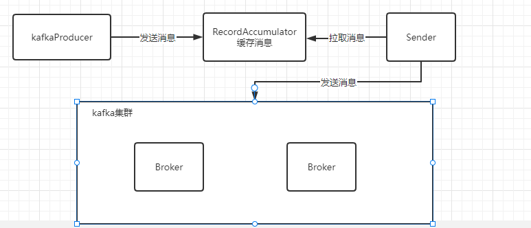

# 基本概念

## 体系结构


- producer：消息生存者,负责创建消息，投递kafka

- consumer：消息消费者，连接kafka接收消息，进而进行相应的业务逻辑处理、

  > broker：

  kafka 集群的 server，(其实就是一台机器)负责处理消息读、写请求，存储消息

  一般topic的partion的数量和broker集群数量一致（如果partion数量大于broker，可能会导致一个broker有多个同一topic的partion，导致数据分布不均匀）

## 分区和主题

> topic：主题（抽象概念），kafka消息以主题为单位进行归类

​		     生产值将消息发送特定主题，消费者负责订阅主题进行消费

​			 代表一个类别，如果把Kafka看做为一个数据库，topic可以理解为数据库中的一张表，topic的名字即为表名  

> partition ：分区（物理概念）

一个主题下可以有多个分区，**offset是分区的唯一表示，保证了消息的顺序性**

partition中的数据是有序的,在需要严格保证消息的消费顺序的场景下，需要将partition数目设为1  


分区可以分布在不同的服务器上（**一个主题可以跨越多个broker**）

# 安装

> 解压

```shell
-rw-r--r--. 1 root root 86486610 Oct  5 04:41 kafka_2.12-3.0.0.tgz
[root@node2 home]# tar -xzvf kafka_2.12-3.0.0.tgz 
```

> 加上可执行权限

```shell
[root@node2 bin]# cd ..
[root@node2 kafka_2.12-3.0.0]# chmod +x ./bin/*
```

> 修改配置文件

```shell
[root@node2 kafka_2.12-3.0.0]# vim config/server.properties
```

```properties
# 配置好brokerid，集群中，每台id都不一样
broker.id=0
## 这里说是日志，其实就是kafka的数据
log.dirs=/home/kafka/log

# 数据保存日期，默认是7天
log.retention.hours=168

## zookeeper地址
zookeeper.connect=node1:2181,node2:2181,node3:2181
```

> 启动

```shell
[root@node2 kafka_2.12-3.0.0]# nohup ./bin/kafka-server-start.sh  ./config/server.properties  > kafka.log 2>&1 &
[1] 7260
```

# 基本命令

## 创建一个topic

- replication-factor： 副本因子（表示每一个分区拥有的副本数量）

```shell
[root@node2 kafka]# ./bin/kafka-topics.sh --create --bootstrap-server localhost:9092 --replication-factor 1 --partitions 1 --topic mytest
Created topic mytest.
```

## 查看topic

```shell
[root@node2 kafka]# ./bin/kafka-topics.sh --list --bootstrap-server=127.0.0.1:9092
mytest

# 查看具体描述
[root@node2 kafka]# ./bin/kafka-topics.sh --describe --bootstrap-server=127.0.0.1:9092
Topic: mytest	TopicId: lHL_52IoSSWPJDRecdDctA	PartitionCount: 1	ReplicationFactor: 1	Configs: segment.bytes=1073741824
	Topic: mytest	Partition: 0	Leader: 0	Replicas: 0	Isr: 0

```

## 消费数据

```sh
 ./bin/kafka-console-consumer.sh --bootstrap-server localhost:9092 --from-beginning --topic my-replicated-topic
```

# 消息可靠性传输

## 消费者自动提交带来的问题

kafka的消息消费位置 offset我们称之为位移

当每一次调用poll()方法时，它返回的是还没有消费过的消息集 ，要做到这一点，就需要记录上一次消费时的消费位移。并且这个消费位移必须做持久化保存（提交） ，默认情况下Kafka的消费位移提交是**自动提交** ，而且**定期提交**，这个定期的周期时间由客户端参数auto.commit.interval.ms配置，默认值为5秒  

所以，这个定期提交就会带来两个问题

1. 重复消费：当我消费到某个位置时，没有定期提交，kafka挂了，这个时候，就会重新消费
2. 消息丢失：当我批量poll某些消息时，只成功消息了一部分，而kafka定期提交，记录消费了全部，则此时就会造成其他一些消息的丢失

## 消费者手动提交

### 原生的客户端消费

在单独使用Kafka的java客户端将位移提交的模式更改为手动位移提交，那么我们就需要显示的调用consumer的方法完成位移提交 

> 代码示例

```java
Properties properties = new Properties();
properties.put("key.deserializer", StringDeserializer.class.getName());
properties.put("value.deserializer", StringDeserializer.class.getName());
properties.put("bootstrap.servers", "192.168.1.132:9092");
properties.put("group.id", "laoxiao");
//是否自动提交
properties.put("enable.auto.commit", "false");
KafkaConsumer<Object, Object> consumer = new KafkaConsumer<>(properties);
consumer.subscribe(Collections.singleton("my_test"));
while (true) {
    ConsumerRecords<Object, Object> records = consumer.poll(Duration.ofMillis(1000));
    for(ConsumerRecord record : records) {
        //此刻如果手动提交，则会重复消费
        System.out.println(record.value());
        consumer.commitAsync(new OffsetCommitCallback() {
            @Override
            public void onComplete(Map<TopicPartition, OffsetAndMetadata> offsets, Exception exception) {
                //提交的位移
                System.out.println(offsets);
            }
        });
    }
```

### spring boot配置

```properties
# kafka配置
spring:
  kafka:
    consumer:
      bootstrap-servers: 192.168.1.132:9092
      # 手动提交模式
      enable-auto-commit: false
    listener:
      # listner负责ack，每调用一次，就立即commit
      ack-mode: manual_immediate
```

虽然enable-auto-commit设置为false，当时spring boot 任然有自己的提交模式，具体配置在ack-mode中

常见的提交模式是在ContainerProperties.AckMode这个枚举类中定义。AckMode针对ENABLE_AUTO_COMMIT_CONFIG=false时生效，有以下几种：
RECORD : 每处理一条commit一次
BATCH : 每次poll的时候批量提交一次，频率取决于每次poll的调用频率
TIME : 每次间隔ackTime的时间去commit
COUNT : 累积达到ackCount次的ack去commit
COUNT_TIME: ackTime或ackCount哪个条件先满足，就commit
MANUAL : listener负责ack，但是背后也是批量上去
MANUAL_IMMEDIATE : listner负责ack，每调用一次，就立即commit  

`所以，想要手动ack，还得自己配置 ack-mode: manual_immediate`

> 代码示例

```java
@KafkaListener(topics = "my_test" , groupId = "laoxiao")
public void consumerHandler(String msg , KafkaConsumer consumer) {
    log.info("消费数据：{}", msg);
    consumer.commitAsync(new OffsetCommitCallback() {
        @Override
        public void onComplete(Map<TopicPartition, OffsetAndMetadata> offsets, Exception exception) {
            log.info(offsets.toString());
        }
    });
}
```
## 生产者发送途中出现问题

在消息发送的过程中，涉及到了两个线程——main线程和Sender线程，以及一个线程共享变量RecordAccumulator。main线程将消息发送给RecordAccumulator，Sender线程会根据指定的条件，不断从RecordAccumulator中拉取消息发送到Kafka broker




Sender线程拉取消息的条件

1. 缓冲区大小达到一定的阈值（默认是16384byte），可以通过spring.kafka.producer.batch-size进行设定  
2. 缓冲区等待的时间达到设置的阈值（默认是0）， 可以通过linger.ms属性进行设定  

### 发送消息的三种方式

> 发送消息的三种方式  

只管往kafka发送消息（消息只发送到缓冲区）而并不关心消息是否正确到达。正常情况没什么问题，不过有些时候（比如不可重试异常）会造成消息的丢失。

```java
kafkaTemplate.send("my_test", "测试java发送数据");
```

> 同步消息发送 
```java
kafkaTemplate.send("my_test", "测试java发送数据").get();
```

> 异步发送

```java
public static void synSendMessage(KafkaTemplate kafkaTemplate) {
    kafkaTemplate.send("my_test" , "测试java发送异步数据").addCallback(obj -> {
        System.out.println("发送成功结果" + ((SendResult)obj).getProducerRecord().value());
    } , t -> System.out.println("失败结果:" + t.getMessage()));
}
```

# Kafka秒杀公平性保证  

消息的可靠性传输可以保证秒杀业务的公平性。关于秒杀业务的公平性，我们还需要考虑一点：消息的顺序性  

只需要确保**要求顺序性的若干消息发送到同一个** partiton，即可满足其顺序性。并且在进行消息消费的时候，需要确保消费者是进行单线程消费。  

# Kafka秒杀不超卖保证

 ## 生产端消息重复

生产者发送的消息没有收到正确的broke响应，导致producer重试。producer发出一条消息，broker落盘以后因为网络等种种原因发送端得到一个发送失败的响应或者网络中断，然后producer收到一个可恢复的Exception重试消息导致消息重复  

> 解决方案

1. 启动kafka的幂等性  
2. retries=0，不重试 （可能会丢消息(一般不会使用)，适用于吞吐量指标重要性高于数据丢失  ）
   1. 开启幂等性的方式比较简单，我们只需要设置enable.idempotence**参数为**true就可以了  
   2. 幂等性配置不能夸分区实现 
