 #

# 特点

- Kafka高效，可伸缩，消息持久化。支持分区、副本和容错。
- Kafka是Scala和Java开发的，对批处理和异步处理做了大量的设计，因此Kafka可以得到非常高的性能。它的异步消息的发送和接收是三个中最好的，但是跟RocketMQ拉不开数量级，每秒处理几十万的消息。
- 如果是异步消息，并且开启了压缩，Kafka最终可以达到每秒处理2000w消息的级别。
- 但是由于是异步的和批处理的，延迟也会高，不适合电商场景。

# 基本概念

## 体系结构

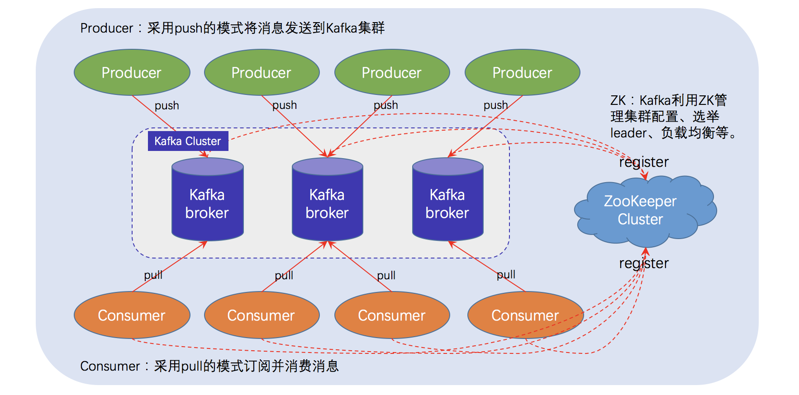

- producer：消息生存者,负责创建消息，投递kafka

- consumer：消息消费者，连接kafka接收消息，进而进行相应的业务逻辑处理

  - 同组内，一个消费者对应一个或者多个partition,但是一个partition只能对应一个consumer
  - 这是为了避免同组内的consumer重复消费

- broker：kafka 集群的 server，(其实就是一台机器)负责处理消息读、写请求，存储消息

  - Topic: 消息的分类，每条消息都属于一个特定的 Topic。用户可以通过 Topic 来组织和管理消息。一般topic的partion的数量和broker集群数量一致（如果partion数量大于broker，可能会导致一个broker有多个同一topic的partion，导致数据分布不均匀）

  - **分区（Partition）**：为了实现扩展性，一个非常大的 topic 可以分布到多个 broker(即服务器)上， 一个 topic 可以分为多个 partition，每个 partition 是一个有序的队列;
  - **副本（Replica）**：副本，为保证集群中的某个节点发生故障时，该节点上的 partition 数据不丢失，且 kafka 仍然能够继续工作，kafka 提供了副本机制，一个 topic 的每个分区都有若干个副本， 一个 **leader** 和若干个 **follower**。


## 分区和主题

> topic：主题（逻辑概念），kafka消息以主题为单位进行归类

生产值将消息发送特定主题，消费者负责订阅主题进行消费

 代表一个类别，如果把Kafka看做为一个数据库，topic可以理解为数据库中的一张表，topic的名字即为表名  

> partition ：分区（物理概念）

一个topic下可以有多个分区,每个partition可以进行副本备份，但是，客户端只与主分区进行交互，副本分区一般作为备份


分区可以分布在不同的服务器上（**一个主题可以跨越多个broker**）


## kafka的优势

1. 高吞吐量：单机每秒处理几十上百万的消息量。即使存储了许多TB的消息，它也保持稳定的性能。

2. 高性能：单节点支持上千个客户端，并保证零停机和零数据丢失。
3. 持久化数据存储：将消息持久化到磁盘。通过将数据持久化到硬盘以及replication防止数据丢失。
  1. 零拷贝
  2. 顺序读，顺序写
  3. 利用Linux的页缓存
4. 分布式系统，易于向外扩展。所有的Producer、Broker和Consumer都会有多个，均为分布式的。**无需停机即可扩展机器**。多个Producer、Consumer可能是不同的应用。
5. 可靠性 - Kafka是分布式，分区，复制和容错的。
   1. 比如，每个partition可以有多个或1个副本，这个副本只有partition所在服务挂掉情况下才会启用，
6. 客户端状态维护：消息被处理的状态是在Consumer端维护，而不是由server端维护。当失败时能自动平衡。
  1. 比如，消费的offset，就存储客户端
7. 支持online和offline的场景。
8. 支持多种客户端语言。Kafka支持Java、.NET、PHP、Python等多种语言。

## 集群控制器

1. 每个集群都有一个broker是集群控制器
2. 控制器负责管理工作
   1. 将分区分配给broker
   2. 监控broker，比如，某个broker挂了，就将其他broker的副本分区启动，变为主分区，并且在其他活跃的broker上，创建新的副本broker进行备份
   2. 副本分区只进行备份

## producer

生产者，负责生产消息

一般情况下，一个消息会被发布到一个特定的主题上。
1. 默认情况下通过轮询把消息均衡地分布到主题的所有分区上。
2. 在某些情况下，生产者会把消息直接写到指定的分区。这通常是通过消息键和分区器来实现
的，分区器为键生成一个散列值，并将其映射到指定的分区上。这样可以保证包含同一个键的
消息会被写到同一个分区上。
3. 生产者也可以使用自定义的分区器，根据不同的业务规则将消息映射到分区。
4. 如果一个消费者失效（或者增加），消费组里的其他消费者可以接管失效消费者的工作，再平衡，分区重新分配

## Consumer

消费者读取消息

1. 消费者订阅一个或多个主题，并按照消息生成的顺序（单partition）读取它们。
2. 消费者通过检查消息的偏移量来区分已经读取过的消息， **偏移量**在生产者写入时候生成，一个递增的整数；消费者消费时，会将当前消息的偏移量记录下来
3. 消费者是消费组的一部分。群组保证每个分区只能被一个消费者使用

## broker

kafka 集群的 server

应该避免，一个topic的partition数量大于broker的情况

broker 是集群的组成部分。每个集群都有一个broker 同时充当了集群控制器的角色（自动从集群的活跃成员中选举出来）

## Offset

偏移量，分为生成者偏移量和消费者偏移量

## 副本

Kafka通过副本保证高可用。副本分为首领副本(Leader)和跟随者副本(Follower)。

Follower的复制多多少少会有延迟的

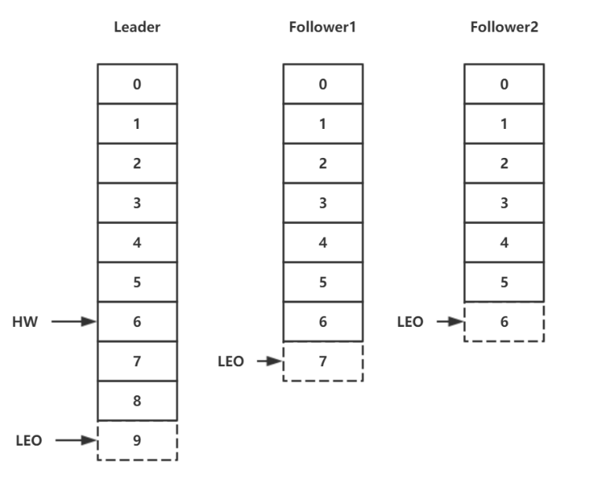

如图：

1. 我们将LEO称为：它表示了当前日志文件中下一条待写入消息的offset
2. HW是High Watermak的缩写， 俗称高水位，它表示了一个特定消息的偏移量（offset），消费只能拉取到这个offset之前的消息。


# 安装

## 安装方式

> 解压

```shell
-rw-r--r--. 1 root root 86486610 Oct  5 04:41 kafka_2.12-3.0.0.tgz
[root@node2 home]# tar -xzvf kafka_2.12-3.0.0.tgz 
```

> 加上可执行权限

```shell
[root@node2 bin]# cd ..
[root@node2 kafka_2.12-3.0.0]# chmod +x ./bin/*
```

> 修改配置文件

```shell
[root@node2 kafka_2.12-3.0.0]# vim config/server.properties
```

```properties
# 配置好brokerid，集群中，每台id都不一样
broker.id=0
## 这里说是日志，其实就是kafka的数据
log.dirs=/home/kafka/log

# 数据保存日期，默认是7天
log.retention.hours=168

## zookeeper地址
zookeeper.connect=node1:2181,node2:2181,node3:2181
```

> 启动

```shell
[root@node2 kafka_2.12-3.0.0]# nohup ./bin/kafka-server-start.sh  ./config/server.properties  > kafka.log 2>&1 &
[1] 7260
```

## 服务端参数配置

<b id="blue">zookeeper.connect</b>：该参数用于配置Kafka要连接的Zookeeper/集群的地址。

<b id="blue">listeners</b>：用于指定当前Broker向外发布服务的地址和端口。与 advertised.listeners 配合，用于做内外网隔离

# 基本命令

## 创建一个topic

- replication-factor： 副本因子（表示每一个分区拥有的副本数量）
- --partitions：分区个数
- --topic： topic 名字

```shell
[root@node2 kafka]# ./bin/kafka-topics.sh --create --bootstrap-server localhost:9092 --replication-factor 1 --partitions 1 --topic mytest
Created topic mytest.
```

## 查看topic

Partition: 0 Leader: 0   表示 有一个分区，编号为0，在0号服务器上

```shell
[root@node2 kafka]# ./bin/kafka-topics.sh --list --bootstrap-server=127.0.0.1:9092
mytest

# 查看具体描述
[root@node2 kafka]# ./bin/kafka-topics.sh --describe --bootstrap-server=127.0.0.1:9092
Topic: mytest	TopicId: lHL_52IoSSWPJDRecdDctA	PartitionCount: 1	ReplicationFactor: 1	Configs: segment.bytes=1073741824
	Topic: mytest	Partition: 0	Leader: 0	Replicas: 0	Isr: 0

```

## 消费数据

通过脚本消费消息

```sh
 ./bin/kafka-console-consumer.sh --bootstrap-server localhost:9092 --from-beginning --topic my-replicated-topic
```

## 消息生产

--broker-list  指定对应的broker

```shell
kafka-console-producer.sh --broker-list localhost:9092 --topic topic_1
```


# 副本机制

1. Follower分区像普通的Kafka消费者一样，消费来自Leader分区的消息，并将其持久化到自己的日志中。
2. 副本有个同步节点(ISR)的定义
   1. 节点必须能够维持与ZooKeeper的会话（通过ZooKeeper的心跳机制）
   2. 对于Follower副本分区，它复制在Leader分区上的写入，并且不要延迟太多
3. Kafka提供的保证是，只要有至少一个同步副本处于活动状态，提交的消息就不会丢失

## 宕机如何恢复

> 少部分副本宕机

当leader宕机了，会从follower选择一个作为leader。当宕机的重新恢复时，会把之前commit的数据清空，重新从leader里pull数据。

> 全部副本宕机

当全部副本宕机了有两种恢复方式
1、等待ISR中的一个恢复后，并选它作为leader。（等待时间较长，降低可用性）
2、选择第一个恢复的副本作为新的leader，无论是否在ISR中。（并未包含之前leader commit的数据，因此造成数据丢失）

# 消息生产

## 配置信息

```java
 Map<String, Object> configs = new HashMap<>();

configs.put("bootstrap.servers", "192.168.1.100:9092");
configs.put("key.serializer", "org.apache.kafka.common.serialization.StringSerializer");
configs.put("value.serializer", "org.apache.kafka.common.serialization.StringSerializer");
configs.put("acks", "all");
configs.put("retries", 3); 
configs.put("compression.type", "gzip");

KafkaProducer<String, String> producer = new KafkaProducer<>(configs);
```


<b id="blue">bootstrap.servers</b>：设置连接Kafka的初始连接用到的服务器地址，如果是集群，则可以通过此初始连接发现集群中的其他broker

<b id="blue">acks</b>：

acks=0 ：生产者不等待broker的任何消息确认。只要将消息放到了socket的缓冲区，就认为消息已发送。不能保证服务器是否收到该消
息， retries 设置也不起作用，因为客户端不关心消息是否发送失败。客户端收到的消息偏移量永远是-1。

acks=1 ：leader将记录写到它本地日志，就响应客户端确认消息，而不等待follower副本的确认。如果leader确认了消息就宕机，则可能会丢失消息，因为follower副本可能还没来得及同步该消息。

acks=all ：leade等待所有同步的副本确认该消息。保证了只要有一个同步副本存在，消息就不会丢失。这是最强的可用性保证。等价于 acks=-1 。默认值为1，字符串。可选值：[all, -1, 0, 1]

<b id="blue">compression.type</b>：生产者生成数据的压缩格式。默认是none（没有压缩）。允许的值： none ， gzip ， snappy 和 lz4 ，一个批次的消息越多，压缩的效率越好

<b id="blue">retries</b>：设置该属性为一个大于1的值，将在消息发送失败的时候重新发送消息，如果消息重试，则可能导致当前分区的消息有序性打乱

## 序列化器

所有的序列化器都实现了：org.apache.kafka.common.serialization.Serializer

主要是对<b id="blue">serialize</b>方法实现

## 自定义序列化器


## 分区器

生产者通过分区器，选择投递的分区

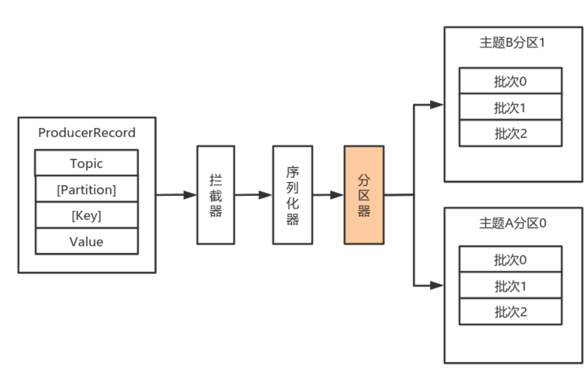

在org.apache.kafka.clients.producer.KafkaProducer#partition方法，中，可以看到，如果指定了分区编号，则直接使用分区编号进行投递

默认情况下，采用org.apache.kafka.clients.producer.internals.DefaultPartitioner#partition方法进行分区编号的返回

1. 如果使用key，则使用Key的序列化后的值的hash值对分区数量取模
2. 否则：使用轮询的方式分配分区号。
   1. 会首先在可用的分区中分配分区号
   2. 如果没有可用的分区，则在该主题所有分区中分配分区号

## 发送模式

### 异步发送

对于生产者的异步发送来说就是，我发送完当前消息后，并不需要你将当前消息的发送结果立马告诉我，而是可以随即进行下一条消息的发送。但是我会允许添加一个回调函数，接收你后续返回的发送结果。异步发送这块我们直接调用kafkaProducer的send方法即可实现异步发送。

### 同步发送

如果生产者需要使用同步发送的方式，只需要拿到 send 方法返回的future对象后，调用其 get() 方法即可。此时如果消息还未发送到broker中，get方法会被阻塞，等到 broker 返回消息发送结果后会跳出当前方法并将结果返回。


## 分区策略

所谓分区写入策略，即是生产者将数据写入到kafka主题后，kafka如何将数据分配到不同分区中的策略。

常见的有三种策略，轮询策略，随机策略，和按键保存策略


## 幂等性

1. 生产中，会出现各种不确定的因素，比如在Producer在发送给Broker的时候出现网络异常，此时，Producer端触发重试机制，将消息重新发送给Broker，Broker接收到消息后，再次将该消息追加到消息流中，然后成功返回Ack信号给Producer。这样下来，消息流中就被重复追加了两条相同的消息
2. Kafka为了实现幂等性，它在底层设计架构中引入了ProducerID和SequenceNumber
   1. ProducerID：在每个新的Producer初始化时，会被分配一个唯一的ProducerID，这个ProducerID对客户端使用者是不可见的。
   2. SequenceNumber：对于每个ProducerID，Producer发送数据的每个Topic和Partition都对应一个从0开始单调递增的SequenceNumber值。
   3. 当broker遇到想同的pid和snumber时，就会认为当前消息是重复的，不再写入
3. 其实：客户端在生成Producer时，会实例化如下代码,此时，会生成PID

```java
Producer<String, String> producer = new KafkaProducer<>(props);
```


## 生产者发送流程

1. <b id="blue">主线程</b>负责消息创建，拦截器，序列化器，分区器等操作，并将消息追加到消息收集器（缓存）中；
   1. 消息累加器为每个分区维护了一个ProducerBatch得双向队列
   2. ProducerBatch 用于批量发送，有利于提升吞吐量，降低网络影响
2. Sender线程
   1. 从消息收集器获取缓存的消息
   2. 进一步将<Node, List<ProducerBatch>转化为<Node, Request>形式，此时才可以向服务端发送数据
   3. 发送完成，清理双向队列

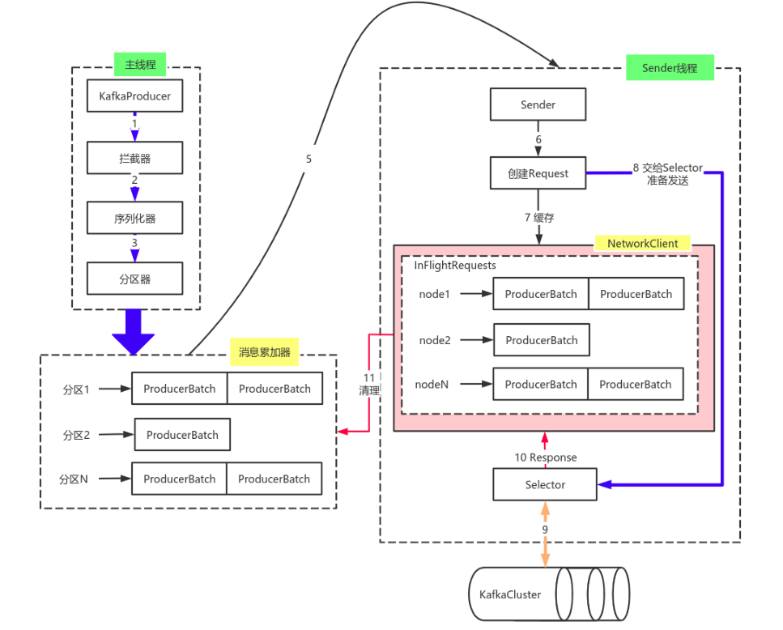

## 保证消息的有序

1. partition中的数据是有序的,在需要严格保证消息的消费顺序的场景下，需要将partition数目设为1  
2. 最消息指定key(消息可以有key,也可以没有key ),对某个key进行取余，保证某个key都进入同一个partition


# 消息消费

## 参数详解

<b id="blue">client.id</b>
当从服务器消费消息的时候向服务器发送的id字符串。在ip/port基础上
提供应用的逻辑名称，记录在服务端的请求日志中，用于追踪请求的源。
<b id="blue">group.id</b>
用于唯一标志当前消费者所属的消费组的字符串。
如果消费者使用组管理功能如subscribe(topic)或使用基于Kafka的偏移量
管理策略，该项必须设置。
<b id="blue">auto.offset.reset</b>
当Kafka中没有初始偏移量或当前偏移量在服务器中不存在（如，数据被
删除了），该如何处理？

1. earliest：自动重置偏移量到最早的偏移量
2. latest：自动重置偏移量为最新的偏移量
3. none：如果消费组原来的（previous）偏移量不存在，则向消费者抛异常
4. anything：向消费者抛异常

<b id="blue">enable.auto.commit</b>
如果设置为true，消费者会自动周期性地向服务器提交偏移量


## 自动提交

kafka的消息消费位置 offset我们称之为位移

当每一次调用poll()方法时，它返回的是还没有消费过的消息集 ，要做到这一点，就需要记录上一次消费时的消费位移。并且这个消费位移必须做持久化保存（提交） ，默认情况下Kafka的消费位移提交是**自动提交** ，而且**定期提交**，这个定期的周期时间由客户端参数auto.commit.interval.ms配置，默认值为5秒  

所以，这个定期提交就会带来两个问题

1. 重复消费：当我消费到某个位置时，没有定期提交，kafka挂了，这个时候，就会重新消费
2. 消息丢失：当我批量poll某些消息时，只成功消息了一部分，而kafka定期提交，记录消费了全部，则此时就会造成其他一些消息的丢失


### 原生的客户端消费

在单独使用Kafka的java客户端将位移提交的模式更改为手动位移提交，那么我们就需要显示的调用consumer的方法完成位移提交 

> 代码示例

```java
Properties properties = new Properties();
properties.put("key.deserializer", StringDeserializer.class.getName());
properties.put("value.deserializer", StringDeserializer.class.getName());
properties.put("bootstrap.servers", "192.168.1.132:9092");
properties.put("group.id", "laoxiao");
//是否自动提交
properties.put("enable.auto.commit", "false");
KafkaConsumer<Object, Object> consumer = new KafkaConsumer<>(properties);
consumer.subscribe(Collections.singleton("my_test"));
while (true) {
    ConsumerRecords<Object, Object> records = consumer.poll(Duration.ofMillis(1000));
    for(ConsumerRecord record : records) {
        //此刻如果手动提交，则会重复消费
        System.out.println(record.value());
        consumer.commitAsync(new OffsetCommitCallback() {
            @Override
            public void onComplete(Map<TopicPartition, OffsetAndMetadata> offsets, Exception exception) {
                //提交的位移
                System.out.println(offsets);
            }
        });
    }
```

### spring boot配置

```properties
# kafka配置
spring:
  kafka:
    consumer:
      bootstrap-servers: 192.168.1.132:9092
      # 手动提交模式
      enable-auto-commit: false
    listener:
      # listner负责ack，每调用一次，就立即commit
      ack-mode: manual_immediate
```

虽然enable-auto-commit设置为false，当时spring boot 任然有自己的提交模式，具体配置在ack-mode中

常见的提交模式是在ContainerProperties.AckMode这个枚举类中定义。AckMode针对ENABLE_AUTO_COMMIT_CONFIG=false时生效，有以下几种：
RECORD : 每处理一条commit一次
BATCH : 每次poll的时候批量提交一次，频率取决于每次poll的调用频率
TIME : 每次间隔ackTime的时间去commit
COUNT : 累积达到ackCount次的ack去commit
COUNT_TIME: ackTime或ackCount哪个条件先满足，就commit
MANUAL : listener负责ack，但是背后也是批量上去
MANUAL_IMMEDIATE : listner负责ack，每调用一次，就立即commit  

`所以，想要手动ack，还得自己配置 ack-mode: manual_immediate`

> 代码示例

```java
@KafkaListener(topics = "my_test" , groupId = "laoxiao")
public void consumerHandler(String msg , KafkaConsumer consumer) {
    log.info("消费数据：{}", msg);
    consumer.commitAsync(new OffsetCommitCallback() {
        @Override
        public void onComplete(Map<TopicPartition, OffsetAndMetadata> offsets, Exception exception) {
            log.info(offsets.toString());
        }
    });
}
```
## 生产者发送途中出现问题

在消息发送的过程中，涉及到了两个线程——main线程和Sender线程，以及一个线程共享变量RecordAccumulator。main线程将消息发送给RecordAccumulator，Sender线程会根据指定的条件，不断从RecordAccumulator中拉取消息发送到Kafka broker

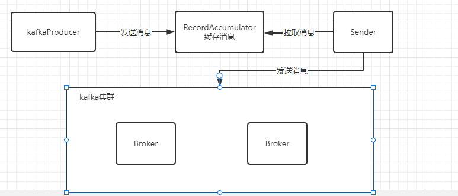


Sender线程拉取消息的条件

1. 缓冲区大小达到一定的阈值（默认是16384byte），可以通过spring.kafka.producer.batch-size进行设定  
2. 缓冲区等待的时间达到设置的阈值（默认是0）， 可以通过linger.ms属性进行设定  

### 发送消息的三种方式

> 发送消息的三种方式  

只管往kafka发送消息（消息只发送到缓冲区）而并不关心消息是否正确到达。正常情况没什么问题，不过有些时候（比如不可重试异常）会造成消息的丢失。

```java
kafkaTemplate.send("my_test", "测试java发送数据");
```

> 同步消息发送 
```java
kafkaTemplate.send("my_test", "测试java发送数据").get();
```

> 异步发送

```java
public static void synSendMessage(KafkaTemplate kafkaTemplate) {
    kafkaTemplate.send("my_test" , "测试java发送异步数据").addCallback(obj -> {
        System.out.println("发送成功结果" + ((SendResult)obj).getProducerRecord().value());
    } , t -> System.out.println("失败结果:" + t.getMessage()));
}
```

## 偏移量

消费者通过偏移量来区分已经读过的消息，从而消费消息（通过偏移量来判断从当前partition的哪里消费）

## 消费组

消费组是为了解决重复消费；

1. 消费组可以保证，一个topic多个partition，对于同一个消费组，只会被消费一次
2. 消费者是消费组的一部分。消费组保证每个分区只能被一个消费者使用（比如partition1不能被消费者1,2订阅消费，只能被消费者1或者2进行消费）
3. 消费者从订阅的主题消费消息，消费消息的偏移量保存在Kafka的服务器的名字是 __consumer_offsets 的主题中

## 位移提交

1. Consumer需要向Kafka记录自己的位移数据，这个汇报过程称为 提交位移(Committing Offsets)
2. Consumer 需要为分配给它的每个分区提交各自的位移数据（每次poll之后，手动/自动的提交位移数据到kafka）
3. 位移提交的由Consumer端负责的，Kafka只负责保管 （__consumer_offsets 主题进行保管）。
   1. __consumer_offsets 存储结构是K-V结构，此时，K的内容为：groupId+topic+partition,V的内容为：偏移量

4. 位移提交分为自动提交和手动提交、同步提交和异步提交


# 主题管理

## 创建主题

```shell

kafka-topics.sh --zookeeper localhost:2181/myKafka --create --topic topic_x --partitions 1 --replication-factor 1
kafka-topics.sh --zookeeper localhost:2181/myKafka --create --topic topic_test_02 --partitions 3 --replication-factor 1 --config
max.message.bytes=1048576 --config segment.bytes=10485760
```

## 查看主题

```shell
kafka-topics.sh --zookeeper localhost:2181/myKafka --list
kafka-topics.sh --zookeeper localhost:2181/myKafka --describe --topic topic_x
kafka-topics.sh --zookeeper localhost:2181/myKafka --topics-with-overrides --describe
```

## 删除主题

```shell
kafka-topics.sh --zookeeper localhost:2181/myKafka --delete --topic topic_x
```


# 添加分区

通过命令行工具操作，主题的分区只能增加，不能减少。否则报错，通过--alter修改主题的分区数，增加分区。

**2**表示添加后的分区数量

kafka-topics.sh --zookeeper localhost/myKafka --alter --topic myTop1 --partitions 2


# 数据生产流程

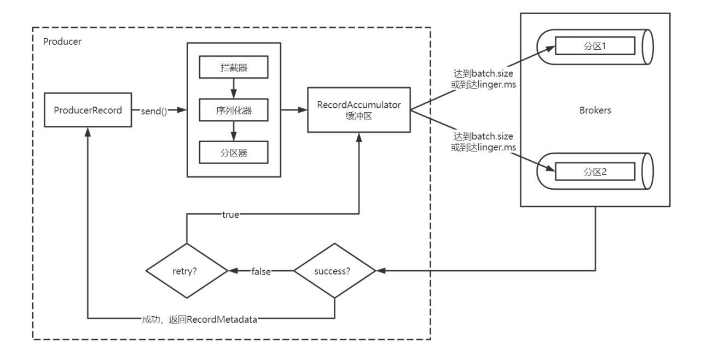

1. Producer创建时，会创建一个Sender线程并设置为守护线程。
2. 生产消息时，内部其实是异步流程；生产的消息先经过拦截器->序列化器->分区器，然后将消息缓存在缓冲区（该缓冲区也是在Producer创建时创建）。
3. 批次发送的条件为：缓冲区数据大小达到batch.size或者linger.ms达到上限，哪个先达到就算哪个。
4. 批次发送后，发往指定分区，然后落盘到broker；如果生产者配置了retrires参数大于0并且失败原因允许重试，那么客户端内部会对该消息进行重试。注意，重试的消息会放在缓冲区的队尾，此时消息的有序性会被打乱，所以，有序消息不能分批发送
5. 落盘到broker成功，返回生产元数据给生产者，元数据返回有两种方式：一种是通过阻塞直接返回，另一种是通过回调返回


# 心跳机制

## 什么是心跳机制

Kafka 的心跳机制是一个**健康检查**和**会话维持**机制。消费者客户端会定期向 Group Coordinator（组协调者，通常是某个 Broker）发送一个简短的心跳包，以此来告知协调者：“我还活着，并且仍在活跃地处理消息”。

Group Coordinator 负责管理消费者组的成员关系（如重新平衡 Rebalance）。它通过心跳来判断一个消费者是否已经“死亡”或“僵死”。

所以，客户端和服务端发现心跳超期，都会触发rebalance的过程

# 订阅解析

## 消费者组

- 每个消费者都属于一个消费者组。
- 一个主题的每个分区只能被同一个消费者组内的一个消费者消费。
  - 避免重复消费（用rocketMQ）
- 不同消费者组可以独立消费同一个主题，互不影响。

## 重平衡

当消费者组内的消费者数量发生变化（如消费者加入或离开）时，Kafka会触发重平衡，重新分配分区给消费者。重平衡期间，消费者无法消费消息，因此应尽量避免不必要的重平衡


重平衡的触发条件主要有三个：
1. 消费者组内成员发生变更，这个变更包括了增加和减少消费者，比如消费者宕机退出消费组。
2. 主题的分区数发生变更，kafka目前只支持增加分区，当增加的时候就会触发重平衡
3. 订阅的主题发生变化，当消费者组使用正则表达式订阅主题，而恰好又新建了对应的主题，就
会触发重平衡


## 避免重平衡影响

重平衡过程中，消费者无法从kafka消费消息，这对kafka的TPS影响极大，而如果kafka集内节点较多，比如数百个，那重平衡可能会耗时极多。数分钟到数小时都有可能，而这段时间kafka基本处于不可用状态。所以在实际环境中，应该尽量避免重平衡发生。

1. 流量小的时候，进行扩容的操作
2. 避免系统误判节点不可用
   1. session.timout.ms控制心跳超时时间，越长越不容易误判
   2. heartbeat.interval.ms控制心跳发送频率，越高越不容易误判
   3. max.poll.interval.ms控制poll的间隔。越大越不容易误判
3. 推荐配置
   1. session.timout.ms：设置为6s
   2. heartbeat.interval.ms：设置2s
   3. max.poll.interval.ms：推荐为消费者处理消息最长耗时再加1分钟

## 自动再均衡

为什么会有自动再均衡：

1. 我们可以在新建主题的时候，手动指定主题各个Leader分区以及Follower分区的分配情况，即什么分区副本在哪个broker节点上。
2. 随着系统的运行，broker的宕机重启，会引发Leader分区和Follower分区的角色转换，最后可能Leader大部分都集中在少数几台broker上，由于Leader负责客户端的读写操作，此时集中Leader分区的少数几台服务器的网络I/O，CPU，以及内存都会很紧张。
3. Leader和Follower的角色转换会引起Leader副本在集群中分布的不均衡，此时我们需要一种手段，让Leader的分布重新恢复到一个均衡的状态。

如何操作：

1. 创建主题的时候，指定leader分区的服务器编号
   1. --replica-assignment "0:1,1:0,0:1"表示：有三个partition，逗号分割开为partition配置
   2. 0:1表示，当前partition的主分区为0号服务器编号， 第一个为主分区的服务器号
   3. 那么1:0表示，当前partition的主分区号位1号服务器

```shell
kafka-topics.sh --zookeeper node1:2181/myKafka --create --topic tp_demo_03 --replica-assignment "0:1,1:0,0:1"
```

2. Kafka提供的自动再均衡脚本： kafka-preferred-replica-election.sh
3. 该脚本仅指定zookeeper地址，则会对集群中所有的主题进行操作，自动再平衡

## 修改副本因子

为什么要修改副本因子：

1. 我们创建主题的时候，可能流量不大，分配的服务器不够，比如服务器就两台，那么我们顶多两个副本，副本因子为2
2. 当流量大时，我们需要扩容，此时，此时比如服务器4台，我们可以修改副本因子为4，让其分区有4个副本

如何修改：

1. 使用 kafka-reassign-partitions.sh 修改副本因子

## 分区分配策略

### RangeAssignor

Kafka默认采用RangeAssignor的分配算法

如果有7个分区，3个消费者，则：每个消费者分配2个，多出来的1个由最开始的消费者消费

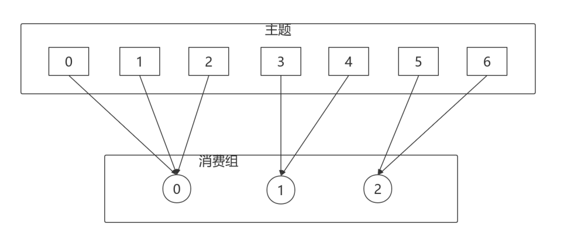

### RoundRobinAssignor

轮询消费

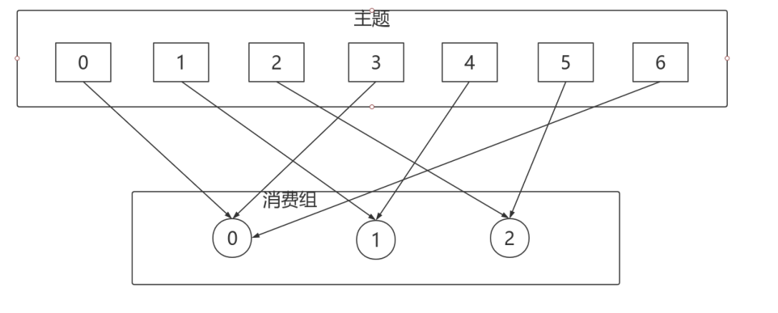

### StickyAssignor

问题：如果我们有一个消费者挂了，则会触发再平衡，再平衡会阻塞消费，这样很不友好

目标：分区的分配尽量的均衡， 每一次重分配的结果尽量与上一次分配结果保持一致


比如如下消费情况：

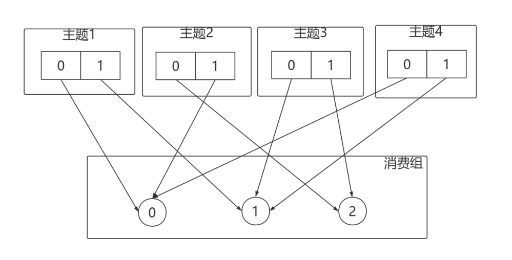

如果0号消费者挂了， 采用轮询的方式，则需要所有的消费者重新分配分区

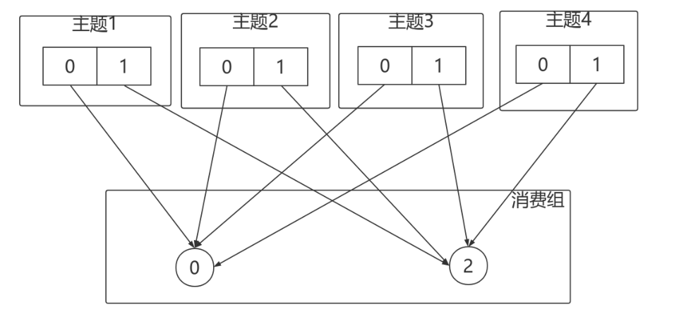

按照Sticky的方式，仅对消费者1分配的分区进行重分配，红线部分。最终达到均衡的目的

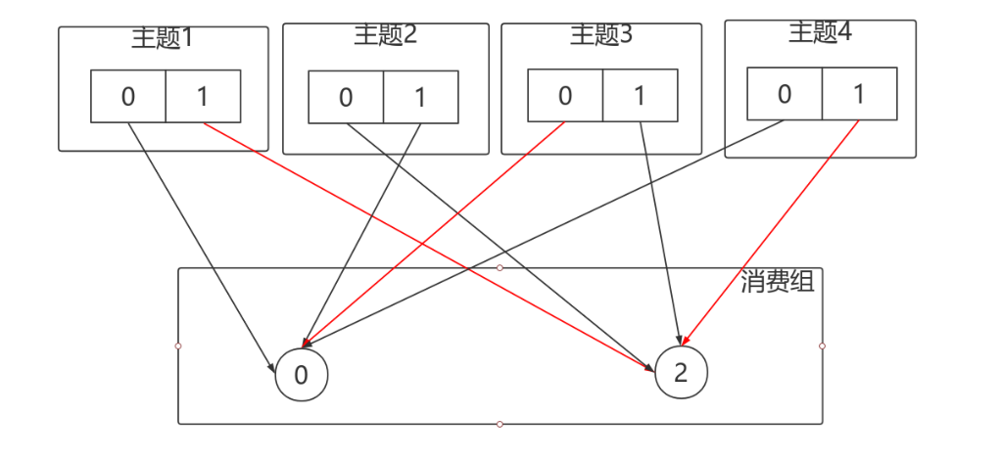

## 消费方式

consumer 采用 pull 模式从 broker 中读取数据

采用 pull 模式，consumer 可自主控制消费消息的速率， 可以自己控制消费方式（批量消费/逐条消费)，还可以选择不同的提交方式从而实现不同的传输语义。

所以，他的延迟相对rocketMQ高一些

但pull的方式，更适合大批量的数据，因为可以自主的选择pull 哪些数据

所以他的吞吐量更大

# 日志存储

Kafka 消息是以主题为单位进行归类，各个主题之间是彼此独立的，互不影响。
每个主题又可以分为一个或多个分区。
每个分区各自存在一个记录消息数据的日志文件

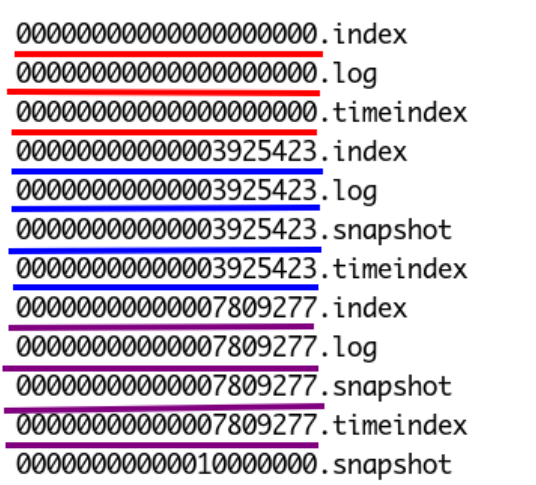

日志文件存在多种后缀文件，重点需要关注 .index、.timestamp、.log 三种类型

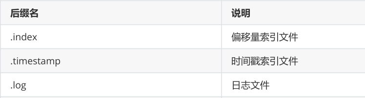

# 事务操作

## 特性

- **原子性**：事务性消息要么完全成功，要么完全失败。这确保了消息不会被部分处理。
- **可靠性**：一旦消息被写入Kafka，它们将被视为已经处理，即使发生了应用程序或系统故障。


##  生产者配置

acks：这是有关生产者接收到确认之后才认为消息发送成功的设置。对于事务性消息，通常将其设置为acks=all，以确保消息仅在事务完全提交后才被视为成功发送。

transactional.id：这是用于标识生产者实例的唯一ID。在配置文件中设置transactional.id是启用事务性消息的关键步骤。是生产者级别的全局唯一标识，**一个生产者对应一个固定的 `transactional.id`**，用于标识事务的连续性

enable.idempotence：幂等性是指相同的消息不会被重复发送。对于事务性消息，通常将其设置为enable.idempotence=true，以确保消息不会重复发送。

## 生产者模式

只有Producer生产消息，这种场景需要事务的介入

```java
Map<String, Object> configs = new HashMap<>();
configs.put(ProducerConfig.BOOTSTRAP_SERVERS_CONFIG, "node1:9092");
configs.put(ProducerConfig.KEY_SERIALIZER_CLASS_CONFIG,
StringSerializer.class);
configs.put(ProducerConfig.VALUE_SERIALIZER_CLASS_CONFIG,
StringSerializer.class);
// 提供客户端ID
configs.put(ProducerConfig.CLIENT_ID_CONFIG, "tx_producer");
// 事务ID
configs.put(ProducerConfig.TRANSACTIONAL_ID_CONFIG, "my_tx_id");
// 要求ISR都确认
configs.put(ProducerConfig.ACKS_CONFIG, "all");
KafkaProducer<String, String> producer = new KafkaProducer<String,
String>(configs);
// 初始化事务
producer.initTransactions();
// 开启事务
producer.beginTransaction();
try {
// producer.send(new ProducerRecord<>("tp_tx_01", "tx_msg_01"));
producer.send(new ProducerRecord<>("tp_tx_01", "tx_msg_02"));
// int i = 1 / 0;
// 提交事务
producer.commitTransaction();
} catch (Exception ex) {
// 中止事务
producer.abortTransaction();
} finally {
// 关闭生产者
producer.close();
}

```

## 消费转发生产模式

比如  A->B->C

A和C是kafka，B是我们的程序，此时B从A读取消息发送到C

此时，我们需要保证，如果B或者发送到C出现异常，那么，A的消息offset不会增加，下次消息还能消费

```java
public static KafkaProducer<String, String> getProducer() {
Map<String, Object> configs = new HashMap<>();
configs.put(ProducerConfig.BOOTSTRAP_SERVERS_CONFIG, "node1:9092");
configs.put(ProducerConfig.KEY_SERIALIZER_CLASS_CONFIG,
StringSerializer.class);
configs.put(ProducerConfig.VALUE_SERIALIZER_CLASS_CONFIG,
StringSerializer.class);
// 设置client.id
configs.put(ProducerConfig.CLIENT_ID_CONFIG, "tx_producer_01");
// 设置事务id
configs.put(ProducerConfig.TRANSACTIONAL_ID_CONFIG, "tx_id_02");
// 需要所有的ISR副本确认
configs.put(ProducerConfig.ACKS_CONFIG, "all");
// 启用幂等性
configs.put(ProducerConfig.ENABLE_IDEMPOTENCE_CONFIG, true);
KafkaProducer<String, String> producer = new KafkaProducer<String,
String>(configs);
return producer;
}
public static KafkaConsumer<String, String> getConsumer(String
consumerGroupId) {
Map<String, Object> configs = new HashMap<>();
configs.put(ConsumerConfig.BOOTSTRAP_SERVERS_CONFIG, "node1:9092");
configs.put(ConsumerConfig.KEY_DESERIALIZER_CLASS_CONFIG,
StringDeserializer.class);
configs.put(ConsumerConfig.VALUE_DESERIALIZER_CLASS_CONFIG,
StringDeserializer.class);
// 设置消费组ID
configs.put(ConsumerConfig.GROUP_ID_CONFIG, "consumer_grp_02");
// 不启用消费者偏移量的自动确认，也不要手动确认
 configs.put(ConsumerConfig.ENABLE_AUTO_COMMIT_CONFIG, false);
configs.put(ConsumerConfig.CLIENT_ID_CONFIG, "consumer_client_02");
configs.put(ConsumerConfig.AUTO_OFFSET_RESET_CONFIG, "earliest");
// 只读取已提交的消息
// configs.put(ConsumerConfig.ISOLATION_LEVEL_CONFIG,
"read_committed");
KafkaConsumer<String, String> consumer = new KafkaConsumer<String,
String>(configs);
return consumer;
}
public static void main(String[] args) {
String consumerGroupId = "consumer_grp_id_101";
KafkaProducer<String, String> producer = getProducer();
KafkaConsumer<String, String> consumer =
getConsumer(consumerGroupId);
// 事务的初始化
producer.initTransactions();
//订阅主题
consumer.subscribe(Collections.singleton("tp_tx_01"));
final ConsumerRecords<String, String> records =
consumer.poll(1_000);
// 开启事务
producer.beginTransaction();
try {
Map<TopicPartition, OffsetAndMetadata> offsets = new HashMap<>
();
for (ConsumerRecord<String, String> record : records) {
System.out.println(record);
producer.send(new ProducerRecord<String, String>
("tp_tx_out_01", record.key(), record.value()));
offsets.put(
new TopicPartition(record.topic(),
record.partition()),
new OffsetAndMetadata(record.offset() + 1)); // 偏
移量表示下一条要消费的消息
}
// 将该消息的偏移量提交作为事务的一部分，随事务提交和回滚（不提交消费偏移
量）
producer.sendOffsetsToTransaction(offsets, consumerGroupId);
// int i = 1 / 0;
// 提交事务
producer.commitTransaction();
} catch (Exception e) {
e.printStackTrace();
// 回滚事务
producer.abortTransaction();
} finally {
// 关闭资源
producer.close();
consumer.close();
}
}
```


# 顺序消费

消息的可靠性传输可以保证秒杀业务的公平性。关于秒杀业务的公平性，我们还需要考虑一点：消息的顺序性  

只需要确保**要求顺序性的若干消息发送到同一个** partiton，即可满足其顺序性。并且在进行消息消费的时候，需要确保消费者是进行单线程消费。  

# Kafka秒杀不超卖保证

 ## 生产端消息重复

生产者发送的消息没有收到正确的broke响应，导致producer重试。producer发出一条消息，broker落盘以后因为网络等种种原因发送端得到一个发送失败的响应或者网络中断，然后producer收到一个可恢复的Exception重试消息导致消息重复  

> 解决方案

1. 启动kafka的幂等性  
2. retries=0，不重试 （可能会丢消息(一般不会使用)，适用于吞吐量指标重要性高于数据丢失  ）
   1. 开启幂等性的方式比较简单，我们只需要设置enable.idempotence**参数为**true就可以了  
   2. 幂等性配置不能夸分区实现 

# Kafka生产者幂等性

生产者幂等性主要避免生产者数据重复提交至Kafka broker中并落盘。在正常情况下，Producer向Broker发送消息，Broker将消息追加写到对应的流（即某一Topic的某一Partition）中并落盘，并向Producer返回ACK信号，表示确认收到。但是Producer和Broker之间的通信总有可能出现异常，如果消息已经写入，但ACK在半途丢失了，Producer就会进行retry操作再次发送该消息，造成重复写入

1. PID。每个新的Producer在初始化的时候会被分配一个唯一的PID，这个PID对用户是不可见的
2. Sequence Numbler。对于每个PID，该Producer发送数据的每个都对应一个从0开始单调递增的Sequence Number
3. Broker端在缓存中保存了这seq number,对于接收的每条消息,如果其序号比Broker缓存中序号大于1则接受它,否则将其丢弃,这样就可以实现了消息重复提交了.
   1. 但是如果其他服务也提交了同样的消息，那么就需要业务上处理了

Producer使用幂等性的示例非常简单,与正常情况下Producer使用相比变化不大,只需要 把Producer的配置enable.idempotence设置为true即可,如下所示:

```java
Properties props = new Properties();
props.put(ProducerConfig.ENABLE_IDEMPOTENCE_CONFIG, "true");
//当enable.idempotence为true时acks默认为 all
// props.put("acks", "all");
props.put("bootstrap.servers", "localhost:9092");
props.put("key.serializer", "org.apache.kafka.common.serialization.StringSerializer");
props.put("value.serializer", "org.apache.kafka.common.serialization.StringSerializer");
KafkaProducer producer = new KafkaProducer(props);
producer.send(new ProducerRecord(topic, "test");
```

# Kafka缺点

1. 由于是批量发送，数据并非真正的实时
2. 仅支持统一分区内消息有序，无法实现全局消息有序；
3. 监控不完善，需要安装插件；
4. 依赖zookeeper进行元数据管理；3.0版本去除，4.0实现了自己的注册中心
