# RocketMQ特点

## 优点

- java开发，阅读源代码、扩展、二次开发很方便。
- 对电商领域的响应延迟做了很多优化。在大多数情况下，响应在毫秒级。如果应用很关注响应时间，可以使用RocketMQ。
- 性能比RabbitMQ高一个数量级，每秒处理几十万的消息。

## 缺点

跟周边系统的整合和兼容不是很好。

# RocketMQ特性

1. 订阅与发布
2. 消息顺序
3. 消息过滤

   1. RocketMQ的消费者可以根据Tag进行消息过滤，也支持自定义属性过滤
4. 消息可靠性

   1. Broker非正常关闭
   2. Broker异常Crash
   3. OS Crash
   4. 机器掉电，但是能立即恢复供电情况
   5. 机器无法开机（可能是cpu、主板、内存等关键设备损坏）
   6. 磁盘设备损坏

   前四种情况都属于硬件资源可立即恢复情况，RocketMQ在这四种情况下能保证消息不丢，或者丢失少量数据（依赖刷盘方式是同步还是异步）

   后一种：属于单点故障，且无法恢复，一旦发生，在此单点上的消息全部丢失
5. 至少一次

   1. 至少一次(At least Once)指每个消息必须投递一次。Consumer先Pull消息到本地，消费完成后，才向服务器返回ack，如果没有消费一定不会ack消息
6. 回溯消费

   1. 回溯消费是指Consumer已经消费成功的消息，由于业务上需求需要重新消费
7. 事务消息
8. 定时消息

   1. broker有配置项messageDelayLevel，默认值为“1s 5s 10s 30s 1m 2m 3m 4m 5m 6m 7m 8m 9m 10m 20m 30m 1h 2h”，18个level
   2. 定时消息会暂存在名为SCHEDULE_TOPIC_XXXX的topic中，并根据delayTimeLevel存入特定的queue，queueId = delayTimeLevel – 1，即一个queue只存相同延迟的消息，保证具有相同发送延迟的消息能够顺序消费
   3. broker会定时调度地消费SCHEDULE_TOPIC_XXXX，将消息写入真实的topic
9. 消息重试
10. 消息重投

    1. 生产者在发送消息时：
       同步消息失败会重投
       异步消息有重试
       oneway没有任何保证。
11. 流量控制

    1. 生产者流控，因为broker处理能力达到瓶颈；消费者流控，因为消费能力达到瓶颈。
12. 死信队列

    1. 死信队列用于处理无法被正常消费的消息。
    2. 达到最大重试次数后，若消费依然失败，则表明消费者在正常情况下无法正确地消费该消息
    3. 在RocketMQ中，可以通过使用console控制台对死信队列中的消息进行重发来使得消费者实例再次进行消费

# RocketMq 是什么

- RocketMQ是一个队列模型的消息中间件，具有高性能、高可靠、高实时、分布式特点。
- Producer、Consumer、队列都可以分布式。
- Producer 向一些队列轮流发送消息，队列集合称为 Topic，Consumer 如果做广播消费，则一个 consumer 实例消费这个 Topic 对应的所有队列，如果做集群消费，则多个 Consumer 实例平均消费这个 topic 对应的队列集合。
- 能够保证严格的消息顺序

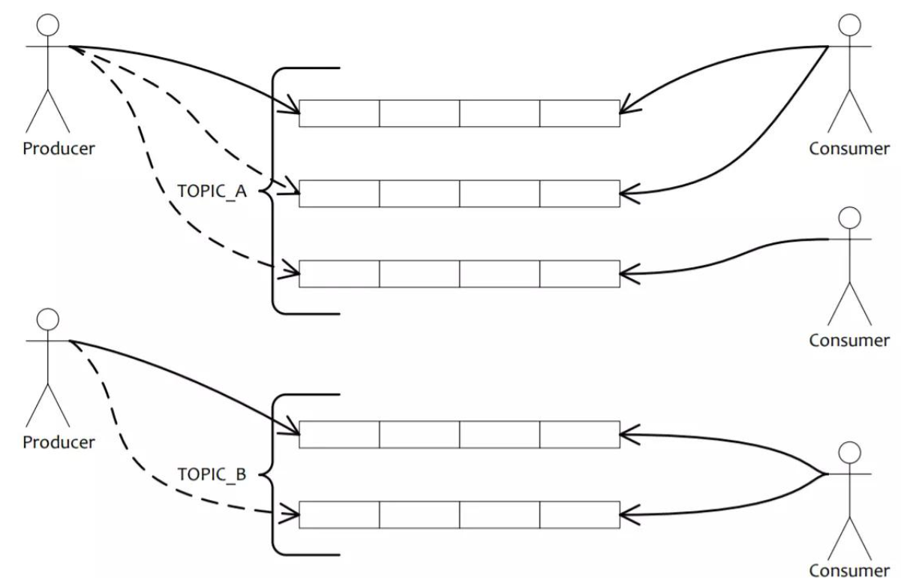

# 核心组件

`<b id="blue">`NameServer`</b>`

NameServer主要负责Topic和路由信息的管理，类似zookeeper。

`<b id="blue">`Broker`</b>`

消息中转角色，负责存储消息，转发消息。

`<b id="blue">`Consumer`</b>`

消息消费者，负责消息消费，一般是后台系统负责异步消费。

PushConsumer：Consumer消费的一种类型，该模式下Broker收到数据后会主动推送给消费端

PullConsumer：Consumer消费的一种类型，应用通常主动调用Consumer的拉消息方法从Broker服务器拉消息、主动权由应用控制。一旦获取了批量消息，应用就会启动消费过程

`<b id="blue">`Producer`</b>`

消息生产者，负责产生消息，一般由业务系统负责产生消息。

`<b id="blue">`ConsumerGroup`</b>`：同一类Consumer的集合，这类Consumer通常消费同一类消息且消费逻辑一致，消费者组的消费者实例必须订阅完全相同的Topic（这一点与kafka不一样）

## Name Server

NameServer是一个Broker与Topic路由的注册中心，支持Broker的动态注册与发现

主要功能：

- Broker管理：接受Broker集群的注册信息并且保存下来作为路由信息的基本数据；提供心跳检测机制，检查Broker是否还存活。
- producer 也需要和某个Name Server 保持长连接
- consumer 和nameserver的某个节点保持长连接，也和broker的master或者slave保持长连接
- 路由信息管理：每个NameServer中都保存着Broker集群的整个路由信息和用于客户端查询的队列信息。Producer和Conumser通过NameServer可以获取整个Broker集群的路由信息，从而进行消息的投递和消费。

### 路由注册

NameServer通常也是以集群的方式部署，不过，NameServer是无状态的，即NameServer集群中的各个节点间是无差异的，各节点间**相互不进行信息通讯**。那各节点中的数据是如何进行数据同步的呢？**在Broker节点启动时，轮询NameServer列表，与每个NameServer节点建立长连接**（只要是长连接，就涉及到心跳机制），发起注册请求。在NameServer内部维护着⼀个Broker列表，用来动态存储Broker的信息

如图:将broker注册到每一个nameserver中

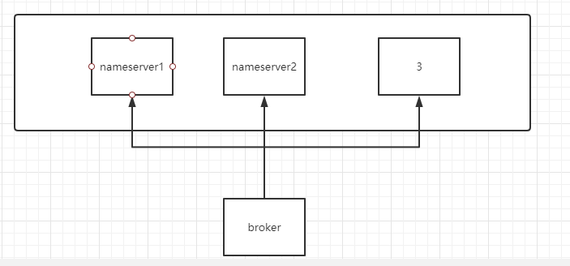

### 路由剔除

由于Broker关机、宕机或网络抖动等原因，NameServer没有收到Broker的心跳，NameServer可能会将其从Broker列表中剔除

- 对于RocketMQ日常运维工作，例如Broker升级，需要停掉Broker的工作。OP需要怎么做？

OP需要将Broker的**读写权限禁掉**。一旦client(Consumer或Producer)向broker发送请求，都会收到broker的NO_PERMISSION响应，然后client会进行对其它Broker的重试

当OP观察到这个Broker没有流量后，再关闭它，实现Broker从NameServer的移除

### 路由发现

RocketMQ的路由发现采用的是Pull模型。当Topic路由信息出现变化时，NameServer不会主动推送给客户端，而是客户端定时拉取主题最新的路由。默认客户端每30秒会拉取一次最新的路由。

1. Push模型：推送模型。其实时性较好，是一个“发布-订阅”模型，需要维护一个长连接。而长连接的维护是需要资源成本的。该模型适合于的场景：

   - 实时性要求较高
   - Client数量不多，Server数据变化较频繁
2. Pull模型：拉取模型。存在的问题是，实时性较差
3. Long Polling模型：长轮询模型。其是对Push与Pull模型的整合，充分利用了这两种模型的优势，屏蔽了它们的劣势。

### 客户端NameServer选择策略

客户端(Producer与Consumer)在配置时必须要写上NameServer集群的地址，那么客户端到底连接的是哪个NameServer节点呢？

客户端首先会生产一个随机数，然后再与NameServer节点数量取模，此时得到的就是所要连接的节点索引，然后就会进行连接。

如果连接失败，则会采用round-robin策略，逐个尝试着去连接其它节点。

## Broker

实际处理消息存储、转发等服务的核心组件，包括消费者组消费进度偏移offset、主题、队列等。

每个Topic的消息也可以分片存储于不同的 Broker。Message Queue 用于存储消息的物理地址，每个Topic中的消息地址存储于多个 Message Queue 中

> 结构

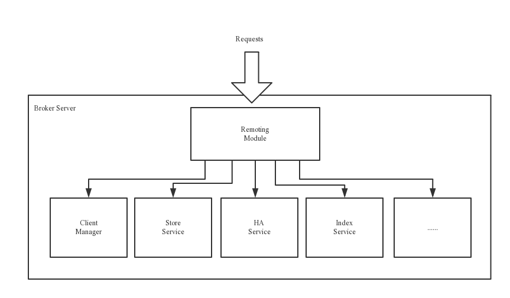

- Remoting Module：整个Broker的实体，负责处理来自clients端的请求。而这个Broker实体则由以下模块构成
  - Client Manager：客户端管理器。负责接收、解析客户端(Producer/Consumer)请求，管理客户端。例如，维护Consumer的Topic订阅信息
  - Store Service：存储服务。提供方便简单的API接口，处理消息存储到物理硬盘和消息查询功能。
  - HA Service：高可用服务，提供Master Broker 和 Slave Broker之间的数据同步功能。
  - Index Service：索引服务。根据特定的Message key（用户指定的Key），对投递到Broker的消息进行索引服务，同时也提供根据Message Key对消息进行快速查询的功能。
- Broker分为Master与Slave
  - 一个Master可以对应多个Slave，但是一个Slave只能对应一个Master
  - Master与Slave 的对应关系通过指定相同的BrokerName，不同的BrokerId来定义，BrokerId为0表示Master，非0表示Slave
  - 。Master也可以部署多个。每个Broker与NameServer集群中的所有节点建立长连接，定时注册Topic信息到所有NameServer。 注意：当前RocketMQ版本在部署架构上支持一Master多Slave，但只有BrokerId=1的从服务器才会参与消息的读负载

# 工作流程

1. 启动NameServe（先启动NameServer）r，NameServer启动后开始监听端口，等待Broker、Producer、Consumer连接。
2. 发送消息前，可以先创建Topic，创建Topic时需要指定**该Topic要存储在哪些Broker上**，当然，*在创建Topic时也会将Topic与Broker的关系写入到NameServer中*。不过，这步是可选的，也可以在发送消息时自动创建Topic。  （我们可以选择手动创建topic或者发送消息时候创建，不过一般我们都是手动创建）
3. Producer发送消息，启动时先跟NameServer集群中的其中一台建立长连接，并从NameServer中获取路由信息，即当前发送的Topic消息的Queue与Broker的地址（IP+Port）的映射关系。然后根据算法策略从队选择一个Queue，与队列所在的Broker建立长连接从而向Broker发消息(**只会往master发送消息**)。当然，在获取到路由信息后，Producer会首先将**路由信息缓存到本地**，再每30秒从NameServer更新一次路由信息。
4. Consumer跟Producer类似，跟其中一台NameServer建立长连接，获取其所订阅Topic的路由信息，
   然后根据算法策略从路由信息中获取到其所要消费的Queue，然后直接跟Broker建立长连接，开始消费其中的消息。Consumer在获取到路由信息后，同样也会每30秒从NameServer更新一次路由信息。不过不同于Producer的是，**Consumer还会向Broker发送心跳**，以确保Broker的存活状态

# Topic的创建模式

手动创建Topic时，有两种模式：

1. 集群模式：该模式下创建的Topic在该集群中，所有Broker中的Queue数量是相同的。
2. Broker模式：该模式下创建的Topic在该集群中，每个Broker中的Queue数量可以不同。

自动创建Topic时，默认采用的是Broker模式，会为每个Broker默认创建4个Queue。

> 读/写队列

从物理上来讲，读/写队列是同一个队列。所以，不存在读/写队列数据同步问题。读/写队列是逻辑上进行区分的概念。一般情况下，读/写队列数量是相同的。

```tex
例如，创建Topic时设置的写队列数量为8，读队列数量为4，
此时系统会创建8个Queue，分别是0 1 2 3 4 5 6 7。
Producer会将消息写入到这8个队列，但Consumer只会消费0 1 2 3这4个队列中的消息，
4 5 6 7中的消息是不会被消费到的。
```

perm用于设置对当前创建Topic的操作权限：2表示只写，4表示只读，6表示读写。

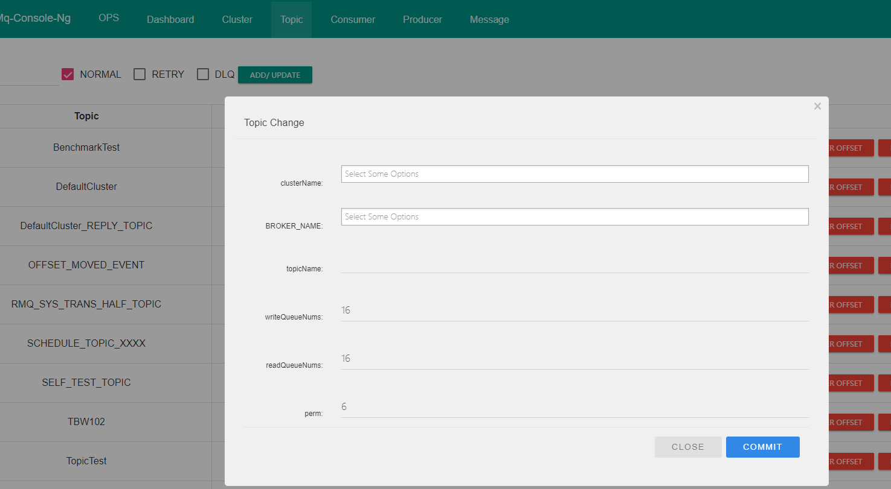

# 安装

## 单机安装

1. 安装JDK8环境
2. 下载

```shell
[root@node1 rocketmq]# wget https://mirrors.bfsu.edu.cn/apache/rocketmq/4.9.0/rocketmq-all-4.9.0-bin-release.zip

```

3. 修改默认的内存(改成-Xms256m -Xmx256m -Xmn128m)
4. 修改[root@node1 bin]# vim bin/runserver.sh，如果是虚拟机，则将内存配置调小点

```shell
JAVA_OPT="${JAVA_OPT} -server -Xms4g -Xmx4g -Xmn2g -XX:MetaspaceSize=128m -XX:MaxMetaspaceSize=320m"
```

修改[root@node1 bin]# vim runbroker.sh,如果是虚拟机，则将内存配置调小点

```shell
JAVA_OPT="${JAVA_OPT} -server -Xms8g -Xmx8g -Xmn4g"
```

> 启动

1. Start Name Server

```shell
[root@node1 rocketmq]# nohup sh bin/mqnamesrv &
[root@node1 rocketmq]# tail -f ~/logs/rocketmqlogs/namesrv.log
  The Name Server boot success...
```

2. Start Broker

```shell
[root@node1 rocketmq]# nohup sh bin/mqbroker -n localhost:9876 &
[root@node1 rocketmq]# tail -f ~/logs/rocketmqlogs/broker.log
```

> 使用官方提供脚本测试

1. 设置全局的环境变量

```shell
[root@node1 rocketmq]#  export NAMESRV_ADDR=localhost:9876
```

2. 发送消息

```shell
[root@node1 rocketmq]# sh bin/tools.sh org.apache.rocketmq.example.quickstart.Producer

## 看到类似日志
SendResult [sendStatus=SEND_OK, msgId=7F00000141EC28D93B308CEBA02E03E7, offsetMsgId=C0A8018300002A9F00000000000317BF, messageQueue=MessageQueue [topic=TopicTest, brokerName=node1, queueId=0], queueOffset=249]

```

3. 消费数据

```shell
[root@node1 rocketmq]# sh bin/tools.sh org.apache.rocketmq.example.quickstart.Consumer
```

> 关闭服务（先关broker再关namesrv）

```shell
> sh bin/mqshutdown broker
The mqbroker(36695) is running...
Send shutdown request to mqbroker(36695) OK

> sh bin/mqshutdown namesrv
The mqnamesrv(36664) is running...
Send shutdown request to mqnamesrv(36664) OK
```

## 控制台安装

前往：https://github.com/apache/rocketmq-externals/releases，下载[rocketmq-console](https://github.com/apache/rocketmq-externals/releases/tag/rocketmq-console-1.0.0)

1. 修改端口和namesrv
2. 添加依赖

```xml
<dependency>
    <groupId>javax.xml.bind</groupId>
    <artifactId>jaxb-api</artifactId>
    <version>2.3.0</version>
</dependency>
<dependency>
    <groupId>com.sun.xml.bind</groupId>
    <artifactId>jaxb-impl</artifactId>
    <version>2.3.0</version>
</dependency>
<dependency>
    <groupId>com.sun.xml.bind</groupId>
    <artifactId>jaxb-core</artifactId>
    <version>2.3.0</version>
</dependency>
<dependency>
    <groupId>javax.activation</groupId>
    <artifactId>activation</artifactId>
    <version>1.1.1</version>
</dependency>
```

# 消息生产

## 生产过程

1. Producer发送消息之前，会先向NameServer发出获取**消息Topic的路由信息**的请求
2. NameServer返回该Topic的**路由表**及**Broker列表 **
   1. 路由表 ：实际是一个Map，key为**Topic名称**，value是一个QueueData实例列表。QueueData并不是一个Queue对应一个QueueData，而是一个Broker中该Topic的所有Queue对应一个QueueData
   2. Broker列表 ：其实际也是一个Map。key为brokerName，value为BrokerData。一套brokerName名称相同的Master-Slave小集群对应一个BrokerData  BrokerData中包含brokerName及一个map。该map的key为brokerId，value为该broker对应的地址。brokerId为0表示该broker为Master，非0表示Slave。
   3. Producer根据代码中指定的Queue选择策略，从Queue列表中选出一个队列，用于后续存储消息
   4. Producer向选择出的Queue所在的Broker发出RPC请求，将消息发送到选择出的Queue

## Queue选择算法

对于无序消息，其Queue选择算法，也称为消息投递算法，常见的有两种

> 轮询算法

默认选择算法。该算法保证了每个Queue中可以均匀的获取到消息。

生产者对topic里面的queue一个一个轮询的投递

- 如果一个queue投递延迟过高， 会导致Producer的缓存队列中出现较大的消息积压，影响消息的投递性能。

> 最小投递延迟算法

该算法会统计每次消息投递的时间延迟，然后根据统计出的结果将消息投递到时间延迟最小的Queue。如果延迟相同，则采用轮询算法投递。该算法可以有效提升消息的投递性能。

- 投递延迟小的Queue其可能会存在大量的消息。而对该Queue的消费者压力会增大，降低消息的消费能力，可能会导致MQ中消息的堆积。

## 整理流程概括

开发者在创建Topic时，需要指定一个很关键的参数——MessageQueue，如：[创建模式](/MQ/rocketmq/rocketmq?id=topic的创建模式)的图片中，会指定Queue的数量等

MessageQueue本质就是一个数据分片的机制。比如order_topic一共有1万条消息，那么可以大致认为每个MessageQueue保存2500条消息。但是，这不是绝对的，需要根据Producer写入消息的策略来定，可能有的MessageQueue中消息多些，有的少些。我们先暂且认为消息是在MessageQueue上平均分配的，然后MessageQueue也可能平均分布在Master-Broker上，如下图：

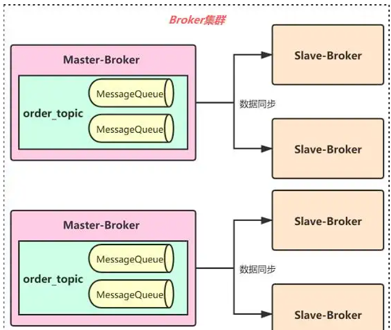

消息存储：

生产者发送消息到Broker后，Master-Broker会将消息写入磁盘上的一个日志文件——CommitLog，按照顺序写入文件末尾，CommitLog中包含了各种各样不通类型的Topic对应的消息内容，如下图：

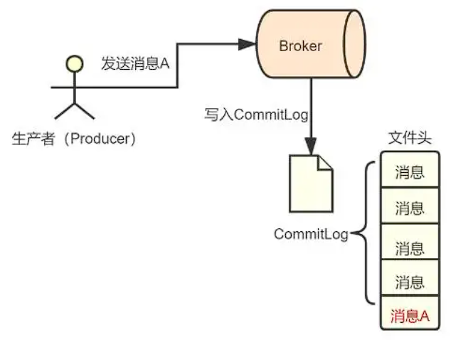

消息是保存在MessageQueue中的，那这个CommitLog和MessageQueue是什么关系呢？事实上，对于每一个Topic，它在某个Broker所在的机器上都会有一些MessageQueue，每一个MessageQueue又会有很多ConsumeQueue文件，这些ConsumeQueue文件里存储的是一条消息对应在CommitLog文件中的offset偏移量

如果我们想发送对topic 发送一条消息，queue1、queue2、queue3、queue3，均匀分布在两个Master-Broker中，Producer选择queue1这个MessageQueue发送了一条“消息A”。那么：

1. 首先Master-Broker接收到消息A后，将其内容顺序写入自己机器上的CommitLog文件末尾；
2. 然后，这个Master-Broker会将消息A在CommitLog文件中的物理位置——offset，写入queue1对应的ConsumeQueue文件末尾（其实不单单offset，还包括消息长度、tag hashcode等信息，一条数据是20个字节，每个ConsumeQueue文件能保存30万条数据，所以每个ConsumeQueue文件的大小约为5.72MB）；

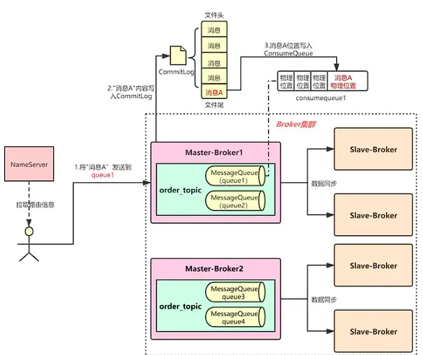

## API

### instanceName

MQClientInstance不是对外应用类，也就是说用户不需要自己实例化使用他。并且，MQClientInstance的实例化并不是直接new后使用，而是通过MQClientManager这个类型。MQClientManager是个单例类，使用饿汉模式设计保证线程安全。他的作用是提供MQClientInstance实例（与集群进行交互）

所以只要ClientConfig里的相关参数（ IP@instanceName@unitName ）一致，这些Client会复用一个MQClientInstance

如果我们同一个JVM，连接了多个集群，那么，不配置instanceName，那么会公用一个MQClientInstance ，则，只会连接一个集群

### 同步模式

```java
DefaultMQProducer producer = new DefaultMQProducer();
// 生产者组名
producer.setProducerGroup("producer_test_01");
// 实例名:默认Default, 同一个JVM，实例名不能相同
producer.setInstanceName("producer_test_01_01");
//重试次数
producer.setRetryTimesWhenSendFailed(2);
producer.setNamesrvAddr("192.168.236.103:9876");
producer.start();
Message msg = new Message("test-topic-1", "TagA", "Hello world".getBytes());
//如果发送失败，则按照setRetryTimesWhenSendFailed次数重试
//则可能会导致消息重复消费
SendResult send = producer.send(msg);
log.info("send result: {}", send);
```

SendResult的几种状态

```Java
public enum SendStatus {
    SEND_OK,
    FLUSH_DISK_TIMEOUT,
    FLUSH_SLAVE_TIMEOUT,
    SLAVE_NOT_AVAILABLE;

    private SendStatus() {
    }
}
```

SEND_OK：

消息发送成功。要注意的是消息发送成功也不意味着它是可靠的。要确保不会丢失任何消息，还应启用同步Master服务器或同步刷盘，即SYNC_MASTER或SYNC_FLUSH。

FLUSH_DISK_TIMEOUT：

消息发送成功，但是服务器同步到Slave时超时。此时消息已经进入服务器队列，只有服务器宕机，消息才会丢失。

### 单向发送

发送一条消息出去要经过三步

1. 客户端发送请求到服务器。
2. 服务器处理该请求。
3. 服务器向客户端返回应答

**Oneway方式只发送请求不等待应答**，即将数据写入客户端的Socket缓冲区就返回，不等待对方返回结果。

具体方式：

```java
Message msg = new Message("test-topic-1", "TagA", "Hello world".getBytes());
producer.sendOneway(msg);
```

### 异步发送方式

```java
producer.setRetryTimesWhenSendAsyncFailed(2);
Message msg = new Message("test-topic-1", "TagA", "Hello world".getBytes());
producer.send(msg, new SendCallback() {
    @Override
    public void onSuccess(SendResult sendResult) {
        //成功回调
    }

    @Override
    public void onException(Throwable e) {
		//失败次数达到后，进行回调
    }
});
```

# 消息消费

## 消费模式

### 集群模式

集群消费模式下，相同Consumer Group的每个Consumer实例平均分摊同一个Topic的消息。即每条消息只会被发送到Consumer Group中的某个Consumer。

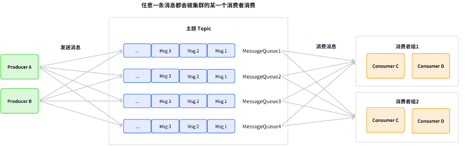

### 广播模式模式

广播消费模式下，相同Consumer Group的每个Consumer实例都接收同一个Topic的全量消息。即每条消息都会被发送到Consumer Group中的**每个Consumer **

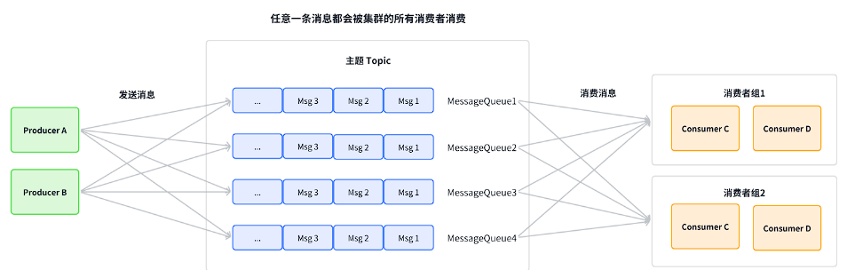

## 负载均衡

消费端的负载均衡是指**将 Broker 端中多个队列按照某种算法分配给同一个消费组中的不同消费者**。

Rebalance机制讨论的前提是：**集群消费 **

Rebalance机制的本意是为了提升消息的并行消费能力。例如，⼀个Topic下5个队列，在只有1个消费者的情况下，这个消费者将负责消费这5个队列的消息。如果此时我们增加⼀个消费者，那么就可以给其中⼀个消费者分配2个队列，给另⼀个分配3个队列，从而提升消息的并行消费能力

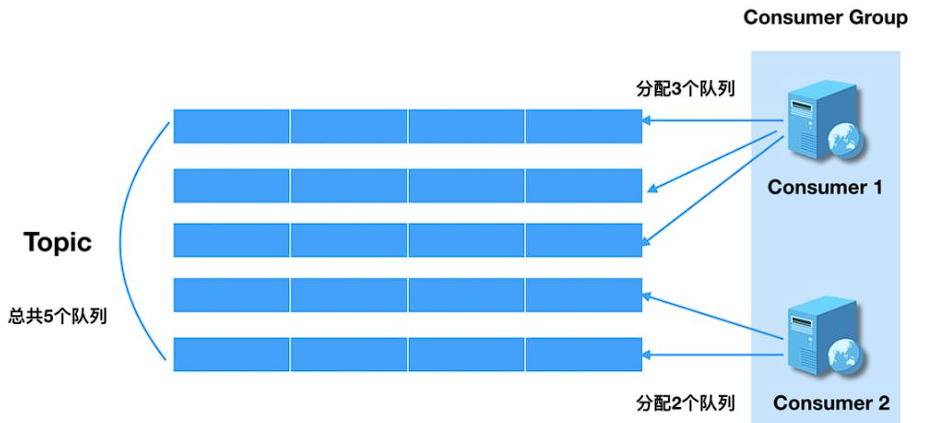

> **Rebalance限制**

由于一个队列最多分配给一个消费者，因此当某个消费者组下的消费者实例数量大于队列的数量时，多余的消费者实例将分配不到任何队列。

> Rebalance危害

消费暂停：

在只有一个Consumer时，其负责消费所有队列；在新增了一个Consumer后会触发Rebalance的发生。此时原Consumer就需要暂停部分队列的消费，等到这些队列分配给新的Consumer后，这些暂停消费的队列才能继续被消费。
消费重复：

Consumer 在消费新分配给自己的队列时，必须接着之前Consumer 提交的消费进度的offset继续消费。然而默认情况下，offset是异步提交的，这个异步性导致提交到Broker的offset与Consumer实际消费的消息并不一致。这个不一致的差值就是可能会重复消费的消息。

> Rebalance产生的原因

1. 消费者所订阅Topic的Queue数量发生变化
2. 消费者组中消费者的数量发生变化。

## Queue分配算法

一个Topic中的Queue只能由Consumer Group中的一个Consumer进行消费，而一个Consumer可以同时消费多个Queue中的消息。常见的Queue分配算法有四种，分别是：平均分配策略、环形平均策略、一致性hash策略、同机房策略。这些策略是通过在创建Consumer时的构造器传进去的

Java Api 中，可以通过构造方法设置，可以通过AllocateMessageQueueStrategy了解，默认使用平均分配

### 平均分配策略

该算法是要根据avg = QueueCount / ConsumerCount 的计算结果进行分配的。如果能够整除，则按顺序将avg个Queue逐个分配Consumer；如果不能整除，则将多余出的Queue按照Consumer顺序逐个分配。

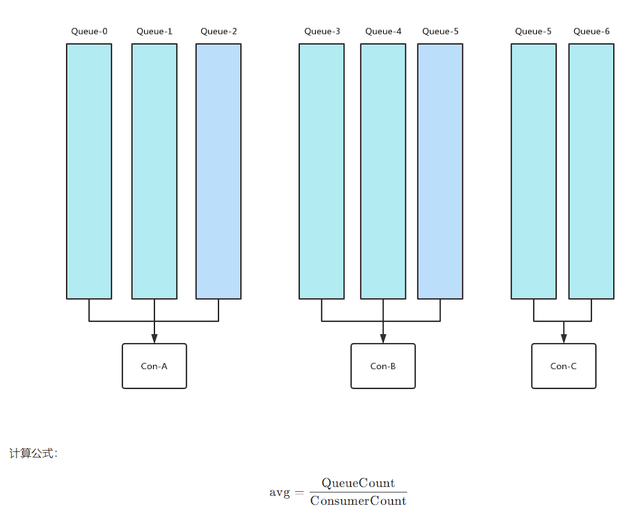

**先计算好每个consumer应该分配几个queue**

### 环形平均策略

环形平均算法是指，根据消费者的顺序，依次在由queue队列组成的环形图中逐个分配

**挨个分配给consumer，一个一个分配**，该方法不需要提前计算

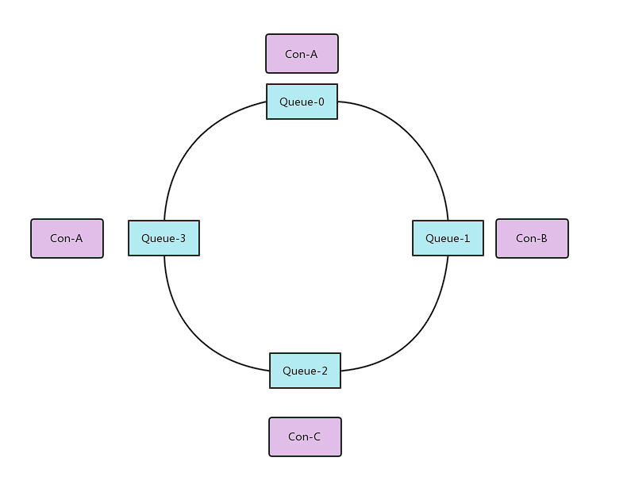

### 一致性hash策略

该算法会将consumer的hash值作为Node节点存放到hash环上，然后将queue的hash值也放到hash环上，通过顺时针方向，距离queue最近的那个consumer就是该queue要分配的consumer

**会导致分配不均匀**

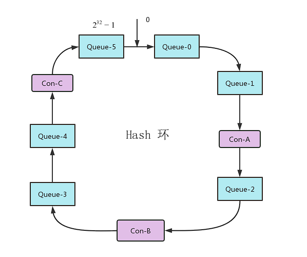

### 同机房策略

AllocateMessageQueueByMachineRoom：

按机房分配，BrokerName 需要以 机房@brokerName命名

当然，我们也可以自己自定义策略

## 订阅关系的一致性

订阅关系的一致性指的是，同一个消费者组（Group ID相同）下所有Consumer实例所订阅的Topic与Tag及对消息的处理逻辑必须完全一致。否则，消息消费的逻辑就会混乱，甚至导致消息丢失

> 错误订阅关系

同一个topic订阅了不同Tag

如图：错误的示例：

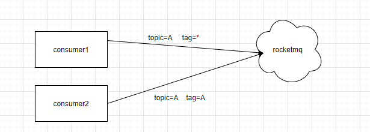

## offset管理

`指的是Consumer的消费进度offset。`

---

当消费模式为**广播消费**时，offset使用本地模式存储

Consumer在广播消费模式下offset相关数据以json的形式持久化到Consumer本地磁盘文件中，默认文件路径为当前用户主目录下的*.rocketmq_offsets/${clientId}/${group}/Offsets.json* 。其中${clientId}为当前消费者id，默认为ip@DEFAULT；${group}为消费者组名称

---

当消费模式为**集群消费**时，offset使用远程模式管理。因为所有Cosnumer实例对消息采用的是均衡消费，所有Consumer共享Queue的消费进度。
Consumer在集群消费模式下offset相关数据以json的形式持久化到Broker磁盘文件中，文件路径为当前用户主目录下的store/config/consumerOffset.json

存放的数据未key-value模式，key:queue的id， value: offset

---

## 消费起始位置

```java
public enum ConsumeFromWhere {
    //从queue的当前最后一条消息开始消费
    CONSUME_FROM_LAST_OFFSET,
    //从queue的第一条消息开始消费
    CONSUME_FROM_FIRST_OFFSET,
  
    /**
    从指定的具体时间戳位置的消息开始消费。这个具体时间戳
    是通过另外一个语句指定的 。
  
    consumer.setConsumeTimestamp(“20210701080000”) yyyyMMddHHmmss
    */
    CONSUME_FROM_TIMESTAMP,
}
```

## 同步提交与异步提交

> 同步提交

消费者在消费完一批消息后会向broker提交这些消息的offset，然后等待broker的成功响应。若在等待超时之前收到了成功响应，则继续读取下一批消息进行消费（从ACK中获取nextBeginOffset）。若没有收到响应，则会重新提交，直到获取到响应。而在这个等待过程中，消费者是阻塞的。其严重影响了消费者的吞吐量

> 异步提交

消费者在消费完一批消息后向broker提交offset，但无需等待Broker的成功响应，可以继续读取并消费下一批消息。这种方式增加了消费者的吞吐量。但需要注意，broker在收到提交的offset后，还是会向消费者进行响应的。可能还没有收到ACK，此时Consumer会从Broker中直接获取nextBeginOffset。

## 消费幂等

当出现消费者对某条消息重复消费的情况时，重复消费的结果与消费一次的结果是相同的，并且多次消费并未对业务系统产生任何负面影响，那么这个消费过程就是消费幂等的

> 消息重复的场景分析

>> 发送时消息重复
>>

当一条消息已被成功发送到Broker并完成持久化，此时出现了网络闪断，从而导致Broker对Producer应答失败。 如果此时Producer意识到消息发送失败并尝试再次发送消息，此时Broker中就可能会出现两条内容相同并且Message ID也相同的消息，那么后续Consumer就一定会消费两次该消息

>> 消费时消息重复
>>

消息已投递到Consumer并完成业务处理，当Consumer给Broker反馈应答时网络闪断，Broker没有接收到消费成功响应。为了保证消息**至少被消费一次**的原则，Broker将在网络恢复后再次尝试投递之前已被处理过的消息。此时消费者就会收到与之前处理过的内容相同、Message ID也相同的消息

>> Rebalance时消息重复
>>

当Consumer Group中的Consumer数量发生变化时，或其订阅的Topic的Queue数量发生变化时，会触发Rebalance，此时Consumer可能会收到曾经被消费过的消息。

---

> 解决方案

幂等解决方案的设计中涉及到两项要素：幂等令牌，与唯一性处理：

幂等令牌：

- 是生产者和消费者两者中的既定协议，通常指具备唯⼀业务标识的字符串。例如，订单号、流水号。一般由Producer随着消息一同发送来的。

唯一性处理：

- 服务端通过采用⼀定的算法策略，保证同⼀个业务逻辑不会被重复执行成功多次。例如，对同一笔订单的多次支付操作，只会成功一次。

>> 常见方案
>>

1. 首先通过缓存去重。在缓存中如果已经存在了某幂等令牌，则说明本次操作是重复性操作；若缓存没有命中，则进入下一步。
2. 在唯一性处理之前，先在数据库中查询幂等令牌作为索引的数据是否存在。若存在，则说明本次操作为重复性操作；若不存在，则进入下一步
3. 在唯一性处理之前，先在数据库中查询幂等令牌作为索引的数据是否存在。若存在，则说明本次操作为重复性操作；若不存在，则进入下一步

---

## 消息的清理

commitlog文件存在一个过期时间，默认为72小时，即三天。除了用户手动清理外，在以下情况下也会被自动清理，无论文件中的消息是否被消费过

对于RocketMQ系统来说，删除一个1G大小的文件，是一个压力巨大的IO操作。在删除过程中，系统性能会骤然下降。所以，其默认清理时间点为凌晨4点，访问量最小的时间。也正因如果，我们要保障磁盘空间的空闲率，不要使系统出现在其它时间点删除commitlog文件的情况

## 消费位点

当建立一个新的消费组时，需要决定是否需要消费已经存在于 Broker 中的历史消息。

CONSUME_FROM_LAST_OFFSET 将会忽略历史消息，并消费之后生成的任何消息。
CONSUME_FROM_FIRST_OFFSET 将会消费每个存在于 Broker 中的信息。
也可以使用 CONSUME_FROM_TIMESTAMP 来消费在指定时间戳后产生的消息。

```java
public static void main(String[] args) throws MQClientException {
DefaultMQPushConsumer consumer = new
DefaultMQPushConsumer("consumer_grp_15_01");
consumer.setNamesrvAddr("node1:9886");
consumer.subscribe("tp_demo_15", "*");
// 以下三个选一个使用，如果是根据时间戳进行消费，则需要设置时间戳
// 从第一个消息开始消费，从头开始
consumer.setConsumeFromWhere(ConsumeFromWhere.CONSUME_FROM_FIRST_OFFSET);
// 从最后一个消息开始消费，不消费历史消息
consumer.setConsumeFromWhere(ConsumeFromWhere.CONSUME_FROM_LAST_OFFSET);
// 从指定的时间戳开始消费
consumer.setConsumeFromWhere(ConsumeFromWhere.CONSUME_FROM_TIMESTAMP);
// 指定时间戳的值
consumer.setConsumeTimestamp("");
consumer.setMessageListener(new MessageListenerConcurrently() {
@Override
public ConsumeConcurrentlyStatus consumeMessage(List<MessageExt>
msgs, ConsumeConcurrentlyContext context) {
// TODO 处理消息的业务逻辑
return ConsumeConcurrentlyStatus.CONSUME_SUCCESS;
// return ConsumeConcurrentlyStatus.RECONSUME_LATER;
}
});
consumer.start();
}
```

## 消费慢处理

1. 提高消费并行度
   1. 同一个 ConsumerGroup 下，通过增加 Consumer 实例数量来提高并行度（需要注意的是超过订阅队列数的 Consumer 实例无效）。可以通过加机器，或者在已有机器启动多个进程的方式。
   2. 提高单个 Consumer 的消费并行线程，通过修改参数 consumeThreadMin、consumeThreadMax实现。
   3. 丢弃部分不重要的消息
2. 批量方式消费
   1. 通过设置 consumer的 consumeMessageBatchMaxSize 返个参数，默认是 1，即一次只消费一条消息，例如设置为 N，那么每次消费的消息数小于等于 N。
3. 跳过非重要消息

```java
public ConsumeConcurrentlyStatus consumeMessage(List<MessageExt> msgs,
ConsumeConcurrentlyContext context) {
long offset = msgs.get(0).getQueueOffset();
String maxOffset =
msgs.get(0).getProperty(Message.PROPERTY_MAX_OFFSET);
long diff = Long.parseLong(maxOffset) - offset;
if (diff > 100000) {
// TODO 消息堆积情况的特殊处理
return ConsumeConcurrentlyStatus.CONSUME_SUCCESS;
}
// TODO 正常消费过程
return ConsumeConcurrentlyStatus.CONSUME_SUCCESS;
}
```

## API

### 两种模式

1. 消息消费方式（Pull和Push）
2. 两种模式都有 消息消费模式（广播模式和集群模式）
3. 流量控制（可以结合sentinel来实现）
4. 并发线程数设置
   1. Push模式设置，Pull模式可以代码上控制怎么并发消费
5. 消息的过滤（Tag、Key） TagA||TagB||TagC

### 代码实现

```java
DefaultMQPushConsumer pushConsumer = new DefaultMQPushConsumer();
    pushConsumer.setConsumerGroup("push_consumer_test_01");
    //消费模式，广播模式;
    //pushConsumer.setMessageModel(MessageModel.BROADCASTING);
    //集群模式
    pushConsumer.setMessageModel(MessageModel.BROADCASTING);
    pushConsumer.setConsumeThreadMin(1);
    pushConsumer.setConsumeThreadMax(10);
    pushConsumer.setNamesrvAddr("192.168.236.103:9876");
    pushConsumer.subscribe("test_topic_1", "*");
    pushConsumer.setMessageListener(new MessageListenerConcurrently() {
        @Override
        public ConsumeConcurrentlyStatus consumeMessage(List<MessageExt> msgs, ConsumeConcurrentlyContext context) {
            for (MessageExt msg : msgs) {
                try {
                    log.info("consume message success, msg: {}", new String(msg.getBody(), "utf-8"));
                } catch (UnsupportedEncodingException e) {
                    log.info("consume message failed, msg: {}", msg);
                }
            }
            return ConsumeConcurrentlyStatus.CONSUME_SUCCESS;
        }
    });
    pushConsumer.start();
}
```

# Broker

## 角色

Broker 角色分为 ASYNC_MASTER（异步主机）、SYNC_MASTER（同步主机）以及SLAVE（从机）

默认是ASYNC_MASTER

比如：有三台主机， 一个 ASYNC_MASTER， 两个SLAVE，此时，消息写入master后，会异步同步SLAVE

一个 SYNC_MASTER， 两个SLAVE，此时，消息写入master后，会同步SLAVE，待SLAVE成功后，即返回成功给producer

## 刷盘方式

FlushDiskType：SYNC_FLUSH（同步刷新）相比于ASYNC_FLUSH（异步处理）会损失很多性能，但是也更可靠，


# NameServer

## 设计

1. NameServer互相独立，彼此没有通信关系，单台NameServer挂掉，不影响其他
2. 单个Broker（Master、Slave）与所有NameServer进行定时注册（30s），心跳包包括：自身的topic配置信息。
3. Consumer随机与一个NameServer建立长连接，如果该NameServer断开，则从NameServer列表中查找下一个进行连接
   1. Consumer主要从NameServer中根据Topic查询Broker的地址，查到就会缓存到客户端，并向提供Topic服务的Master、Slave建立长连接，且定时向Master、Slave发送心跳。
      如果Broker宕机，则NameServer会将其剔除，此时Consumer从slave消费
4. Producer随机与一个NameServer建立长连接，每隔30秒（此处时间可配置）从NameServer获取Topic的最新队列情况，如果某个Broker Master宕机，Producer最多30秒才能感知，那么在这30S期间，发送的消息就会失败进行重试

## 作用

1. NameServer 用来保存活跃的 broker 列表，包括 Master 和 Slave 。
2. NameServer 用来保存所有 topic 和该 topic 所有队列的列表。
3. NameServer 用来保存所有 broker 的 Filter 列表。
4. 命名服务器为客户端，包括生产者，消费者和命令行客户端提供最新的路由信息。

## 与zookeeper对比

1. zookeeper是AP系统，对于注册中心，我们关注的是调用服务的可用性，如果不需要注册中心保证强一致性
2. 当数据中心服务规模超过一定数量，作为注册中心的ZooKeeper性能堪忧。
3. 作为MQ的注册中心，不需要像dubbo那样，持久化权重，鉴权这些注册信息
4. zookeeper的服务健康检测，是长连接对session的可用，这只能代表这个服务长连接可用，并不代表服务本身可用
5. 注册中心如果down机，服务直接的调用不应该收到影响

# 客户端配置

DefaultMQProducer、TransactionMQProducer、DefaultMQPushConsumer、DefaultMQPullConsumer都继承于ClientConfig类，ClientConfig为客户端的公共配置类

客户端的配置都是get、set形式，每个参数都可以用spring来配置，也可以在代码中配置

## Java启动参数中指定

```shell
-Drocketmq.namesrv.addr=192.168.0.1:9876;192.168.0.2:9876
```

## 环境变量指定

```shell
export NAMESRV_ADDR=192.168.0.1:9876;192.168.0.2:9876
```

## HTTP静态服务器寻址

该静态地址，客户端第一次会10s后调用，然后每个2分钟调用一次。
客户端启动后，会定时访问一个静态HTTP服务器，地址如下：http://jmenv.tbsite.net:8080/rocketmq/nsaddr，这个URL的返回内容如下：
192.168.0.1:9876;192.168.0.2:9876

我们可以利用hosts重定向到我们自己的服务上

推荐使用HTTP静态服务器寻址方式，好处是客户端部署简单，且Name Server集群可以热升级。因为只需要修改域名解析，客户端不需要重启。

# 重试队列

当rocketMQ对消息的消费出现异常时，会将发生异常的消息的offset提交到Broker中的重试队列。系统在发生消息消费异常时会为当前的topic@group创建一个重试队列，该队列以**%RETRY%**  开头，到达重试时间后进行消费重试。

# 消息存储

## store目录

broker启动后，会在${userhome}目录下产生一个store目录

```shell
[root@node1 store]# pwd
/root/store
```

```shell
[root@node1 store]# ll
总用量 8
## 如果broker正常关闭，则这个文件会被删除
-rw-r--r--. 1 root root    0 7月  28 08:41 abort
# 其中存储着commitlog、consumequeue、index文件的最后刷盘时间戳
-rw-r--r--. 1 root root 4096 7月  28 10:46 checkpoint
# 其中存放着commitlog文件，而消息都是写在commitlog文件中的
drwxr-xr-x. 2 root root   62 7月  28 08:44 commitlog
# 存放着Broker运行期间的一些配置数据
drwxr-xr-x. 2 root root  246 7月  28 10:47 config
# 其中存放着consumequeue文件，队列就存放在这个目录中
drwxr-xr-x. 3 root root   23 7月  28 08:44 consumequeue
# 其中存放着消息索引文件indexFile
drwxr-xr-x. 2 root root   31 7月  28 08:44 index

-rw-r--r--. 1 root root    4 7月  28 08:41 lock
```

### commitlog

commitlog目录中存放着**很多的mappedFile文件**，当前Broker中的所有消息都是落盘到这些mappedFile文件中的。mappedFile文件**最大1G**，文件名由20位十进制数构成，表示当前文件的第一条消息的起始位移偏移量

**mappedFile文件是顺序读写的文件，所有其访问效率很高**

**一个Broker中仅包含一个commitlog目录，所有的mappedFile文件都是存放在该目录中的。即无论当前Broker中存放着多少Topic的消息，这些消息都是被顺序写入到了mappedFile文件中的  **

>> 消息单元
>>

mappedFile文件内容由一个个的消息单元构成。每个消息单元中包含消息总长度MsgLen、消息的物理位置physicalOffset、消息体内容Body、消息体长度BodyLength、消息主题Topic、Topic长度TopicLength、消息生产者BornHost、消息发送时间戳BornTimestamp、消息所在的队列QueueId、消息在**Queue中存储的偏移量QueueOffset**等近20余项消息相关属性

### consumequeue

消息存放在commitlog中，consumequeue存放消息索引（相当于存放了某个topic下，某个queue对应commitlog下的索引）

```shell
# 主题目录
[root@node1 store]# ll consumequeue/
总用量 0
drwxr-xr-x. 6 root root 42 7月  28 08:44 TopicTest
## queueid(默认一个topic有4个queue)
[root@node1 store]# ll consumequeue/TopicTest/
0/ 1/ 2/ 3/ 
## queue
[root@node1 store]# ll consumequeue/TopicTest/0/
总用量 12
-rw-r--r--. 1 root root 6000000 7月  28 09:32 00000000000000000000
```

每个consumequeue文件可以包含30w个索引条目，每个索引条目（每个条目共20个字节）包含了三个消息重要属性：

1. 消息在mappedFile文件中的偏移量CommitLog Offset、
2. 消息长度、
3. 消息Tag的hashcode值

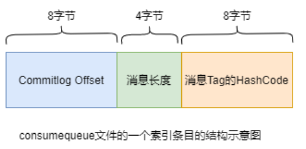

>> 消息写入
>>

一条消息进入到Broker后经历了以下几个过程才最终被持久化

1. Broker根据queueId，获取到该消息对应索引条目要在consumequeue目录中的写入偏移量，即QueueOffset
2. 将queueId、queueOffset等数据，与消息一起封装为消息单元
3. 将消息单元写入到commitlog ，同时，形成消息索引条目 ，同时，形成消息索引条目

>> 消息拉取
>>

当Consumer来拉取消息时会经历以下几个步骤

1. Consumer获取到其要消费消息所在Queue的消费偏移量offset，计算出其要消费消息的消息offset

`消费offset即消费进度，consumer对某个Queue的消费offset，即消费到了该Queue的第几条消息消息offset = 消费offset + 1  `

2. Consumer向Broker发送拉取请求，其中会包含其要拉取消息的Queue、消息offset及消息Tag。
3. Broker计算在该consumequeue中的queueOffset。
4. 从该queueOffset处开始向后查找第一个指定Tag的索引条目。解析该索引条目的前8个字节，即可定位到该消息在commitlog中的commitlog offset ,从对应commitlog offset中读取消息单元，并发送给Consumer

>> 性能问题
>>

1. RocketMQ对文件的读写操作是通过[**mmap零拷贝**](/java/java-io/1-nio?id=零拷贝问题)进行的，将对文件的操作转化为直接对内存地址进行操作，从而极大地提高了文件的读写效率
2. consumequeue中的数据是顺序存放的，还引入了PageCache的预读取机制，使得对consumequeue文件的读取几乎接近于内存读取，即使在有消息堆积情况下也不会影响性能
   1. PageCache机制，页缓存机制，是OS对文件的缓存机制，用于加速对文件的读写操作。一般来
      说，程序对文件进行顺序读写 的速度几乎接近于内存读写速度

### indexFile

1. 除了通过通常的指定Topic进行消息消费外，RocketMQ还提供了**根据key进行消息查询的功能**。该查询是通过store目录中的index子目录中的indexFile进行索引实现的快速查询。当然，这个indexFile中的索引数据是在包含了key的消息被发送到Broker时写入的。如果消息中没有包含key，则不会写入
2. indexFile与consumerLog不同的是，consumerLog针对某个topic做索引，indexFile针对所有做索引

>> 结构
>>

1. 每个Broker中会包含一组indexFile，每个indexFile都是以一个时间戳命名的（这个indexFile被创建时的时间戳）
2. 每个indexFile文件由三部分构成：indexHeader，slots槽位，indexes索引数据
3. 每个indexFile文件中包含500w个slot槽。而每个slot槽又可能会挂载很多的index索引单元。

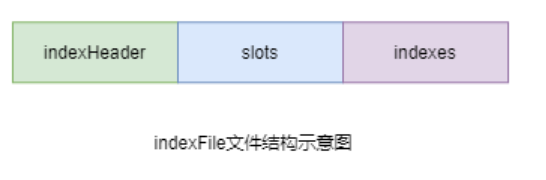

>> index索引单元
>>

默写20个字节，其中存放着以下四个属性

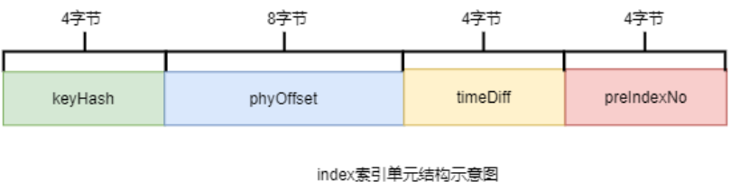

# 消息过滤

## Tag过滤

1. Consumer端会将这个订阅请求构建成一个 SubscriptionData，发送一个Pull消息的请求给Broker端。
2. Broker端从RocketMQ的文件存储层—Store读取数据之前，会用这些数据先构建一个MessageFilter，然后传给Store。
3. Store从 ConsumeQueue读取到一条记录后，会用它记录的消息tag hash值去做过滤(hash 冲突)
4. 在服务端只是根据hashcode进行判断，无法精确对tag原始字符串进行过滤，在消息消费端拉取到消息后，还需要对消息的原始tag字符串进行比对，如果不同，则丢弃该消息，不进行消息消费。

通过consumer的subscribe()方法指定要订阅消息的Tag(即：subExpression)。如果订阅多个Tag的消息，Tag间使用或运算符(双竖线||)连接。

```java
DefaultMQPushConsumer consumer = new
DefaultMQPushConsumer("CID_EXAMPLE");
consumer.subscribe("TOPIC", "TAGA || TAGB || TAGC");
```

## SQL过滤

SQL过滤是一种通过特定表达式对事先埋入到消息中的用户属性进行筛选过滤的方式。通过SQL过滤，可以实现对消息的复杂过滤。不过，只有使用PUSH模式的消费者才能使用SQL过滤。

> SQL过滤表达式中支持多种常量类型与运算符

>> 常量类型
>>

数值：比如：123，3.1415
字符：必须用单引号包裹起来，比如：'abc'
布尔：TRUE 或 FALSE
NULL：特殊的常量，表示空

>> 运算符
>>

数值比较：>，>=，<，<=，BETWEEN，=
字符比较：=，<>，IN
逻辑运算 ：AND，OR，NOT
NULL判断：IS NULL 或者 IS NOT NULL

---

`默认情况下Broker没有开启消息的SQL过滤功能，需要在Broker加载的配置文件中添加如下属性，以开启该功能：  `

```shell
enablePropertyFilter = true
```

在启动Broker时需要指定这个修改过的配置文件。例如对于单机Broker的启动，其修改的配置文件是conf/broker.conf，启动时使用如下命令：

```shell
sh bin/mqbroker -n localhost:9876 -c conf/broker.conf &
```

# RocketMQ应用

## 批量消息

### 批量发送

> 发送限制

1. 批量发送的消息必须具有相同的Topic
2. 批量发送的消息必须具有相同的刷盘策略
3. 批量发送的消息必须具有相同的刷盘策略

> 发送大小

默认情况下，一批发送的消息总大小不能超过4MB字节

如果超过，则需要消息分割器进行分割

### 批量消费

Consumer的MessageListenerConcurrently监听接口的consumeMessage()方法的第一个参数为消息列表，但默认情况下每次只能消费一条消息。若要使其一次可以消费多条消息，则可以通过修改Consumer的consumeMessageBatchMaxSize属性来指定。不过，该值不能超过32。因为默认情况下消费者每次可以拉取的消息最多是32条。若要修改一次拉取的最大值，则可通过修改Consumer的pullBatchSize属性来指定

```java
consumer.setConsumeMessageBatchMaxSize(10);
```

## 消息重置机制

### 发送重试

> 说明

1. 生产者在发送消息时，若采用同步或异步发送方式，发送失败会重试，但oneway消息发送方式发送失败是没有重试机制的
2. 只有普通消息具有发送重试机制，顺序消息是没有的
3. 消息发送重试有三种策略可以选择：同步发送失败策略、异步发送失败策略、消息刷盘失败策略

> 重试策略

对于普通消息，消息发送默认采用round-robin策略来选择所发送到的队列。如果发送失败，默认重试2次。但在重试时是不会选择上次发送失败的Broker，而是选择其它Broker。当然，若只有一个Broker其也只能发送到该Broker，但其会尽量发送到该Broker上的其它Queue

## 消费重试

对于无序消息（普通消息、延时消息、事务消息），当Consumer消费消息失败时，可以通过设置返回状态达到消息重试的效果。不过需要注意，无序消息的重试只对集群消费方式生效，广播消费方式不提供失败重试特性

对于无序消息集群消费下的重试消费，每条消息默认最多重试16次，但每次重试的间隔时间是不同的

若一条消息在一直消费失败的前提下，将会在正常消费后的第 4小时46分 后进行第16次重试。若仍然失败，则将消息投递到 死信队列

> 修改重试策略

```java
DefaultMQPushConsumer consumer = new DefaultMQPushConsumer("cg");
// 修改消费重试次数
consumer.setMaxReconsumeTimes(10);
```

> 消费重试配置方式

集群消费方式下，消息消费失败后若希望消费重试，则需要在消息监听器接口的实现中明确进行如下三种方式之一的配置：

方式1：返回ConsumeConcurrentlyStatus.RECONSUME_LATER（推荐）
方式2：返回Null
方式3：抛出异常

# RocketMQ 消息积压

## 消费者线程

我们在配置消费的时候，一般都会配置线程数

如：

```java
DefaultMQPushConsumer consumer = new DefaultMQPushConsumer("consumer_group");
// 统一设置最小和最大线程数（推荐）
consumer.setConsumeThreadMin(20);
consumer.setConsumeThreadMax(20);
```

RocketMQ 消费者线程池采用 `LinkedBlockingQueue` 作为阻塞队列，默认未设置队列容量，导致其成为无界队列; 用户可配置 **核心线程数（`consumeThreadMin`）** 和 **最大线程数（`consumeThreadMax`）**，但由于无界队列特性，线程池不会触发扩容至最大线程数，实际运行中线程数始终等于核心线程数

## 消息拉取速度与本地消费速度的关联

消费者拉取的消息会暂存到 `ProcessQueue`，其积压状态触发流控规则：

- **消息数量阈值**：单队列默认 1000 条
- **消息大小阈值**：单队列默认 100MB
- **偏移量跨度阈值**：非顺序消费场景下，队列首尾消息偏移差默认不超过 2000

若本地消费速度慢，导致 `ProcessQueue` 达到阈值，消费者会暂停拉取消息，延迟一段时间（如顺序消费加锁失败时延迟 3 秒）后再尝试

## 策略

1. 根据rebanlce机制，适当的调整consumer的数量
2. **线程池调优**：调整consumeThreadMin的大小
3. 从consumer端着手，看代码上有没有拉低消费的代码进行优化
4. producer端，对消息生存限流

# 零拷贝

## PageCache

**PageCache（页缓存）** 是 Linux/Unix 内核在物理内存中开辟的一块缓存区域，专门用于缓存磁盘文件的**数据页**（默认大小 4KB），是操作系统优化磁盘 I/O 性能的核心机制。

简单来说，PageCache 是**内存与磁盘之间的 “中间层”**，目的是减少频繁的磁盘读写操作 —— 因为内存的读写速度比磁盘快数百倍甚至上千倍。

## 内存映射文件（Mmap）

MMAP（Memory Mapped File）是一种操作系统提供的内存映射技术

1. 它能将**磁盘文件的一部分 / 全部**直接映射到应用程序的**虚拟内存地址空间**。
2. 这样一来，应用程序操作这块内存，就等同于操作磁盘文件

# 同步复制与异步复制

如果一个Broker组有Master和Slave，消息需要从Master复制到Slave 上，有同步和异步两种复制方式。

## 同步复制

同步复制方式是等Master和Slave均写 成功后才反馈给客户端写成功状态；

## 异步复制

异步复制方式是只要Master写成功 即可反馈给客户端写成功状态。

# 高可用

1. RocketMQ分布式集群是通过Master和Slave的配合达到高可用性的
2. Master角色的Broker支持读和写，Slave角色的Broker仅支持读。

# 刷盘机制

## 同步刷盘

同步刷盘与异步刷盘的唯一区别是异步刷盘写完 PageCache直接返回，而同步刷盘需要等待刷盘
完成才返回， 同步刷盘流程如下：
(1). 写入 PageCache后，线程等待，通知刷盘线程刷盘。
(2). 刷盘线程刷盘后，唤醒前端等待线程，可能是一批线程。
(3). 前端等待线程向用户返回成功

## 异步刷盘

1. 写入消息到 PageCache时，如果内存不足，则尝试丢弃干净的 page，腾出内存供新消息使
   用，策略是LRU 方式。
2. 如果干净页不足，此时写入 PageCache会被阻塞，系统尝试刷盘部分数据，大约每次尝试 32
   个 page, 来找出更多干净 PAGE。

# 负载均衡

## 指定Queue

消息接收，和发送都可以指定queue，具体操作如下：

1. 可以通过如下命令先创建topic

```shell
## 查询admin相关的命令的帮助文档，可以找到对应的命令
[root@localhost rocketmq-all-4.9.8-bin-release]# ./bin/mqadmin 
The most commonly used mqadmin commands are:
   updateTopic          Update or create topic
   deleteTopic          Delete topic from broker and NameServer.
   updateSubGroup       Update or create subscription group
   
## updateTopic命令可以创建和修改topic
## 查看创建topic命令的帮助文档
[root@localhost rocketmq-all-4.9.8-bin-release]# ./bin/mqadmin updatetopic --help

##
[root@localhost rocketmq-all-4.9.8-bin-release]# ./bin/mqadmin updateTopic -n loclhost:9876 -b localhost:10911 -t topic_4 -w 6
```

# 死信队列

1. 死信队列中的消息不会再被消费者正常消费，即DLQ对于消费者是不可见的
2. 死信存储有效期与正常消息相同，均为 3 天（commitlog文件的过期时间），3 天后会被自动删除
3. 死信队列就是一个特殊的Topic，名称为%DLQ%consumerGroup@consumerGroup ，即每个消费者组都有一个死信队列
4. 如果⼀个消费者组未产生死信消息，则不会为其创建相应的死信队列

# 延迟消息

> 应用场景

当消息写入到Broker后，在指定的时长后才可被消费处理的消息，称为延时消息

延时消息可以实现定时任务的功能，而无需使用定时器。

典型的应用场景是：

1. 电商交易中超时未支付关闭订单的场景
2. 12306平台订票超时未支付取消订票的场景。

> 延迟等级

延时消息的延迟时长**不支持随意时长**的延迟，是通过特定的延迟等级来指定的。延时等级定义在RocketMQ服务端的MessageStoreConfig类中的如下变量中

当然，如果需要自定义的延时等级，可以通过在broker加载的配置中新增如下配置（例如下面增加了1天这个等级1d）。配置文件在RocketMQ安装目录下的conf目录中。

```
messageDelayLevel = 1s 5s 10s 30s 1m 2m 3m 4m 5m 6m 7m 8m 9m 10m 20m 30m 1h 2h 1d
```

> 实现原理

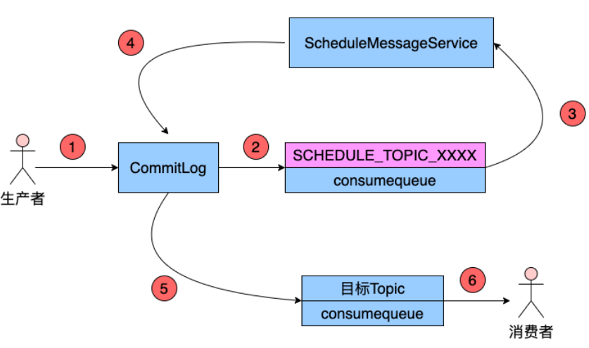

Producer将消息发送到Broker后，Broker会首先将消息写入到commitlog文件，然后需要将其分发到相应的consumequeue。不过，在分发之前，系统会先判断消息中是否带有延时等级。若没有，则直接正常分发；若有则需要经历一个复杂的过程

1. 将消息发送到Topic为SCHEDULE_TOPIC_XXXX的consumequeue中（这个XXXX其实就是延迟等级）

修改消息的Topic为SCHEDULE_TOPIC_XXXX ?

- 是按照消息投递时间排序的。一个Broker中同一等级的所有延时消息会被写入到consumequeue目录中SCHEDULE_TOPIC_XXXX目录下相同Queue中

> 代码示例

```java
Message msg = new Message(TOPIC,
        "TagA",
        "DelayOrderID188",
        "Delay Hello world".getBytes(RemotingHelper.DEFAULT_CHARSET));
//设置消息延迟等级为3（也就是10s）
msg.setDelayTimeLevel(3);
SendResult send = producer.send(msg);
log.debug("延迟消息队列：{}", LocalDateTime.now());
producer.shutdown();
```

2. 当消息时间达到，则将当前消息投递到真正的topic中，进行消费

# 顺序消息

指的是严格按照消息的发送顺序进行消费

默认情况下生产者会把消息以Round Robin`<b id="blue">`轮询方式`</b>`发送到不同的Queue分区队列；而消费消息时会从多个Queue上拉取消息，这种情况下的发送和消费是不能保证顺序的。

如果将消息仅发送到 `同一个Queue`中，消费时也只从这个Queue上拉取消息，就严格保证了消息的顺序性。

*全局有序*:

当发送和消费参与的Queue只有**一个**时所保证的有序是整个Topic中消息的顺序， 称为全局有序


*分区有序*:

1. 在创建producer的时候，我们创建queue选择器，指定投放的queue是哪个(`可以实现MessageQueueSelector  接口来选择当前生产者投递的队列` )
2. 在消费端使用`<b id="gray">`MessageListenerOrderly`</b>`进行消息消费
3. 这样，我们就保证了队列的顺序性

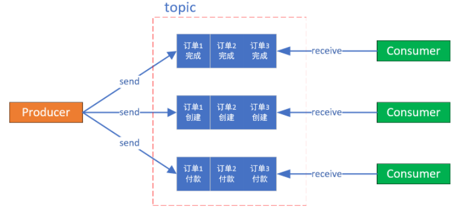

> Producer
>
> `按照某种规则投递到指定的队列中`

```java
Message msg = new Message("TOPIC",
        "TagA",
        "SortOrderID188",
        "Sort Hello world".getBytes(RemotingHelper.DEFAULT_CHARSET));
Integer orderId = 1;
//模拟指定的orderId发送指定的队列之中
SendResult send = producer.send(msg, new MessageQueueSelector() {
    @Override
    public MessageQueue select(List<MessageQueue> mqs, Message msg, Object arg) {
        Integer id = (Integer) arg;
        int index = id % mqs.size();
        return mqs.get(index);
    }
}, orderId);
producer.shutdown();
```

> Consumer
>
> `consumer使用<b id="blue">`MessageListenerOrderly`</b>`来进行并发的顺序消费

```java
//线程数等设置为1
consumer.setConsumeThreadMin(1);
consumer.setConsumeThreadMax(1);
consumer.setPullBatchSize(1);
consumer.setConsumeMessageBatchMaxSize(1);
//注册监听
consumer.registerMessageListener(new MessageListenerOrderly() {
    @Override
    public ConsumeOrderlyStatus consumeMessage(List<MessageExt> msgs, ConsumeOrderlyContext context) {
        //进行消息的消费
        return ConsumeOrderlyStatus.SUCCESS;
    }
});
```

## 与并发消息比较

`<b id="blue">`MessageListenerConcurrently`</b>`是拉取到新消息之后就提交到线程池去消费，而`<b id="blue">`MessageListenerOrderly`</b>`则是通过加分布式锁和本地锁保证同时只有一条线程去消费一个队列上的数据。

## MessageListenerOrderly的加锁机制

1. 消费者在进行某个队列的消息拉取时首先向Broker服务器申请队列锁，如果申请到琐，则拉取消息，否则放弃消息拉取，等到下一个队列负载周期(20s)再试。这一个锁使得一个MessageQueue同一个时刻只能被一个消费客户端消费，防止因为队列负载均衡导致消息重复消费。
2. 假设消费者对messageQueue的加锁已经成功，那么会开始拉取消息，拉取到消息后同样会提交到消费端的线程池进行消费。但在本地消费之前，会先获取该messageQueue对应的锁对象，每一个messageQueue对应一个锁对象，获取到锁对象后，使用synchronized阻塞式的申请线程级独占锁。这一个锁使得来自同一个messageQueue的消息在本地的同一个时刻只能被一个消费客户端中的一个线程顺序的消费。
3. 在本地加synchronized锁成功之后，还会判断如果是广播模式，则直接进行消费，如果是集群模式，则判断如果messagequeue没有锁住或者锁过期(默认30000ms)，那么延迟100ms后再次尝试向Broker 申请锁定messageQueue，锁定成功后重新提交消费请求。

## 顺序消费问题

> 性能上的问题

1. 使用了很多的锁，降低了吞吐量。
2. 前一个消息消费阻塞时后面消息都会被阻塞。如果遇到消费失败的消息，会自动对当前消息进行重试（每次间隔时间为1秒），无法自动跳过，重试最大次数是Integer.MAX_VALUE，这将导致当前队列消费暂停，因此通常需要设定有一个最大消费次数，以及处理好所有可能的异常情况。

> 消息投递问题

1. 采用队列选择器的方法不能保证消息的严格顺序，我们的目的是将消息发送到同一个队列中
2. 如果某个broker挂了，那么队列就会减少一部分
3. 如果增加了服务器，那么也会造成短暂的造成部分消息无序

# 事务消息（重要）

## 问题场景

工行用户A向建行用户B转账1万元 ：

我们可以使用同步消息来处理该需求场景 ：

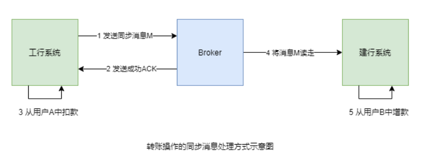

> 问题

如果1 2 成功， 3的扣款失败，但是此事4 建行读取消息已经成功

> 解决方案

解决思路是，让第1、2、3步具有原子性，要么全部成功，要么全部失败

## 事务消息生命周期

- 初始化：半事务消息被生产者构建并完成初始化，待发送到服务端的状态。
- 事务待提交：半事务消息被发送到服务端，和普通消息不同，并不会直接被服务端持久化，而是会被单独存储到事务存储系统中，等待第二阶段本地事务返回执行结果后再提交。此时消息对下游消费者不可见。
- 消息回滚：第二阶段如果事务执行结果明确为回滚，服务端会将半事务消息回滚，该事务消息流程终止。
- 提交待消费：第二阶段如果事务执行结果明确为提交，服务端会将半事务消息重新存储到普通存储系统中，此时消息对下游消费者可见，等待被消费者获取并消费。
- 消费中：消息被消费者获取，并按照消费者本地的业务逻辑进行处理的过程。 此时服务端会等待消费者完成消费并提交消费结果，如果一定时间后没有收到消费者的响应，Apache RocketMQ会对消息进行重试处理。具体信息，请参见[消费重试](https://rocketmq.apache.org/zh/docs/featureBehavior/10consumerretrypolicy)。
- 消费提交：消费者完成消费处理，并向服务端提交消费结果，服务端标记当前消息已经被处理（包括消费成功和失败）。 Apache RocketMQ默认支持保留所有消息，此时消息数据并不会立即被删除，只是逻辑标记已消费。消息在保存时间到期或存储空间不足被删除前，消费者仍然可以回溯消息重新消费。
- 消息删除：Apache RocketMQ按照消息保存机制滚动清理最早的消息数据，将消息从物理文件中删除。更多信息，请参见[消息存储和清理机制](https://rocketmq.apache.org/zh/docs/featureBehavior/11messagestorepolicy)。

## 代码片段

官方文档有不同实现：[事务消息 | RocketMQ](https://rocketmq.apache.org/zh/docs/featureBehavior/04transactionmessage/)

1. 定义一个监听器，用于操作本地事务和消息回查
   1. 消息回查是一同一个group 的producer为单位，进行回查的，具体调用group里面的哪个producer由producer自行决定

```java
static class ICBCTransactionListener implements TransactionListener {
    @Override
    public LocalTransactionState executeLocalTransaction(Message msg, Object arg) {
        //当消息投递到mq后，处于半提交状态，调用这个方法
        //可以通过本地事务使用的业务参数(arg)来进行触发本地事务提交
        try {
            boolean success = doBusinessLogic();  // 执行本地事务
            //要么提交消息，要么回滚
            return success ? LocalTransactionState.COMMIT_MESSAGE 
                           : LocalTransactionState.ROLLBACK_MESSAGE;
        } catch (Exception e) {
            return LocalTransactionState.UNKNOW;   // 触发回查[6,9](@ref)
        }
    }

    @Override
    public LocalTransactionState checkLocalTransaction(MessageExt msg) {
        //回查:只有以下两种情况会回查
        //1.回调操作返回UNKNWON
        //2.TC没有接收到TM的最终全局事务确认指令
        log.debug("收到回查消息：{}", msg);
        /**
           * 事务检查器一般是根据业务的ID去检查本地事务是否正确提交还是回滚，此处以订单ID属性为例。
           * 在订单表找到了这个订单，说明本地事务插入订单的操作已经正确提交；如果订单表没有订单，说明本地事务已经回滚。
         */
        final String orderId = messageView.getProperties().get("OrderId");
        return LocalTransactionState.COMMIT_MESSAGE;
    }
}
```

2. 启动事务消息
   1. setExecutorService主要是给checkLocalTransaction线程池异步调用

```java
//事务消息的group
TransactionMQProducer txProducer = new TransactionMQProducer("transaction_group");
//设置namespace
txProducer.setNamesrvAddr("127.0.0.1:9876");
ThreadPoolExecutor executor = new ThreadPoolExecutor(1, 1, 1000l, TimeUnit.SECONDS, new ArrayBlockingQueue<>(100));
txProducer.setExecutorService(executor);
txProducer.setTransactionListener(new ICBCTransactionListener());
txProducer.start();

Message message = new Message("tx-topic", "taga", "tx".getBytes(StandardCharsets.UTF_8));
//消息， 本地事务使用的业务参数(arg)
TransactionSendResult sendResult = txProducer.sendMessageInTransaction(message, arg);
log.debug("启动事务生产者： {}", sendResult);
```

## 应用

> 事务与本地事务表的思考

在官网，可以看到这段文字

在断网或者是生产者应用重启的特殊情况下，若服务端未收到发送者提交的二次确认结果，或服务端收到的二次确认结果为Unknown未知状态，经过固定时间后，服务端将对消息生产者即生产者集群中任一生产者实例发起消息回查。 **说明** 服务端回查的间隔时间和最大回查次数，请参见[参数限制](https://rocketmq.apache.org/zh/docs/introduction/03limits)。

也就是说 executeLocalTransaction 方法，如果执行超时，此时，服务端回调checkLocalTransaction进行事务提交判断，此时，

1. 业务代码如果执行过长，没有提交，我们直接查询业务表，发现没有数据，认定事务回滚，返回回滚状态给brocker
2. 业务代码提交事务

这个过程就会有问题了，事务提交了，消息没发出去

加入本地事务表后：

t_transation_log: 无论事务提交还是失败，都会往这个表设置数据（与业务表同一本地事务）

1. 执行executeLocalTransaction 方法，方法执行成功or失败，都插入t_transation_log数据
2. checkLocalTransaction检查t_transation_log表，有数据证明已提交，验证提交成功与失败
3. 没有数据则没有提交，返回UNKNOWN等待下一次的检查，当检查的时间超过一定限制时间，告警并且默认失败


# 限流