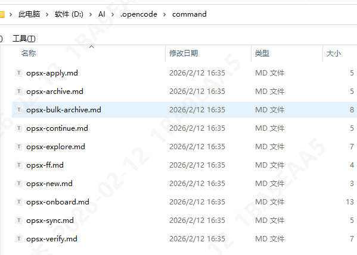
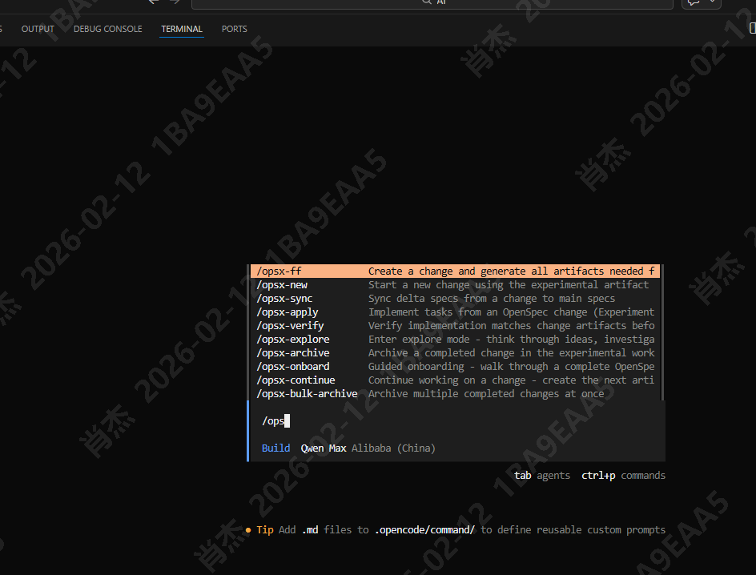

# 

# Rules vs Spec vs Skills


* **Rules** 管  **“怎么写代码”** （风格、规范、禁忌）
* **[Specs](https://zhida.zhihu.com/search?content_id=267842293&content_type=Article&match_order=1&q=Specs&zhida_source=entity)** 管  **“要做什么”** （需求、功能定义、数据库设计）
* **[Skills](https://zhida.zhihu.com/search?content_id=267842293&content_type=Article&match_order=1&q=Skills&zhida_source=entity)** 管  **“怎么做特定任务”** （复杂流程、工具链整合）

## Rules

相当于定义编码规范，比如：

1. 代码命名规范
2. 不能使用哪些包，比如Java的hutool

# Skill编写技巧

## 写 Skill 的好处

1. 复用性强 - 写一次，可以反复使用，甚至分享给团队
2. 上下文高效 - Skill 采用渐进式加载，只读取需要的内容
3. 可维护 - 集中管理专业知识，便于迭代更新

## 基本结构


```shell
my-skill/
├── SKILL.md               ← 唯一必需文件（全大写）#核心指令:触发条件、任务流程、执行指引
├── scripts/                 #可执行代码:AI直接运行的固定脚本程序
│   └── generate_ui.py     ← 可执行脚本（Python/Bash等） 
├── references/  					#参考文档，给AI看的:技术规范、API文档、专业指南
│   ├── template.md        ← 参考模板
│   └── examples/          ← 示例输出
|—— assets/						#素材资源，拿来用的，会被复制、修改:模板、图片...
└── README.md              ← 人类可读说明（非必需）
```

## SKILL.md

分三个部分

```markdown
---
name: skill-name # 必填！必须与目录名一致
description: 简短描述 # 必填！用第三人称
invocable: user # 可选，是否允许用户直接调用
license: 完整条款见 LICENSE.txt # 可选
---

# 标题

## 使用场景

- 场景 1
- 场景 2

## 功能介绍

...

## 工作流程

...

## 示例

...
```

## 原则

### 描述要精准

1. 描述字段必须用第三人称

比如：

错误写法：

```yaml
description: 使用这个技能来翻译文章...
```

正确写法

```yaml
description: 翻译英文文章为简体中文 Markdown 格式...
```

### 指令要明确并且简洁

错误

```yaml
你应该首先读取文件，然后分析内容...
```

正确：把应该这种语气词去掉，直接用命令的方式

```yaml
1. 读取文件
2. 分析内容
```

### 控制字数

SKILL.md 控制5000 字以内，

超过则：

- 把详细内容移到 `references/` 目录，
  - 比如说，达到某个条件，出触发某个环节，读取某个文件再去实现一些细节（节省token）

- 把代码移到 `scripts/` 目录
  - 比如说，达到某个条件运行某个脚本

- SKILL.md 只保留核心流程

### 提供完整示例

• 展示完整工作流程

• 包含输入和输出

• 覆盖常见场景

## 模板

### 超简洁型

```yaml
---
name: simple-rule
description: 简短描述
---

# 技能标题

执行任务时，遵循以下规则：

1. 规则一
2. 规则二
3. 规则三

## 注意事项

- 注意点 A
- 注意点 B
```

### 流程型

```yaml
---
name: workflow-skill
description: 描述这个工作流程...
---

# 技能标题

## 使用场景

- 场景一：[具体描述]
- 场景二：[具体描述]

## 核心功能

1. **功能一**：[说明]
2. **功能二**：[说明]
3. **功能三**：[说明]

## 执行流程

### 阶段 1：准备

1. [具体步骤]
2. [具体步骤]

### 阶段 2：执行

1. [具体步骤]
2. [具体步骤]

### 阶段 3：验证

1. [具体步骤]
2. [具体步骤]

## 示例

### 示例 1：[场景名称]

**用户请求：**
```

## 如何创建自己的 Skill

### AI生成

在支持 Skill Creator 的平台（如 Coze 2.0、OpenCode）输入：

```
“帮我创建一个 Skill，能自动生成 PPT 大纲，输入主题，输出 5 页结构化大纲”
```

AI 会引导你定义输入/输出/步骤，并生成完整 `SKILL.md` + 脚本。


## 生成代码SKILL示例

```markdown
---
name: spring-boot-generator
description: 根据数据库表结构自动生成Spring Boot项目的Controller、Service、Mapper接口和XML映射文件的完整三层架构代码。
---
# 自动生成Spring Boot三层架构代码

## 使用场景

用户输入表结构与包目录，和自动生成的方法，需要生成三层代码时使用

## 工作流程

1. 根据表结构，表名按照驼峰命名法，去处前缀，生成实体
2. 实体如表是long类型，则实体为String类型
3. 实体需要实现TableFieldModel基础类，并且不映射：id，create_time，creator，creator_name，modify_time，modifier，modifier_name字段
4. 生成springboot 的三层结构的Controller
5. 生成的方法由用户输入觉得，如未输入则为空类

## 示例

用户输入xxx表的表结构，输入包目录：com.xxx，

### Controller示例

1. tags名为表comment名称
2. controller输出目录为：xxx项目/xxx子目录2/src/main/java/com/xxx/controller

​```java
package com.xxx.controller;

import com.baomidou.mybatisplus.core.metadata.IPage;
import com.xxx.common.base.response.ResponseData;

@RequestMapping("/payment/plan")
@RestController
@Api(tags = "付款计划", value = "付款计划")
public class PaymentPlanController {
    
    @Autowired
    private PaymentPlanService paymentPlanService;

    
    @ApiOperation(value = "分页查询付款计划")
    @PostMapping("/queryPage")
    public ResponseData<IPage<PaymentPlanPageDto>> queryPage(@RequestBody PaymentPlanPageParam param) {
        return ResponseData.success(paymentPlanService.queryPage(param));
    }
    
}
​```

3. 实体类输出目录：xxx项目/xxx子项目1/src/main/java/com/xxx/api/model

​```
package com.xxx.api.model;

@Getter
@Setter
@ToString
@TableName("pur_payment_plan")
public class PaymentPlan extends TableFieldModel {
    /**
     * 状态 0 失效， 1 有效, 2 驳回中  4 作废
     */
    private Integer planStatus;

    /**
     * 付款计划编码
     */
    private String paymentPlanCode;
}
​```

4. 返回的查询dto输出目录：xxx项目/xxx子项目1/src/main/java/xxx/api/dto
   1. 分页查询将所有字段都返回
   2. 字段带上swagger注解

​```
package com.itl.isrm.pur.api.dto;

@Getter
@Setter
@ToString
@ApiModel("付款计划分页查询")
public class PaymentPlanPageDto implements Serializable {

}
​```

5. 查询param目录：xxx子项目/xxx子项目1/src/main/java/com/xxx/api/param
   1. 如果是分页查询，必有一个page字段
   2. 如果有公司id字段，公司id字段必传

​```
@Getter
@Setter
@ApiModel("xxx分页查询")
public class PaymentPlanPageParam implements Serializable {
	private Page<PaymentPlanPageDTO> page;
}
​```


```


# Openspec

## 什么是OpenSpec？

让人类和AI在开始工作前对规范达成一致(反复交流)

OpenSpec帮助人和AI编码助手在编写任何代码之前就构建什么达成一致。

## 工作流程

工作流程遵循一个简单的模式：

```
┌────────────────────┐
│ 开始一个变更    	  │  		/opsx:new
└────────┬───────────┘
         │
         ▼
┌────────────────────┐
│ Create Artifacts   │  /opsx:ff or /opsx:continue
│ (proposal, specs,  │
│  design, tasks)    │
└────────┬───────────┘
         │
         ▼
┌────────────────────┐
│ Implement Tasks    │  /opsx:apply
│ (AI writes code)   │
└────────┬───────────┘
         │
         ▼
┌────────────────────┐
│ Archive & Merge    │  /opsx:archive
│ Specs              │
└────────────────────┘
```

## 步骤拆分

每个步骤都可以重复的进行

```
proposal ──► specs ──► design ──► tasks ──► implement
   ▲           ▲          ▲                    │
   └───────────┴──────────┴────────────────────┘
            update as you learn
```

翻译成中文就是

先提想法 → 再写规范 → 再做设计 → 再拆任务 → 最后编码实现

| 阶段         | 核心定义（是什么）| 核心内容                                                                 | 对应开发环节                     | 输出物                     |
|--------------|---------------------------------|--------------------------------------------------------------------------|----------------------------------|----------------------------|
| proposal（提案） | 想法、方向、要不要做、解决什么问题 | 背景、目标、价值、大致思路                                               | 需求讨论、技术预研、评估功能必要性 | 提案文档（结论：做/不做）  |
| specs（规范/规格） | 做什么，定义清楚边界、行为、接口 | 输入输出、字段定义、约束、异常、兼容、不实现什么（重点）| API 文档、协议定义、数据结构定义 | 不可随意改动的规范文档     |
| design（设计）| 怎么做，技术方案、架构、模块划分 | 模块结构、类/接口设计、流程/时序图、依赖、存储、性能                     | 概要设计 + 详细设计              | 技术设计文档               |
| tasks（任务）| 把设计拆成可开发的最小单元       | 拆分为 Jira/任务、责任人、排期、依赖关系、验收标准                       | 迭代拆分、开发排期               | 任务列表                   |
| implement（实现） | 写代码、测试、上线               | 编码、单元测试/集成测试（UT/IT）、联调、问题修复                         | 编写业务代码、逻辑开发、部署上线 | 可运行的功能、上线的服务   |

## 退回某个步骤

可以直接输入，比如  

```
 退回 Proposal
```

退回到Proposal步骤

## 修改文档

命令行操作是不方便的，我们可以直接改写文档，比如，改写proposal文档，改完后

我们执行如下命令进行检查

```shell
openspec status --change xxx任务
```

注意的是，如果改了proposal提案，我们则需要重新更AI交互修改specs/design等


## 初始化

在项目文件执行初始化，选择对应的AI工具

```shell
openspec init
```

比如这里选择opencode，在对应的命令，和skill下，能看到对应openspec操作的命令



在打开opencode后，就能看到对应的命令了



## 命令详情

| Command              | Purpose                                                      |
| -------------------- | ------------------------------------------------------------ |
| `/opsx:explore`      | 如果我们不知道该做什么时候，可以先使用一个命令，AI会提示我们下面做什么 |
| `/opsx:new`          | 开始一个变更                                                 |
| `/opsx:continue`     | 创建计划（一个个的创建）                                     |
| `/opsx:ff`           | 一次性创建所有的计划                                         |
| `/opsx:apply`        | 实现任务                                                     |
| `/opsx:verify`       | Validate implementation matches artifacts                    |
| `/opsx:sync`         | Merge delta specs into main specs                            |
| `/opsx:archive`      | 归档                                                         |
| `/opsx:bulk-archive` | Archive multiple changes at once                             |
| `/opsx:onboard`      | Guided tutorial through the complete workflow                |