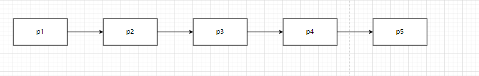

# 链表

# 几个基本的链表信息

1. 单链表反转
2. 链表中是否有环
3. 两个有序链表合并
4. 删除链表倒数第n节点
5. 求链表的中间节点

# 单链表反转




```java
pn=p1;
pt=p1.next;
p1.next=null; 
while(true) {
    //暂存第三个节点
    ptt = pt.next;
    if(ptt==null) {
        break;
    }
    //第二个节点指向第一个节点
    pt.next=pn;
    //第一，第二节点往后移一位，链表反转完成一个节点
    pn = pt;
    pt = ptt;
}
```

# 链表有环

 定义两个指针指向第一个节点。一个一次走一个节点，一个一次走两个节点，如果遇到相等节点，则链表有环

