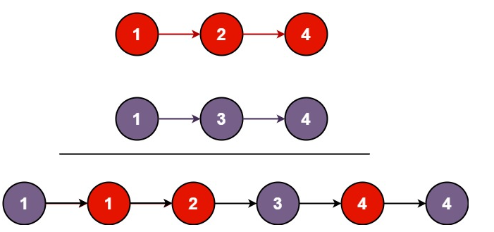

# 链表

# 几个基本的链表算法

1. 单链表反转
2. 链表中是否有环
3. 两个有序链表合并
4. 删除链表倒数第n节点
5. 求链表的中间节点

# 单链表反转


```java
public static ListNode reverseList(ListNode head) {
    //反转过后的头结点
    ListNode current = head;
    ListNode curTmp= head.next;
    ListNode per = null;
    while (curTmp != null) {
        per = curTmp.next;
        curTmp.next = current;
        current = curTmp;
        curTmp = per;
    }
    head.next = null;
    return current;
}
```

# 链表有环

 定义两个指针指向第一个节点。一个一次走一个节点，一个一次走两个节点，如果遇到相等节点，则链表有环

# 合并链表



## 递归法

1. 比较两个链表的节点
2. 小的留下来，大的和留下来的下一个节点做合并处理

```c++
struct ListNode* mergeTwoLists(struct ListNode* l1, struct ListNode* l2) {
    if (l1 == NULL) return l2;
    if (l2 == NULL) return l1;

    if (l1->val < l2->val) {
        l1->next = mergeTwoLists(l1->next, l2);
        return l1;
    } else {
        l2->next = mergeTwoLists(l1, l2->next);
        return l2;
    }
}
```

