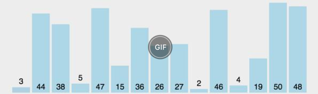

#

# 冒泡排序

```java
public static int[] sort(int[] nums) {
    for(int i=nums.length-1; i>=0; i--) {
        for(int j=i; j>0; j--) {
            //相邻的两位开始比
            if(nums[j]<nums[j-1]){
                int tmp = nums[j];
                nums[j] = nums[j-1];
                nums[j-1] = tmp;
            }
        }
    }
    return nums;
}
```

# 选择排序

如下：从第一个index开始，拿出3，与左边的index+1开始寻找对比，将最小的数找到，放到index位置

再从index+1开始执行上面操作



```java
public static int[] sort(int[] nums) {
    for(int i=0; i<nums.length; i++) {
        int tmp = nums[i];
        int index = i;
        for(int j=i+1; j<nums.length; j++) {
            if(nums[j]<tmp) {
                //找出最小的数
                tmp = nums[j];
                index = j;
            }
        }
        //使用最小的数座交换
        nums[index] = nums[i];
        nums[i] = tmp;
    }
    return nums;
}
```

# 快排

比如有数组：4, 5, 6, 2, 7, 1, 10, 8

1. 我们选定一个数，如最右边的8
2. 将数组划分两块，4, 5, 6, 2,        7, 1, 10,      8
3. 如果