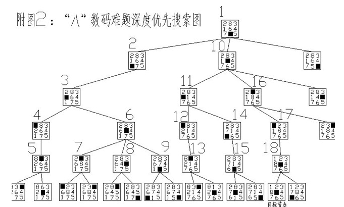
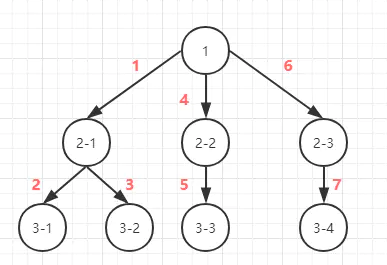
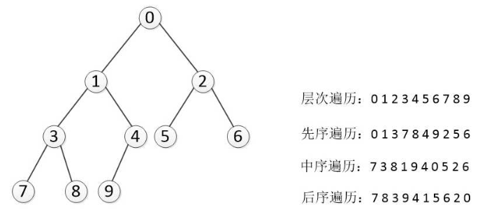
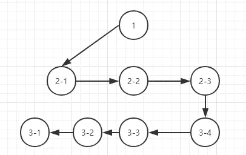
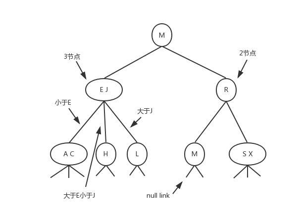
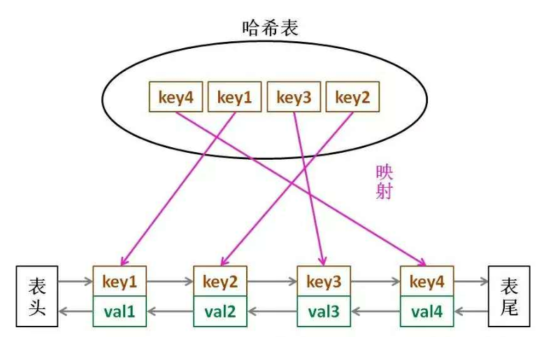
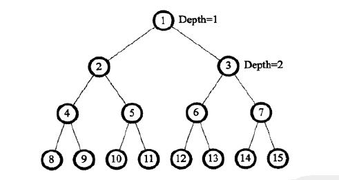
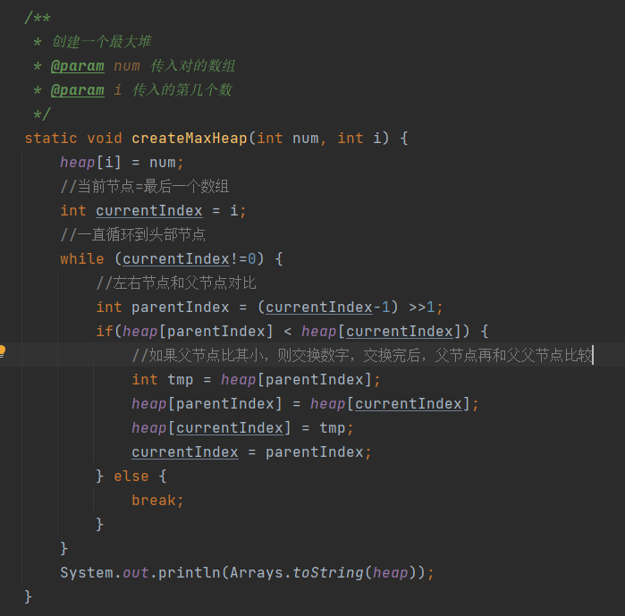

#

# 算法复杂度

## 时间复杂度

1. 常数阶O(1)

- 时间与数据规模无关，如交换两个变量值

2. 线性阶O(n)

- 时间和数据规模呈线性，可以理解为n的1次方，如单循环里的操作

```java
for(int i=0; i<=n; i++) {
    do();
}
```

3. k次方阶o(n)

- 执行次数是数量的k次方，如多重循环，以下为2次方阶实例

```java
for(int i=0; i<=n; i++) {
    for(int j=0; j<=n; j++) {
      do();  
    }
}
```

4. 指数阶O(21)

- 随着n的上升，运算次数呈指数增长

> 最好情况时间复杂度
>
> 最坏情况时间复杂度
>
> 平均情况时间复杂度


## 对数阶


```java
i=1;
while(i<=n) {
    i= i*2
}
```

分析这段代码，

当 i从1开始，每次循环，*2，

假定我们执行次数是x

2^x=n   =>>则x=log2n

由此得知，执行的时间复杂度为logn 

## 空间复杂度


# 基础概念

- 什么是数据结构
  - 存储数据的不同方式
- 什么是算法
  - 同一个问题的不同解决方法

## 计算机基础

### 原码、反码、补码

- 机器数

  - 一个数在计算机中的二进制表示形式,  叫做这个数的机器数

  - 比如，十进制中的数 +3 ，计算机字长为8位，转换成二进制就是00000011。如果是 -3 ，就是 10000011 。

    那么，这里的 00000011 和 10000011 就是机器数

- 真值

  - 就是现实中的数字（二进制）必须有+/-，实际中整数舍弃了+。
  - 例：0000 0001的真值 = +000 0001 = +1，1000 0001的真值 = –000 0001 = –1

- 原码

  - 例如，我们用8位二进制表示一个数，+11的原码为00001011，-11的原码就是10001011
  - 在计算机中表示的带符号的二进制数称为机器数。原码是机器数的一种表示方式

```tex
真值：+10000101        -10101100
原码：010000101        110101100
```

- 反码

  -  符号位不动
  - 正数的反码是其本身
  - 负数的反码是其余各个位取反

```
[+1] = [00000001]原 = [00000001]反

[-1] = [10000001]原 = [11111110]反
```

- 补码
  - 正数的补码就是其本身
  - 负数的补码是在其原码的基础上, 符号位不变, 其余各位取反, 最后+1. (**即在反码的基础上+1**)

```tex
真值：+1010111          -1110101    -101010100
反码：01010111			 10001010	 1010101011
补码：01010111          10001011    1010101100
```


## 算法思想

1. 分而治之

2. 动态规划


#  斐波那契数列

斐波那契数列（1,1,2,3,5,8,13,21,34 ），现在要求输入一个整数n，请你输出斐波那契数列的第n项（从0开始，第0项为0）。n<=39

## 递归解法

从数值中可以看到，第3项的值=第2+第1项值，即 f(n) = f(n-1) + f(n-2)

其时间复杂度为：2^n

```java
public int fibonacci(int n) {
    if(n==0){
        return 0;
    }
    if(n == 1) {
        return 1;
    }
    if(n>1){
        int num = this.fibonacci(n-1) + this.fibonacci(n-2);
        return num;
    }
    return 0;
}
```

## 快速解法

n=2   res=1+0

n=3  res = (1+0)+1

n=4  res= (1+0) + (1+0+1)

n=5  res = (1+0+1) +( (1+0) + (1+0+1))

从上面看，n=5 时，（1+0+1）在n=3时计算过， ( (1+0) + (1+0+1)) 在n=4时计算过，所以，代码上，可以弄两个变量，保存第n-1项，和n-2项的值

```java
public int fibonacci(int n) {
    if(n==0){
        return 0;
    }
    if(n == 1) {
        return 1;
    }
    int a=0;
    int b=1;
    int ret=0;
    for (int i=1; i<n; i++){
        //保留前两项之和
        ret =a+b;
        //下一轮b=n-2项的值
        a=b;
        //下一轮ret=n-1项的值
        b=ret;
    }
    return ret;
}
```

## 青蛙跳台阶

一只青蛙一次可以跳上1级台阶，也可以跳上2级。求该青蛙跳上一个n级的台阶总共有多少种跳法（先后次序不同算不同的结果）

解法：

由于它可以跳1级台阶或者2级台阶，所以**它上一步必定在第n-1,或者第n-2级台阶**，也就是说**它跳上n级台阶的跳法数是跳上n-1和跳上n-2级台阶的跳法数之和**


```java
public class Solution {
    public int jumpFloor(int target) {
        if(target <=2)
            return target;
        int ret=0, a=1, b=2;
        for(int i=2; i<target; i++){
            ret=a+b;
            a=b;
            b=ret;
        }
        return ret;
    }
}
```

## 变态跳台阶

一只青蛙一次可以跳上1级台阶，也可以跳上2级……它也可以跳上n级，求该青蛙跳上一个n级的台阶总共有多少种跳法。 f(n)=f(n-1)+...+f(1)， f(n-1) = f(n-2) + ... + f(1) f(n)=2f(n-1)

```java
public class Solution {
    public int jumpFloorII(int target) {
        if(target ==1)
            return 1;
        int ret =1;
        int a=1; //相当于第一步
        //循环n次
        for(int i=2; i<=target; i++){
            //当n=2时， 2*（n=1）
            ret = 2*a;
            a=ret;
        }
        return ret;
    }
}
```

#  位运算

##  二进制中1的个数

输入一个整数，输出该数二进制表示中1的个数。其中负数用补码表示。

```java
public int NumberOf1(int n) {
    int count=0;
    while (n!=0) {
        //当n&(n-1)相当于去掉了最低位的1
        //10010&10001=10000
        n=n&(n-1);
        count++;
    }
    return count;
}
```

## 不用加减乘除做加法

1.不考虑进位对每一位相加。0加0、1加1结果都是0,0加1、1加0结果都是1。这和异或运算一样；

2.考虑进位(进位计算)，0加0、0加1、1加0都不产生进位，只有1加1向前产生一个进位。可看成是先做位*与运算*，然后向左移动一位；

3.相加过程重复前两步，直到不产生进位为止。(如果有进位，则需要进位+原有位数的数)

如：

010+010

010^010 +(010&010)<<1 = 0000+1000

```java
static int add(int a, int b) {
    while (b!=0) {
        //异或计算
        int temp = a^b;
        //计算进位
        b = (a&b)<<1;
        a = temp;
    }
    return a;
}
```

## 数组中出现次数超过一半的数字

数组中有一个数字出现的次数超过数组长度的一半，请找出这个数字。例如输入一个长度为9的数组{1,2,3,2,2,2,5,4,2}。由于数字2在数组中出现了5次，超过数组长度的一半，因此输出2。如果不存在则输出0。

### 方式一

- 空间复杂度O(n), 时间复杂度O(n)

定义一个map，记录数字和次数<数字， 次数>，记录完后遍历输出值

### 方式二

- 数组中的数两两兑换，如果不相等，则去掉，留下来的数则可能是满足条件的数
- 如： 1 2 不相等，去掉， 3 2 去掉， 2 5 去掉， 4 2 去掉， 剩下的2 2 就是数组中最多的一个数，可能会超过1/2

```java
//记录当前比对的对数的前一个数
//如： 1 2  中的 1
int last = 0;
int lastCount = 0;
for(int num : array) {
    if(lastCount == 0) {
        //记录两个数中的前一个数
        last = num;
        lastCount = 1;
    } else {
        if(last == num) {
            lastCount++;
        } else {
            //当不相等时，则-1，一般两个不相等的，此时需要减到0
            lastCount--;
        }
    }
}
if(lastCount == 0) {
    return 0;
} else {
    int length = array.length;
    //循环查出出现的次数
    int sum = 0;
    for(int num : array) {
        if(num == last){
            sum ++;
        }
        if(sum>(length>>1)) {
            return last;
        }
    }
}
return 0;
```

# 树

## 二叉树

结构：

```java
static class Node<T> {
    T val;
    Node<T> left;
    Node<T> right;
    public Node(T val) {
        this.val = val;
    }
}
```

- 深度优先





1. 先序遍历：先打印根节点，再打印左子树，再打印右子树

```java
public static void firstOrder(Node<Integer> node) {
    if(node == null) {
        return;
    }
    System.out.print(node.val + ",");
    firstOrder(node.left);
    firstOrder(node.right);
}
```

1. 中序遍历：左子树输出完了后再输出根节点，再输出右子树

```java
public static void inorder(Node<Integer> node) {
    if(node == null) {
        return;
    }
    inorder(node.left);
    System.out.print(node.val + ",");
    inorder(node.right);
}
```

1. 后续遍历：先左后右再根



- 广度优先



## 二叉搜索树

- 插入时，数据比当前节点小放在左子树，比当前节点大放在右子树

## 2-3树



## 定义

1. 如果一个内部节点拥有一个数据元素、两个子节点，则此节点为2节点
2. 如果一个内部节点拥有一个数据元素、两个子节点，则此节点为2节点

当且仅当以下叙述中有一条成立时，*T*为2–3树

1. 当且仅当以下叙述中有一条成立时，*T*为2–3树
2. 当且仅当以下叙述中有一条成立时，*T*为2–3树
   1. *L*和*R*是等高的非空2–3树(*等高*)
   2. *a*大于*L*中的所有数据元素；同时*a*小于等于*R*中的所有数据元素（二叉搜索树）
3. *T*为拥有数据元素*a*和*b*的3节点，其中*a* < *b*。若*T*的左孩子为*L*、中孩子为*M*、右孩子为*R*，则
   1. *L*、*M*、和*R*是等高的非空2–3树
   2. *a*大于*L*中的所有数据元素，并且小于等于*M*中的所有数据元素；同时b大于M中的所有数据元素，并且小于等于R中的所有数据元素
   3. 相当于（L<a<=M && M< b<=R）

# 失效算法

失效算法常见于缓存系统中。因为缓存往往占据大量内存，而内存空间是相对昂贵，且空间有限的，那么针对一部分值，就要依据相应的算法进行失效或移除操作。

## 先来先淘汰（FIFO）

可以使用链表来模拟队列操作


## 最久未用淘汰(LRU）

1. 某个key的set或get操作一旦发生，认为这个key的记录成了最常使用的。
2. 当缓存的大小超过K时，移除最不经常使用的记录，即set或get最久远的

特性：

- 必须要有顺序之分，以区分最近使用的和很久没有使用的数据排序
- 写和读操作一次搞定
- 如果容量(坑位)满了要删除最不长用的数据，每次新访问还要把新的数据插入到队头(按照业务你自己设定左右那一边是队头)

所以采用：hashmap+双向链表来进行设计

1. 当发生读的时候，将数据放到队尾 



代码[com.xiao.algorithm.lru.LRU]

## 最近最少使用（LFU）

即最近最少使用。它要淘汰的是最近一段时间内，使用次数最少的值。可以认为比LRU多了一重判断。LFU需要时间和次数两个维度的参考指标。需要注意的是，两个维度就可能涉及到同一时间段内，访问次数相同的情况，就必须内置一个计数器和一个队列，计数器算数，队列放置相同计数时的访问时间。

# 限流算法

限流是对系统的一种保护措施。即限制流量请求的频率（每秒处理多少个请求)。一般来说，当请求流量超过系统的瓶颈，则丢弃掉多余的请求流量，保证系统的可用性。即要么不放进来，放进来的就保证提供服务。

## 计数器

## 漏桶算法

漏桶算法将请求缓存在桶中，服务流程匀速处理。超出桶容量的部分丢弃。漏桶算法主要用于保护内部的处理业务，保障其稳定有节奏的处理请求，但是无法根据流量的波动弹性调整响应能力。现实中，类似容纳人数有限的服务大厅开启了固定的服务窗口。

## 令牌桶

## 滑动窗口

# 最小堆

1. 根元素是最小的元素，父节点小于它的两个子节点。
2. 是一个完全二叉树

> 二叉树的编号



当我们用一个数组并且一个个模拟二叉树的时候

个数是奇数的话，下面就是 （个数+1）/2 因为有一半去了右边

个数是偶数的话，（个数）/2

> 创建最大堆代码




# 负载均衡

 

