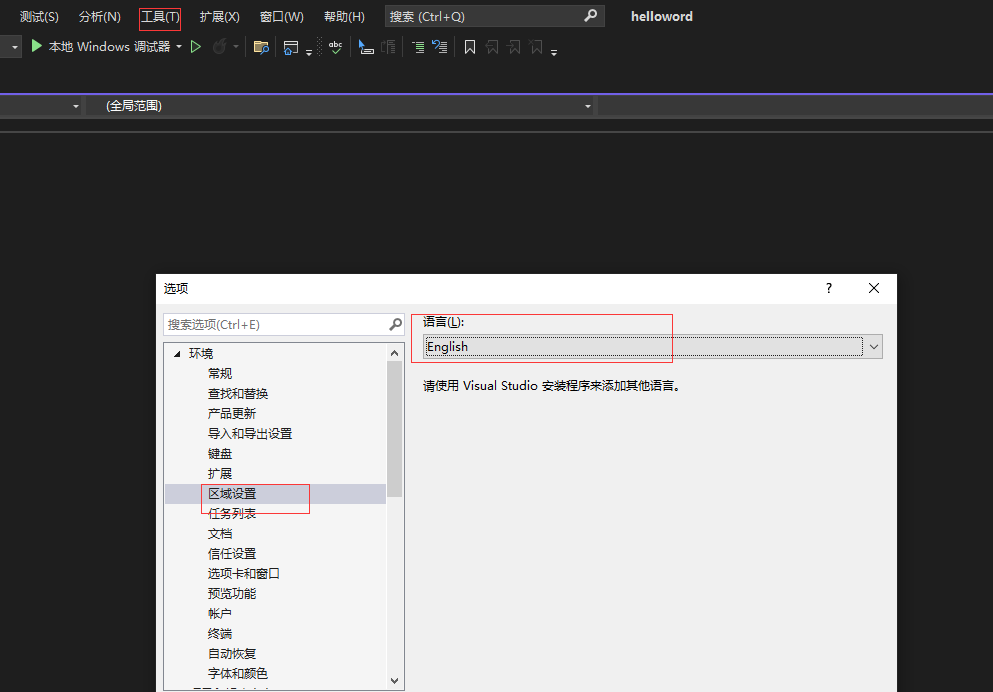
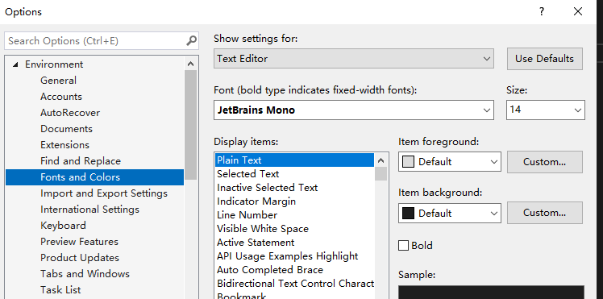
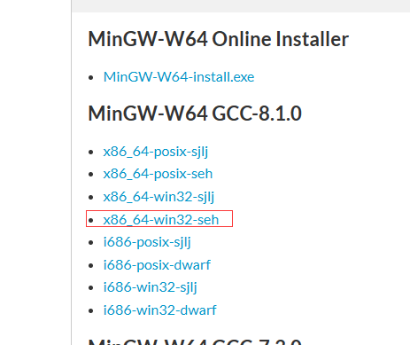
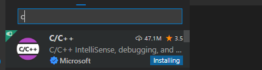
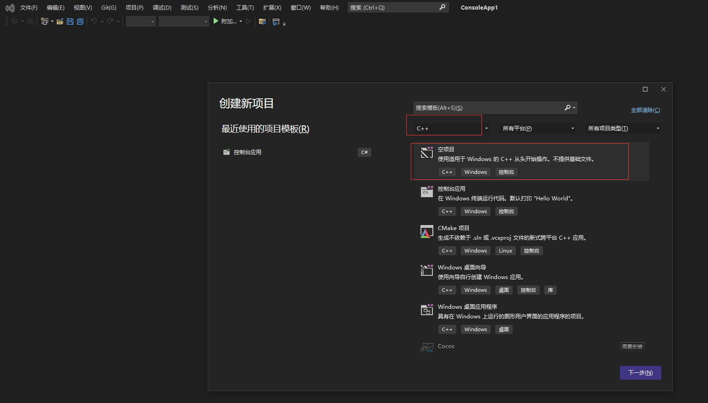

# vs修改成英语界面




# 字体设置

	

# vscode 配置环境

## 配置MinGW

前往：[MinGW-w64 - for 32 and 64 bit Windows - Browse /mingw-w64 at SourceForge.net](https://sourceforge.net/projects/mingw-w64/files/mingw-w64/)下载



将mingw64复制到无中文的路径，然后配置环境变量

## 安装vscode插件



## .vscode添加配置文件

### launch.json

```json
{
    "version": "0.2.0",
    "configurations": [
        {//这个大括号里是我们的‘调试(Debug)’配置
            "name": "Debug", // 配置名称
            "type": "cppdbg", // 配置类型，cppdbg对应cpptools提供的调试功能；可以认为此处只能是cppdbg
            "request": "launch", // 请求配置类型，可以为launch（启动）或attach（附加）
            "program": "${fileDirname}\\bin\\${fileBasenameNoExtension}.exe", // 将要进行调试的程序的路径
            "args": [], // 程序调试时传递给程序的命令行参数，这里设为空即可
            "stopAtEntry": false, // 设为true时程序将暂停在程序入口处，相当于在main上打断点
            "cwd": "${fileDirname}", // 调试程序时的工作目录，此处为源码文件所在目录
            "environment": [], // 环境变量，这里设为空即可
            "externalConsole": false, // 为true时使用单独的cmd窗口，跳出小黑框；设为false则是用vscode的内置终端，建议用内置终端
            "internalConsoleOptions": "neverOpen", // 如果不设为neverOpen，调试时会跳到“调试控制台”选项卡，新手调试用不到
            "MIMode": "gdb", // 指定连接的调试器，gdb是minGW中的调试程序
            "miDebuggerPath": "C:\\Program Files\\mingw64\\bin\\gdb.exe", // 指定调试器所在路径，如果你的minGW装在别的地方，则要改成你自己的路径，注意间隔是\\
            "preLaunchTask": "build" // 调试开始前执行的任务，我们在调试前要编译构建。与tasks.json的label相对应，名字要一样
    }]
}
```

### tasks.json

```json
{
    "version": "2.0.0",
    "tasks": [
        {
            "label": "build",
            "type": "shell",
            "command": "gcc",
            "args": [
                "${file}",
                "-o",
                "${fileDirname}\\bin\\${fileBasenameNoExtension}.exe",
                "-g",
                "-Wall",
                "-static-libgcc",
                "-fexec-charset=GBK",
                "-std=c11"
            ],
            "group": "build",
            "presentation": {
                "echo": true,
                "reveal": "always",
                "focus": false,
                "panel": "new"
            },
            "problemMatcher": "$gcc"
        },
        {
            "label": "run",
            "type": "shell",
            "dependsOn": "build",
            "command": "${fileDirname}\\bin\\${fileBasenameNoExtension}.exe",
            "group": {
                "kind": "test",
                "isDefault": true
            },
            "presentation": {
                "echo": true,
                "reveal": "always",
                "focus": true,
                "panel": "new"
            }
        },
        {
            "type": "cppbuild",
            "label": "C/C++: g++.exe 生成活动文件",
            "command": "C:\\mingw64\\bin\\g++.exe",
            "args": [
                "-fdiagnostics-color=always",
                "-g",
                "${file}",
                "-o",
                "${fileDirname}\bin\\${fileBasenameNoExtension}.exe"
            ],
            "options": {
                "cwd": "${fileDirname}"
            },
            "problemMatcher": [
                "$gcc"
            ],
            "group": {
                "kind": "build",
                "isDefault": true
            },
            "detail": "调试器生成的任务。"
        }
    ]
}
```

**如果遇到 正常的#include报错，可能是环境变量没配置**


### 多文件配置

```json
{
    "version": "2.0.0",
    "tasks": [
        {
            "label": "build",
            "type": "shell",
            "command": "gcc",
            "args": [
                "${file}",
                "-o",
                "${fileDirname}\\bin\\${fileBasenameNoExtension}.exe",
                "-g",
                "-Wall",
                "-static-libgcc",
                "-fexec-charset=GBK",
                "-std=c11"
            ],
            "group": "build",
            "presentation": {
                "echo": true,
                "reveal": "always",
                "focus": false,
                "panel": "new"
            },
            "problemMatcher": "$gcc"
        },
        {
            "label": "run",
            "type": "shell",
            "dependsOn": "build",
            "command": "${fileDirname}\\bin\\${fileBasenameNoExtension}.exe",
            "group": {
                "kind": "test",
                "isDefault": true
            },
            "presentation": {
                "echo": true,
                "reveal": "always",
                "focus": true,
                "panel": "new"
            }
        },
        {
            "type": "cppbuild",
            "label": "C/C++: g++.exe 生成活动文件",
            "command": "C:\\mingw64\\bin\\g++.exe",
            "args": [
                "*.cpp",
                "-o",
                "${fileDirname}\\bin\\${fileBasenameNoExtension}.exe",
                "-std=c++11",
                "-g",
                "-fexec-charset=GBK"
            ],
            "options": {
                "cwd": "${fileDirname}"
            },
            "problemMatcher": [
                "$gcc"
            ],
            "group": {
                "kind": "build",
                "isDefault": true
            },
            "detail": "调试器生成的任务。"
        }
    ]
}
```


# helloword

## 创建一个空项目

