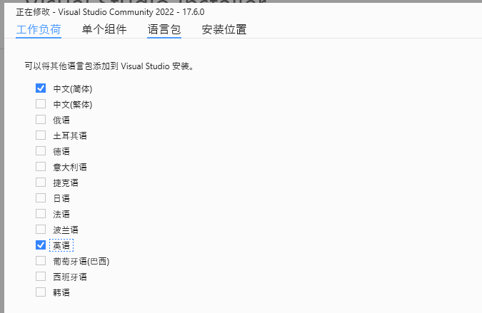
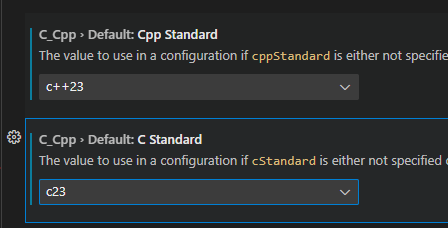
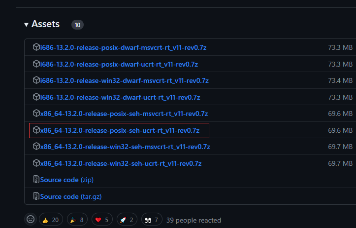
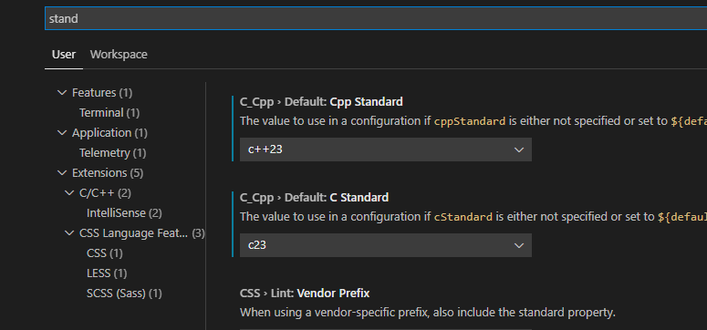
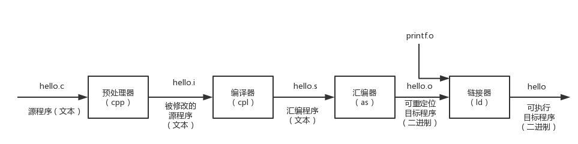
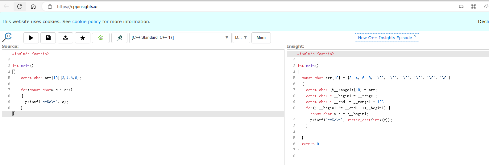

#
# VsStudio修改成英语界面
1. 打开 Visual Studio Installer

2. 按照语言包



# 字体设置

	

# Vscode 配置环境

## 配置MinGW

前往：[MinGW-w64 - for 32 and 64 bit Windows - Browse /mingw-w64 at SourceForge.net](https://sourceforge.net/projects/mingw-w64/files/mingw-w64/)下载


将mingw64复制到无中文的路径，然后配置环境变量

## 安装vscode插件


## .VsCode添加配置文件

1. setting 里面设置c++相关配置




1. 快捷键Ctrl+Shift+P调出命令面板
2. 选择Edit Configurations(UI)

- **c_cpp_properties.json** ：对C/C++扩展的设置（一些提示啊什么的，貌似现在可以没有）。
- **tasks.json** ：定义如何生成可执行文件。
- **launch.json** ：定义如何调试可执行文件

### launch.json

用于运行可执行程序

```json
{
    "version": "0.2.0",
    "configurations": [
        {//这个大括号里是我们的‘调试(Debug)’配置
            "name": "Debug", // 配置名称
            "type": "cppdbg", // 配置类型，cppdbg对应cpptools提供的调试功能；可以认为此处只能是cppdbg
            "request": "launch", // 请求配置类型，可以为launch（启动）或attach（附加）
            "program": "${fileDirname}\\bin\\${fileBasenameNoExtension}.exe", // 将要进行调试的程序的路径
            "args": [], // 程序调试时传递给程序的命令行参数，这里设为空即可
            "stopAtEntry": false, // 设为true时程序将暂停在程序入口处，相当于在main上打断点
            "cwd": "${fileDirname}", // 调试程序时的工作目录，此处为源码文件所在目录
            "environment": [], // 环境变量，这里设为空即可
            "externalConsole": false, // 为true时使用单独的cmd窗口，跳出小黑框；设为false则是用vscode的内置终端，建议用内置终端
            "internalConsoleOptions": "neverOpen", // 如果不设为neverOpen，调试时会跳到“调试控制台”选项卡，新手调试用不到
            "MIMode": "gdb", // 指定连接的调试器，gdb是minGW中的调试程序
            "miDebuggerPath": "C:\\Program Files\\mingw64\\bin\\gdb.exe", // 指定调试器所在路径，如果你的minGW装在别的地方，则要改成你自己的路径，注意间隔是\\
            "preLaunchTask": "build" // 调试开始前执行的任务，我们在调试前要编译构建。与tasks.json的label相对应，名字要一样
    }]
}
```

### tasks.json

用于编译可执行程序，即build exe

<b id="blue">label</b>需要注意，在`launch.json`中的<b id="blue">preLaunchTask</b>用的到

```json
{
    "version": "2.0.0",
    "tasks": [
        {
            "label": "build",
            "type": "shell",
            "command": "gcc",
            "args": [
                "${file}",
                "-o",
                "${fileDirname}\\bin\\${fileBasenameNoExtension}.exe",
                "-g",
                "-Wall",
                "-static-libgcc",
                "-fexec-charset=GBK",
                "-std=c11"
            ],
            "group": "build",
            "presentation": {
                "echo": true,
                "reveal": "always",
                "focus": false,
                "panel": "new"
            },
            "problemMatcher": "$gcc"
        },
        {
            "label": "run",
            "type": "shell",
            "dependsOn": "build",
            "command": "${fileDirname}\\bin\\${fileBasenameNoExtension}.exe",
            "group": {
                "kind": "test",
                "isDefault": true
            },
            "presentation": {
                "echo": true,
                "reveal": "always",
                "focus": true,
                "panel": "new"
            }
        },
        {
            "type": "cppbuild",
            "label": "C/C++: g++.exe 生成活动文件",
            "command": "C:\\mingw64\\bin\\g++.exe",
            "args": [
                "-fdiagnostics-color=always",
                "-g",
                "${file}",
                "-o",
                "${fileDirname}\bin\\${fileBasenameNoExtension}.exe"
            ],
            "options": {
                "cwd": "${fileDirname}"
            },
            "problemMatcher": [
                "$gcc"
            ],
            "group": {
                "kind": "build",
                "isDefault": true
            },
            "detail": "调试器生成的任务。"
        }
    ]
}
```

**如果遇到 正常的#include报错，可能是环境变量没配置**


### 多文件配置

```json
{
    "version": "2.0.0",
    "tasks": [
        {
            "label": "build",
            "type": "shell",
            "command": "gcc",
            "args": [
                "${file}",
                "-o",
                "${fileDirname}\\bin\\${fileBasenameNoExtension}.exe",
                "-g",
                "-Wall",
                "-static-libgcc",
                "-fexec-charset=GBK",
                "-std=c11"
            ],
            "group": "build",
            "presentation": {
                "echo": true,
                "reveal": "always",
                "focus": false,
                "panel": "new"
            },
            "problemMatcher": "$gcc"
        },
        {
            "label": "run",
            "type": "shell",
            "dependsOn": "build",
            "command": "${fileDirname}\\bin\\${fileBasenameNoExtension}.exe",
            "group": {
                "kind": "test",
                "isDefault": true
            },
            "presentation": {
                "echo": true,
                "reveal": "always",
                "focus": true,
                "panel": "new"
            }
        },
        {
            "type": "cppbuild",
            "label": "C/C++: g++.exe 生成活动文件",
            "command": "C:\\mingw64\\bin\\g++.exe",
            "args": [
                "*.cpp",
                "-o",
                "${fileDirname}\\bin\\${fileBasenameNoExtension}.exe",
                "-std=c++11",
                "-g",
                "-fexec-charset=GBK"
            ],
            "options": {
                "cwd": "${fileDirname}"
            },
            "problemMatcher": [
                "$gcc"
            ],
            "group": {
                "kind": "build",
                "isDefault": true
            },
            "detail": "调试器生成的任务。"
        }
    ]
}
```


# VS创建一个空项目


# VSCode 插件

1. C/C++：必选
2. C/C++ Extension Pack : C/C++扩展包 ；
3. C/C++ Themes : C/C++图标颜色主题；
4. Include Autocomplete 自动头文件包含
5. TabNine ：一款 AI 自动补全插件
6. CMake/CMake Tools 用于在vscode中支持cmake编译；

# VsCode 配置c++20

[Releases · niXman/mingw-builds-binaries (github.com)](https://github.com/niXman/mingw-builds-binaries/releases)

建议下载红框内的ucrt版本。



配置文件配置



tasks.json

```
 "-std=c++2a"
```

c_cpp_properties.json （配置了vscode的setting的话，可以删除这个文件）

```json
"cppStandard": "c++23",
"cStandard": "c23"
```

# 编译链接模型

源代码 (source code) →预处理器(preprocessor) → 编译器 (compiler) →目标代码(object code) →链接器(Linker) → 可执行程序(executables)



## 预处理

将源文件转换为翻译单元的过程


```shell
g++ -E test.cpp -o test.i
```

### 防止头文件被循环展开

- #ifdef 解决方案
  - 有弊端，可能会定义重复的 定义
- #pragma once解决方案
  - 推荐使用，保证只会被include一次

## 编译

将其转为汇编代码

```bash
g++ -S test.i -o test.s
```

编译优化网站：[Compiler Explorer (godbolt.org)](https://godbolt.org/)

## 汇编

```text
g++ -c test.s -o test.o
```

## 链接

合并多个目标文件。关联声明与定义

```text
g++ test.o -o test
```

#  HelloWord

```c++
#include <iostream>

//使用命名空间，下面使用可以省略
using namespace std;

int main()
{	
	//输出helloword
	std::cout << "helloword \n";
	//定义变量
	int a = 1;
	char b = 'b';
	//endl 表示换行 类似cout << b << "\n";
	cout << a << endl;
	cout << b << "\n";
	//阻塞命令
	system("pause");
	return 0;
}
```

## 为什么main函数要有返回值

1. 一般来说，我们来通过返回值来判断程序执行是否成功，一般 程序返回0表示成功（约定俗称）
2. 我们通过错误返回的代码来做一些操作

## 为什么main函数可以没有return

c++标准规定，如果main没有return,则默认返回0

# 查看c++是如何编译的

[C++ Insights (cppinsights.io)](https://cppinsights.io/)



# 系统io

iostream:

标准库所提供的 IO 接口，用于与用户交互

1. 输入流： cin ；输出流： cout / cerr / clog
2. cout 与cerr的区别： 输出目标； 
3. cerr和clog的区别：是否立即刷新缓冲区，cerr会立即刷新缓冲区，clog将数据先输出缓冲区，不会立即刷新
4. 缓冲区与缓冲区刷新： std::flush; std::endl 

# 命名空间

1. 可以避免include的多个函数，从而导致的名字冲突

## 调用方式

定义一个命名空间，后面的人使用需要带上命名空间才能访问里面的函数

```c++
#include <iostream>

using namespace std;

//定义一个命名空间
namespace n1
{
    void fun() 
    {
        std::cout << "fun.. \n";
    }
}

int main(int argc, char const *argv[])
{
    //使用命名空间里的函数
    n1::fun();
    return 0;
}

```

## 全局定义使用某个命名空间

定义了全局之后，后面都可以省略命名空间

但是不建议，因为命名空间的定义本身就是为了解决冲突，这样定义可能产生冲突

```c++
//定义一个命名空间
namespace n1
{
    void fun() 
    {
        std::cout << "fun.. \n";
    }
}

using namespace n1;

int main(int argc, char const *argv[])
{
    //使用命名空间里的函数
    fun();
    return 0;
}
```

# 结构体

通过一个结构体，将不同的变量聚合到一起

## 定义结构体

```c++
struct stuStruct
{
    /* 定义一个struct */
    string name;

    int age;
    //构造方法
    stuStruct() {
        name = "小小";
        age = 18;
    }
	//带参数构造方法
    stuStruct(string name, int age) {
        this->age = age;
        this->name = name;
    }

    //定义一个方法
    void toString() {
        cout << name << endl;
        cout << age << endl;
    }
};
```

## 调用结构体

```c++
int main() {
    //在初始化的时候，就调用了结构体的构造方法
    stuStruct ss;
    //调用结构体的方法
    ss.toString();

    //给结构体属性赋值(这里实际调用的就是他的构造方法)
    stuStruct ss2 = {"小~", 19};
    ss2.toString();
    return 0;
}
```

# 类型

## 类型描述

1. 类型是一个编译期概念，可执行文件中不存在类型的概念

> 类型描述了

1. 存储所需要的尺寸 (sizeof ，标准并没有严格限制 )

```c++
//利用sizeof 输出类型存储所需要的大小， 输出 4  4
int main(int argc, char const *argv[])
{
    int x = 10;
    std::cout << sizeof(x) << '\n';
    std::cout << sizeof(int) << '\n';
    std::cout << "end--" << std::endl;
    return 0;
}
```

2. 取值空间 (std::numeric_limits ，超过范围可能产生溢出 )

```c++
#include <iostream>
#include <limits>

//输出某个类型的取值范围（最大的存取数值）
int main(int argc, char const *argv[])
{
    std::cout << std::numeric_limits<int>::min() << std::endl;
    std::cout << std::numeric_limits<int>::max() << std::endl;
    return 0;
}
```

3. 对齐信息（ alignof ）
   1. 为啥要对齐：简单来说，就是方便计算机去读写数据
   2. 对齐的地址一般都是 n（n = 2、4、8）的倍数
   3. 1 个字节的变量，例如 **char** 类型的变量，放在**任意地址**的位置上；
   4. 2 个字节的变量，例如 **short** 类型的变量，放在 **2 的整数倍**的地址上
4. 可以执行的操作(这个类型可以执行的操作)

## 自定义后缀

```c++
//输出6， 讲double类型转为整型*2
int operator ""_dd(long double num) 
{
    return (int)num * 2;
}

int main(int argc, char const *argv[])
{
    std::cout << 3.14_dd << std::endl;
    return 0;
}
```


# 指针

一种间接类型， 存储可以“指向”不同的对象的地址

## 相关操作

1. <b id="blue">&</b> – 取地址操作符
2. <b id="blue">*</b>  – 解引用操作符

```c++
//定义一个指针类型,int*标识指针类型
int* p = &val;

int* p = nullptr;
```

### 定义

```c++
int* p
```

如果定义一个指针，但是没有初始化，那么<b id="blue">*p</b>解引用打印出来可能是随机值，因为这块内存是随机的

### 关于 nullptr

1. 
   一个特殊的对象（类型为 <b id="blue">nullptr_t</b>），表示空指针
2. 类似于 C 中的 NULL ，但更加安全

```c++
//输出0
int* j = nullptr;
std::cout << j << std::endl;
```


## 调用优先级

```c++
int func(int i)
{
    std::cout << "func1" << std::endl;
}

int func(int* i)
{
    std::cout << "func2" << std::endl;
}

int main(int argc, char const *argv[])
{
    //优先调用func1， 因为是整型
    func(1);
    //调用func2，因为是指针类型
    int* i = 0;
    func(i);
    return 0;
}
```

## 主要操作

解引用;

增加、减少;-----*可以对指针指向的地址进行移动*

判等 (**不要拿地址进行大小判断，因为地址在不等的情况，大小是不定的**)

## void* 指针

1. 没有记录对象的尺寸信息，可以保存任意地址

2. 可以用来作为参数，可以传入任何指针类型（指针的尺寸是一样的）


```c++
#include <iostream>

void fun(void* param) 
{
    char* p = (char*)param;
    std::cout << *p << std::endl;
}
//我们可以用来传入任意的引用，然后在函数内进行转换
int main(int argc, char const *argv[])
{
    int i = 1;
    char a = 'a';
    //fun(&i);
    fun(&a);
    return 0;
}

```

3. 判等的操作

## 数组指针

数组就是存储了第一个元素的地址，所以，指针就是存储了他的第一个地址

```c++
int number[] = {1,2,3,4,5,6};
int* numberPr = number;
//输出 1
cout << *numberPr << endl;
//输出下一个元素
numberPr++;
cout << *numberPr << endl;
```

## 为什么需要指针

*减少传参的性能*;

当传参的时候，往往会复制一个变量到临时参数上，如果数据量大，则非常消耗性能，如果传递指针，则只需要将地址进行赋值

# 引用

1. int& ref = val;
2. 是对象的别名，不能绑定字面值

```c++
int i = 10;
int& j = i;
j++;
//输出的都是11，相当于操作j就相当于操作i
std::cout<< j << std::endl;
std::cout << i << std::endl;
//如果定义 Int& j=10;则不可以，因为不可以直接字面量操作
return 0;
```

3. 属于编译期概念，在底层还是通过指针实现

# 常量

1. 使用 const 声明常量对象
2. 防止非法操作

## 常量指针

const int* p;   指针指向内容可改

int* const p;  指针指向内容不可改

const int* const p; 指针和指向内容都不可改


## 常量引用

```c++
const int&
```

1. 可读但不可写
2. 主要用于函数形参

```c++

void fun(const int& x) {

}
// 防止x在函数方法里做修改
int main(int argc, char const *argv[])
{
    int x = 0;
    fun(x);
    return 0;
}
```

# 静态变量

生命周期：从执行这一块代码开始，到整个程序结束

```c++
static int i = 0;
```

如：x生命周期是从，首次进入<b id="gray">fun</b>函数开始，到程序结束

```c++
void fun()
{
    static int x = 3;
}
```


# 别名

typedef int MyInt;

using MyInt = int; （从 C++11 开始）

可以为类型引入别名，从而引入特殊的含义或便于使用

# 类型的自动推导

1. 从 C++11 开始，可以通过初始化表达式自动推导对象类型
2. 自动推导类型并不意味着弱化类型，对象还是强类型

```c++
//计算完后，我们不知道x的类型，这时候我们可以交给编译器自动识别
auto x = 3.5 + 5l;
std::cout << x << std::endl;
return 0;
```

3. auto: 最常用的形式，但会产生类型退化

```c++
// ief 本来是引用类型，但是， 作为右值使用的时候
// auto 产生类型退化， ia 成为了int类型
int i = 10;
int& ief = i;
auto ia = ief;
```

4. auto& : 推导出引用类型，避免类型退化


