# 

# VsStudio相关安装

## 修改成英语界面
1. 打开 Visual Studio Installer

2. 按照语言包


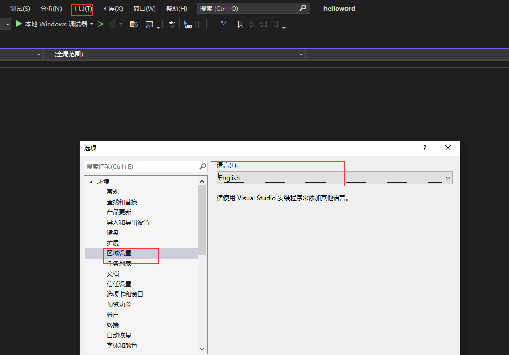

## 字体设置

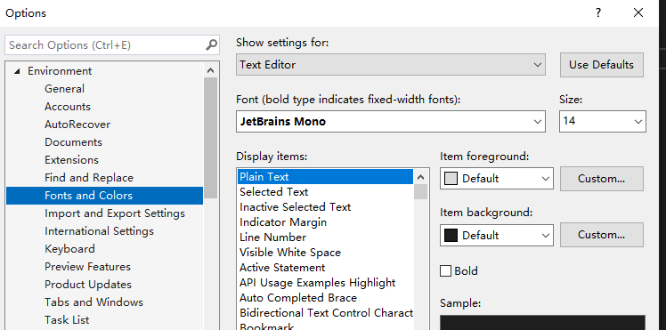	

## 离线插件入口

[Extensions for Visual Studio family of products | Visual Studio Marketplace](https://marketplace.visualstudio.com/)

## 安装类似idea的主题

1. 安装Darcula_Theme主题[Darcula 主题 - Visual Studio Marketplace](https://marketplace.visualstudio.com/items?itemName=rokoroku.vscode-theme-darcula)  
2. 完毕进入VS后依次点击按钮 工具>主题>Darcula 即可切换为IntelliJ 的主题样式

## idea 的快捷键

1. Hot Keys - Keyboard Shortcuts 插件[Hot Keys - Keyboard Shortcuts - Visual Studio Marketplace](https://marketplace.visualstudio.com/items?itemName=JustinClareburtMSFT.HotKeys)
2. 安装完毕后可依次点击 工具 > Keyboard Shortcuts > Load Shortcuts>IntelliJ IDEA > Import Shortcuts
3. 插件的作者的这个导入之后大部分IDEA的快捷键都过来了,但有少部分几个可能不太满意,需要手动调整
   1. 依次展开 工具>选项>环境>键盘进行手动修改
   2. 在显示命令那里搜索 注释 , 找到 切换块注释和切换行注释 修改快捷键的应用范围为全局
   3. 修改代码补全的快捷键,按上述方法 搜索 列出成员 , 然后将快捷键改为 <b id="gray">alt+/ </b>应用范围为全局


# Vscode 配置环境

## 配置MinGW

前往：[MinGW-w64 - for 32 and 64 bit Windows - Browse /mingw-w64 at SourceForge.net](https://sourceforge.net/projects/mingw-w64/files/mingw-w64/)下载

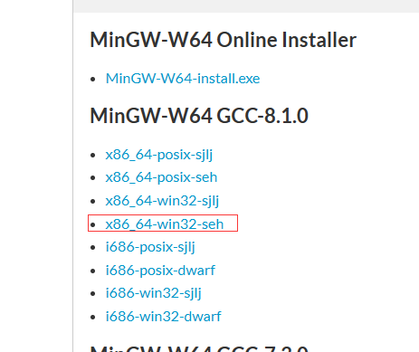

将mingw64复制到无中文的路径，然后配置环境变量

## 安装vscode插件

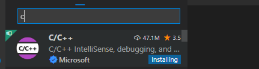

## .VsCode添加配置文件

1. setting 里面设置c++相关配置

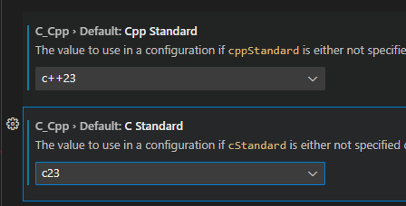


1. 快捷键Ctrl+Shift+P调出命令面板
2. 选择Edit Configurations(UI)

- **c_cpp_properties.json** ：对C/C++扩展的设置（一些提示啊什么的，貌似现在可以没有）。
- **tasks.json** ：定义如何生成可执行文件。
- **launch.json** ：定义如何调试可执行文件

### launch.json

用于运行可执行程序

```json
{
    "version": "0.2.0",
    "configurations": [
        {//这个大括号里是我们的‘调试(Debug)’配置
            "name": "Debug", // 配置名称
            "type": "cppdbg", // 配置类型，cppdbg对应cpptools提供的调试功能；可以认为此处只能是cppdbg
            "request": "launch", // 请求配置类型，可以为launch（启动）或attach（附加）
            "program": "${fileDirname}\\bin\\${fileBasenameNoExtension}.exe", // 将要进行调试的程序的路径
            "args": [], // 程序调试时传递给程序的命令行参数，这里设为空即可
            "stopAtEntry": false, // 设为true时程序将暂停在程序入口处，相当于在main上打断点
            "cwd": "${fileDirname}", // 调试程序时的工作目录，此处为源码文件所在目录
            "environment": [], // 环境变量，这里设为空即可
            "externalConsole": false, // 为true时使用单独的cmd窗口，跳出小黑框；设为false则是用vscode的内置终端，建议用内置终端
            "internalConsoleOptions": "neverOpen", // 如果不设为neverOpen，调试时会跳到“调试控制台”选项卡，新手调试用不到
            "MIMode": "gdb", // 指定连接的调试器，gdb是minGW中的调试程序
            "miDebuggerPath": "C:\\Program Files\\mingw64\\bin\\gdb.exe", // 指定调试器所在路径，如果你的minGW装在别的地方，则要改成你自己的路径，注意间隔是\\
            "preLaunchTask": "build" // 调试开始前执行的任务，我们在调试前要编译构建。与tasks.json的label相对应，名字要一样
    }]
}
```

### tasks.json

用于编译可执行程序，即build exe

<b id="blue">label</b>需要注意，在`launch.json`中的<b id="blue">preLaunchTask</b>用的到

```json
{
    "version": "2.0.0",
    "tasks": [
        {
            "label": "build",
            "type": "shell",
            "command": "gcc",
            "args": [
                "${file}",
                "-o",
                "${fileDirname}\\bin\\${fileBasenameNoExtension}.exe",
                "-g",
                "-Wall",
                "-static-libgcc",
                "-fexec-charset=GBK",
                "-std=c11"
            ],
            "group": "build",
            "presentation": {
                "echo": true,
                "reveal": "always",
                "focus": false,
                "panel": "new"
            },
            "problemMatcher": "$gcc"
        },
        {
            "label": "run",
            "type": "shell",
            "dependsOn": "build",
            "command": "${fileDirname}\\bin\\${fileBasenameNoExtension}.exe",
            "group": {
                "kind": "test",
                "isDefault": true
            },
            "presentation": {
                "echo": true,
                "reveal": "always",
                "focus": true,
                "panel": "new"
            }
        },
        {
            "type": "cppbuild",
            "label": "C/C++: g++.exe 生成活动文件",
            "command": "C:\\mingw64\\bin\\g++.exe",
            "args": [
                "-fdiagnostics-color=always",
                "-g",
                "${file}",
                "-o",
                "${fileDirname}\bin\\${fileBasenameNoExtension}.exe"
            ],
            "options": {
                "cwd": "${fileDirname}"
            },
            "problemMatcher": [
                "$gcc"
            ],
            "group": {
                "kind": "build",
                "isDefault": true
            },
            "detail": "调试器生成的任务。"
        }
    ]
}
```

**如果遇到 正常的#include报错，可能是环境变量没配置**


### 多文件配置

```json
{
    "version": "2.0.0",
    "tasks": [
        {
            "label": "build",
            "type": "shell",
            "command": "gcc",
            "args": [
                "${file}",
                "-o",
                "${fileDirname}\\bin\\${fileBasenameNoExtension}.exe",
                "-g",
                "-Wall",
                "-static-libgcc",
                "-fexec-charset=GBK",
                "-std=c11"
            ],
            "group": "build",
            "presentation": {
                "echo": true,
                "reveal": "always",
                "focus": false,
                "panel": "new"
            },
            "problemMatcher": "$gcc"
        },
        {
            "label": "run",
            "type": "shell",
            "dependsOn": "build",
            "command": "${fileDirname}\\bin\\${fileBasenameNoExtension}.exe",
            "group": {
                "kind": "test",
                "isDefault": true
            },
            "presentation": {
                "echo": true,
                "reveal": "always",
                "focus": true,
                "panel": "new"
            }
        },
        {
            "type": "cppbuild",
            "label": "C/C++: g++.exe 生成活动文件",
            "command": "C:\\mingw64\\bin\\g++.exe",
            "args": [
                "*.cpp",
                "-o",
                "${fileDirname}\\bin\\${fileBasenameNoExtension}.exe",
                "-std=c++11",
                "-g",
                "-fexec-charset=GBK"
            ],
            "options": {
                "cwd": "${fileDirname}"
            },
            "problemMatcher": [
                "$gcc"
            ],
            "group": {
                "kind": "build",
                "isDefault": true
            },
            "detail": "调试器生成的任务。"
        }
    ]
}
```


# VS项目相关操作

## 创建一个空项目

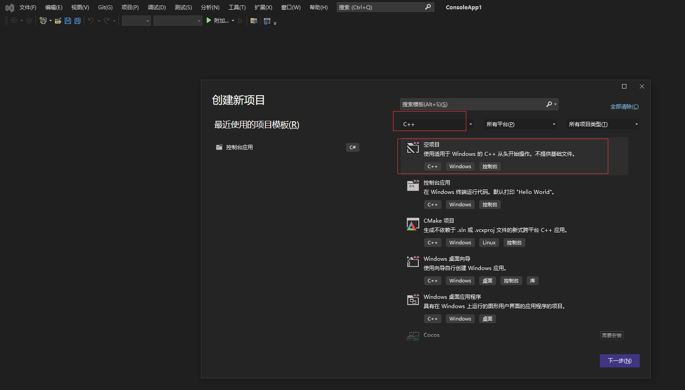

## 现有的文件夹导入

*取巧的一种方式，用来学习的时候运行单个文件夹*

1. 创建一个空项目
2. 在原文件处导入新的项


# VSCode 插件

1. C/C++：必选
2. C/C++ Extension Pack : C/C++扩展包 ；
3. C/C++ Themes : C/C++图标颜色主题；
4. Include Autocomplete 自动头文件包含
5. TabNine ：一款 AI 自动补全插件
6. CMake/CMake Tools 用于在vscode中支持cmake编译；

# VsCode 配置c++20

[Releases · niXman/mingw-builds-binaries (github.com)](https://github.com/niXman/mingw-builds-binaries/releases)

建议下载红框内的ucrt版本。

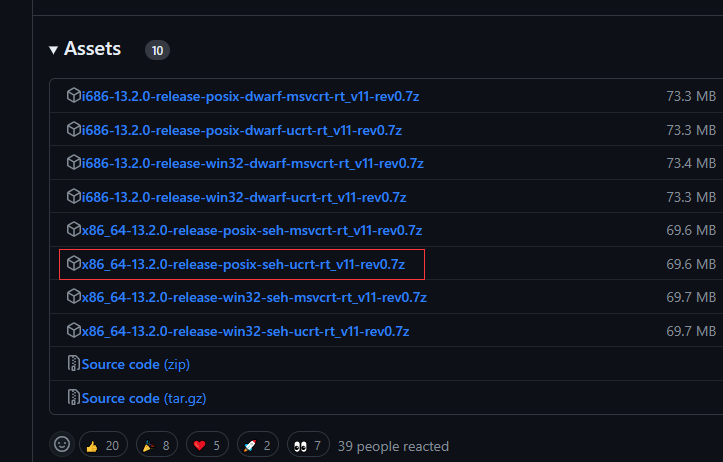

配置文件配置

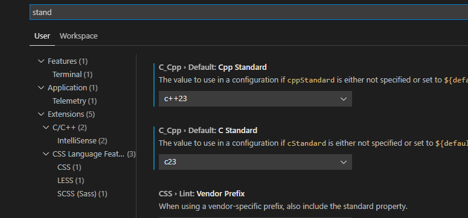

tasks.json

```
 "-std=c++2a"
```

c_cpp_properties.json （配置了vscode的setting的话，可以删除这个文件）

```json
"cppStandard": "c++23",
"cStandard": "c23"
```

## 快捷键设置


# Clion 环境配置

1. 配置MinGW

2. 关联MinGW

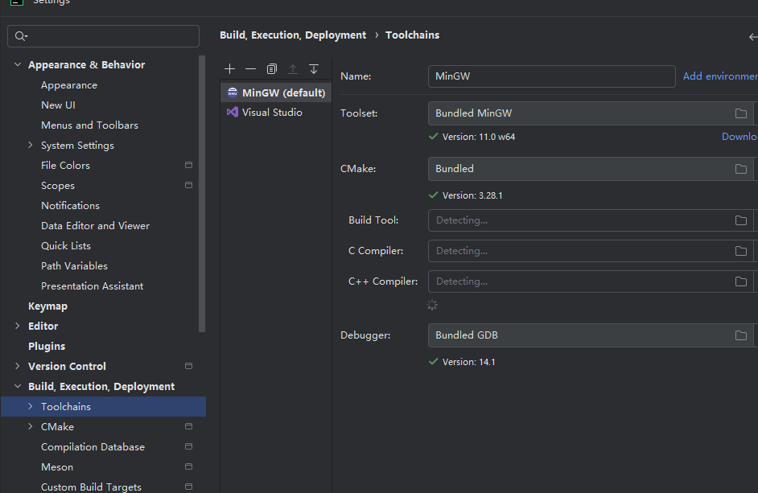

3. 如果打开存在的项目，需要new project

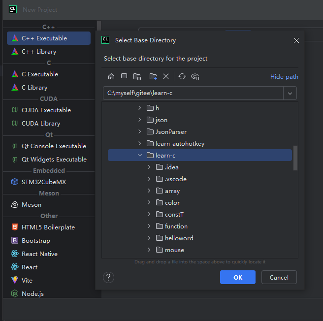

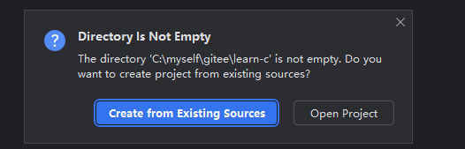

4. 可以看到关联执行文件的clion核心配置

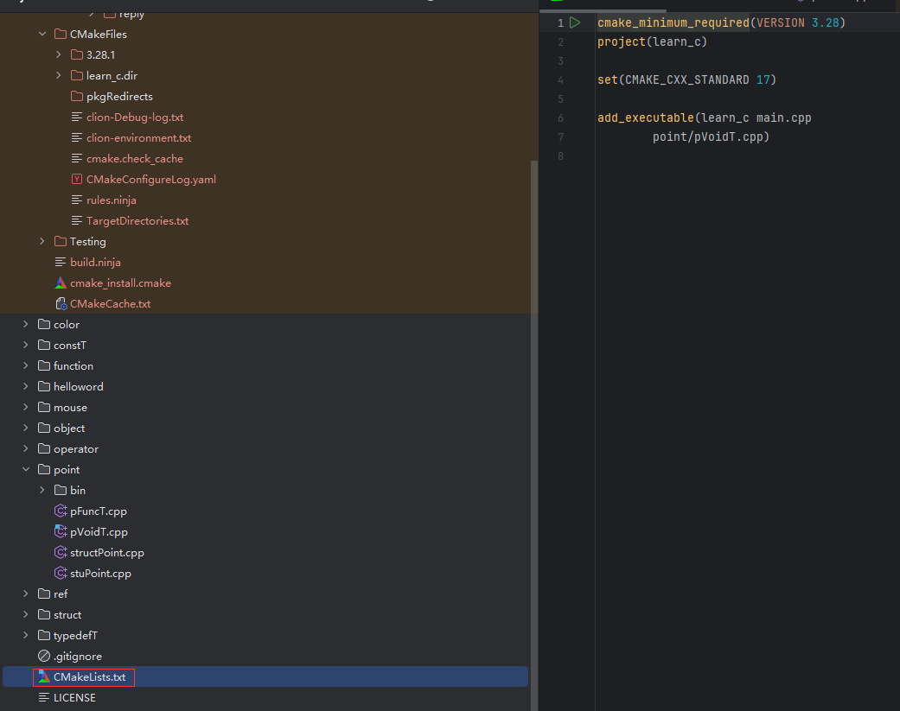


## 怎么运行单个文件

1. 新建一个带main函数的文件

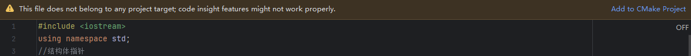

2. add project ，记得new 一个target

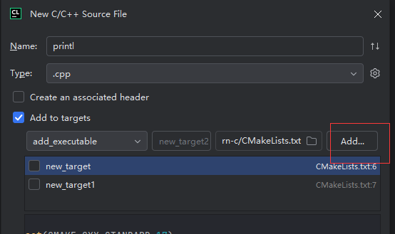

2.2 或者进入文件，点击add execulable,如果没有这个选项，需要安装<b id="blue">C/C+ + Single File Execution</b>插件

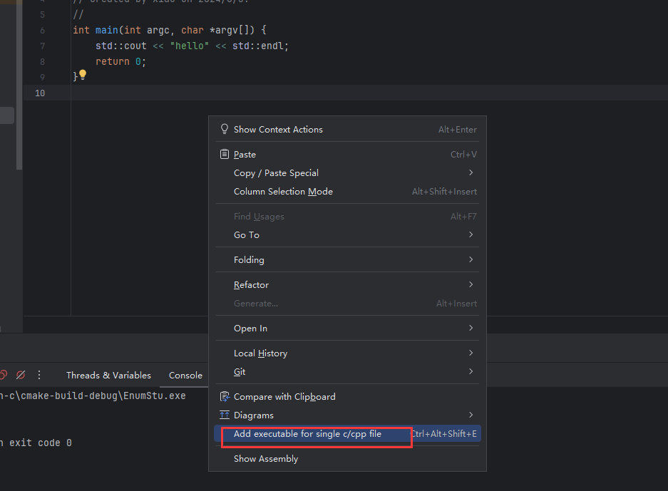

3. 然后刷新项目

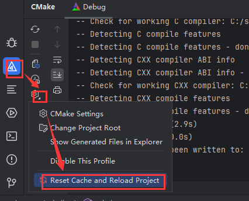

