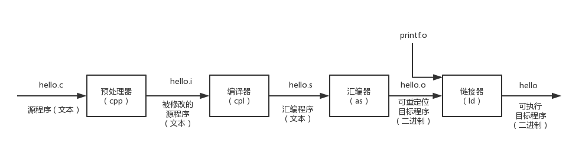
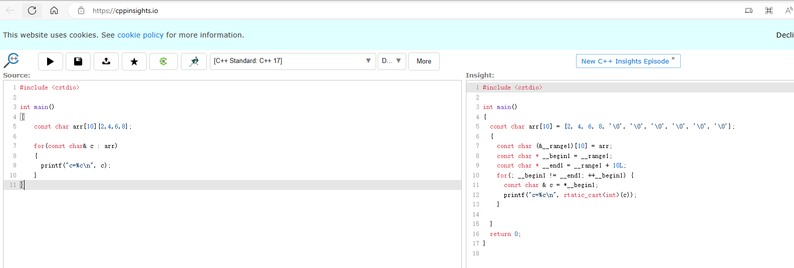

#


# 编译链接模型

源代码 (source code) →预处理器(preprocessor) → 编译器 (compiler) →目标代码(object code) →链接器(Linker) → 可执行程序(executables)



## 预处理

将源文件转换为翻译单元的过程


```shell
g++ -E test.cpp -o test.i
```

### 防止头文件被循环展开

- #ifdef 解决方案
  - 有弊端，可能会定义重复的 定义
- #pragma once解决方案
  - 推荐使用，保证只会被include一次

## 编译

将其转为汇编代码

```bash
g++ -S test.i -o test.s
```

编译优化网站：[Compiler Explorer (godbolt.org)](https://godbolt.org/)

## 汇编

```text
g++ -c test.s -o test.o
```

## 链接

合并多个目标文件。关联声明与定义

```text
g++ test.o -o test
```

#  HelloWord

```c++
#include <iostream>

//使用命名空间，下面使用可以省略
using namespace std;

int main()
{	
	//输出helloword
	std::cout << "helloword \n";
	//定义变量
	int a = 1;
	char b = 'b';
	//endl 表示换行 类似cout << b << "\n";
	cout << a << endl;
	cout << b << "\n";
	//阻塞命令
	system("pause");
	return 0;
}
```


## 让窗口一直打开

有些窗口环境在独立的窗口中运行程序，并在程序运行完毕后自动关闭该窗口。要让窗口一直打开，直到您按任何键，可在return语句前添加如下语句：<b id="gray">cin.get</b>


## 为什么main函数要有返回值

1. 一般来说，我们来通过返回值来判断程序执行是否成功，一般 程序返回0表示成功（约定俗称）
2. 我们通过错误返回的代码来做一些操作

## 为什么main函数可以没有return

c++标准规定，如果main没有return,则默认返回0

```text
通常的约定是，退出值为0则意味着程序运行成功，为非零则意味着存在问题。因此，如果C++程序无法打开文件，可以将它设计为返回一个非零值。然后，便可以设计一个外壳脚本或批处理文件在操作系统来运行该程序，如果该程序发出指示失败的消息，则采取其他措施

--摘自 《C++ Primer plus》 2.4.3
```


# 查看c++是如何编译的

[C++ Insights (cppinsights.io)](https://cppinsights.io/)



# 预处理

```text
#include编译指令导致iostream文件的内容随源代码文件的内容一起被发送给编译器。实际上，iostream文件的内容将取代程序中的代码行#include <iostream>。原始文件没有被修改，而是将源代码文件和iostream组合成一个复合文件，编译的下一阶段将使用该文件。
```

--摘自 c++ primer plus 2.1.3


# 系统io

iostream:

标准库所提供的 IO 接口，用于与用户交互

1. 输入流： cin ；输出流： cout / cerr / clog
2. cout 与cerr的区别： 输出目标； 
3. cerr和clog的区别：是否立即刷新缓冲区，cerr会立即刷新缓冲区，clog将数据先输出缓冲区，不会立即刷新
4. 缓冲区与缓冲区刷新： std::flush; std::endl 

# 命名空间

1. 可以避免include的多个函数，从而导致的名字冲突

## 调用方式

定义一个命名空间，后面的人使用需要带上命名空间才能访问里面的函数

```c++
#include <iostream>

using namespace std;

//定义一个命名空间
namespace n1
{
    void fun() 
    {
        std::cout << "fun.. \n";
    }
}

int main(int argc, char const *argv[])
{
    //使用命名空间里的函数
    n1::fun();
    return 0;
}

```

## 全局定义使用某个命名空间

定义了全局之后，后面都可以省略命名空间

但是不建议，因为命名空间的定义本身就是为了解决冲突，这样定义可能产生冲突

```c++
//定义一个命名空间
namespace n1
{
    void fun() 
    {
        std::cout << "fun.. \n";
    }
}

using namespace n1;

int main(int argc, char const *argv[])
{
    //使用命名空间里的函数
    fun();
    return 0;
}
```

# 表达式

- 10是值为10的表达式
- 28 * 20是值为560的表达式
- <b id="gray">x=3</b> ：C++将赋值表达式的值定义为左侧成员的值，因此这个表达式的值为3
- <b id="gray">m=(c=4)+3</b>表达式c= 4的值为4，因此m的值为7

`从表达式到语句的转变很容易，只要加分号即可`

<b id="gray">b=100</b>是表达式

<b id="gray">b=100;</b>是语句

# 结构体

通过一个结构体，将不同的变量聚合到一起

## 定义结构体

```c++
struct stuStruct
{
    /* 定义一个struct */
    string name;

    int age;
    //构造方法
    stuStruct() {
        name = "小小";
        age = 18;
    }
	//带参数构造方法
    stuStruct(string name, int age) {
        this->age = age;
        this->name = name;
    }

    //定义一个方法
    void toString() {
        cout << name << endl;
        cout << age << endl;
    }
};
```

## 调用结构体

```c++
int main() {
    //在初始化的时候，就调用了结构体的构造方法
    stuStruct ss;
    //调用结构体的方法
    ss.toString();

    //给结构体属性赋值(这里实际调用的就是他的构造方法)
    stuStruct ss2 = {"小~", 19};
    ss2.toString();
    return 0;
}
```

# 类型

## 类型描述

1. 类型是一个编译期概念，可执行文件中不存在类型的概念

> 类型描述了

1. 存储所需要的尺寸 (sizeof ，标准并没有严格限制 )

```c++
//利用sizeof 输出类型存储所需要的大小， 输出 4  4
int main(int argc, char const *argv[])
{
    int x = 10;
    std::cout << sizeof(x) << '\n';
    std::cout << sizeof(int) << '\n';
    std::cout << "end--" << std::endl;
    return 0;
}
```

2. 取值空间 (std::numeric_limits ，超过范围可能产生溢出 )

```c++
#include <iostream>
#include <limits>

//输出某个类型的取值范围（最大的存取数值）
int main(int argc, char const *argv[])
{
    std::cout << std::numeric_limits<int>::min() << std::endl;
    std::cout << std::numeric_limits<int>::max() << std::endl;
    return 0;
}
```

3. 对齐信息（ alignof ）
   1. 为啥要对齐：简单来说，就是方便计算机去读写数据
   2. 对齐的地址一般都是 n（n = 2、4、8）的倍数
   3. 1 个字节的变量，例如 **char** 类型的变量，放在**任意地址**的位置上；
   4. 2 个字节的变量，例如 **short** 类型的变量，放在 **2 的整数倍**的地址上
4. 可以执行的操作(这个类型可以执行的操作)

## 自定义后缀

```c++
//输出6， 讲double类型转为整型*2
int operator ""_dd(long double num) 
{
    return (int)num * 2;
}

int main(int argc, char const *argv[])
{
    std::cout << 3.14_dd << std::endl;
    return 0;
}
```


# 指针

一种间接类型， 存储可以“指向”不同的对象的地址

## 相关操作

1. <b id="blue">&</b> – 取地址操作符

> 如何找到常规变量的地址?只需对变量应用地址运算符（&），就可以获得它的位置

```c++
int i = 10;
int* pi = &i;
//输出的是 i的地址，为16进制的数字
cout << pi << endl;
```

### 定义

```c++
int* p
```


### 关于 nullptr

1. 
   一个特殊的对象（类型为 <b id="blue">nullptr_t</b>），表示空指针
2. 类似于 C 中的 NULL ，但更加安全

```c++
//输出0
int* j = nullptr;
std::cout << j << std::endl;
```

### 解引用

<b id="blue">*</b>  – 解引用操作符

> 假设manly是一个指针，则manly表示的是一个地址，而*manly表示存储在该地址处的值

`如果定义一个指针，但是没有初始化，那么<b id="blue">*p</b>解引用打印出来可能是随机值，因为这块内存是随机的`

```c++
int i = 10;
int* pi = &i;
//输出pi指向的地址的内容
cout << *pi << endl;
```

### 初始化指针

上序代码，我们初始化的是 pi这个指针，而不是*pi, 也就是将<b id="gray">i</b>的地址赋值给pi

## 调用优先级

```c++
int func(int i)
{
    std::cout << "func1" << std::endl;
}

int func(int* i)
{
    std::cout << "func2" << std::endl;
}

int main(int argc, char const *argv[])
{
    //优先调用func1， 因为是整型
    func(1);
    //调用func2，因为是指针类型
    int* i = 0;
    func(i);
    return 0;
}
```


## 主要操作

解引用;

增加、减少;-----*可以对指针指向的地址进行移动*

判等 (**不要拿地址进行大小判断，因为地址在不等的情况，大小是不定的**)

## void* 指针

1. 没有记录对象的尺寸信息，可以保存任意地址

2. 可以用来作为参数，可以传入任何指针类型（指针的尺寸是一样的）


```c++
#include <iostream>

void fun(void* param) 
{
    char* p = (char*)param;
    std::cout << *p << std::endl;
}
//我们可以用来传入任意的引用，然后在函数内进行转换
int main(int argc, char const *argv[])
{
    int i = 1;
    char a = 'a';
    //fun(&i);
    fun(&a);
    return 0;
}

```

3. 判等的操作

## 数组指针

数组就是存储了第一个元素的地址，所以，指针就是存储了他的第一个地址

```c++
int number[] = {1,2,3,4,5,6};
int* numberPr = number;
//输出 1
cout << *numberPr << endl;
//输出下一个元素
numberPr++;
cout << *numberPr << endl;
```

## 为什么需要指针

*减少传参的性能*;

当传参的时候，往往会复制一个变量到临时参数上，如果数据量大，则非常消耗性能，如果传递指针，则只需要将地址进行赋值

## 指针的危险

```c++
int* p;
*p = 12;
```

## 释放指针

当需要内存时，可以使用new来请求，delete运算符，它使得在使用完内存后，能够将其归还给内存池

这将释放ps指向的内存，但不会删除指针ps本身。例如，可以将ps重新指向另一个新分配的内存块。一定要配对地使用new和delete；

```c++
int* ps = new int;
delete ps;
```

> **使用new和delete时，应遵守以下规则**
>
> - 不要使用delete来释放不是new分配的内存。
> - 不要使用delete释放同一个内存块两次。
> - 如果使用new [ ]为数组分配内存，则应使用delete [ ]来释放。
> - 如果使用new [ ]为一个实体分配内存，则应使用delete（没有方括号）来释放。
> - 对空指针应用delete是安全的。

# 引用

1. int& ref = val;
2. 是对象的别名，不能绑定字面值

```c++
int i = 10;
int& j = i;
j++;
//输出的都是11，相当于操作j就相当于操作i
std::cout<< j << std::endl;
std::cout << i << std::endl;
//如果定义 Int& j=10;则不可以，因为不可以直接字面量操作
return 0;
```

3. 属于编译期概念，在底层还是通过指针实现

# 常量

1. 使用 const 声明常量对象
2. 防止非法操作

## 初始化

如果不对函数内部定义的变量进行初始化，该变量的值将是不确定的。这意味着该变量的值将是它被创建之前，相应内存单元保存的值。
如果知道变量的初始值应该是什么，则应对它进行初始化。

比如 

```c++
//定义一个变量，如果我们不初始化，则i可能指向一个之前这个内存单元保存的值
int i;
```


## 常量指针

const int* p;   指针指向内容可改

int* const p;  指针指向内容不可改

const int* const p; 指针和指向内容都不可改


## 常量引用

```c++
const int&
```

1. 可读但不可写
2. 主要用于函数形参

```c++

void fun(const int& x) {

}
// 防止x在函数方法里做修改
int main(int argc, char const *argv[])
{
    int x = 0;
    fun(x);
    return 0;
}
```

## 整型字面值

```
如果第一位为1～9，则基数为10（十进制）；因此93是以10为基数的。如果第一位是0，第二位为1～7，则基数为8（八进制）；因此042的基数是8，它相当于十进制数34。如果前两位为0x或0X，则基数为16（十六进制）；因此0x42为十六进制数，相当于十进制数66。对于十六进制数，字符a～f和A～F表示了十六进制位，对应于10～15。0xF为15，0xA5为165（10个16加5个1）
-- 《C++ Primer Plus》 3.1.6
```

## 浮点型

```
使用浮点类型可以表示诸如2.5、3.14159和122442.32这样的数字，即带小数部分的数字。计算机将这样的值分成两部分存储。一部分表示值，另一部分用于对值进行放大或缩小。下面打个比方。对于数字34.1245和34124.5，它们除了小数点的位置不同外，其他都是相同的

-- 《C++ Primer Plus》 3.3
```

### 有效位

对于float,c++只能保证6位有效位

### 整型提升

整型提升指的是在表达式计算过程中，各种整型数据（如char、short等）首先会被提升为int类型。如果int类型无法表示该值，则会进一步被提升为unsigned int类型。

```c++
int main() {  
    char a = 5;    // a的二进制表示为：00000101  
    char b = 126;  // b的二进制表示为：01111110  
    int c = a + b; // a和b在运算前会进行整型提升，转换为int类型后再进行相加  
    printf("%d\n", c); // 输出结果为131，因为00000101 + 01111110 = 10000011，转换为十进制为131  
    return 0;  
}
```


# 静态变量

生命周期：从执行这一块代码开始，到整个程序结束

```c++
static int i = 0;
```

如：x生命周期是从，首次进入<b id="gray">fun</b>函数开始，到程序结束

```c++
void fun()
{
    static int x = 3;
}
```


# 别名

typedef int MyInt;

using MyInt = int; （从 C++11 开始）

可以为类型引入别名，从而引入特殊的含义或便于使用

# 类型的自动推导

1. 从 C++11 开始，可以通过初始化表达式自动推导对象类型
2. 自动推导类型并不意味着弱化类型，对象还是强类型

```c++
//计算完后，我们不知道x的类型，这时候我们可以交给编译器自动识别
auto x = 3.5 + 5l;
std::cout << x << std::endl;
return 0;
```

3. auto: 最常用的形式，但会产生类型退化

```c++
// ief 本来是引用类型，但是， 作为右值使用的时候
// auto 产生类型退化， ia 成为了int类型
int i = 10;
int& ief = i;
auto ia = ief;
```

4. auto& : 推导出引用类型，避免类型退化


