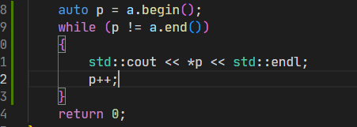

#

# 定义数组

```c++
int a[3];
int b[] = {1,2,3};
int x = 10;
//指针数组， c是一个长度为3的数组，存储指针
int *c[] = {&x};
//指针数组
int(*d)[3] = &b;
//输出1， 此刻，d首先是个指针，解引用之后，就是一个长度为3的数组
std::cout << (*d)[0] << std::endl;

//数组的引用
int (&e)[3] = b;
e[0] = 4;
//输出4，此时，e就是b数组对象的引用
std::cout << b[0] << std::endl;
```

`为什么不能有引用数组`

因为数组内容存储的是对象，而引用表示的是对象的别名，并不是对象


```
通常，让编译器计算元素个数(int b[] = {1,2,3}这种方式)是种很糟的做法，因为其计数可能与您想象的不一样。例如，您可能不小心在列表中遗漏了一个值。
```


# 数组解析

```C++
int b[] = {1,2,3};
b[0];
```

<b id="blue">b[0]</b>做了什么事情（<b id="blue">x[y]</b>做了什么事情）

1. <b id="blue">x[y]</b>这种格式并不是数组的专利，引用也可以这样进行访问
2. <b id="blue">x[y]</b>相当于*（x+y）;(对的x+y地址进行解引用)
3. 比如 b[0], 相当于 <b id="gray">b+0</b>解引用
4. 数组<b id="red">b</b>存储的就是数组的起始地址
5. 所以，数组也可以<b id="gray">*(b+1)</b>访问，相当于<b id="gray">b[1]</b>
6. 但是数组并不等于指针，数组只是里面有指针的一些信息，还有很多其他的信息，比如，长度等


# 数组和指针

## 指针相减

```c++
int main(int argc, char const *argv[])
{
    int a[] = {1,2,3};
    // auto 会对数组进行隐式的转换
    // 将数组类型，转为指针类型
    auto ptr1 = a;
    auto ptr2 = a+3;
    //输出3，  这里指针的相减= （地址与地址之间的差）/指针解引用的类型的长度
    std::cout << ptr2 - ptr1 << std::endl;
    return 0;
}
```

# 数组个数

## sizeof方式

返回一个对象或者类型所占的内存字节数

```c++
int a[] = {1,2,3,4};
std::cout << sizeof(a)/sizeof(int) <<std::endl;
```

##  cend-cbegin方式

这个是运行期的方法，不推荐

<b id="blue">begin</b>：指针起始位置

<b id="blue">end</b>: 指针结束位的后以为

```c++
std::cout << std::cend(a) - std::cbegin(a) << std::endl;
```

## size

<b id="blue">std::size</b>在c++17引入

```c++
std::cout << std::size(a) << std::endl;
```

# 数组的动态联编和静态联编

静态联编

```c++
int a[10]
```

动态联编

```c++
int size;
cin>> size;
int *p = new int[size];

delete [] p;
```

即运行时为数组分配内存，使用完后需要delete[] 释放内存


# 内建字符串

## 字符串解析

1. 字符串本质是一个char类型的数组 
2. 如下，我们定义一个字符串，实际上是，一个数组，但数组的最后一位是'\0'的char

```c++
#include<iostream>

int main(int argc, char const *argv[])
{ 
    char str1[] = "hello";
    std::cout << str1 << std::endl;
    return 0;
}
```

# 输出字符串长度

1. include <b id="gray">cstring</b>
2. 采用<b id="gray">strlen</b>输出字符串长度

```c++
#include< >
#include<iostream>

int main(int argc, char const *argv[])
{
    char str1[] = "hello";
    std::cout << str1 << std::endl;
    std::cout << strlen(str1) << std::endl;
    return 0;
}
```

3. 定义一个数组，已<b id="gray">‘\0’</b>结束，发现长度与字符串长度一直，这说明了字符串是以特定字符串标识结束的

```c++
    char str1[] = "hello";
    char str2[] = {'h', 'e', 'l',  'l', 'o', '\0'};
    std::cout << str1 << std::endl;
    std::cout << strlen(str1) << std::endl;
    std::cout << strlen(str2) << std::endl;
    return 0;
```

# Vector

## 定义

是 C++ 标准库中定义的一个类模板

与内建数组相比，更侧重于易用性

易用性换来的就是性能没那么好


```c++
#include <vector>
#include <iostream>

int main(int argc, char const *argv[])
{
    //大小为3， 初始化3个1
    std::vector<int> a(3, 1);
    // 输出vector的大小
    std::cout << a.size() << std::endl;
    // 输出是否为空
    std::cout << a.empty() << std::endl;
    // 结尾插入元素
    a.push_back(2);
    // 结尾弹出元素
    a.pop_back();
    return 0;
}
```

另一种定义的方式

```c++
std::vector<int> a = {1, 2, 3};
```

## 输出

```c++
Courier New    
//以下两种方式输出一致
std::cout << a[0] << std::endl;
std::cout << a.at(0) << std::endl;
```

## 遍历

### 通过指针的方式

a.begin() ： vector 开始的地址

a.end() ： vector 结束的地址



# 内建字符串

C-风格字符串具有一种特殊的性质：以空字符（null character）结尾，空字符被写作\0，其ASCII码为0，用来标记字符串的结尾

如：

```c++
//string
char c1[4] = {'d', 'o', 'g', '\0'};
//非string
char c2[3]= {'d', 'o', 'g'};
```


# string

是C++标准库中定义的一个类模板特化别名，用于内建字符串的代替品

与内建字符串相比，更侧重于易用性

## 定义

1. 我们需要include string模块
2.  a + " world"  ： a是string类型， world 是内建字符串，可以进行拼接

```c++
#include<string>

int main(int argc, char const *argv[])
{
    std::string a ="hello";
    std::cout<< a + " world" << std::endl;
    return 0;
}
```

3. 如果是  两个内建字符串 <b id="blue">"hello" + " world"</b>这样拼接，则是不可以的

 ## 转义字符显示（原始（raw）字符串）

C++11新增的另一种类型是原始（raw）字符串

```c++
std::string s = R"(This is a raw string with a backslash: \n and another.)";
```

输出<b id="blue">s</b>的时候，直接能够输出\n，而不是换行符号

如果想输出括号

```c++
//使用  R"*+内容+* 的方式，可以将内容完全输出
std::string s = R"*+(This is a raw string with a backslash: \n and another.)";
```

# cin读取输入流

## 基本操作

1. 将键盘的输入值赋值

```c++
int main(int argc, char const *argv[])
{
    char ch;
    std::cout << "输入字符，输入#结束" << std::endl;
    while (ch != '#')
    {
        // 输出如如的字符
        std::cout << ch;
        //输入字符
        std::cin >> ch;
    }
    std::cout<< ch << std::endl;
    return 0;
}
```

2. 上面的方式输出的时候会忽略

