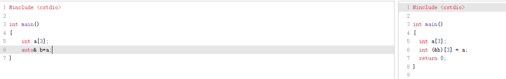
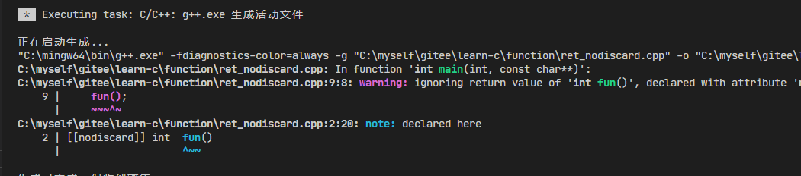

# 函数


# 函数声明与定义

1. 函数声明只包含函数头，不包含函数体，通常置于头文件中

```c++
//声明一个函数
void fun1();

void fun1() {
    
}
```

2. 函数声明可出现多次，但函数定义通常只能出现一次(存在例外)

## 定义一个给C调用的函数

```c++
extern("C")
void fun1() {
    
}
```

# 参数

## 参数的概念

1. 如果没有形参，则可以用void表示

```c++
void fun1(void) 等价于 void fun1()
```

2. 如果某个形参没有使用，可以没有名称

```c++
void fun1(int, int y) {
    std::cout<<y;
}
```

3. 形参的初始化执行顺序是不定的
   1. 如：先初始化x=1 还是初始化y=2，下面的函数是不能确定的由编译器决定

```c++
void fun1(int x, int y){
    
}
void main() {
    fun1(1, 2)
}
```

## 传参的方式

### 传值

```c++
    int op = 1;
    param1(op);
    std::cout << op << std::endl;
```

op的值会改变

```c++
void param1(int op)
{
    ++op;
}
```

### 传地址

```c++
param2(&op);
std::cout << op << std::endl;
```

op值改变，因为函数里面修改的是地址指向的内容

```c++
void param2(int* op)
{
    ++(*op);
}
```

### 传引用

```c++
param3(op);
std::cout << op << std::endl;
```

op值改变，原理同上

```c++
void param3(int& op)
{
    ++op;
}
```

## 参数的退化

### 一维数值退化为一级指针

定义一个数据，他会蜕化成一个指针

```c++
int main(int argc, char const *argv[])
{
    int a[3];
    f1(a);
    return 0;
}
```

```c++
void f1(int* p) 
{

}
```

### 二维数组退化为数组指针

```c++
void f2(int (*p)[4])
{

}
//可以看到二元数组大小必须与参数一致
int main(int argc, char const *argv[])
{
    int b[2][4];
    f2(b);
    return 0;
}
```

### 避免参数退化

我们知道<b id="gray">auto& </b> 类型，则不会产生退化，如：




```c++
void f3(int (&p)[3])
{

}
//此时，传入函数的参数数组大小就必须是3
int main(int argc, char const *argv[])
{
    int c[3];
    f3(c);
    return 0;
}

```

## 可变长度参数

1. initializer_list方式

```c++
void f1(std::initializer_list<int> param)
{

}

//可变长度的参数
int main(int argc, char const *argv[])
{
    f1({1,2,3,4,5})
    return 0;
}
```

2. 使用省略号

## 缺省形参

如果调用<b id="gray">f1</b>函数的时候，没有传入参数，则将<b id="blue">x</b>默认赋值为0

```c++
void f1(int x=0) 
{

}
int main(int argc, char const *argv[])
{
    f1(1);
    f1();
    return 0;
}
```

需要注意的是，缺省形参一定要从右侧起，连续

**如果是这样，则不被允许**

```c++
void f1(int x=0, y) 
{

}
```

# 返回类型

## 定义

1. 传统类型

```c++
int fun() 
{}
```

2. c++11新增了头部定义

```c++
auto fun() -> int 
{}
```

3. c++14新增了自动推导类型

```c++
auto fun()
{
    return 1+2;
}
```

单如果这样就会**报错**, 因为编译器没办法推导函数返回的类型

```c++
auto fun()
{
    if(xx) return 2.0;
    if(xxx) return 1;
       
}
```

## nodiscard

在调用函数时，如果没有注意到返回值，就会有对应的告警

```c++
[[nodiscard]] int  fun() 
{
    return 1;
}

int main(int argc, char const *argv[])
{
    fun();
    return 0;
}
```

