# 

# 小技巧

## 跳过下载安装的方法

1. 点虚幻引擎的下载，下载出现下载的标识后，暂停安装，彻底退出虚幻引擎
2. 我们能够在下面看到如下的文件架

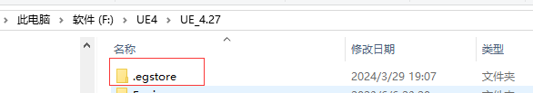

3. 然后将解压好的虚幻引擎文件复制到这个文件夹下面

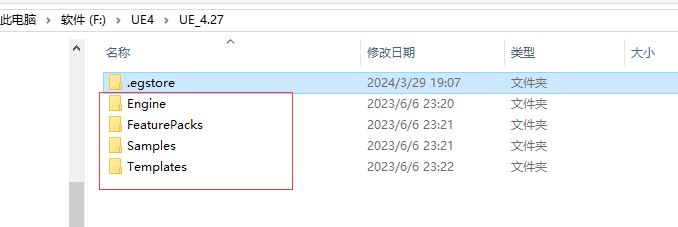

4. 再打开我们的E宝
5. 然后到对应的虚幻引擎的下载处点继续

## 旧项目启动

如果我们从某个地方down下来，我们只需要右键<b id="blue">xx.uproject</b>文件，然后，点击<b id="blue">Generate Visual Studio project files</b>选项重新生成vs项目

## UE4中删除C++类下的class

1. 关闭visual studio 
2. 关闭UE4编辑器 
3. 删除项目中Soure文件夹中的你想删除的.cpp和.h文件 
4. 删除项目中的Binaries文件夹 
5. 右键uproject文件，点击Generate Visual Studio project files 
6. 重新打开工程 
7. 重新编译项目

## 进入缩放模式

可以点击这个按键，也可以使用R快捷键

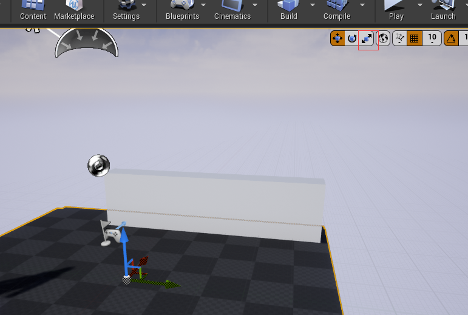

# UE4基本类层次

## 建立class入口

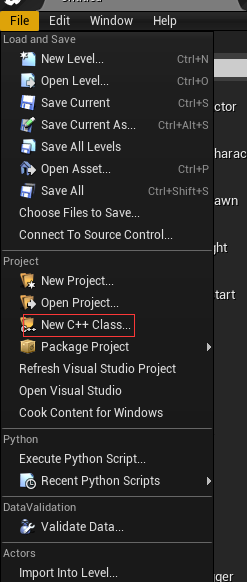

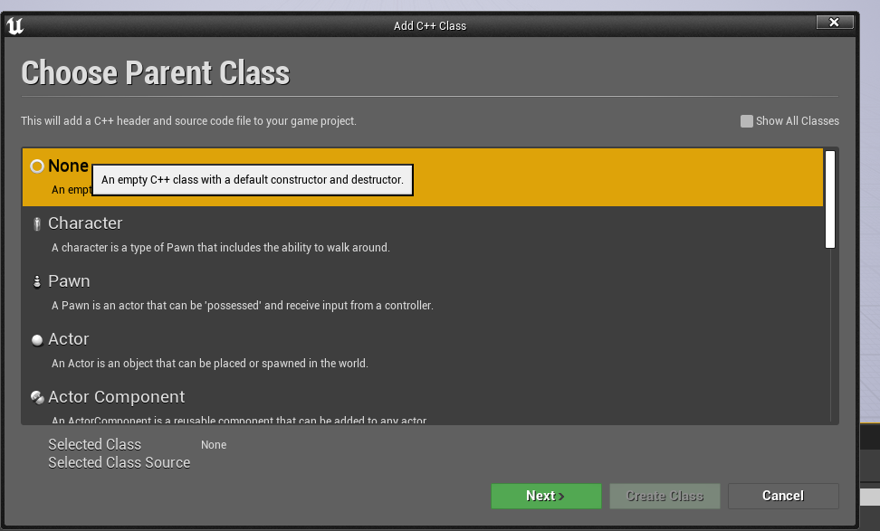

## UObject

是所有Object的基类（不是所有类的基类/有点类似JAVA的Object），包含各类功能，诸如垃圾回收、通过元数据（UProperty）将变量公开给编辑器，以及保存和加载时的序列化功能。

## AActor

是所有Actor的基础类，AActor中有一个RootComponent成员，用来保存组件树中的顶级组件；

这是因为Level需要放置各式各样的Actor，而在UE4的世界观里，Actor不仅包含游戏世界里的角色、NPC、载具，还可以是一间房子、一把武器、一个掉落的苹果，甚至一个抽象的游戏规则、看不见的玩家控制器...

你如果想放置任何有实质作用的东西到游戏场景中，应该继承AActor类

## APawn

APawn继承AActor，是分化出来的AActor，物理表示和基本的移动能力，他可以被player 或 AI拥有。APawn类是一个代表可被控制的游戏对象（玩家角色、怪物、NPC、载具等）

使用APawn需要包含头文件“GameFramework/Pawn.h”。

- **ADefaultPawn （默认的可操控单位）**

  DefaultPawn继承于APawn，是一个默认的Pawn模板。它默认带了一个DefaultPawnMovementComponent、SphericalCollisionComponent和StaticMeshComponent。

- **ASpectatorPawn（观察者）**

  SpectatorPawn继承于APawn，是适用于观战的Pawn模板，拥有摄像机“漫游”的能力。它实际就是提供了一个基本的USpectatorPawnMovement（不带重力漫游），并关闭了StaticMesh的显示，碰撞也设置到了“Spectator”通道。

- **ACharacter（角色）**

  Character继承于APawn，是一个包含了行走，跑步，跳跃以及更多动作的Pawn模板。它含有像人一样行走的CharacterMovementComponent，尽量贴合的CapsuleComponent，再加上骨骼上蒙皮的网格。

## ACharacter

因为我们是人，所以在游戏中，代入的角色大部分也都是人。大部分游戏中都会有用到人形的角色，既然如此，UE就为我们直接提供了一个人形的Pawn来让我们操纵。

ACharacter继承APawn。它是拥有mesh, collision 和内置移动逻辑的Pawn。它们负责玩家和AI和世界之间的所有物理交互，以及负责实现基本的网络和输入模型。它们通过使用CharacterMovementComponent来实现一个垂直朝向的可以在世界中走、跑跳、的玩家。飞、游泳。使用ACharacter需要包含头文件“GameFramework/Character.h”。

# 宏

## UFUNCTION

UFunction 是虚幻引擎4（UE4）反射系统可识别的C++函数。

宏将支持`函数说明符`更改UE4解译和使用函数的方式。

可利用函数说明符将UFunction对蓝图可视化脚本图表公开，以便开发者从蓝图资源调用或扩展UFunction，而无需更改C++代码。

### 函数说明符

| 函数说明符                  | 效果                                                         |
| --------------------------- | ------------------------------------------------------------ |
| BlueprintAuthorityOnly      | 如果在具有网络权限的机器上运行（服务器、专用服务器或单人游戏），此函数将仅从蓝图代码执行。 |
| BlueprintCallable           | 此函数可在蓝图或关卡蓝图图表中执行。                         |
| BlueprintCosmetic           | 此函数为修饰性的，无法在专用服务器上运行。                   |
| BlueprintImplementableEvent | 此函数可在蓝图或关卡蓝图图表中实现。                         |
| BlueprintNativeEvent        | 此函数旨在被蓝图覆盖掉，但是也具有默认原生实现。用于声明名称与主函数相同的附加函数，但是末尾添加了`Implementation，是写入代码的位置。如果未找到任何蓝图覆盖，该自动生成的代码将调用 Implementation` 方法。 |
| BlueprintPure               | 此函数不对拥有它的对象产生任何影响，可在蓝图或关卡蓝图图表中执行。 |
| CallInEditor                | 可通过细节（Details）面板`中的按钮在编辑器中的选定实例上调用此函数。 |
| Client                      | 此函数仅在拥有在其上调用此函数的对象的客户端上执行。用于声明名称与主函数相同的附加函数，但是末尾添加了`Implementation。必要时，此自动生成的代码将调用 Implementation` 方法。 |
| CustomThunk                 | UnrealHeaderTool 代码生成器将不为此函数生成thunk，用户需要自己通过 DECLARE_FUNCTION 或 DEFINE_FUNCTION 宏来提供thunk。 |
| Exec                        | 此函数可从游戏内控制台执行。仅在特定类中声明时，Exec命令才有效。 |
| NetMulticast                | 此函数将在服务器上本地执行，也将复制到所有客户端上，无论该Actor的 NetOwner 为何。 |
| Reliable                    | 此函数将通过网络复制，并且一定会到达，即使出现带宽或网络错误。仅在与`Client`或`Server`配合使用时才有效。 |
| SealedEvent                 | 无法在子类中覆盖此函数。SealedEvent`关键词只能用于事件。对于非事件函数，请将它们声明为`static`或`final，以密封它们。 |
| ServiceRequest              | 此函数为RPC（远程过程调用）服务请求。这意味着 NetMulticast 和 Reliable。 |
| ServiceResponse             | 此函数为RPC服务响应。这意味着 NetMulticast 和 Reliable。     |
| Server                      | 此函数仅在服务器上执行。用于声明名称与主函数相同的附加函数，但是末尾添加了 _Implementation，是写入代码的位置。必要时，此自动生成的代码将调用 _Implementation 方法。 |
| Unreliable                  | 此函数将通过网络复制，但是可能会因带宽限制或网络错误而失败。仅在与`Client`或`Server`配合使用时才有效。 |
| WithValidation              | 用于声明名称与主函数相同的附加函数，但是末尾需要添加`_Validate`。此函数使用相同的参数，但是会返回`bool`，以指示是否应继续调用主函数。 |

## UPROPERTY

UPROPERTY 用途广泛。它允许变量被复制、被序列化，并可从蓝图中进行访问。垃圾回收器还使用它们来追踪对 UObject 的引用数

### 修饰符说明信息

[虚幻引擎推荐说明符 |虚幻引擎5.0文档 (unrealengine.com)](https://docs.unrealengine.com/5.0/zh-CN/unreal-engine-uproperty-specifiers/)

# 建立一个Character

一般命名，我们以项目名作为前缀，建立一个public的类

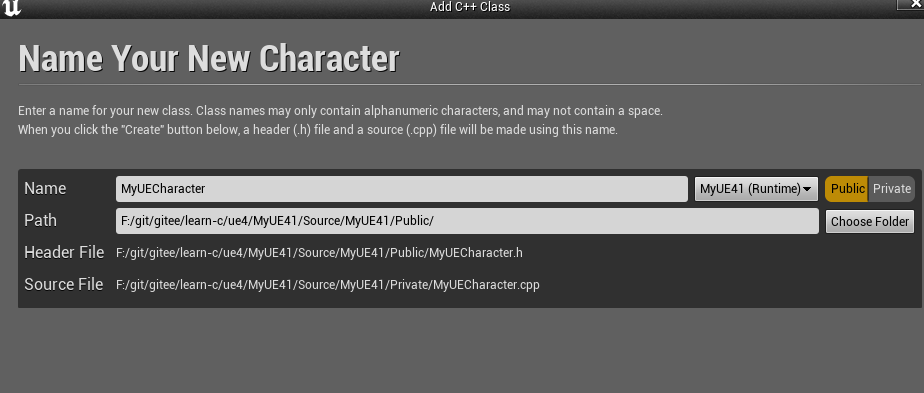

我们看到生成类两个文件

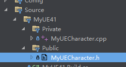


## 建立一个蓝图类

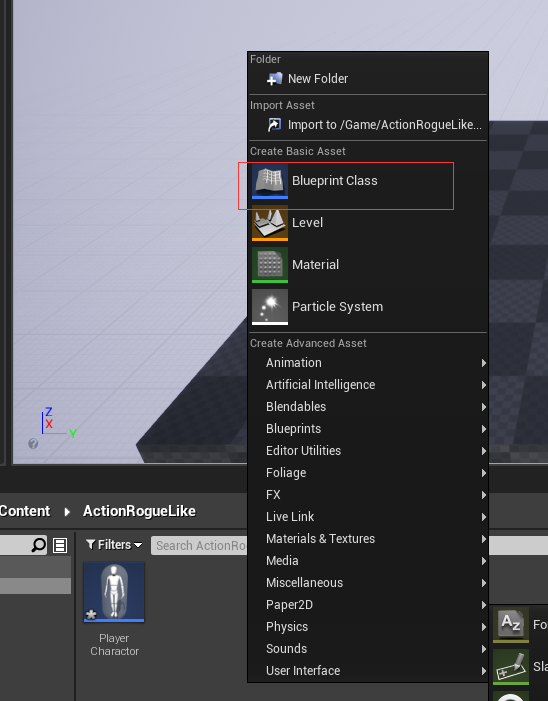

选择继承我们新建的Character

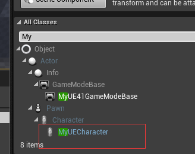

# 添加摄像头

如果我们不添加摄像头，那么他会默认以我们角色作为视角

### 举例说明

我们将蓝图类拖到地图上

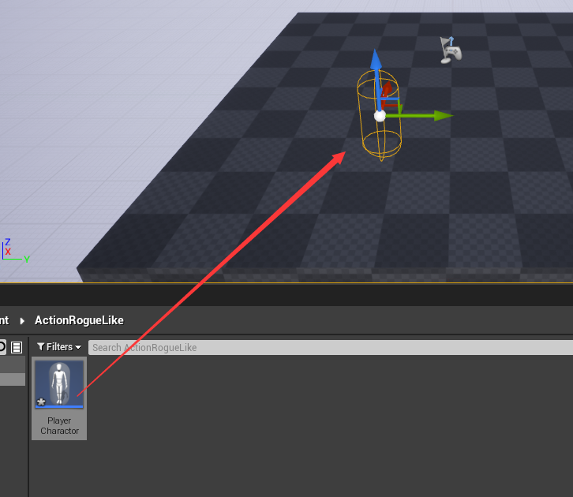

如果我们play，则会啥都看不到，因为摄像头默认是蓝图类的中心（也就是第一视角）

## 在MyUEcharcater定义摄像头

定义class

```c++
class USpringArmComponent;
class UCameraComponent;

USpringArmComponent* springArmComponent;

UCameraComponent* cameraComponent;
```

初始化构造方法：

```c++
springArmComponent = CreateDefaultSubobject<USpringArmComponent>("springArmComponent");
cameraComponent = CreateDefaultSubobject<UCameraComponent>("cameraComponent")
```
编译后在UE能看到摄像头在中心

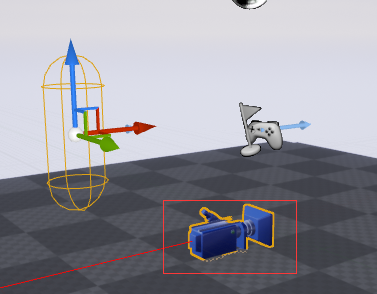

### SpringArmComponent

常用的相机辅助组件， 主要的作用是快速的实现第三人称的视角（包括相机的障碍避免功能）

## UCameraComponent 与SpringArmComponent绑定

```c++
springArmComponent = CreateDefaultSubobject<USpringArmComponent>("springArmComponent");
springArmComponent->SetupAttachment(RootComponent);
cameraComponent = CreateDefaultSubobject<UCameraComponent>("cameraComponent");
cameraComponent->SetupAttachment(springArmComponent);
```

实现之后，我们打卡关卡，可以发现摄像头固定到了角色的后方

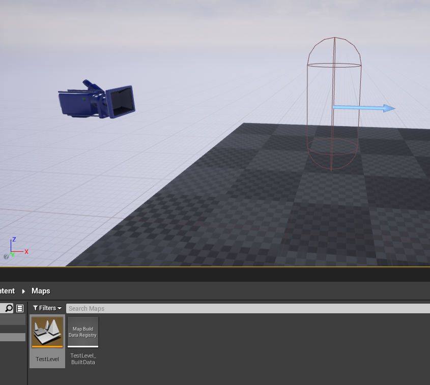

## 运行一某个角色视角

选择角色， 搜索autopo, 选择player 0

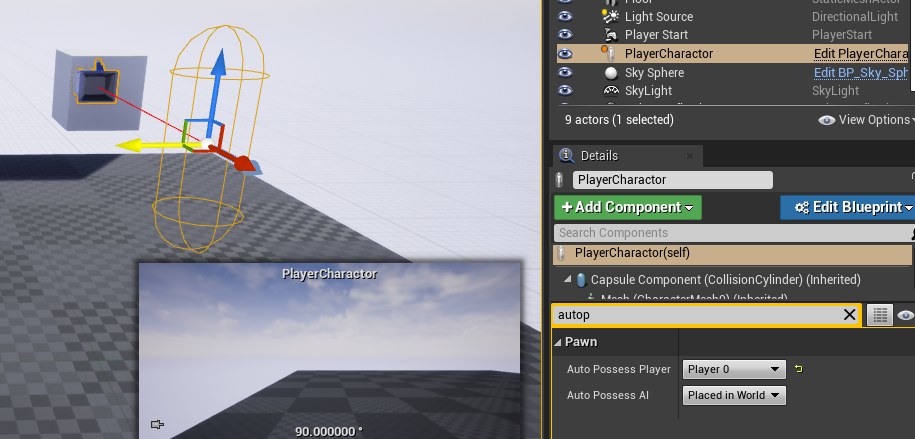

实现的效果是，play的时候，以这个摄像头为视角运行

# 玩家移动

## UInputComponent 

用来绑定鼠标的按下和释放事件

## 输入字符串常量定义

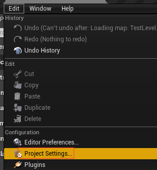

找到input

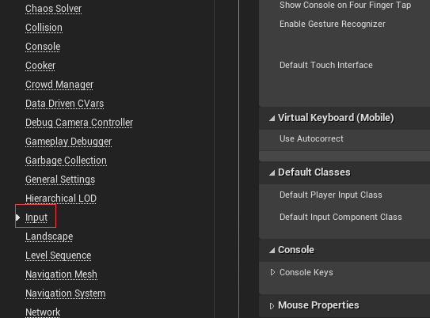

定义一个轴映射的常量

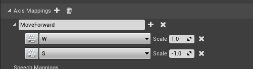

## 代码中绑定映射

```c++
// Called to bind functionality to input
void AMyUECharacter::SetupPlayerInputComponent(UInputComponent* PlayerInputComponent)
{
	Super::SetupPlayerInputComponent(PlayerInputComponent);

	//定义一个 MoveForward 常量， 这个常量等会我们去UE界面设置他的控制数据
	//当按下 MoveForward 定义的键的时候，调用当前角色的 MoveForward 方法
	PlayerInputComponent->BindAxis("MoveForward", this, &AMyUECharacter::MoveForward);

}
```

```c++
//当按下相应的键调用这个方法的时候，传入值，向前就是1， 向后就是-1(Axis定义的常量值)
void AMyUECharacter::MoveForward(float value)
{
	AddMovementInput(GetActorForwardVector(), value);
}
```

## 控制鼠标X轴的移动

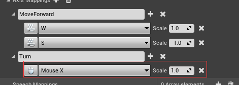

```c++
PlayerInputComponent->BindAxis("Turn", this, &APawn::AddControllerYawInput);
```

*AddControllerYawInput*: AddControllerYawInput()函数可以得到Yaw（水平方向）方向的偏转


## 让角色能够左右和鼠标控制上下看

1. 设置常量

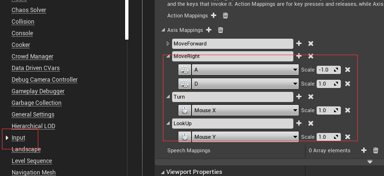

2. 一定要将角色的 <b id="blue">使用pawn控制旋转</b>给选好，否则，鼠标将失效

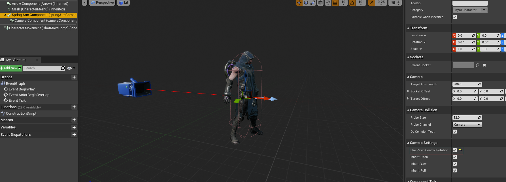

3. 代码编写

```c++
PlayerInputComponent->BindAxis("Turn", this, &APawn::AddControllerYawInput);
PlayerInputComponent->BindAxis("LookUp", this, &APawn::AddControllerPitchInput);
```
```C++
void AMyUECharacter::MoveRight(float value)
{
	AddMovementInput(GetActorRightVector(), value);
}
```

## 让鼠标不能控制人物转方向

到目前为止，我们已经实现了初步的角色运动和旋转。但细看就会发现，角色的朝向和摄像机的旋转是一起的，即我们移动鼠标，角色也跟着旋转， 一般情况向我们转弯，靠的是W D这两个来进行旋转，关闭鼠标效果只需要这样，这个选项表示鼠标能控制旋转，去除就不会了

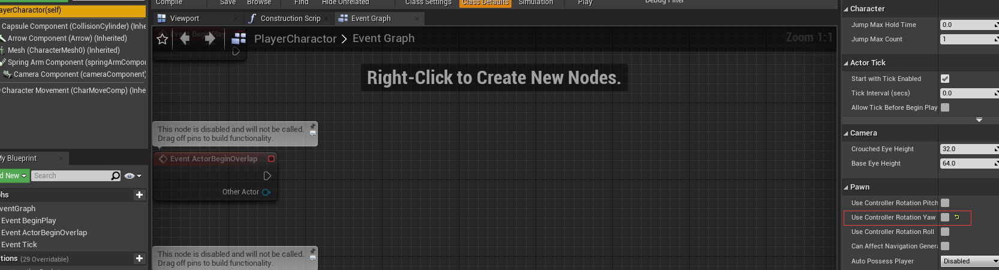

## 用代码控制

bOrientRotationToMovement的意思是：按W D键能够让身体转弯（以前我们只能左移右移）

```c++
AMyUECharacter::AMyUECharacter()
{
 	// Set this character to call Tick() every frame.  You can turn this off to improve performance if you don't need it.
	PrimaryActorTick.bCanEverTick = true;

	springArmComponent = CreateDefaultSubobject<USpringArmComponent>("springArmComponent");
	//开启使用Pawn控制旋转
	springArmComponent->bUsePawnControlRotation = true;
	springArmComponent->SetupAttachment(RootComponent);
	cameraComponent = CreateDefaultSubobject<UCameraComponent>("cameraComponent");
	cameraComponent->SetupAttachment(springArmComponent);
	//关闭“使用控制旋转yaw”
	bUseControllerRotationYaw = false;
	//获取角色组件，然后开启左右能够旋转的功能
	GetCharacterMovement()->bOrientRotationToMovement = true;
}
```

## 左移

现在，我们发现，按住左移时，角色会向左做圆周运动，那是因为，按住A的过程中，角色也朝向了左边，但是此时，角色还会左移的操作，所以在此基础上又左移类，所以就做了圆周运动

解决方案：

我们只需要实现一个操作方向，即表示空间方向的方向向量vector，当按下键的时候，朝这个矢量运动

获得目前控制器/摄像机的旋转角度，并将Pitch和Roll设为0，


```c++
void AMyUECharacter::MoveForward(float value)
{
    //获取人物角色朝向，设置默认人物相机，朝向与controller绑定
	FRotator contolRot = GetControlRotation();
	contolRot.Pitch = 0.0f;
	contolRot.Roll = 0.0f;
    //获取相机（鼠标控制器）的朝向，并朝这个方向移动
	AddMovementInput(contolRot.Vector(), value);
}
void AMyUECharacter::MoveRight(float value)
{
	FRotator contolRot = GetControlRotation();
	contolRot.Pitch = 0.0f;
	contolRot.Roll = 0.0f;
	// 获取相机（鼠标控制器）的朝向，转向右侧，并朝这个方向移动；传入的Y表示右侧
	FVector rightVector = FRotationMatrix(contolRot).GetScaledAxis(EAxis::Y);
	AddMovementInput(rightVector, value);
}
```


# 添加虚幻材质包

## 将材质包添加到工程

1. 进入虚幻商城，搜索Gideon,然后点击购买
2. 在库里面，添加到工程，如果添加失败，可以重启epic

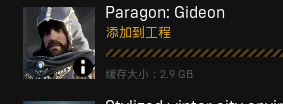

3. 进入虚幻编译器，选择角色，进入mesh选择Giden,可以看到Compiling Shaders字样，等编译完再进行下一步操作
4. 选择对应的动画

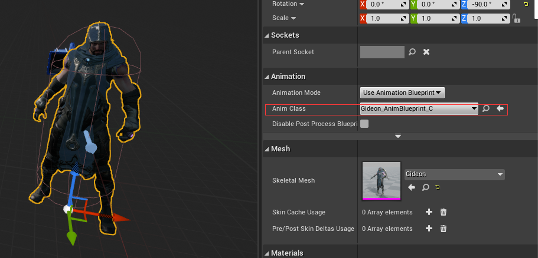

# 弹射子弹组件

## 添加

1. 创建一个子弹的Actor

2. 定义属性

```c++
//碰撞组件
UPROPERTY(VisibleAnywhere)
USphereComponent* SphereComponent;

//投射运动组件，可以给出一个速度，让组件直线运动
UPROPERTY(VisibleAnywhere)
UProjectileMovementComponent* MovementComponent;

//粒子系统组件
UPROPERTY(VisibleAnywhere)
UParticleSystemComponent* EffectComponent;

```

```c++
SphereComponent = CreateDefaultSubobject<USphereComponent>("SphereComponent");
RootComponent = SphereComponent;

EffectComponent = CreateDefaultSubobject<UParticleSystemComponent>("EffectComponent");
EffectComponent->SetupAttachment(SphereComponent);

MovementComponent = CreateDefaultSubobject<UProjectileMovementComponent>("CreateDefaultSubobject");
MovementComponent->InitialSpeed = 1000.0f;
MovementComponent->bRotationFollowsVelocity = true;
MovementComponent->bInitialVelocityInLocalSpace = true;
```

3. 建立一个蓝图

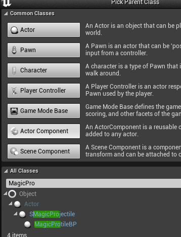

4. 选择一个特效

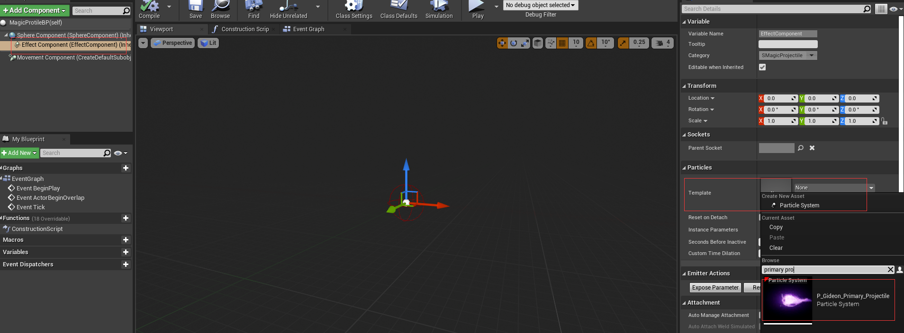

5. 将它托上去

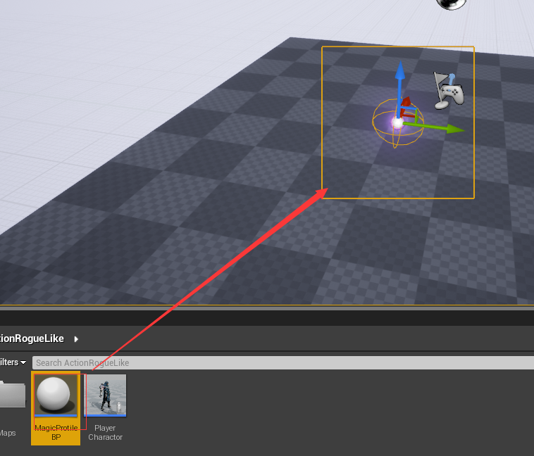

6. 设置下子弹点击运动

```c++
void AMyUECharacter::SetupPlayerInputComponent(UInputComponent* PlayerInputComponent)
{
	//定义一个左键点击动作，触发函数
	PlayerInputComponent->BindAction("PrimaryAttack", IE_Pressed, this, &AMyUECharacter::PrimaryAttack);
}

```

```C++
void AMyUECharacter::PrimaryAttack()
{
	//获取角色的朝向
	FTransform SpamTM = FTransform(GetControlRotation(), GetActorLocation());

	FActorSpawnParameters SpawnParams;
	SpawnParams.SpawnCollisionHandlingOverride = ESpawnActorCollisionHandlingMethod::AlwaysSpawn;

	GetWorld()->SpawnActor<AActor>(ProjectileClass, SpamTM, SpawnParams);
}

```

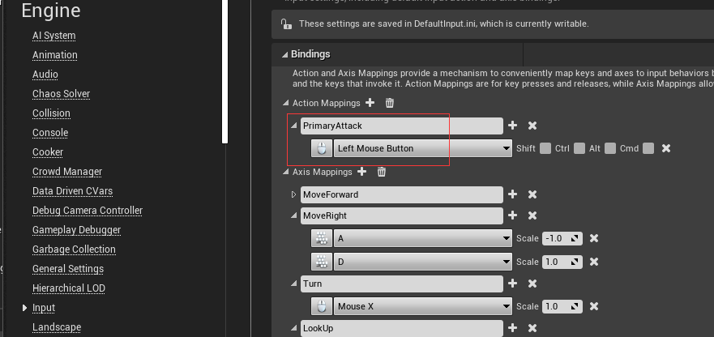

8. 设置子弹蓝图跟随人物角色

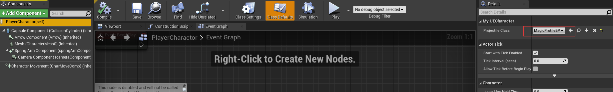

9. 此时运行点击可以看到人物发射出子弹，但是，不是从手里面发射的，这样看有点奇怪

## 取消重力

取消重力，让子弹直线运动

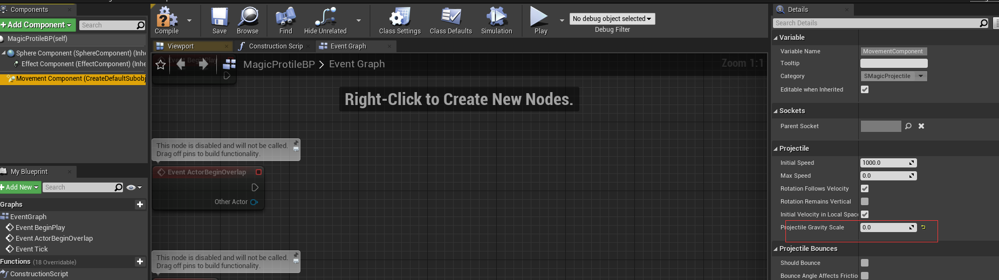

## 让墙壁能够阻挡子弹

我们选择球体，选择work static

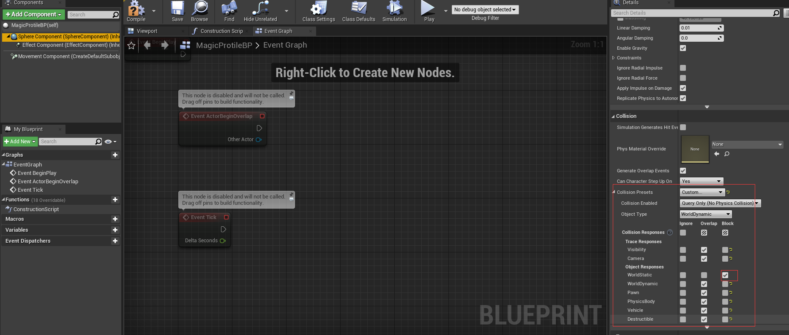

可以看到实际上，我们已经将子弹停住了

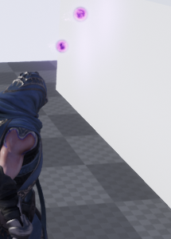

## 使用配置文件读取


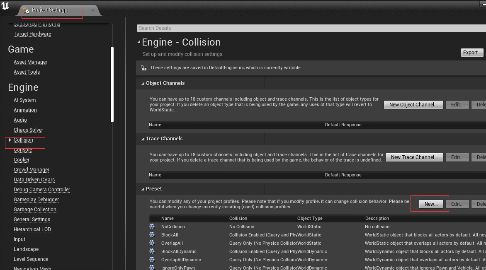

增加一个配置，用于魔法粒子<b id="blue">碰撞检测</b>

overlap: 重叠

Block:阻挡

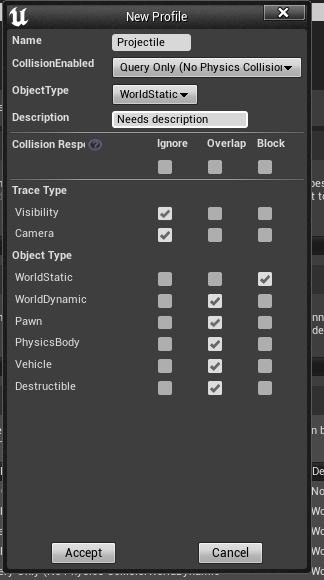

在代码中引用配置

```c++
	SphereComponent = CreateDefaultSubobject<USphereComponent>("SphereComponent");
	SphereComponent->SetCollisionProfileName("Projectile");
	RootComponent = SphereComponent;
```

此时，我们在此处点击一下按钮，发现已经加载类配置

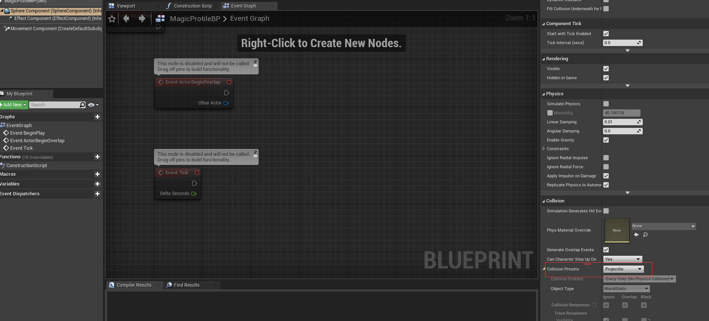


# 碰撞检测（Collision Presets）说明

## Trace Responses

默认的追踪响应通道

*Visibility*:一般可见性物体

*Camera*:一般用于追踪从摄像机到某个物体

## Object Responses

默认的物体响应通道有五个：

WorldStatic:适用于所有不用移动的Actor，最好的例子就是Static Mesh Actors

WorldDynamic:适用于所有因动画或者代码影响而移动的Actor，如电梯和门

Pawn: 适用于所有有玩家控制的实体，例如玩家的角色 

PhysicsBody:适用于所有因物理引擎模拟而运动的Actor

Vehicle:适用于所有载具，如汽车，飞机

Destructible:适用于所有可被破坏的物体，如窗户

分别对应不同的物理物体类型和物理体作用是，应该如何响应

# UE接口

有的时候，我们需要一些固定的物品和角色交互，而这些物品有很多方法是公共的，而这些方法没有实现，实现交给具体的实现类，这时，我们可以使用UE提供的接口（例如，我们按下F键去打开箱子，但是有时候，我们有需要按下F键去拾取武器）

## 新建一个接口

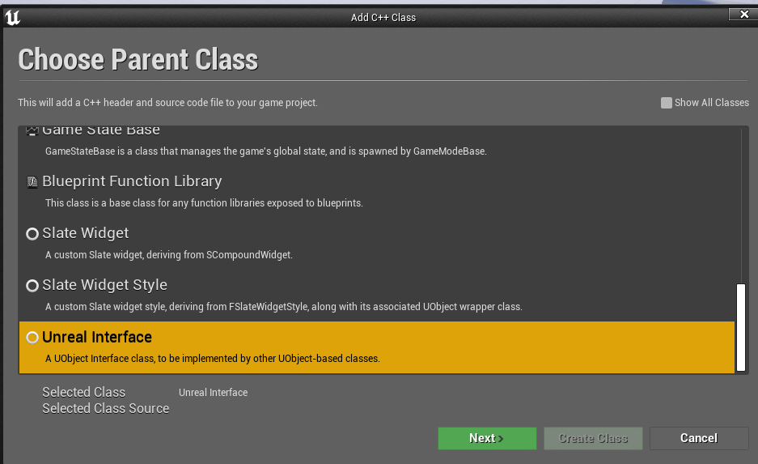

## 接口举个粒子

*UFUNCTION(BlueprintNativeEvent)*:

这样定以后，会优先调用蓝图中的Event，如果蓝图中该Event没有方法体，则调用C++的方法_Implementation

```c++
/**
 * USGameplayInterface 不需要我们修改，这是虚幻引擎的模板，我们只需要对ISGameplayInterface进行修改
 */
class MYUE41_API ISGameplayInterface
{
	GENERATED_BODY()

	// Add interface functions to this class. This is the class that will be inherited to implement this interface.
public:

	//定义一个接口，传入一个角色，让我们知道谁调用他
	//比如某个人使用类生命药水，我们需要知道给这个人添加生命值
	//如果定义函数UFUNCATION时使用BlueprintNativeEvent标识，
	//表示期望该函数在蓝图被重写(override)（这里的重写指的是定义一个自定义事件Custom Event），同时又拥有C++的实现方法
	UFUNCTION(BlueprintNativeEvent)
	void Interact(APawn* InstigatorPawn);
};
```

## 定义一个箱子

*UStaticMeshComponent*:继承于USceneComponent，是一个静态网格组件，也就是提供一个静态网格物体的渲染效果/物理碰撞等。

```c++
protected:
	//包厢的底座
	UPROPERTY(VisibleAnywhere)
	UStaticMeshComponent* BaseMesh;
	//宝箱的盖子
	UPROPERTY(VisibleAnywhere)
	UStaticMeshComponent* LidMesh;

```

```C++
ASItemChest::ASItemChest()
{
 	// Set this actor to call Tick() every frame.  You can turn this off to improve performance if you don't need it.
	PrimaryActorTick.bCanEverTick = true;
	BaseMesh = CreateDefaultSubobject<UStaticMeshComponent>("BaseMesh");

	LidMesh = CreateDefaultSubobject<UStaticMeshComponent>("LidMesh");
	LidMesh->SetupAttachment(BaseMesh);
}
```

## 箱子实现我们的接口类

我们知道Interact接口是<b id="gray">BlueprintNativeEvent</b>的，所以，当蓝图没有实现时，会调用<b id="blue">Interact_Implementation</b>方法

```c++
class MYUE41_API ASItemChest : public AActor, public ISGameplayInterface
{
	GENERATED_BODY()
	void Interact_Implementation(APawn* InstigatorPawn);

```

## 建立一个箱子的蓝图类

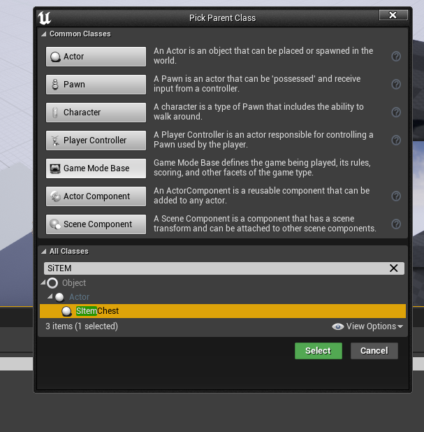

我们可以通过这种方式筛选出我们的staticmesh

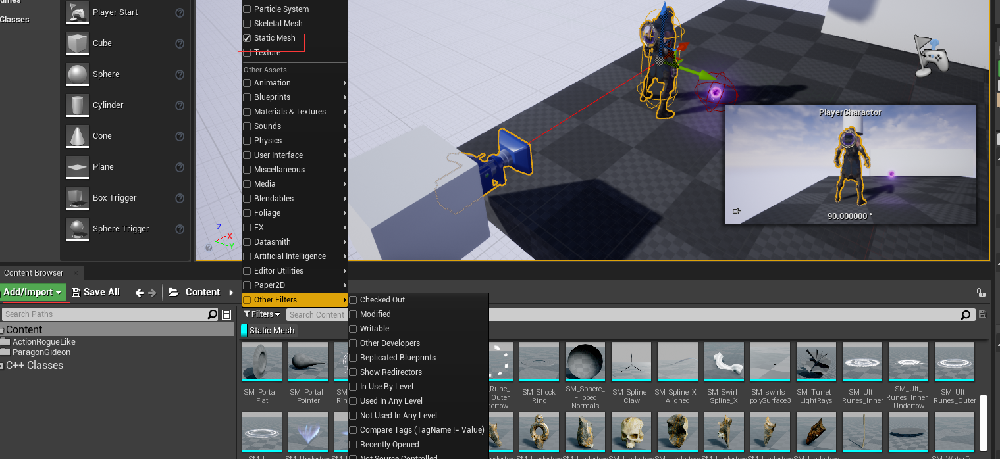

我们只需要选中它

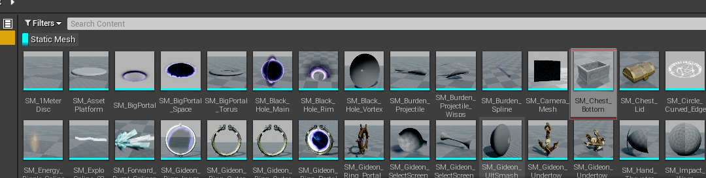

然后到对应的蓝图里选择即可（另一种方式就是选择后拖动）

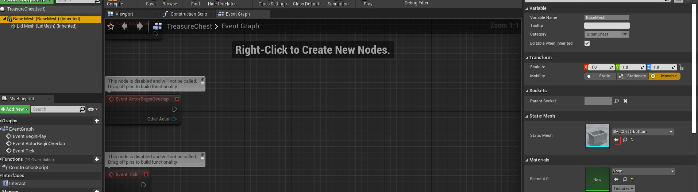

调整盖子的位置

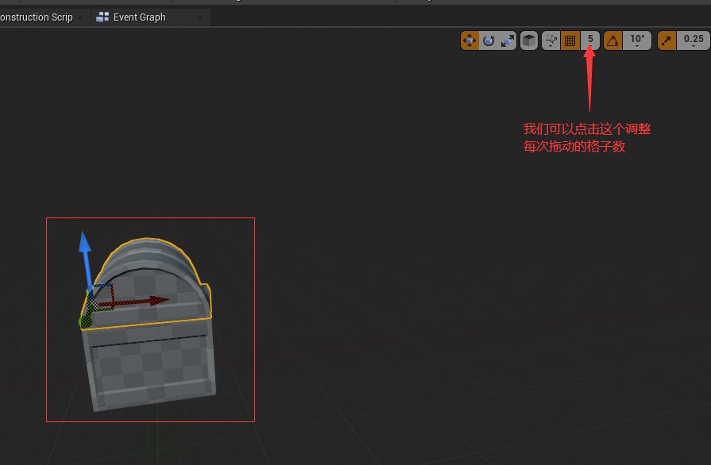

## 实现箱子旋转

在箱子旋转过程，我们可以看到对应的pitch值

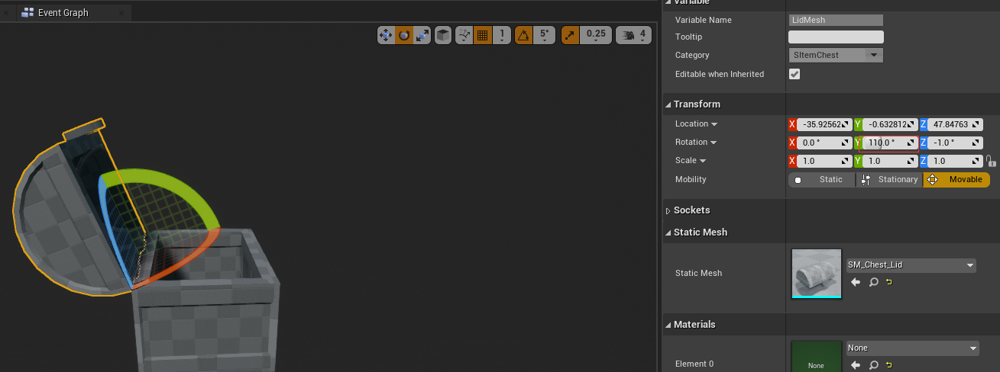

```c++
void ASItemChest::Interact_Implementation(APawn* InstigatorPawn)
{
	//当触发这个方法时，让pitch到110的位置
	LidMesh->SetRelativeRotation(FRotator(110.0f, 0.0f, 0.0f));
}

```

新建一个组件

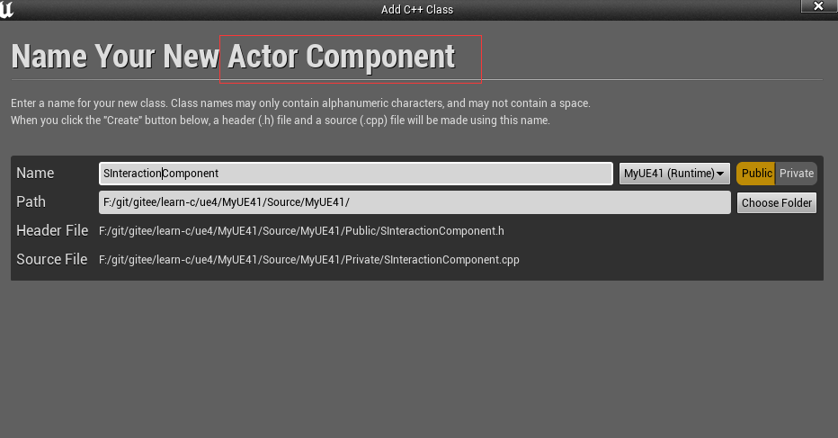


定义处理箱子打开方法

```c++
void USInteractionComponent::PrimaryInteract()
{
	FHitResult Hit;
	//查询场景为动态对象
	FCollisionObjectQueryParams ObjectQueryParams;
	ObjectQueryParams.AddObjectTypesToQuery(ECC_WorldDynamic);

	AActor* MyOwner = GetOwner();
	FVector EyeLocation;
	FRotator EyeRotation;
	
	MyOwner->GetActorEyesViewPoint(EyeLocation, EyeRotation);
	//结束位置我们让他在眼睛看到的矢量位置*1000单位
	FVector End = EyeLocation + (EyeRotation.Vector() * 1000);


	//LineTraceSingleByObjectType:给出一条线，从世界的一个点，到另一个点
	//param1:命中的结果
	//param2: 启始位置，现在我们定义在角色眼睛的位置
	//返回有没有命中我们要查询的动态对象
	bool b = GetWorld()->LineTraceSingleByObjectType(Hit, EyeLocation, End, ObjectQueryParams);
	//从命中结果拿出角色
	AActor* hitActor = Hit.GetActor();
	if(hitActor){
		if (hitActor->Implements<USGameplayInterface>())
		{
			APawn* MyPawn = Cast<APawn>(MyOwner);
			ISGameplayInterface::Execute_Interact(hitActor, MyPawn);
		}
	}
	//添加debug代码，视野路线能看到线条
	FColor color = b ? FColor::Green : FColor::Red;
	DrawDebugLine(GetWorld(), EyeLocation, End, color,false,  2.f, 2.f);
}
```

在人物的character的设计按住E调用方法

```c++
void AMyUECharacter::PrimaryInteraction()
{
	if (InteractionComponent) {
		//调用打开箱子的操作
		InteractionComponent->PrimaryInteract();
	}
}

```


新建一个input

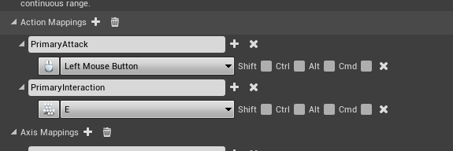

## 优化

我们对上面的代码优化，我们将视野指向的地方画个圆，这个圆触碰到了箱子，就打开

```c++
void USInteractionComponent::PrimaryInteract()
{
	//FHitResult Hit;
	//查询场景为动态对象
	FCollisionObjectQueryParams ObjectQueryParams;
	ObjectQueryParams.AddObjectTypesToQuery(ECC_WorldDynamic);

	AActor* MyOwner = GetOwner();
	FVector EyeLocation;
	FRotator EyeRotation;
	
	MyOwner->GetActorEyesViewPoint(EyeLocation, EyeRotation);
	//结束位置我们让他在眼睛看到的矢量位置*1000单位
	FVector End = EyeLocation + (EyeRotation.Vector() * 1000);


	//LineTraceSingleByObjectType:给出一条线，从世界的一个点，到另一个点
	//param1:命中的结果
	//param2: 启始位置，现在我们定义在角色眼睛的位置
	//返回有没有命中我们要查询的动态对象
	//bool b = GetWorld()->LineTraceSingleByObjectType(Hit, EyeLocation, End, ObjectQueryParams);
	TArray<FHitResult> Hits;
	FCollisionShape shape;
	float Radius = 100.f;
	shape.SetSphere(Radius);
	bool b = GetWorld()->SweepMultiByObjectType(Hits, EyeLocation, End, FQuat::Identity, ObjectQueryParams, shape);
	//添加debug代码，视野路线能看到线条
	FColor color = b ? FColor::Green : FColor::Red;
	for (FHitResult Hit : Hits) {
		//从命中结果拿出角色
		AActor* hitActor = Hit.GetActor();
		if (hitActor) {
			if (hitActor->Implements<USGameplayInterface>())
			{
				APawn* MyPawn = Cast<APawn>(MyOwner);
				ISGameplayInterface::Execute_Interact(hitActor, MyPawn);
			}
		}
		DrawDebugSphere(GetWorld(), Hit.ImpactPoint, Radius, 32, color, false, 2.f);
	}
	
	DrawDebugLine(GetWorld(), EyeLocation, End, color,false,  2.f, 2.f);
}
```

# 为攻击添加动画

## 初步实现

角色类定义一个施法动作

```C++
//定义一个施法动作
	UPROPERTY(EditAnywhere, Category="Attack")
	UAnimMontage* attackAnim;

```


```c++
void AMyUECharacter::PrimaryAttack()
{
	PlayAnimMontage(attackAnim);
	//获取手部的向量(Muzzle_01 为手部的蓝图名称)
	FVector handLocation = GetMesh()->GetSocketLocation("Muzzle_01");
	//获取角色的朝向
	FTransform SpamTM = FTransform(GetControlRotation(), handLocation);

	FActorSpawnParameters SpawnParams;
	SpawnParams.SpawnCollisionHandlingOverride = ESpawnActorCollisionHandlingMethod::AlwaysSpawn;

	GetWorld()->SpawnActor<AActor>(ProjectileClass, SpamTM, SpawnParams);
}
```

再添加材质

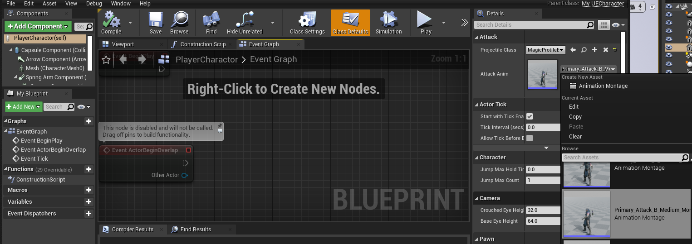

 现在有个问题，就是子弹是从手臂矢量处激发的

那么看起来有点怪，它至少要在手臂动作操作完后，再从手臂处激发才看起来正常

那么我们就需要延迟下子弹激发的时间

## 优化

```c++
void AMyUECharacter::PrimaryAttack()
{
	PlayAnimMontage(attackAnim);

	GetWorldTimerManager().SetTimer(TimeHandler_PrimaryAttack, this, &AMyUECharacter::PrimaryAttack_TimeElapsed, 0.2f);
	
}
void AMyUECharacter::PrimaryAttack_TimeElapsed()
{
	//获取手部的向量(Muzzle_01 为手部的蓝图名称)
	FVector handLocation = GetMesh()->GetSocketLocation("Muzzle_01");
	//获取角色的朝向
	FTransform SpamTM = FTransform(GetControlRotation(), handLocation);

	FActorSpawnParameters SpawnParams;
	SpawnParams.SpawnCollisionHandlingOverride = ESpawnActorCollisionHandlingMethod::AlwaysSpawn;

	GetWorld()->SpawnActor<AActor>(ProjectileClass, SpamTM, SpawnParams);
}

```

# 爆炸桶的实现

ASurExplosiveBarrel 建立一个爆炸类，实现actor，然后在蓝图中实现它

```c++
ASurExplosiveBarrel::ASurExplosiveBarrel()
{
 	// Set this actor to call Tick() every frame.  You can turn this off to improve performance if you don't need it.
	PrimaryActorTick.bCanEverTick = true;
	MeshComp = CreateDefaultSubobject<UStaticMeshComponent>("MeshComp");
	//UE中的“模拟物理”选项
	MeshComp->SetSimulatePhysics(true);
	//UE中的“模拟物理”选项
	MeshComp->SetCollisionProfileName(UCollisionProfile::PhysicsActor_ProfileName);
	RootComponent = MeshComp;
	ForceComp = CreateDefaultSubobject<URadialForceComponent>("ForceComp");
	ForceComp->SetupAttachment(MeshComp);
	// 爆炸范围
	ForceComp->Radius = 700.f;
	// 冲击力
	ForceComp->ImpulseStrength = 700.f;
	// 忽略质量大小；见UE中ForceComp的“冲量速度变更”
	ForceComp->bImpulseVelChange = true;
	//设置作用对象的碰撞类型
	ForceComp->AddCollisionChannelToAffect(ECC_WorldDynamic);
}
//是actor最初处于完整状态的地方。所以，在这里经常编写actor在游戏开始时的初始化相关代码。
void ASurExplosiveBarrel::PostInitializeComponents()
{
	Super::PostInitializeComponents();
	MeshComp->OnComponentHit.AddDynamic(this, &ASurExplosiveBarrel::OnActorHit);
}

void ASurExplosiveBarrel::OnActorHit(UPrimitiveComponent* HitComponent, AActor* OtherActor,
	UPrimitiveComponent* OtherComp, FVector NormalImpulse, const FHitResult& Hit)
{
	ForceComp->FireImpulse();
}
```

