# 蓝图

蓝图的本质是把C++的函数暴露给可视化的编辑器使用

[蓝图最佳实践 | 虚幻引擎文档 (unrealengine.com)](https://docs.unrealengine.com/4.26/zh-CN/ProgrammingAndScripting/Blueprints/BestPractices/)

## 虚幻引擎的内容示例

[内容示例 | 虚幻引擎文档 (unrealengine.com)](https://docs.unrealengine.com/4.26/zh-CN/Resources/ContentExamples/)

我们可以在这个下面下载

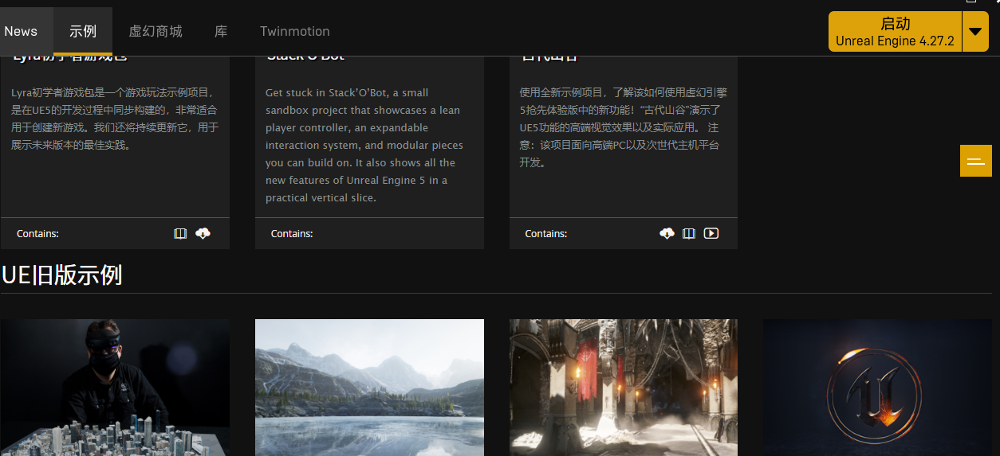

# 用蓝图建立一个开关

*类似箱子一样，有按键交互*，只不过这个是用蓝图实现的

1. 新建一个actor蓝图，LeverBP
2. 新建两个组件

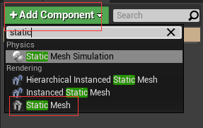

3. 将这个往上拖，覆盖之前的场景

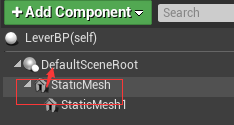

4. 然后分配两个static mesh, 这就是我们的拉环，然后将拉环Y轴30度，将switch拖到level里面

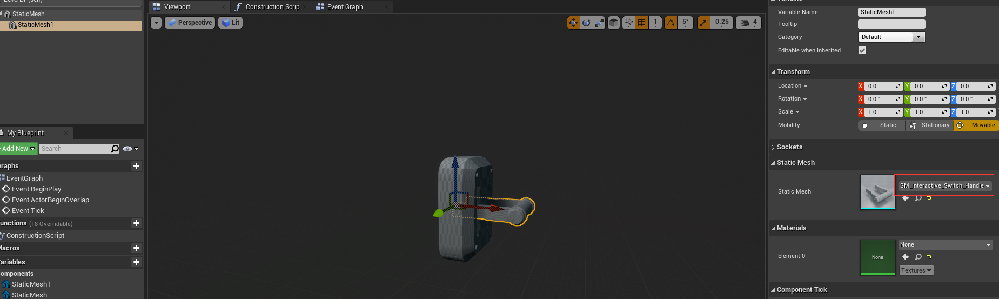

5. 接下来，我们要与这个switch互动，我们只需要点击ClassSetting，就能实现对应的接口，实现以后，左侧面多了很多的接口的一些信息

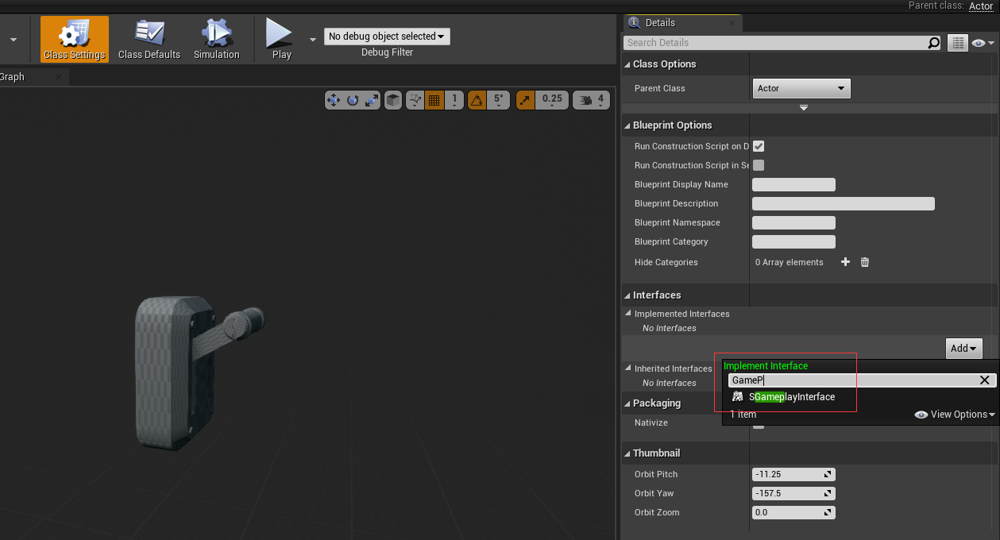

6. 实现这个事件

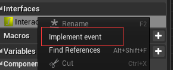

7. 我们把需要触发的事件的按钮拖到界面，这样，我们就创建了一个小节点，

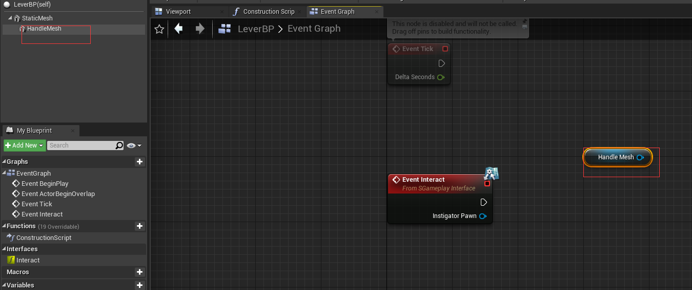

8.托出一个SetRelativeRotation的事件，在蓝图中，白线时执行线。像蓝色线或者紫色线就是数据线（作为函数的输出）

Make Rotator，就是我们白色执行线（按下我们的SGameInterface定义的E键后），去执行的角度数据，然后我们进入游戏，按下E，可以看到对应的拉杆到了-30度

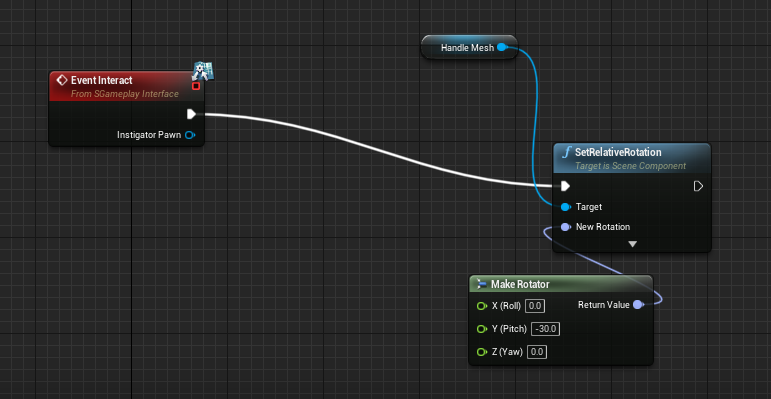

# 蓝图打开箱子

我们去实现一个接口，相当于重写了这个接口的代码，所以代码中<b id="blue">Interact_Implementation</b>的实现代码就会失效（可以在implement event之后试一下，按E会失去效果）

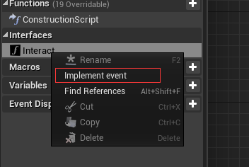

此时，我们需要调用代码里的实现，则需要 用蓝图去调用父类方法

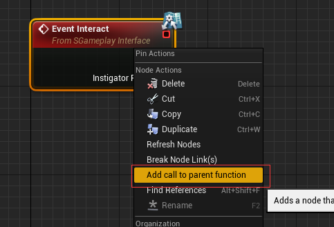

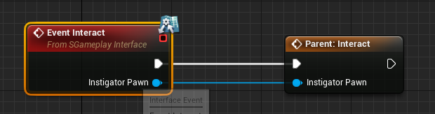

# 为打开箱子添加动画

1. 添加一个timeLine

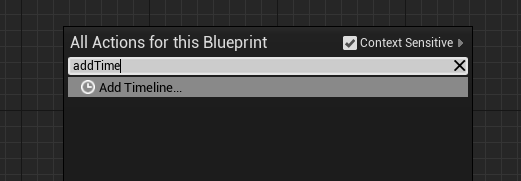

2. 双击打开以后，点击函数，添加时间变化，产生的不同值的函数（pitch），点击shitf+左键，可以添加时间点

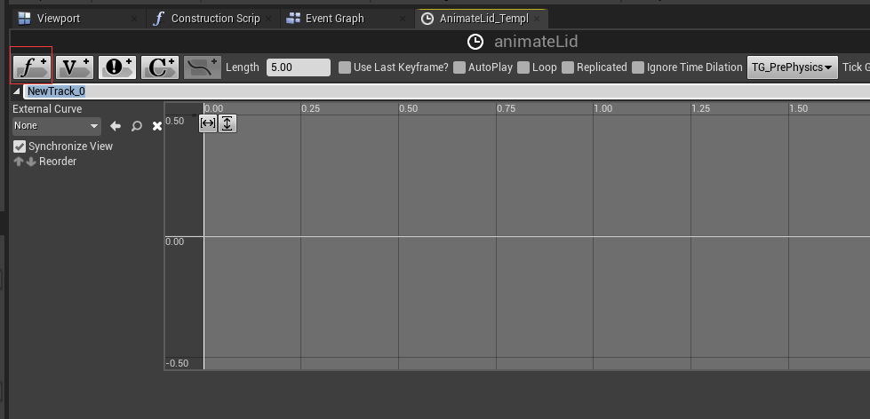

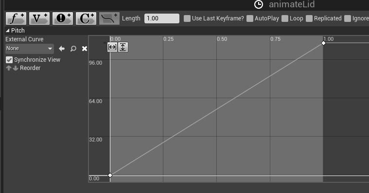

3. 这里表示，箱子的盖子（LidMesh）每次的pitch值是随着timeline变化产生的值改变的，如果词库Lidmesh报警，则可能需要回到代码，将箱盖的属性改成BlueprintReadOnly

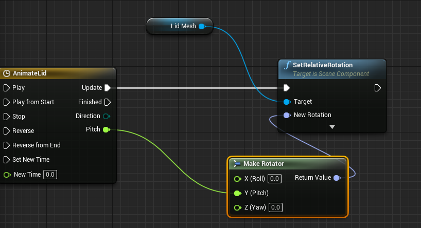

4. 需要注意的是，我们不能使用代码中的了，因为它会直接打开箱子，所以我们需要这样，这个时候我们再运行游戏，箱子是缓慢打开的

   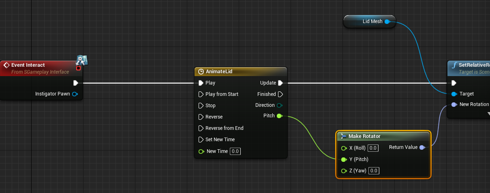

# 为箱子添加黄金

1. 添加一个staticmesh,使用黄金材料

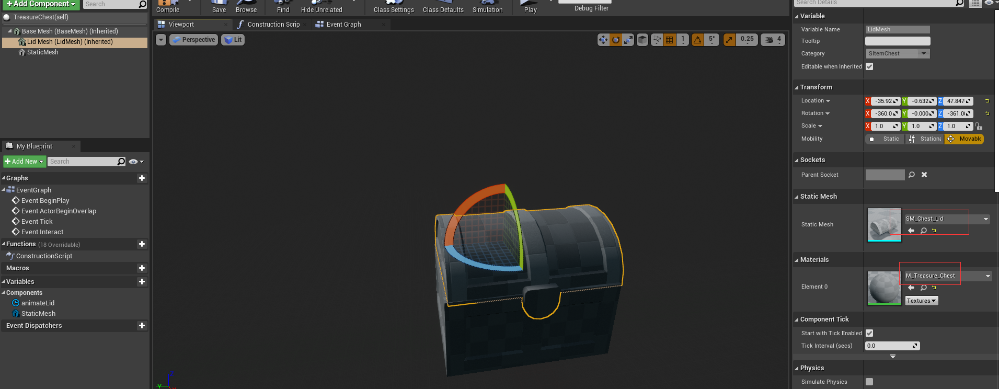

2. 为黄金添加特效

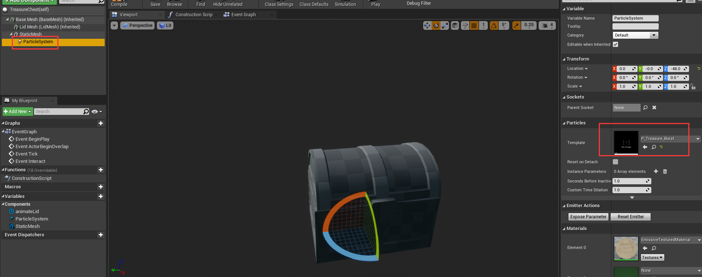

3. 为了能让我们自己控制，我们需要将特效自动触发取消

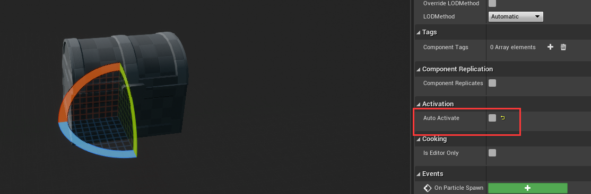

5. 当动画完成是，触发 activate

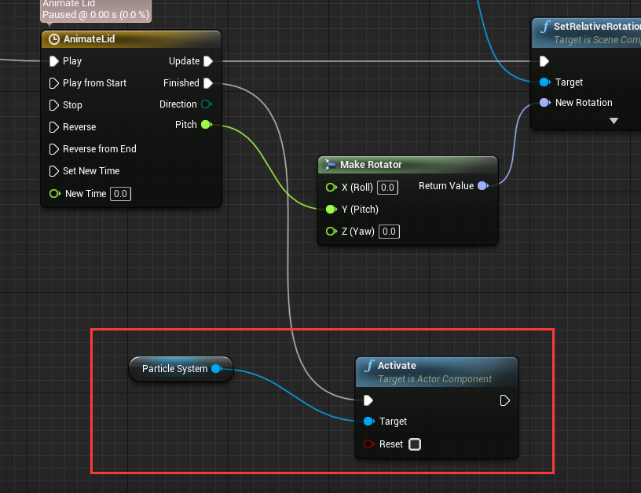

# 让箱子盖上

再次触发时，触发B指向回复

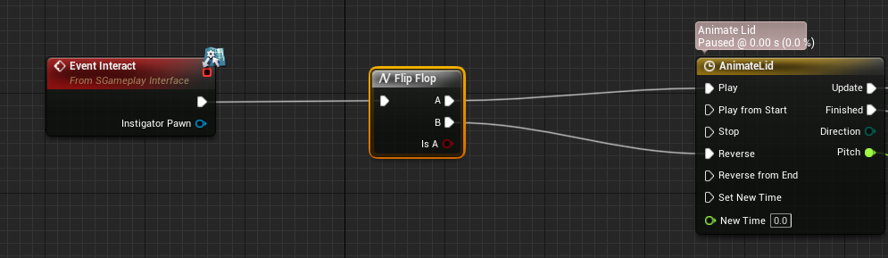

# 造一个攻击的弹射器

## 创建一个弹射器

1. 创建一个蓝图，实现actor,然后，begin绑定一个set time event(定时器)， 然后event 指向 custom event, 设置循环时间2秒
   1. set time event： *looping*:循环， *time*: 每隔多少秒产生一个事件
   2. *Custom Event*: 自定义事件
2. 自定义事件连接spawn actor from class
   1.  *Spawn Actor from Class*: 带有一个Actor类（通过类输入指定并尝试在世界中生成一个属于该类的实例。生成变换（Spawn Transform）输入用于定义Actor在世界中的生成位置（及其初始方向））
   2.   <b id="blue">class</b>输入要产生的Actor类型，一般为我们自己创建的蓝图类型，
   3. <b id="blue">Spawn Transform</b> : 如果针对Get Actor Transform要指定某个物体，即在这个物体处产生我们指定类型的物体。如果针对MakeTransform，输入MakeTransform产生对应节点，可以输入你想要的位置角度大小属性
3. spawn actor from class的class 选择 magic profile BP(我们建立的子弹蓝图类)

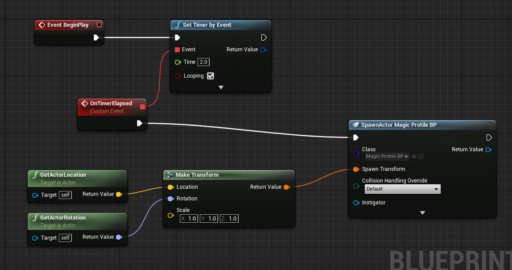

4. 这个时候他是没有视觉效果的，所以我们用一个小箭头来表示它的发射方向

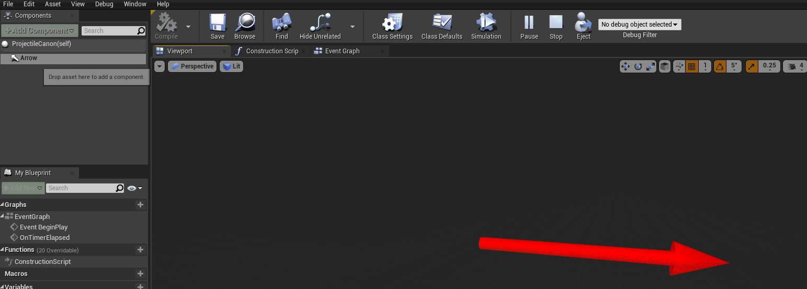

## 游戏中能看到箭头

去掉hidden in game

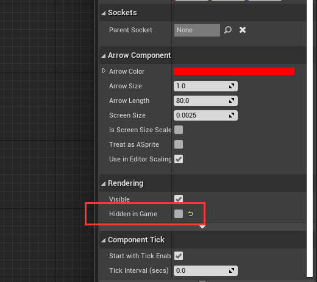

## 让攻击跟随用户

1. 创建一个EventTick： 每一帧都会触发Event Tick事件
2. 将事件指向setworldrotation， 目标为我们的箭头arrow
   
   1. <b id="blue">setworldrotation</b>： 设置世界坐标系下的旋转
   2. <b id="blue">GetPlayerpawn</b>：获得的Pawn或其子类继承自UObject，但Pawn没实现接口，因此这将什么也不做，执行下一个节点
   
   3. <b id="blue">FindLookatRotation</b>：其中Start连接需要旋转的物体位置矢量，Target连接摄像头位置矢量， 就能对准摄像头。**此节点的作用是计算从Start点到Target的方向向量在世界坐标系下的Rotation**

# 优化攻击

## 发射粒子时看见事件触发的位置

在粒子蓝图中，添加<b id="blue">OnComponentBeginOverlap</b>事件：粒子触发的时候调用

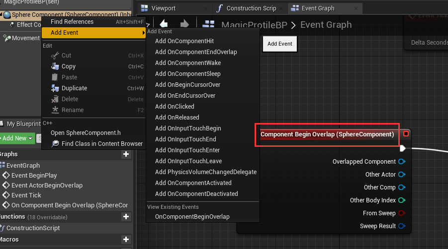

然后我们数据线连接draw debug sphere(绘制debug球体), center传入 当前actor的位置

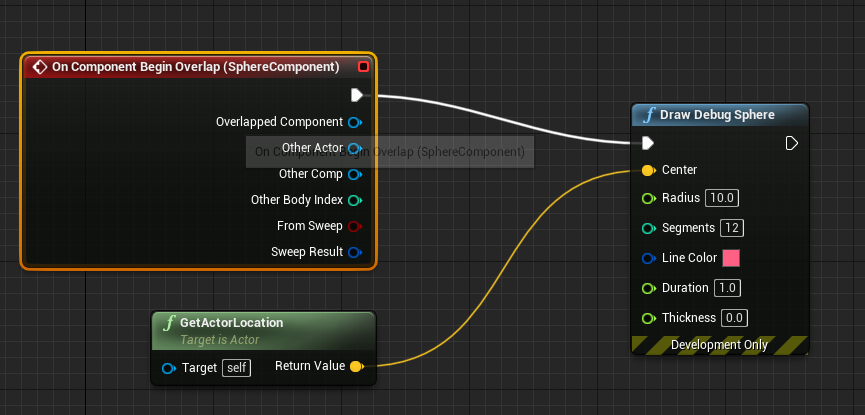

然后我们在激发子弹的时候，能看到这样的球体

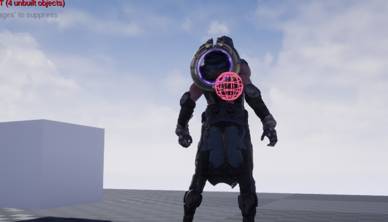

## 看见粒子触碰的位置

更改下触发事件即可

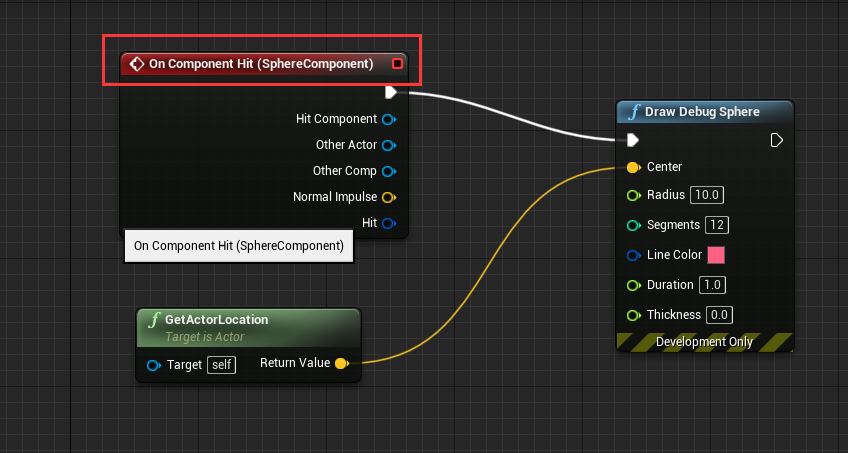


## 让粒子碰撞后消失

我们将碰撞属性设置成block，这时，我们发现，粒子在手臂发射处就停下来了，这个是因为它碰到了角色自己，所以停下来了

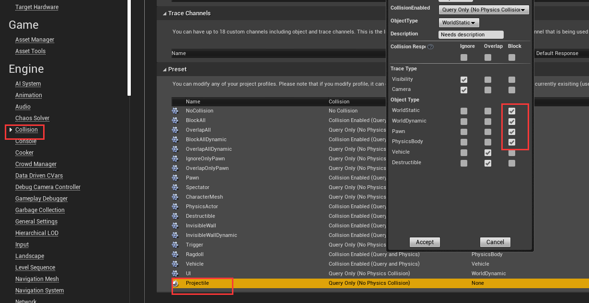

SpawnEmitterAtLocation:在某一个位置产生效果(接下来destroy，表示销毁效果)，传参物体，粒子效果，位置


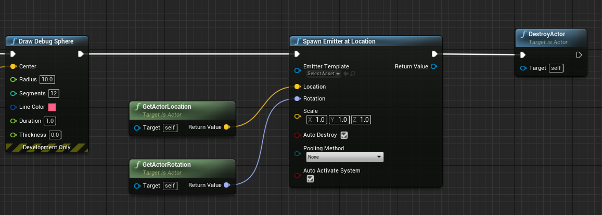

## 让粒子忽略自己

在UE中实现伤害判定时通常会引入Instigator，即发起者

使用Instigator的常见场景是射击游戏，在玩家发射子弹击杀了某个角色后，需要更新玩家的奖励和数据统计时，就可以通过这个Instigator快速找到发射子弹的玩家对象。<b id="blue">SpawnParams.Instigator=this;</b>这样，我们就把角色自己赋值给了instigator

```c++
void AMyUECharacter::PrimaryAttack_TimeElapsed()
{
	//获取手部的向量(Muzzle_01 为手部的蓝图名称)
	FVector handLocation = GetMesh()->GetSocketLocation("Muzzle_01");
	//获取角色的朝向
	FTransform SpamTM = FTransform(GetControlRotation(), handLocation);

	FActorSpawnParameters SpawnParams;
	SpawnParams.SpawnCollisionHandlingOverride = ESpawnActorCollisionHandlingMethod::AlwaysSpawn;
	SpawnParams.Instigator=this;
	GetWorld()->SpawnActor<AActor>(ProjectileClass, SpamTM, SpawnParams);
}
```

other actor: 命中对象

然后用not equal判断，如果不相等 就用branch输出给draw debug sphere

branch ： 一般用来做条件值的判断输出

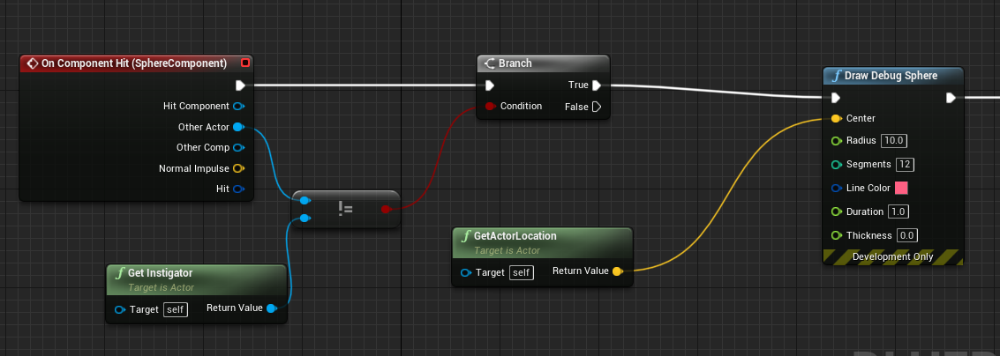

这个时候，我们运行游戏发现，我们的设置无效，粒子还是碰到自己就停下来了，这时为啥呢

因为，我们还有一个<b id="gray">MovementComponent</b>组件，这个组件也使用了profile的配置，即碰到就阻塞，所以，这个时候我们需要将其忽略

*IgnoreActorWhenMoving*:在移动中忽略指定Actor，即不与其发生碰撞和<b id="blue">Overlap</b>事件（这里我们忽略instigator,即角色自己）

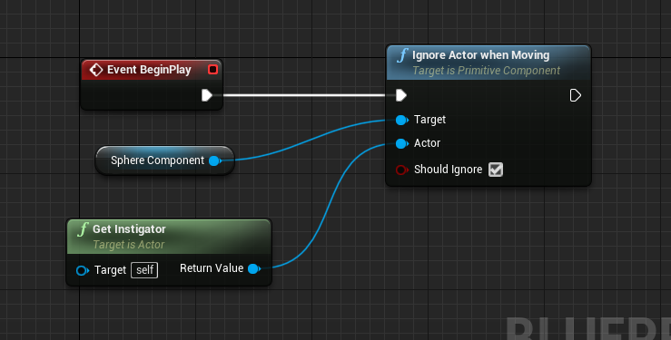

代码实现方式：

```c++
void ASMagicProjectile::BeginPlay()
{
	Super::BeginPlay();
	SphereComponent->IgnoreActorWhenMoving(GetInstigator(), true);
}
```

# 摄像机左移

## 有问题的移动

我们直接移动location, 这个时候，很容易造成视觉穿墙的情况

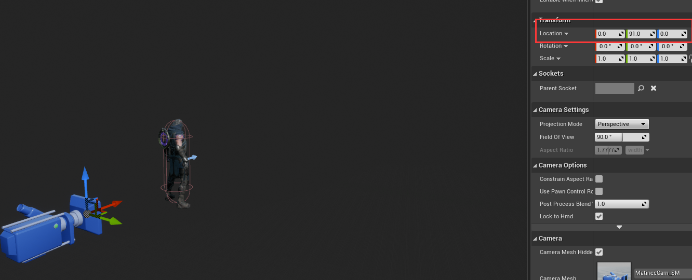

这是因为，我们有一个arm的组件，这个组件会做碰撞检验，来确保我们不会穿墙，如果我们直接移动camera的location,这个组件就会失效

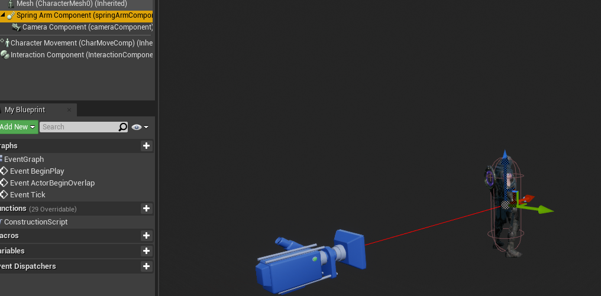

这个时候，我们只需要移动arm的socket offset即可

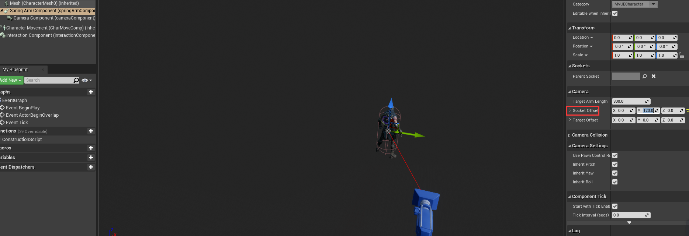

# 射击准星

## 添加一个准心

我们现在射击，发现根本没有一个准星，这个时候我们需要建一个

1. 建立一个UI文件夹
2. UI下建立一个widget blueprint,

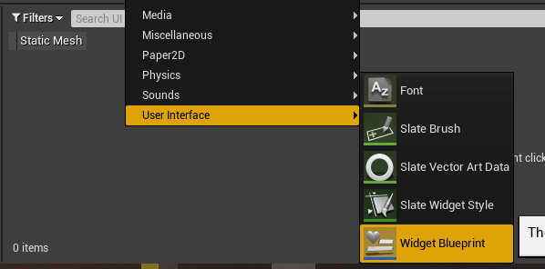

3. 这个蓝框就是我们全部的屏幕

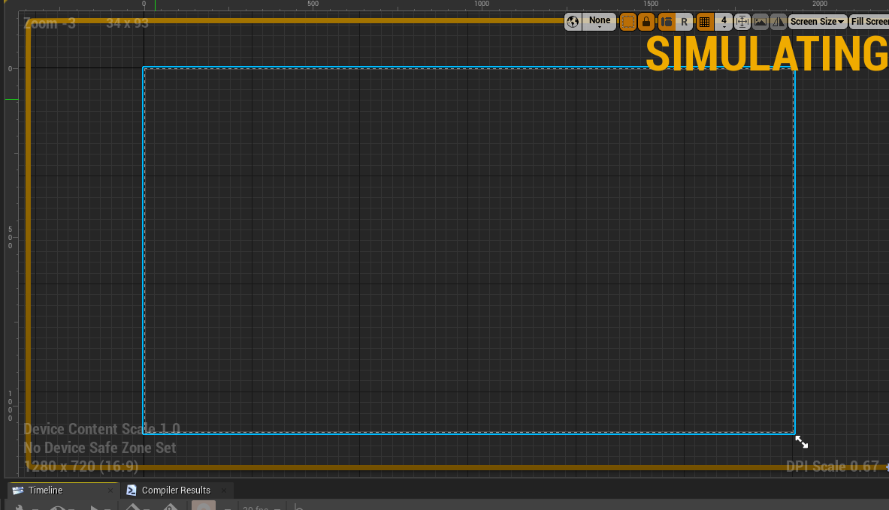

4. 新建一个image, 这个就是我们的准星

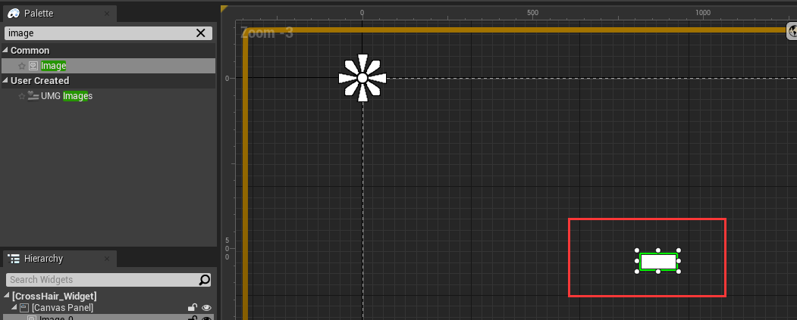

5. 我们将这朵花对准中间，我们以此为标准来进行调试

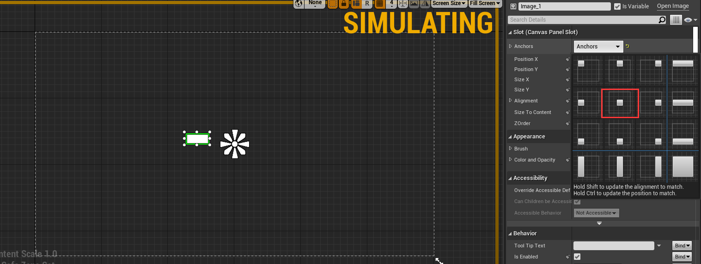

6. 我们可以放大， 然后调整成这个数据，就差不多了

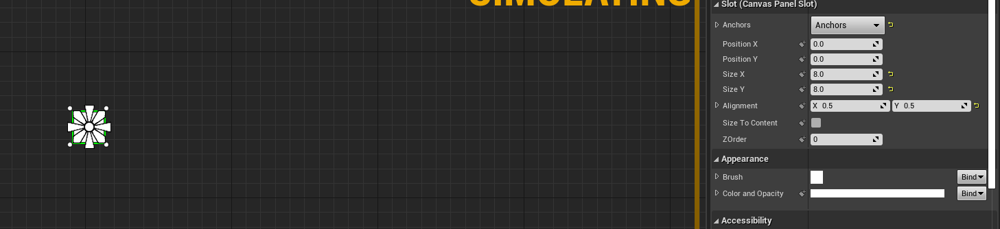

7. 回到我们的角色蓝图界面，begin play 添加 create widget,  class 选择我们的widget名称

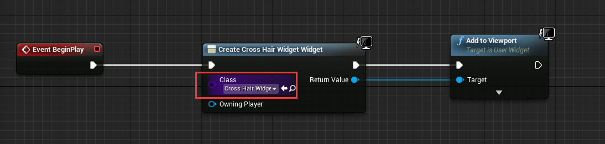