# 蓝图

蓝图的本质是把C++的函数暴露给可视化的编辑器使用

[蓝图最佳实践 | 虚幻引擎文档 (unrealengine.com)](https://docs.unrealengine.com/4.26/zh-CN/ProgrammingAndScripting/Blueprints/BestPractices/)

## 虚幻引擎的内容示例

[内容示例 | 虚幻引擎文档 (unrealengine.com)](https://docs.unrealengine.com/4.26/zh-CN/Resources/ContentExamples/)

我们可以在这个下面下载

# 用蓝图建立一个开关

*类似箱子一样，有按键交互*，只不过这个是用蓝图实现的

1. 新建一个actor蓝图，LeverBP
2. 新建两个组件

3. 将这个往上拖，覆盖之前的场景

4. 然后分配两个static mesh, 这就是我们的拉环，然后将拉环Y轴30度，将switch拖到level里面

5. 接下来，我们要与这个switch互动，我们只需要点击ClassSetting，就能实现对应的接口，实现以后，左侧面多了很多的接口的一些信息

6. 实现这个事件

7. 我们把需要触发的事件的按钮拖到界面，这样，我们就创建了一个小节点，

8.托出一个SetRelativeRotation的事件，在蓝图中，白线时执行线。像蓝色线或者紫色线就是数据线（作为函数的输出）

Make Rotator，就是我们白色执行线（按下我们的SGameInterface定义的E键后），去执行的角度数据，然后我们进入游戏，按下E，可以看到对应的拉杆到了-30度

# 蓝图打开箱子

我们去实现一个接口，相当于重写了这个接口的代码，所以代码中<b id="blue">Interact_Implementation</b>的实现代码就会失效（可以在implement event之后试一下，按E会失去效果）

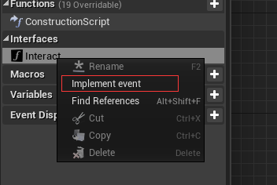

此时，我们需要调用代码里的实现，则需要 用蓝图去调用父类方法

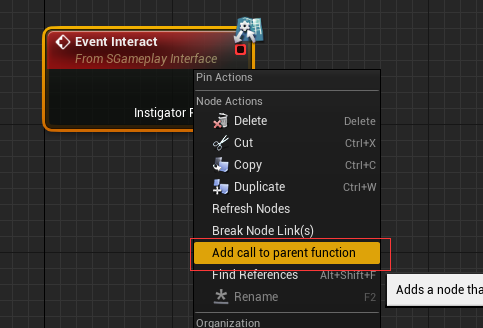

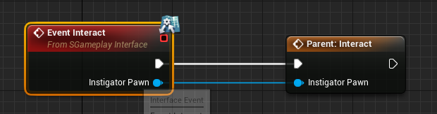

# 为打开箱子添加动画

1. 添加一个timeLine

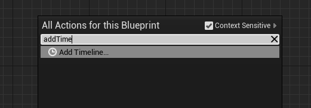

2. 双击打开以后，点击函数，添加时间变化，产生的不同值的函数（pitch），点击shitf+左键，可以添加时间点

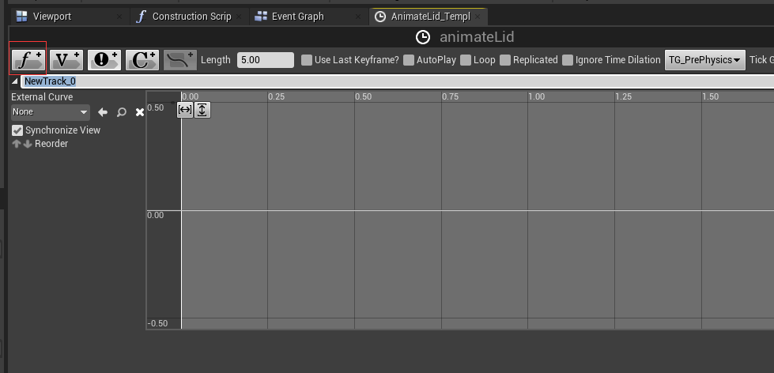

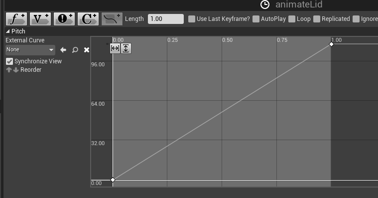

3. 这里表示，箱子的盖子（LidMesh）每次的pitch值是随着timeline变化产生的值改变的，如果词库Lidmesh报警，则可能需要回到代码，将箱盖的属性改成BlueprintReadOnly

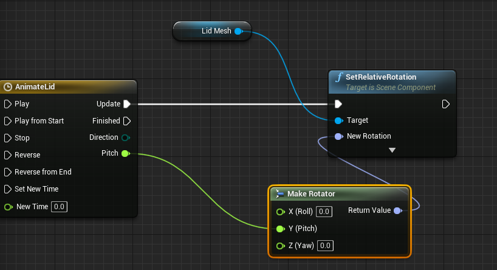

4. 需要注意的是，我们不能使用代码中的了，因为它会直接打开箱子，所以我们需要这样，这个时候我们再运行游戏，箱子是缓慢打开的

   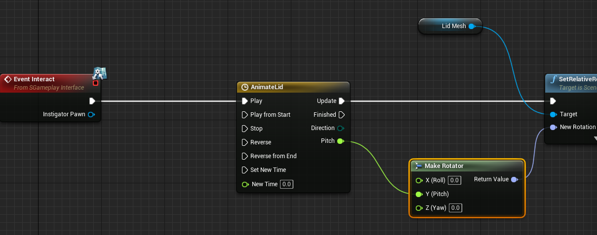

# 为箱子添加黄金

1. 添加一个staticmesh,使用黄金材料

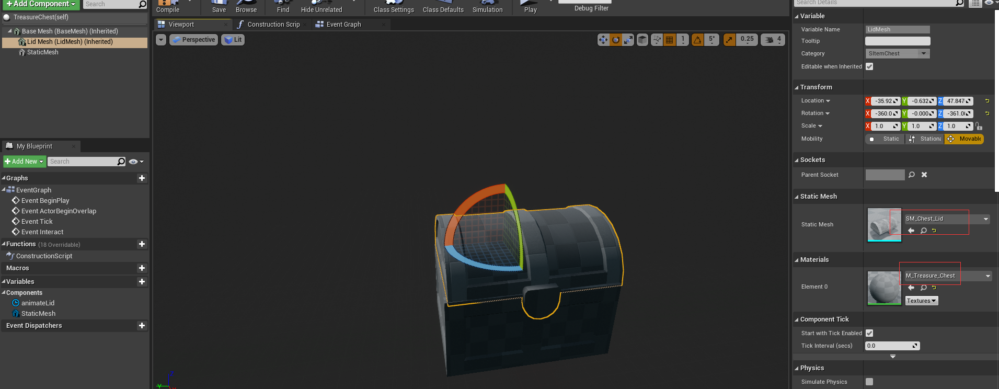

2. 为黄金添加特效

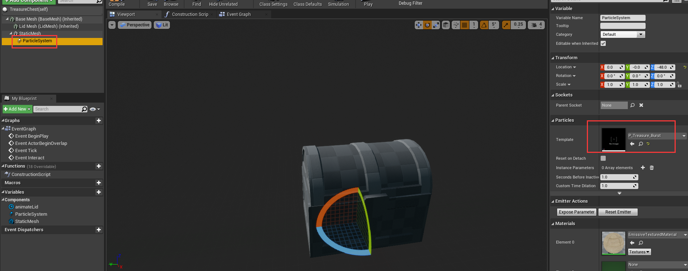

3. 为了能让我们自己控制，我们需要将特效自动触发取消

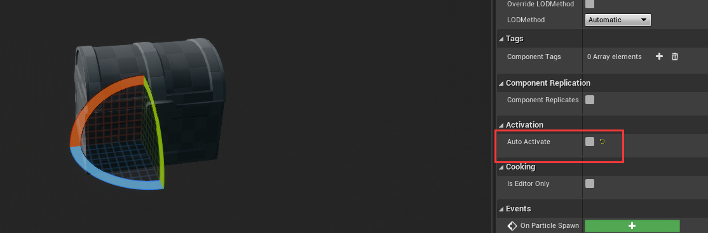

5. 当动画完成是，触发 activate

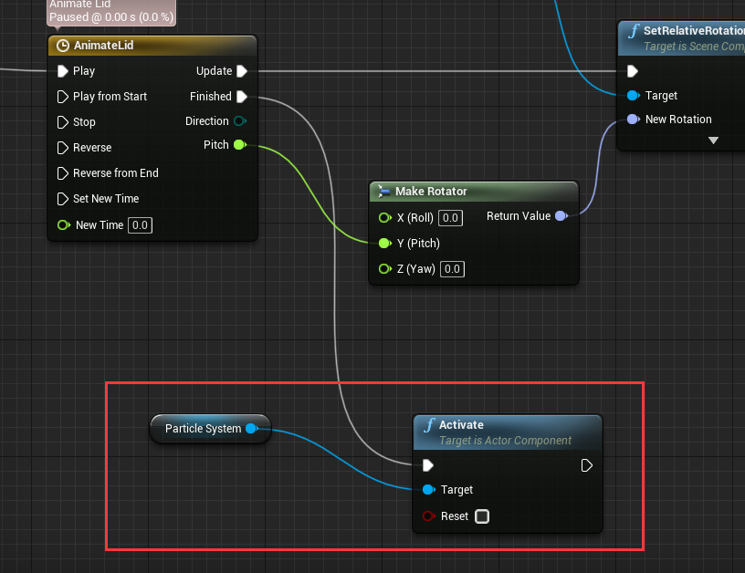

# 让箱子盖上

再次触发时，触发B指向回复

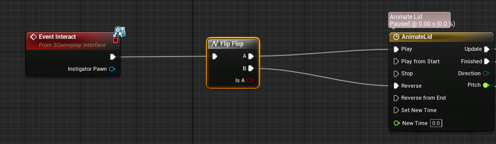