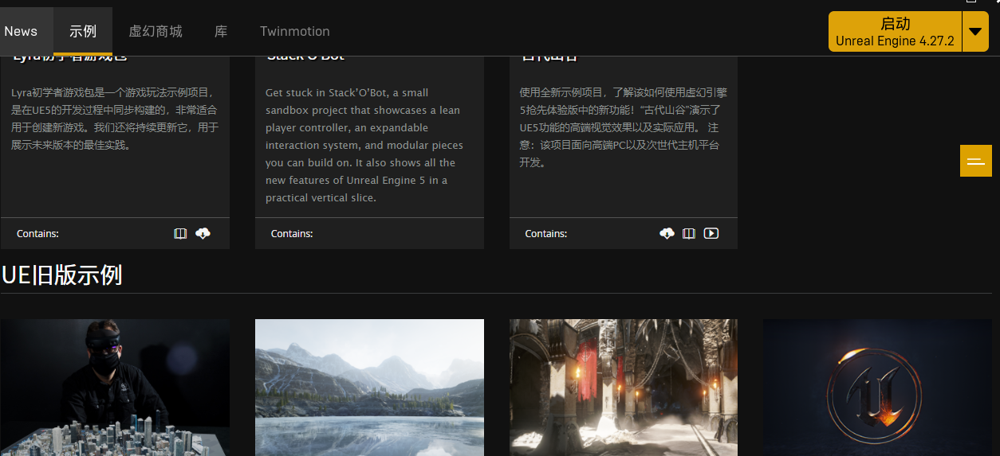
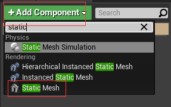
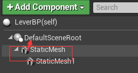
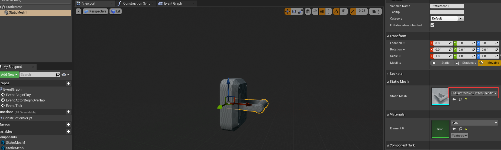
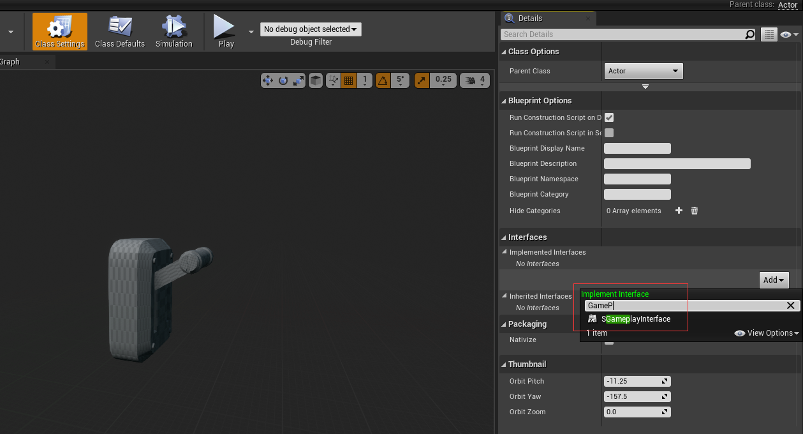
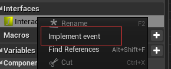
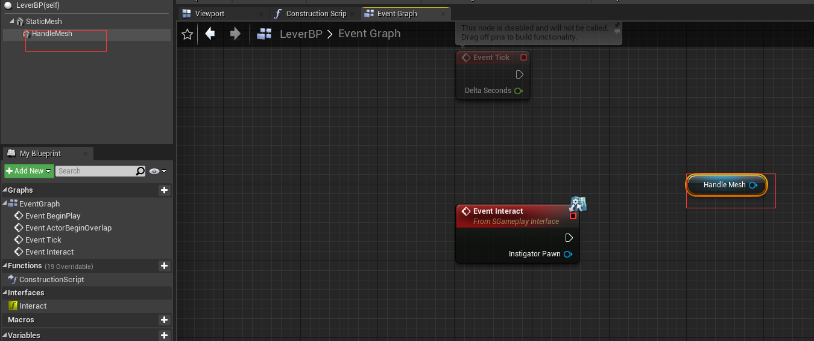
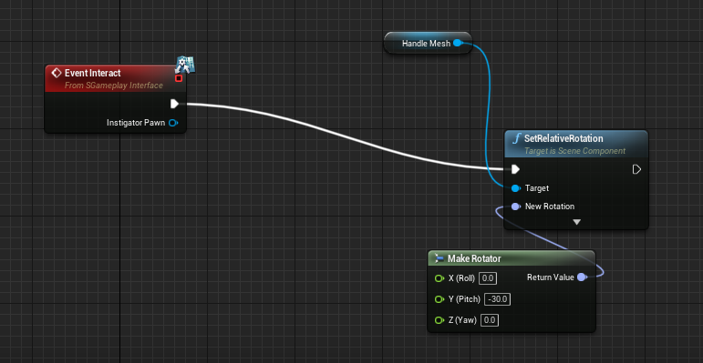

# 蓝图

蓝图的本质是把C++的函数暴露给可视化的编辑器使用

[蓝图最佳实践 | 虚幻引擎文档 (unrealengine.com)](https://docs.unrealengine.com/4.26/zh-CN/ProgrammingAndScripting/Blueprints/BestPractices/)

## 虚幻引擎的内容示例

[内容示例 | 虚幻引擎文档 (unrealengine.com)](https://docs.unrealengine.com/4.26/zh-CN/Resources/ContentExamples/)

我们可以在这个下面下载

# 用蓝图建立一个开关

*类似箱子一样，有按键交互*，只不过这个是用蓝图实现的

1. 新建一个actor蓝图，LeverBP
2. 新建两个组件

3. 将这个往上拖，覆盖之前的场景

4. 然后分配两个static mesh, 这就是我们的拉环，然后将拉环Y轴30度，将switch拖到level里面

5. 接下来，我们要与这个switch互动，我们只需要点击ClassSetting，就能实现对应的接口，实现以后，左侧面多了很多的接口的一些信息

6. 实现这个事件

7. 我们把需要触发的事件的按钮拖到界面，这样，我们就创建了一个小节点，

8.托出一个SetRelativeRotation的事件，在蓝图中，白线时执行线。像蓝色线或者紫色线就是数据线（作为函数的输出）

Make Rotator，就是我们白色执行线（按下我们的SGameInterface定义的E键后），去执行的角度数据，然后我们进入游戏，按下E，可以看到对应的拉杆到了-30度

