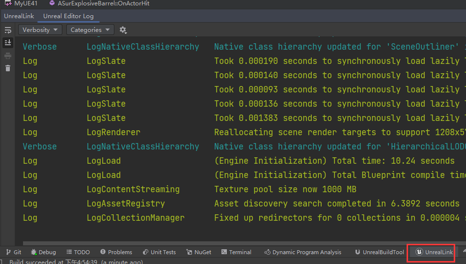

# 日志打印


```shell
void ASurExplosiveBarrel::OnActorHit(UPrimitiveComponent* HitComponent, AActor* OtherActor,
	UPrimitiveComponent* OtherComp, FVector NormalImpulse, const FHitResult& Hit)
{
	ForceComp->FireImpulse();
	//日志打印	
	UE_LOG(LogTemp, Log, TEXT("===>OnActorHit"));
	//GetNameSafe的* 是因为要打印字符串
	UE_LOG(LogTemp, Warning, TEXT("OtherActor: %s, at time : %f"), *GetNameSafe(OtherActor), GetWorld()->TimeSeconds);
}
```

然后在ue界面打开log，可以看到控制台输出log


当然，rider上面也可以看



# 断点调试

**需要通过rider**打开ue,然后加上断点，才能调试


# 界面绘制debug信息

```c++
	FString CombineString = FString::Printf(TEXT("Hit at : %s"), *Hit.ImpactPoint.ToString());
	DrawDebugString(GetWorld(), Hit.ImpactPoint, CombineString, nullptr, FColor::Green, 2.f, true);	
```


# 断言

我们通常用<b id="blue">ensure</b>来调试条件是否为真

还有check，但两者不同之处在于ensure提示错误但不会中断程序，check会直接结束你的关卡测试，所以通常使用ensure