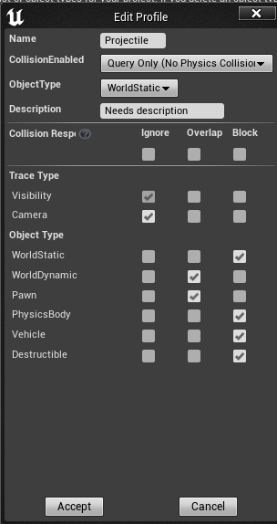

# 新建Health属性类

1. 新建一个class ,继承actor component, 命名sattributecomponent, 定义一个health属性，在构造方法中，初始化值为100
2. 添加扣减血量的方法

```c++
bool USAttrbuteComponent::ApplyHealthChange(float Delta)
{
	Health -= Delta;
	return  true;
}
```

3. 在角色类中，我们需要定义属性变量，然后在构造方法中初始化

```c++
AttributeComp = CreateDefaultSubobject<USAttributeComponent>("AttributeComp");
```

4. 我们需要在子弹类中初始化的时候添加事件

```c++
//指定组件与另外一个碰撞体产生Overlap事件时触发
SphereComponent->OnComponentBeginOverlap.AddDynamic(this, &ASMagicProjectile::OnActorOverlap);
```

4. 在<b id="blue">OnActorOverlap</b>中实现扣减血量的方法
   1. HitComp：发出事件的Actor中指定该事件的组建
   2. OtherActor：被碰撞的Actor的指针
   3. OtherComp：被碰撞的Actor中响应该次时间的组件
   4. OtherBodyIndex：不能理解，可能类似被碰撞的Actor的编号之类的
   5. FHitResult：将碰撞时间的一些信息包装起来，里面也存着被碰撞Actor的指针

```C++
void ASMagicProjectile::OnActorOverlap(UPrimitiveComponent* OverlappedComponent, AActor* OtherActor,
	UPrimitiveComponent* OtherComp, int32 OtherBodyIndex, bool bFromSweep, const FHitResult& SweepResult)
{
	if(OtherActor)
	{	
        //找到一个指定类的组件实例，在你不Actor的确切类型但知道该Actor有确定的某个组件类型时非常有用，它会返回找到的全部组件实例
		USAttributeComponent* AttributeComp = Cast<USAttributeComponent>(OtherActor->GetComponentByClass(USAttributeComponent::StaticClass()));
		if(AttributeComp)
		{
			AttributeComp->ApplyHealthChange(-20.f);
		}
	}
}
```

5. 这是啥? 这么设置是为了让子弹碰到自己不再阻挡



6. 为了打印血量，我们这样构建蓝图，每一帧触发一个事件 
   1. print log 去掉，防止重复打印
   2. Duration 设置为0


# 显示血量图标

1. 在UI文件下建立PlayerHealth_Widget的widget
2. 拖动三个组件，然后将<b id="blue">progressbar</b>和text拖动到<b id="blue">Horizontal Box</b>下, 我们可以看到，这个horizon太小了，我们可以调整左边的size为file


3. 点击右侧，进入事件设置


4. 给数值添加一个绑定的函数添加一个函数和返回类型， 我们希望它返回玩家血量，所以改名为GetHealthText


5. 在palayer蓝图中创建一个widget 和viewport


6. 回到血量widget,我们将动态的heath，传入绑定的函数返回值中


7. 如果想完美点，我们就加一个isvalid
   1. IsValid方法判断一个对象是否有效


# 事件通知方式显示血量值

上面的血量值，是通过每一帧的扫描去获取的，这样很低效，我们可以通过事件的方式，来获取血量值

这个时候，我们可以通过事件来操作

*DECLARE_DYNAMIC_MULTICAST_DELEGATE_OneParam*:动态多播

1. 我们在属性类建立一个四属性的多播器

```c++
//这里有定义了四个参数的的多播器
// AActor*, InstigatorActor : 造成血量扣减的人
//USAttributeComponent*, Owning
// float, NewHealth, 新血量
//float, Delta 扣减的血量
DECLARE_DYNAMIC_MULTICAST_DELEGATE_FourParams(FOnHealthChanged, AActor*, InstigatorActor, USAttributeComponent*, Owning,  float, NewHealth, float, Delta)

```

```C++
public:

	UPROPERTY(BlueprintAssignable)
	FOnHealthChanged OnHealthChanged;
```

2. 在扣减血量方法中添加事件传播调用

```c++
bool USAttributeComponent::ApplyHealthChange(float Delta)
{
	Health += Delta;
	OnHealthChanged.Broadcast(nullptr, this, Health, Delta);
	return  true;
}
```

3. 现在，我们在蓝图属性下，能看到对应的事件了


4. 可以打印下，可以看到对应的血量变化


# 血条的变化

1. 我们将progressbar 拖到蓝图中
2. 通过角色类里面的属性的血量事件通知，来改变对应值


3. 为了能让这个被除数是我们代码里的血量，我们可以这样优化

这种写法类似我们代码里的

USAttributeComponent* AttributeComp = Cast<USAttributeComponent>(OtherActor->GetComponentByClass(USAttributeComponent::*StaticClass*()));

强行转换类型


event construct


event pre construct : 一般用来设置颜色啊什么的


# 血量变化添加动画


1. 如果我们想在某个事件段改变某个值，在调整好对应动画时间帧后，可以点击这个小按钮来确定改变啥


2. 我们在动画中间的过程，修改scale后，点击+,然后按空格，可以看到对应的时间变化，动画值变化

