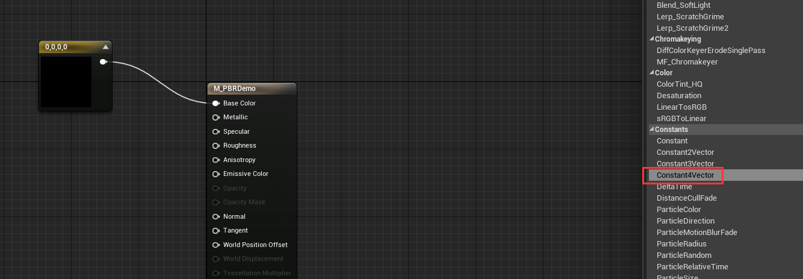
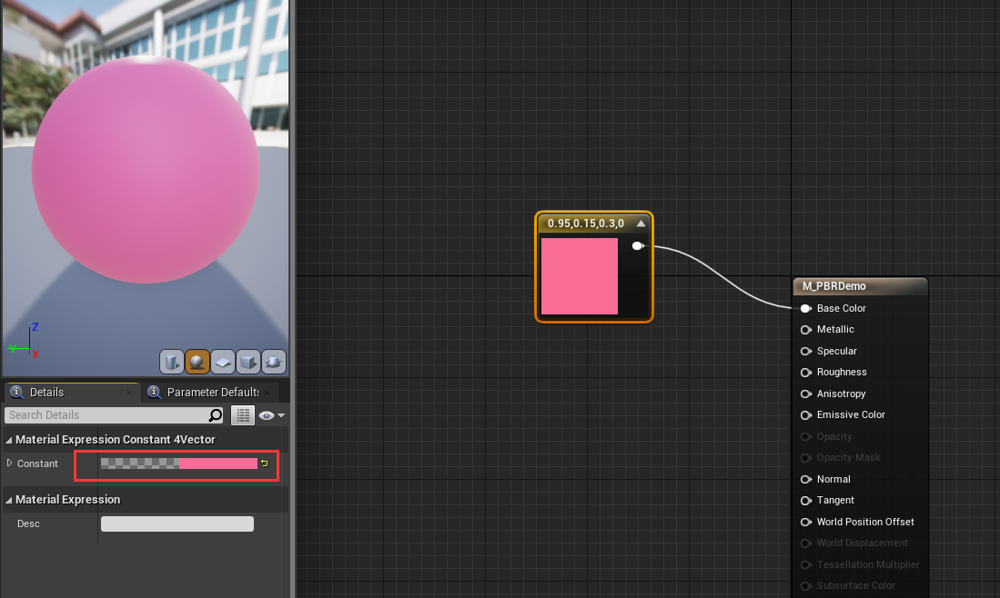
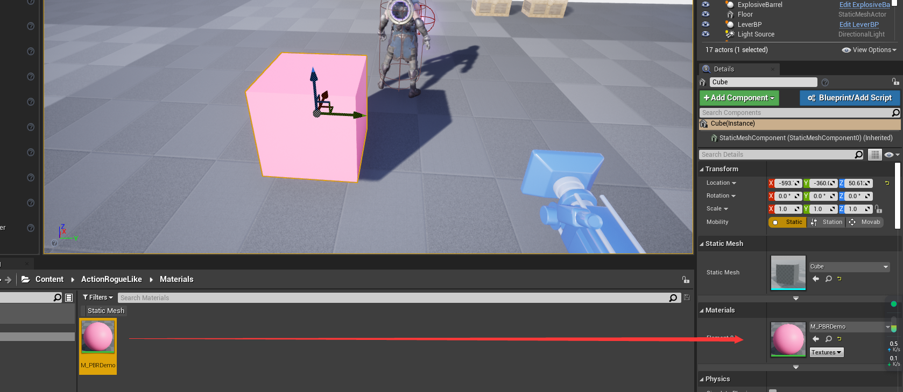
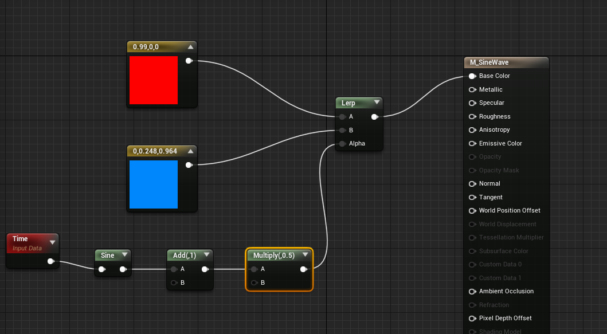
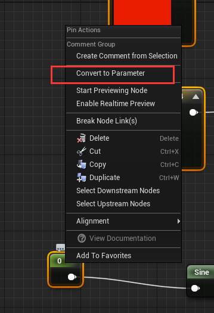
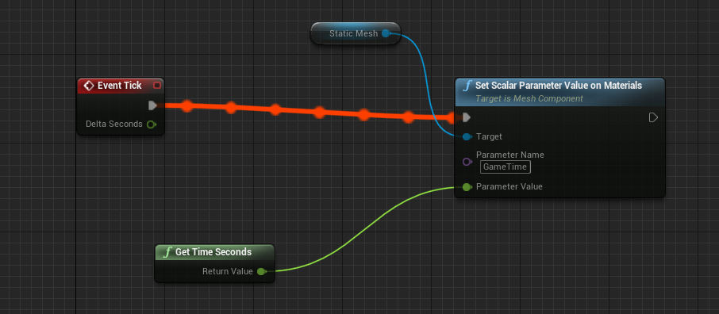
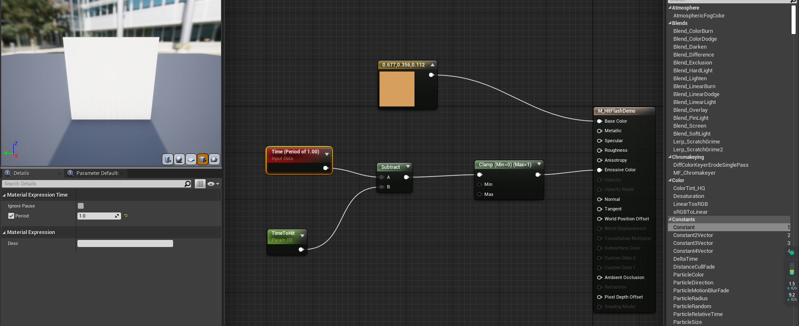
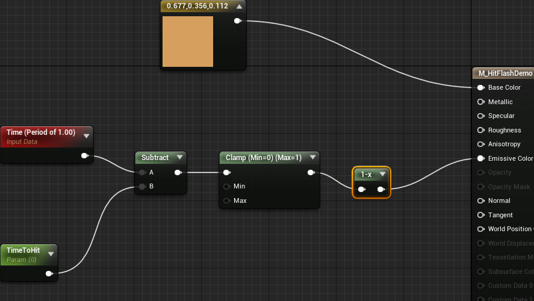

#

# 定义一个材质

1. 建立一个<b id="blue">Materials</b>材质文件夹
2. 建立<b id="blue">M_PBRDemo</b>的材质，材质命名一般以M_开头，双击进入材质，可以看到右侧有很多节点选择

## 基础颜色

*Constant3Vector*：三维向量，表达式输出三通道矢量值，即RGB(红、绿、蓝)

如果，我们想要一些基础颜色，可以拖动三维向量，指向base color

我们可以通过这个改变材质的颜色

我们可以通过拖动将这个材质赋值给某个蓝图

## 建立一个时间变化，颜色变化的材质

1. 增加一个<b id="blue">Linearlnterpolate</b>（在math下面），它会将 a b两个颜色混合
2. *Alpha*:值不同，a b 两个的表现就不同
3. *Time*: 产生游戏开始时的时间

## 建立一个能传递参数的材质

1. 从<b id="blue">M_PBRDemo</b>复制一个材质 M_PBSineWave
2. 我们将左侧的constant拖过来，点击转换成parameter,然后在命名gametime

3. 我们建立一个蓝图，命名SineWaveBluethPrint ，将我们定义的材质拖入staticmesh中，编辑event,传入时间参数

4. 这种方式，我们是用了Tick的方式，所以，会对CPU压力造成很大，然而，time的方式，我们是将渲染等交给GPU的，所以那种方式更优

## 创建受到攻击闪烁的材质

1. 创建一个名为M_HitFlashDemo 材质，然后给他一点颜色
2. 为了能让参数改变闪烁，我们定义一个可以传参的，然后定义一个时间，让他们计算，产生不同值
3. 为了让time产生周期性的值，我们可以把time 的period设置成1，意思就是1秒中的轮询

4. 我们希望，这个颜色变化为无的时候，里面变回去，这个时候，我们需要color为0，所以我们可以建立one minus(1-输入参数=输出参数),这样我们能让他里面从0变为1

