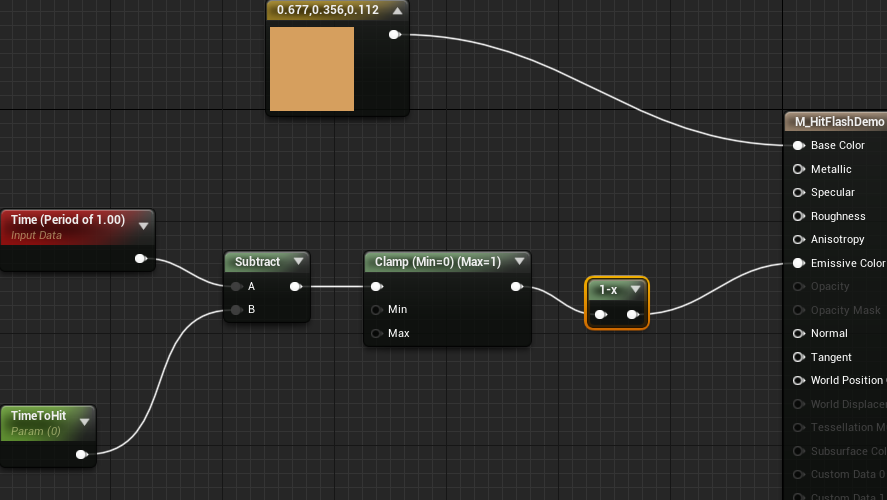

#

# 定义一个材质

1. 建立一个<b id="blue">Materials</b>材质文件夹
2. 建立<b id="blue">M_PBRDemo</b>的材质，材质命名一般以M_开头，双击进入材质，可以看到右侧有很多节点选择

## 基础颜色

*Constant3Vector*：三维向量，表达式输出三通道矢量值，即RGB(红、绿、蓝)

如果，我们想要一些基础颜色，可以拖动三维向量，指向base color


我们可以通过这个改变材质的颜色


我们可以通过拖动将这个材质赋值给某个蓝图


## 建立一个时间变化，颜色变化的材质

1. 增加一个<b id="blue">Linearlnterpolate</b>（在math下面），它会将 a b两个颜色混合
2. *Alpha*:值不同，a b 两个的表现就不同
3. *Time*: 产生游戏开始时的时间


## 建立一个能传递参数的材质

1. 从<b id="blue">M_PBRDemo</b>复制一个材质 M_PBSineWave
2. 我们将左侧的constant拖过来，点击转换成parameter,然后在命名gametime


3. 我们建立一个蓝图，命名SineWaveBluethPrint ，将我们定义的材质拖入staticmesh中，编辑event,传入时间参数


4. 这种方式，我们是用了Tick的方式，所以，会对CPU压力造成很大，然而，time的方式，我们是将渲染等交给GPU的，所以那种方式更优

## 创建受到攻击闪烁的材质

原理： emissive color =1时，发光亮度会变成白色，当=0时，他会变成黄色

1. 创建一个名为M_HitFlashDemo 材质，然后给他一点颜色
2. 为了能让参数改变闪烁，我们定义一个可以传参的，然后定义一个时间，让他们计算，产生不同值
3. 为了让time产生周期性的值，我们可以把time 的period设置成1，意思就是1秒中的轮询


4. 我们希望，这个颜色变化为无的时候，里面变回去，这个时候，我们需要color为0，所以我们可以建立one minus(1-输入参数=输出参数),这样我们能让他里面从0变为1



5. 在代码上，我们需要利用之前的攻击事件,建立一个ASurTargetDummy的class, 然后，在蓝图中实现， <b id="blue">TimeToHit</b>，传入的是游戏时间，当攻击的时候，闪烁参数与时间相减，则=0

```java
ASurTargetDummy::ASurTargetDummy()
{
 	// Set this actor to call Tick() every frame.  You can turn this off to improve performance if you don't need it.
	PrimaryActorTick.bCanEverTick = true;
	MeshComp = CreateDefaultSubobject<UStaticMeshComponent>("MeshComp");
	RootComponent = MeshComp;

	AttrComp = CreateDefaultSubobject<USAttributeComponent>("AttrComp");
	AttrComp->OnHealthChanged.AddDynamic(this, &ASurTargetDummy::OnHealthChanged);
}

void ASurTargetDummy::OnHealthChanged(AActor* InstigatorActor, USAttributeComponent* OwningComp, float NewHealth,
	float Delta)
{
	if (Delta < 0) {
		MeshComp->SetScalarParameterValueOnMaterials("TimeToHit", GetWorld()->TimeSeconds);
	}
}
```

# 材质的溶解

当一个NPC死亡，我们常常能看到游戏中的效果是，这个NPC慢慢的消失，材质的溶解就是这样的效果

## 定义Texture

1. 新建一个材料（Material）, 命名为<b id="blue">M_DissolveEffect</b>
2. 在材质里面新建一个Texture Sample
3. 然后我们在content下筛选对应的texture,选中一个<b id="blue">T_TileNoise</b>给我们对应材质的Texture


4. 我们定义一个基础的三维颜色

## 混合模式（Blend Mode）

”混合模式“用来定义半透明度类型，一般情况下，它负责控制各种类型的半透明

- 不透明（Opaque）
- 遮罩（Masked）
- 半透明（Tanslucency）
- 叠加（Additive）
- 调制（Modulate）
- 预乘透明度（AlphaComposite） 

5. 我们将mode设置为Masked
6. 我们江texture指向Opactity mask，我们发现它已经有了反应


## Opactity mask

仅在使用遮罩模式下(Masked)可使用，与不透明度(Opacity)一样，但不会出现那种半透的颜色，这种模式下，材质要么完全可见，要么完全不可见

我们可以修改他的值，0-1，来控制


7. 拖动一个constant常量，转换为param，然后命名<b id="blue">DissolveAmount</b>，如图，我们就可以通过param来控制像素了


## 让像素完全消失

8. 此时，我们设置param为0，发现像素还是没有完全消失（此时我们的clip已经设置为了1），以为我们的texture有初始值，此时，我们可以利用<b id="blue">clamp</b>来处理，并且将值设置为0-0.99


# 公共函数

