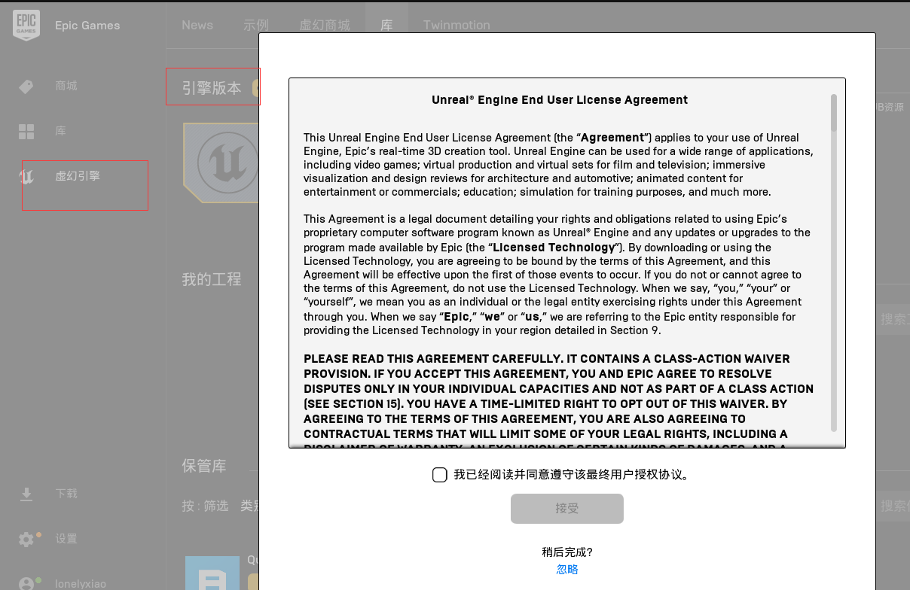
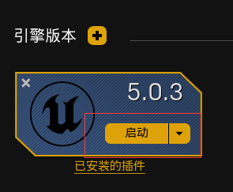
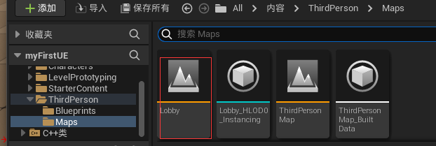

# 测试一个游戏

## 新建一个5.0的引擎

## 启动虚幻引擎

## 启动多人测试

将玩家数量调到多个

standalone运行： 将启动一个独立的游戏

监听服务器运行：编辑器作为服务器

运行的时候就能看到两个测试实例，并且他们已经连接了监听服务器

# 局域网连接

## 新建一个地图

新建一个关卡地图，保存到map下

## 使用蓝图局域网连接

进入蓝图双击

建立两个keyboard，表示按某个键触发某个事件

将第一个事件指向Open level , 命令为Lobby，表示按1进入关卡Lobby

2指向一个命令，表示输入2连接指定关卡

回到lobby打包

打包文件后，将文件传送另一个机子

在另一个机子（B）运行文件

在本机（A）运行文件

A点击1进入Lobby关卡， B点击2进入关卡

## 使用C++代码局域网连接

1. 在虚幻商城下载vs插件

2. 双击进入代码编辑界面

