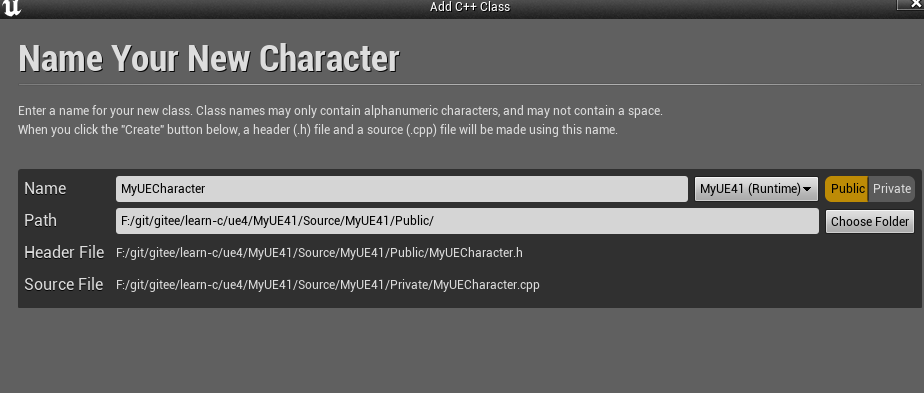
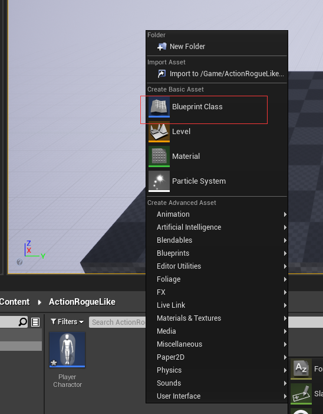
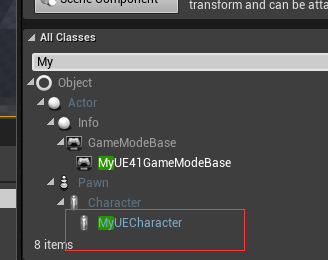
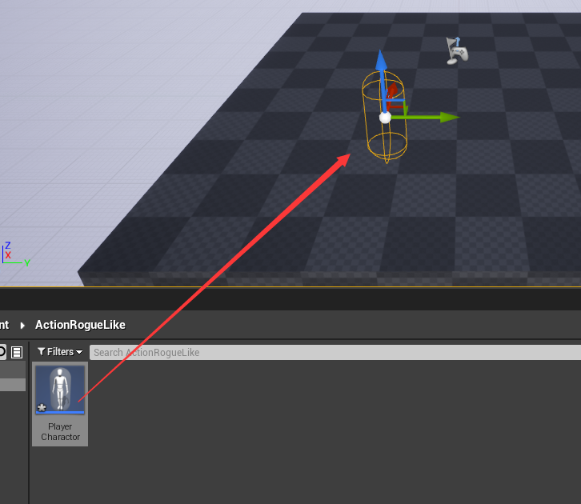
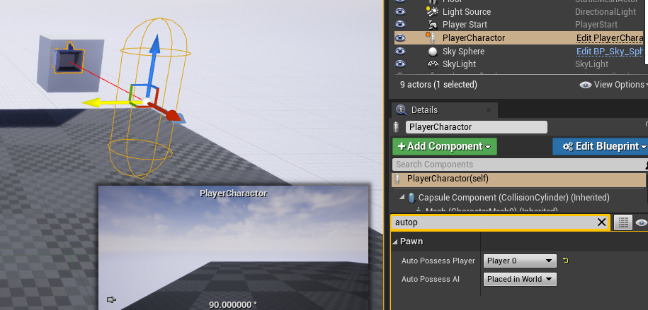
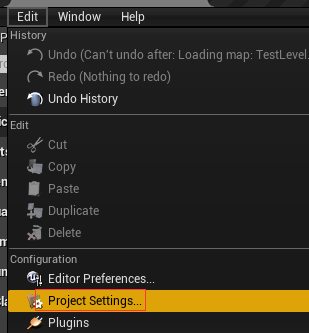
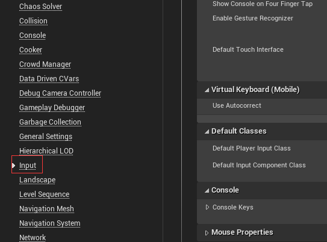
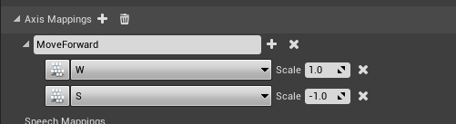
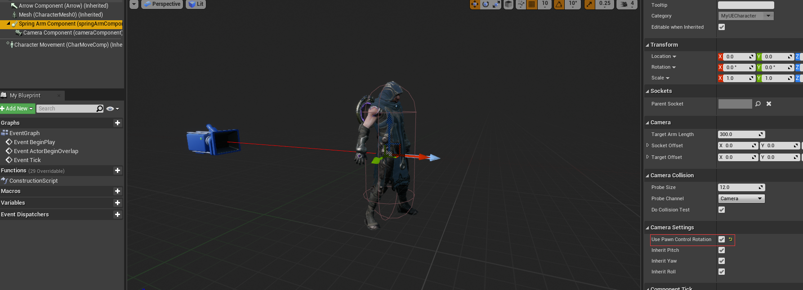

创建一个空项目

如果我们从某个地方down下来，我们只需要右键<b id="blue">xx.uproject</b>文件，然后，点击<b id="blue">Generate Visual Studio project files</b>选项重新生成vs项目


# UE4基本类层次

## 建立class入口


## UObject

是所有Object的基类（不是所有类的基类），包含各类功能，诸如垃圾回收、通过元数据（UProperty）将变量公开给编辑器，以及保存和加载时的序列化功能。

## AActor

是所有Actor的基础类，AActor中有一个RootComponent成员，用来保存组件树中的顶级组件；

## APawn

APawn继承AActor，是分化出来的AActor，物理表示和基本的移动能力，他可以被player 或 AI拥有。

使用APawn需要包含头文件“GameFramework/Pawn.h”。

## ACharacter

因为我们是人，所以在游戏中，代入的角色大部分也都是人。大部分游戏中都会有用到人形的角色，既然如此，UE就为我们直接提供了一个人形的Pawn来让我们操纵。

ACharacter继承APawn。它是拥有mesh, collision 和内置移动逻辑的Pawn。它们负责玩家和AI和世界之间的所有物理交互，以及负责实现基本的网络和输入模型。它们通过使用CharacterMovementComponent来实现一个垂直朝向的可以在世界中走、跑跳、的玩家。飞、游泳。使用ACharacter需要包含头文件“GameFramework/Character.h”。

# 建立一个Character

一般命名，我们以项目名作为前缀，建立一个public的类



我们看到生成类两个文件


## 建立一个蓝图类



选择继承我们新建的Character



# 添加摄像头

如果我们不添加摄像头，那么他会默认以我们角色作为视角

### 举例说明

我们将蓝图类拖到地图上



如果我们play，则会啥都看不到，因为摄像头默认是蓝图类的中心（也就是第一视角）

## 在MyUEcharcater定义摄像头

定义class

```c++
class USpringArmComponent;
class UCameraComponent;

USpringArmComponent* springArmComponent;

UCameraComponent* cameraComponent;
```

初始化构造方法：

```c++
springArmComponent = CreateDefaultSubobject<USpringArmComponent>("springArmComponent");
cameraComponent = CreateDefaultSubobject<UCameraComponent>("cameraComponent")
```
编译后在UE能看到摄像头在中心


### SpringArmComponent

常用的相机辅助组件， 主要的作用是快速的实现第三人称的视角（包括相机的障碍避免功能）

## UCameraComponent 与SpringArmComponent绑定

```c++
springArmComponent = CreateDefaultSubobject<USpringArmComponent>("springArmComponent");
springArmComponent->SetupAttachment(RootComponent);
cameraComponent = CreateDefaultSubobject<UCameraComponent>("cameraComponent");
cameraComponent->SetupAttachment(springArmComponent);
```

实现之后，我们打卡关卡，可以发现摄像头固定到了角色的后方


## 运行一某个角色视角

选择角色， 搜索autopo, 选择player 0



实现的效果是，play的时候，以这个摄像头为视角运行

# 玩家移动

## UInputComponent 

用来绑定鼠标的按下和释放事件

## 输入字符串常量定义



找到input



定义一个轴映射的常量



## 代码中绑定映射

```c++
// Called to bind functionality to input
void AMyUECharacter::SetupPlayerInputComponent(UInputComponent* PlayerInputComponent)
{
	Super::SetupPlayerInputComponent(PlayerInputComponent);

	//定义一个 MoveForward 常量， 这个常量等会我们去UE界面设置他的控制数据
	//当按下 MoveForward 定义的键的时候，调用当前角色的 MoveForward 方法
	PlayerInputComponent->BindAxis("MoveForward", this, &AMyUECharacter::MoveForward);

}
```

```c++
//当按下相应的键调用这个方法的时候，传入值，向前就是1， 向后就是-1(Axis定义的常量值)
void AMyUECharacter::MoveForward(float value)
{
	AddMovementInput(GetActorForwardVector(), value);
}
```

## 控制鼠标X轴的移动


```c++
PlayerInputComponent->BindAxis("Turn", this, &APawn::AddControllerYawInput);
```

*AddControllerYawInput*: AddControllerYawInput()函数可以得到Yaw（水平方向）方向的偏转


## 让角色能够左右和鼠标控制上下看

1. 设置常量


2. 一定要将角色的 <b id="blue">使用pawn控制旋转</b>给选好，否则，鼠标将失效



3. 代码编写

```c++
PlayerInputComponent->BindAxis("Turn", this, &APawn::AddControllerYawInput);
PlayerInputComponent->BindAxis("LookUp", this, &APawn::AddControllerPitchInput);
```
```C++
void AMyUECharacter::MoveRight(float value)
{
	AddMovementInput(GetActorRightVector(), value);
}
```

## 让鼠标不能控制人物转方向

到目前为止，我们已经实现了初步的角色运动和旋转。但细看就会发现，角色的朝向和摄像机的旋转是一起的，即我们移动鼠标，角色也跟着旋转， 一般情况向我们转弯，靠的是W D这两个来进行旋转，关闭鼠标效果只需要这样，这个选项表示鼠标能控制旋转，去除就不会了


## 用代码控制

bOrientRotationToMovement的意思是：按W D键能够让身体转弯（以前我们只能左移右移）

```c++
AMyUECharacter::AMyUECharacter()
{
 	// Set this character to call Tick() every frame.  You can turn this off to improve performance if you don't need it.
	PrimaryActorTick.bCanEverTick = true;

	springArmComponent = CreateDefaultSubobject<USpringArmComponent>("springArmComponent");
	//开启使用Pawn控制旋转
	springArmComponent->bUsePawnControlRotation = true;
	springArmComponent->SetupAttachment(RootComponent);
	cameraComponent = CreateDefaultSubobject<UCameraComponent>("cameraComponent");
	cameraComponent->SetupAttachment(springArmComponent);
	//关闭“使用控制旋转yaw”
	bUseControllerRotationYaw = false;
	//获取角色组件，然后开启左右能够旋转的功能
	GetCharacterMovement()->bOrientRotationToMovement = true;
}
```

## 左移

现在，我们发现，按住左移时，角色会向左做圆周运动，那是因为，按住A的过程中，角色也朝向了左边，但是此时，角色还会左移的操作，所以在此基础上又左移类，所以就做了圆周运动

解决方案：

我们只需要实现一个操作方向，即表示空间方向的方向向量vector，当按下键的时候，朝这个矢量运动

获得目前控制器/摄像机的旋转角度，并将Pitch和Roll设为0，


```c++
void AMyUECharacter::MoveForward(float value)
{
    //获取人物角色朝向，设置默认人物相机，朝向与controller绑定
	FRotator contolRot = GetControlRotation();
	contolRot.Pitch = 0.0f;
	contolRot.Roll = 0.0f;
    //获取相机（鼠标控制器）的朝向，并朝这个方向移动
	AddMovementInput(contolRot.Vector(), value);
}
void AMyUECharacter::MoveRight(float value)
{
	FRotator contolRot = GetControlRotation();
	contolRot.Pitch = 0.0f;
	contolRot.Roll = 0.0f;
	// 获取相机（鼠标控制器）的朝向，转向右侧，并朝这个方向移动；传入的Y表示右侧
	FVector rightVector = FRotationMatrix(contolRot).GetScaledAxis(EAxis::Y);
	AddMovementInput(rightVector, value);
}
```


# 添加虚幻材质包

## 将材质包添加到工程

1. 进入虚幻商城，搜索Gideon,然后点击购买
2. 在库里面，添加到工程，如果添加失败，可以重启epic


3. 进入虚幻编译器，选择角色，进入mesh选择Giden,可以看到Compiling Shaders字样，等编译完再进行下一步操作
4. 选择对应的动画


