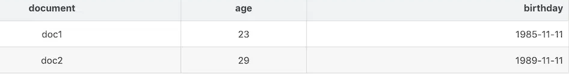
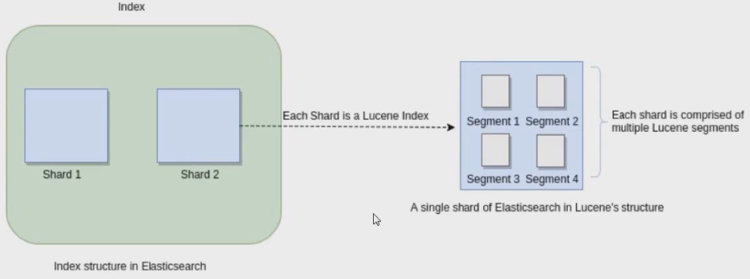
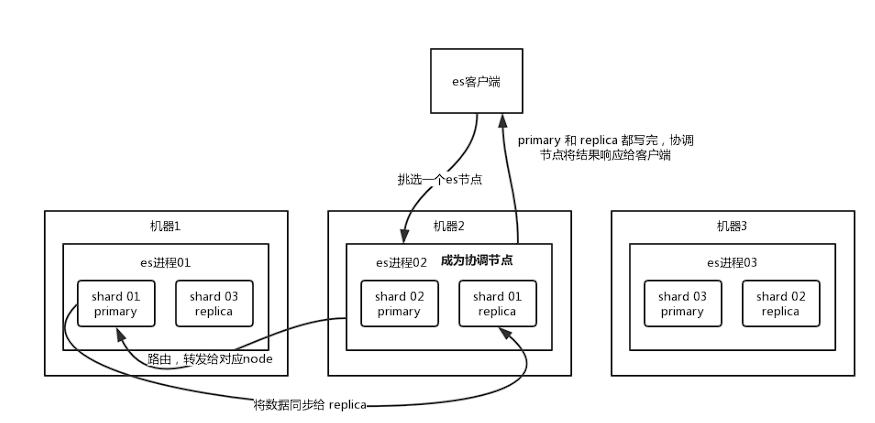
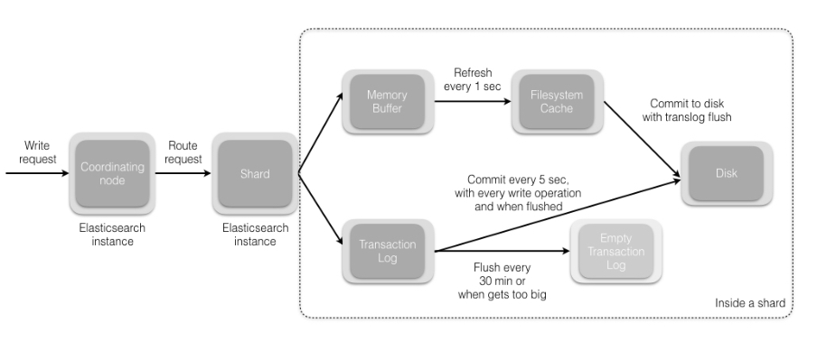

# 功能

- 分布式的搜索引擎

如：百度等

- 全文检索，结构化检索
  - 文章的关键字检索
  - 电商的分类查询

# 倒排索引

 **词项（Term）** 映射到包含该词项的 **文档列表（Posting List）**,适合搜索场景,

比如说，一个文档，doc1内容是username->"天天向上"

那么，分词将其分为天天，向上，分别指向doc1

## doc_values

ES中，除了倒排索引，还会有正排索引

doc_values和fielddata就是用来给文档建立正排索引的。他俩一个很显著的区别是，前者的工作地盘主要在磁盘，而后者的工作地盘在内存。

对于非text字段类型，doc_values默认情况下是打开的

关闭doc_values

```json
PUT users
{
    "mappings" : {
      "properties" : {
        "name" : {
          "type" : "text"
        },
        "mobile" : {
          "type" : "keyword"
        },
        "age" : {
          "type" : "integer",
          "doc_values": false
        }
      }
    }
}
```

对age搜索排序，发现报错，意思就是`age`字段不支持排序了，需要打开doc_values才行

`原因：`

比如说，所以我们要查找包含`brown`的文档，先在词项列表中找到 brown，然后扫描所有列，可以快速找到包含 brown 的文档。

但是如果是要对搜索结果进行排序或者其它聚合操作，倒排索引这种方式就没真这么容易了，反而是类下面这种正排索引更方便。doc_values其实是Lucene在构建倒排索引时，会额外建立一个有序的正排索引（基于document => field value的映射列表）。



# 核心概念

- Document&field

文档，es中的最小数据单元，一个document可以是一条客户数据，一条商品分类数据，一条订单数据，通常用JSON数据结构表示

- type

每个索引都有多个或者一个type，一个type下的document，有着相同的字段

**在7.X后，官方废弃type,默认type为_doc**

故：
ES 的Type 被废弃后，库表合一，Index 既可以被认为对应 MySQL 的 Database，也可以认为对应 table。

- index:索引

包含一堆有相似结构文档的数据，如：订单索引

| es       | 数据库 |
| -------- | ------ |
| document | 行     |
| type     | 表     |
| index    | 数据库 |

## share

1. 每个share都是一个Lucence的index，由多个segment组成



2. 如果一个index有3t的数据，它把他分为三份，每一个share存1t，这样，查询就增加了速度
   1. share是最小的工作单元
   2. 每个share其实就是一个Lucene实例
   3. share分为primary share和replica share，每个document只能存在于某个primary share以及对应的replica share中

- replica share

其实就是share的一个副本

优点：查询的时候，也可以查到replica上面

​			share挂了，可以让replica顶上

**share不能和replica同一个服务器，所以es一般两个服务器以上**

- master

master 选举，将一个node变为master

新master间隔primary share的replica 变为primary


## Segment 的本质

1. **数据结构**：每个 segment 是一个独立的倒排索引
2. **不可变性**：一旦创建就不能被修改（只能被合并或删除）
3. **层次结构**：一个索引由多个 segment 组成

# 特性

- 对复杂的分布式机制的透明隐藏特性
  - 我们不需要考虑数据怎么进行分片，数据分配到了哪个shard占用，
  - 集群可以自己发现node
  - shard复杂均衡

- 垂直扩容和水平扩容，扩容对应用程序透明
  - 垂直扩容：购置强大的服务器，将新的服务器代替老服务器
  - 水平扩容：购置服务器，加入老的集群之中
- 增加或者减少节点，会自动将数据平衡
- master节点
  - 创建、删除索引；增加删除节点
  - 默认自动选择一台节点作为master
- 节点平等的分布式架构
  - 每个节点都可以接受所有请求
  - 可能请求a share，但a可以发给b，让b给数据给a，最后返回

# Es分片数据刷新策略

Es分片默认刷新频率为1s

刷新频率越高越耗资源（刷新即写入硬盘，并会产生记录）

Mapping结构默认会是1s刷新

```json
{
  "settings": {},
  "defaults": {
    "index": {
      "refresh_interval": "1s"
    }
  }
}
```

 

为保证数据实时性，es提供手动刷新方法，以Java为例

```Java
org.elasticsearch.action.support.WriteRequest.RefreshPolicy
```

- `RefreshPolicy#IMMEDIATE:`
  请求向ElasticSearch提交了数据，立即进行数据刷新，然后再结束请求。
  优点：实时性高、操作延时短。
  缺点：资源消耗高。
- `RefreshPolicy#WAIT_UNTIL:`
  请求向ElasticSearch提交了数据，等待数据完成刷新，然后再结束请求。
  优点：资源消耗低。
  缺点：操作延时长，一般刷新时间都是1s。
- `RefreshPolicy#NONE:`
  默认策略。
  请求向ElasticSearch提交了数据，不关系数据是否已经完成刷新，直接结束请求。
  优点：操作延时短、资源消耗低。
  缺点：实时性低。

如：

```Java
UpdateRequest request = new UpdateRequest(tableName, id);
Map<String, Object> value = columnValue.getValue();
request.doc(value);
// ES数据立即刷新
request.setRefreshPolicy(WriteRequest.RefreshPolicy.IMMEDIATE);
UpdateResponse response = highLevelClient.update(request, RequestOptions.DEFAULT);
```

或者Es语法调用：

```bash
PUT /test/_doc/2?refresh=true
{"test": "test"}
```

# ES为什么快

1. 基于 **分布式架构**，查询可以并行执行（跨多个分片/节点），充分利用多核 CPU 和集群资
   1. 如，有多个replica share，一个查询可以同时扫描多个分片，并在内存中合并结果
2.  **倒排索引 + 分词优化**
3. **文件系统缓存（Page Cache）**：倒排索引默认驻留在内存中，查询时直接读取，速度极快
4. **查询缓存（Query Cache）**：[filter](/database/es/3-curd?id=对比)查询结果可缓存，减少重复计算

# ES 写入流程

- 客户端选择一个 node 发送请求过去，这个 node 就是 `coordinating node`（协调节点）。
- `coordinating node` 对 document 进行路由，将请求转发给对应的 node（有 primary shard）。
- 实际的 node 上的 `primary shard` 处理请求，然后将数据同步到 `replica node`。
- `coordinating node` 如果发现 `primary node` 和所有 `replica node` 都搞定之后，就返回响应结果给客户端



# ES主分片写数据流程



1. refresh 过程 
   1. 主分片先将数据写入ES的 memory buffer，然后定时（默认1s）将 memory buffer 中的数据写入一个新的 segment 文件中，并进入操作系统缓存 Filesystem cache（同时清空 memory buffer）
   2. 数据存在 memory buffer 时是搜索不到的，只有数据被 refresh 到 Filesystem cache 之后才能被搜索到
   3. 由于 memory Buffer 和 Filesystem Cache 都是基于内存，假设服务器宕机，那么数据就会丢失，所以 ES 通过 translog 日志文件来保证数据的可靠性，在数据写入 memory buffer 的同时，将数据也写入 translog 日志文件中，当机器宕机重启时，es 会自动读取 translog 日志文件中的数据，恢复到 memory buffer 和 Filesystem cache 中去。

2. flush过程
   1. translog足够大或每隔30分钟发起commit操作将Filesystem cache中的segment file flush到磁盘中去，并且清空日志文件

# translog

Translog是Elasticsearch为了防止写入缓存的segment没有被持久化而断点导致数据丢失而设计的

不过，数据被写到`Translog`也没有保存到磁盘

如果服务器在write之后、磁盘同步之前宕机，则数据会丢失。这时需要调用操作系统提供的`fsync`功能来确保文件所有已修改的内容被正确同步到磁盘上

默认情况下：默认translog是每5秒被fsync刷新到硬盘，或者在每次写请求完成之后执行(index,delete,update,bulk)

优势：确保每次写操作持久化。代价：增加IO负载。

```json
{
  "index.translog.durability": "request",
  "index.translog.flush_threshold_size": "256mb"
}
```

如果对写入的数据安全性要求不高，我们可以如下 

优点：降低IO压力，提升写入吞吐量。风险：可能丢失最近10秒的数据。

```json
PUT /my_index/_settings
{
  "index.translog.durability": "async",
  "index.translog.sync_interval": "10s",
  "index.translog.flush_threshold_size": "1gb"
}
```

# 不同业务场景的写入优化

1. 如：日志系统，我们不需要很快就能搜索到，这时候，我们的refresh时间可以设置的大一点
2. 生产环境，我们构建一个新的索引，可以先把刷新关闭，然后等正式使用的时候，我们再将其调整回来

```json
PUT /my_logs/_settings
{ "refresh_interval":-1}
PUT /my_logs/_settings
{ "refresh_interval":"1s"}
```

# Segment段合并

## 问题

1. 由于自动刷新流程每秒会创建一个新的段 ，这样会导致短时间内的段数量暴增
2. 段数目太多会带来较大的麻烦。 每一个段都会消耗文件句柄、内存和cpu运行周期。更重要的是，每个搜索请求都必须轮流检查每个段；所以段越多，搜索也就越慢

## 解决方案

1. ElasticSearch有一个后台进程专门负责Segment的合并，定期执行Merge操作，将多个小Segment文件合并成一个Segment
2. 段合并的时候会将那些旧的已删除文档从文件系统中清除
3. 合并的Segment可以是磁盘上已经commit过的Segment，也可以是在内存中还未commit的Segment

## 合并对性能的影响

1. Elasticsearch 在默认情况下会对合并线程进行资源限制，确保它不会对搜索性能造成太大影响
2. 默认情况下，归并线程的限速配置indices.store.throttle.max_bytes_per_sec 是 20MB，对于写入量大，磁盘转速高，甚至使用SSD盘的服务器来说，这个限速明显是低了。对于ELK Stack应用，建议适当调大到100MB或者更高

```json
PUT /_cluster/settings
{
    "persistent" : {
        "indices.store.throttle.max_bytes_per_sec" : "100mb"
    }
}
```

3. 用于控制归并线程的数目，推荐设置为CPU核心数的一半。如果觉得自己的磁盘性能跟不上，可以降低配置，避免IO请求瓶颈。参数如下：
   index.merge.scheduler.max_thread_count

## 手动强制合并

ES 的 API 也提供了命令来支持强制合并 Segment，即 optimize 命令，它可以强制一个分片 shard 合并成 max_num_segments 参数指定的段数量，一个索引它的Segment数量越少，它的搜索性能就越高

但需要注意的是，optimize 命令是没有限制资源的，也就是你系统有多少IO资源就会使用多少IO资源，这样可能导致一段时间内搜索没有任何响应

所以，optimize命令不要用在一个频繁更新的索引上面

比如日志场景：一般可能是1天一个索引，那么几个月前的，可能日志就不会再更新了，更多的是用来查询，那么这个时候，可以执行强制合并

```json
POST /logstash-2014-10/_optimize?max_num_segments=1
```

## 合并策略

归并线程是按照一定的运行策略来挑选 segment 进行归并的。主要有以下几条：

- index.merge.policy.floor_segment 默认 2MB，小于这个大小的 segment，优先被归并。
- index.merge.policy.max_merge_at_once 默认一次最多归并 10 个 segment
- index.merge.policy.max_merge_at_once_explicit 默认 optimize 时一次最多归并 30 个segment。
- index.merge.policy.max_merged_segment 默认 5 GB，大于这个大小的 segment，不用参与归并。optimize 除外。

# ES 查询流程

1. 请求到达协调节点：每个节点可能扮演协调节点、数据节点（Data Node）或主节点（Master Node）的角色。客户端的查询请求首先到达协调节点，协调节点负责解析请求、协调查询并汇总结果。
   1. **解析DSL**：协调节点接收到请求后，使用内部的JSON解析器（如Jackson）将DSL解析为查询对象
   2. **查询验证**：检查DSL语法是否正确，索引是否存在，字段是否合法。
   3. **路由计算**：根据查询的索引名和分片路由规则，确定哪些分片（Primary Shard和Replica Shard）需要参与查询
2. 查询分发到数据节点
3. 数据节点的查询执行
   1. 每个数据节点负责处理其本地分片的查询
4. 结果汇总与返回：数据节点完成查询后，将结果（包含Doc ID、评分和文档内容）返回给协调节点。协调节点执行以下操作
   1. **结果合并**：合并所有分片的查询结果，执行全局排序（如果需要）。
   2. **分页处理**：根据`from`和`size`参数，截取最终结果集。
   3. **响应生成**：将结果序列化为JSON，返回给客户端。

## id查询的场景

1. **路由精确**：
   - 直接根据文档ID的哈希值确定目标分片
   - 无需查询所有分片，只需查询特定分片
2. **执行简单**：
   - 直接从倒排索引中获取文档
   - 不需要评分和排序
   - 性能极高（O(1)时间复杂度）