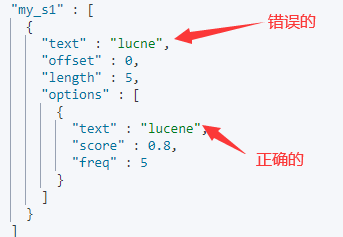
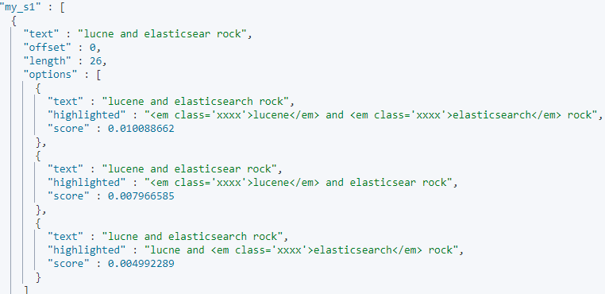
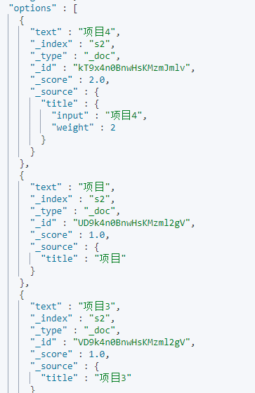

**在7.X后，官方废弃type,默认type为_doc**

故：
ES 的Type 被废弃后，库表合一，Index 既可以被认为对应 MySQL 的 Database，也可以认为对应 table。

# 简单的集群管理

- 快速检查进群的健康状态

```
GET /_cat/health?v
```

- 查看集群index

```
GET /_cat/indices?v
```

# 新增操作

```
PUT /index/type/documentid
{
	json 数据
}
```

新增一条数据
```shell
PUT /order/product/1
{
  "name":"iphone",
  "price":"3000",
  "desc": "Simple to use and cheap to use"
}
```

不指定documentid 新增(采用GUID算法生成)

```shell
POST /order/product/
{
  "name":"phone",
  "price":"2000",
  "ooprice":2000,
  "desc": "Simple to use and cheap to use"
}
```

- PUT 和POST用法

```
PUT是幂等方法，POST不是。
– PUT，DELETE操作是幂等的。所谓幂等是指不管进行多少次操作，结果都一样。比如我用PUT修改一篇文章，然后在做同样的操作，每次操作后的结果并没有不同，DELETE也是一样。
– POST操作不是幂等的，比如常见的POST重复加载问题：当我们多次发出同样的POST请求后，其结果是创建出了若干的资源。
– 还有一点需要注意的就是，创建操作可以使用POST，也可以使用PUT，区别在于POST是作用在一个集合资源之上的（/articles），而PUT操作是作用在一个具体资源之上的（/articles/123），比如说很多资源使用数据库自增主键作为标识信息，而创建的资源的标识信息到底是什么只能由服务端提供，这个时候就必须使用POST。
```

# 修改操作

- 替换的方式

这有一点不好，就是需要将所有字段都带上

```
PUT /order/product/1
{
  "name":"iphone",
  "price":"4000",
  "desc": "Simple to use and cheap to use"
}
```

返回

```json
"_index" : "order",
"_type" : "product",
"_id" : "5", //可以不手动设置，es会自动设置
```

- 修改的方式（post）

```
POST /order/product/1/_update
{
  "doc":{
    "name":"huawei iphone"
  }
}
```

# 查询

```
GET /order/product/1
```

# 删除

不是物理删除，只是标记，如果数据越来越多，则会后台自动物理删除

```shell
DELETE /order/product/1
```

- 带查询方式的删除

```json
POST /sys_org_company/_delete_by_query
{
   "query": {
        "match_all": {
        }
    }
}
```


# 结构化查询


## 结构化查询（Query DSL）  

结构化查询是指使用 Elasticsearch 的查询 DSL (Domain Specific Language) 来执行复杂的搜索操作，通常涉及评分计算（_score），最后返回文档结果  

查询全部，会将所有的数据查询出来

```json
GET /test_index/test_type/_search?scroll=1m
{
  "query": {
    "match_all": {}
  }
}
```

- `match` 查询（全文搜索）
- `multi_match` 查询
- `query_string` 查询
- `wildcard` 查询
- `fuzzy` 查询

## 结构化过滤（Filter DSL） 

结构化过滤是指使用过滤器（filter）来执行精确匹配，不计算相关性分数，只返回匹配或不匹配的文档 

```json
GET /order/product/_search
{
    "query":{
        "bool": {
            "must": [
                {"match":{"name": "iphone"}}
            ],
            "filter": [
                {"range":{"price":{"gt":"3000"}}}  
            ]
        }
    }
```

```json
GET /products/_search
{
  "query": {
    "bool": {
      "filter": [
        { "term": { "status": "active" } },
        { "range": { "price": { "lte": 1000 } } }
      ]
    }
  }
}
```


- `term` 查询（精确匹配）
- `terms` 查询（多值精确匹配）
- `range` 查询（范围查询）
- `exists` 查询（字段是否存在）
- `bool` 过滤器（与查询的 bool 类似但不计算分数）

### term 过滤  

term 主要用于精确匹配哪些值，比如数字，日期，布尔值或 not_analyzed 的字符串（未经分析的文本数据类型），相当于sql <b id="blue">age=26  </b>

```json
{ "term": { "age": 26 }}
{ "term": { "date": "2014-09-01" }}
```

### terms 过滤  

terms 允许指定多个匹配条件。如果某个字段指定了多个值，那么文档需要一起去做匹配。相当于sql： <b id="blue">age in</b> 

```json
{"terms": {"age": [26, 27, 28]}}
```

### range 过滤  

range 过滤允许我们按照指定范围查找一批数据 

GET /order/_search

```json
{
    "range": {
        "price": {
            "gte": 2000,
            "lte": 3000
            }
        }
    }
}
```

### exists 和 missing 过滤  

exists 和 missing 过滤可以用于查找文档中是否包含指定字段或没有某个字段  

```json
{
	"exists": {
    	"field": "title"
    }
}
```

### bool 过滤  

用来合并多个过滤条件查询结果的布尔逻辑：

1. must：多个查询条件的完全匹配，相当于 and。

2. must_not： 多个查询条件的相反匹配，相当于 not；

3. should：至少有一个查询条件匹配，相当于 or；

   相当于sql and 和or  

```json
{
    "bool": {
        "must": { "term": { "folder": "inbox" }},
        "must_not": { "term": { "tag": "spam" }},
        "should": [
                { "term": { "starred": true }},
                { "term": { "unread": true }}
            ]
    }
}
```

### 复杂查询

如果我们需要查询  (A|B)&C，  则如下查询

> json版本

```json
{
    "query": {
        "bool": {
            "must": [
                {
                    "bool": {
                        "should": [
                            {
                                "match": {
                                    "A": "测试"
                                }
                            },
                            {
                                "match": {
                                    "B": "测试2"
                                }
                            }
                        ]
                    }
                },
                {
                    "bool": {
                        "must": [
                            {
                                "term": {
                                    "C": "1"
                                }
                            }
                        ]
                    }
                }
            ]
        }
    }
}
```

> 代码版本

```java
BoolQueryBuilder boolQueryBuilder = QueryBuilders.boolQuery()
        .must(QueryBuilders.boolQuery()
                .should(QueryBuilders.matchQuery("A", key))
                .should(QueryBuilders.matchQuery("B", key)))
        .must(QueryBuilders.boolQuery()
                .must(QueryBuilders.termQuery("C", "1")));
```

### 分词完全匹配

如果<b id="blue">operator</b>的选项是and，则表示XXX的分词必须完全匹配，如果是or，则只需要匹配一个即可

```java
{
    "query": {
        "bool": {
            "must": [
                {
                    "match": {
                        "itemName": {
                            "query": "xxx",
                            "operator": "and"
                        }
                    }
                }
            ]
        }
    }
}
```

## 对比

|       特性       |             结构化查询（Query）              |           结构化过滤（Filter）           |
| :--------------: | :------------------------------------------: | :--------------------------------------: |
| **是否默认缓存** |                   ❌ 不缓存                   |                ✅ 自动缓存                |
|   **适用场景**   | 全文搜索、模糊匹配（如 `match`、`wildcard`） | 精确匹配、范围查询（如 `term`、`range`） |
|   **性能优化**   |             尽量用 `filter` 替代             |            直接使用 `filter`             |
|   **缓存控制**   |                 无法直接缓存                 |        可通过 `query_cache` 优化         |

**最佳实践**：

✅ ​**优先使用 `filter` 进行精确匹配**​（如状态、ID、分类）。

✅ ​**将可缓存的逻辑放在 `filter` 中**，不可缓存的逻辑放在 `query` 中。

✅ ​**避免在 `query` 中使用高开销操作**​（如 `wildcard`、`fuzzy`）。

✅ ​**监控缓存命中率**，优化频繁查询的缓存策略。

1. **当需要精确匹配时**（如状态、ID、分类等），优先使用过滤
2. **当需要全文搜索或模糊匹配时**，使用查询
3. **组合使用时**：将过滤条件放在 `filter` 子句，查询条件放在 `must` 子句

```json
{
  "query": {
    "bool": {
      "must": [ { "match": { "description": "fast" } } ],
      "filter": [ { "term": { "status": "active" } } ]
    }
  }
}
```

这样能最大化 Elasticsearch 的查询性能

## Filter的原理

Filter主要是通过*bitset机制与caching机制*来实现的

### bitset机制

比如我们有一个倒排索引：

1. 过滤date为2020-02-02（filter：2020-02-02）
   1. 从倒排索引中，找到doc2,doc3符合，doc1不符合
   2. Filter为每个在倒排索引中搜索到的结果，构建一个bitset，[0, 1, 1]（**非常重要**）；bitset是一个二进制数组，匹配为1，不匹配为0

2. 多个过滤条件时,遍历每个过滤条件对应的bitset，优先从最稀疏的开始搜索，查找满足所有条件的document
   1. 稀疏、密集的判断是通过匹配的多少（即bitset中元素为1的个数）[0, 0, 0, 1, 0, 0] 比较稀疏、[0,
      1, 0, 1, 0, 1] 比较密集
   2. 多个filter组合查询时，每个filter条件都会对应一个bitset
   3. 比如：filter，postDate=2017-01-01，userID=1
      1. 匹配的bitset分别是[0,1,1]  [0,1,0]; 那么匹配的则是doc2

### caching bitset

1. caching bitset，跟踪query，在最近256个query中超过一定次数的过滤条件，缓存其bitset。对
   于小segment（<1000，或<3%），不缓存bitset
2. 如果document有新增或修改，那么cached bitset会被自动更新
3. filter大部分情况下，在query之前执行，先尽量过滤尽可能多的数据
   1. query：要计算doc对搜索条件的relevance score，还会根据这个score排序
   2. filter：只是简单过滤出想要的数据，不计算relevance score，也不排序

# 搜索精准度

## boost

搜索条件权重。可以将某个搜索条件的权重加大，此时匹配这个搜索条件的document，在计算relevance score时，权重更大的搜索条件的document对应的relevance score会更高，当然也就会优先被返回回来。默认情况下，搜索条件的权重都是1

比如：搜索帖子，如果标题包含Hadoop或java或spark或Elasticsearch，就优先输出包含java的，再输出spark的，再输出Hadoop的，最后输出Elasticsearch的。

```json
GET /article/_search
{
    "query": {
        "bool": {
            "should": [
                {
                    "term": {
                        "title": {
                            "value": "java",
                            "boost": 5
                        }
                    }
                },
                {
                    "term": {
                        "title": {
                            "value": "spark",
                            "boost": 4
                        }
                    }
                },
                {
                    "term": {
                        "title": {
                            "value": "hadoop",
                            "boost": 3
                        }
                    }
                },
                {
                    "term": {
                        "title": {
                            "value": "elasticsearch"
                        }
                    }
                }
            ]
        }
    }
}
```

## dis_max

### 问题

某个帖子，doc1，title中包含java，content不包含java beginner任何一个关键词；
某个帖子，doc2，title中包含java，content中包含beginner；

我们进行搜索：

```json
GET /forum/article/_search
{
    "query": {
        "dis_max": {
            "queries": [
                { "match": { "title": "java beginner" }},
                { "match": { "body":  "java beginner" }}
            ]
        }
    }
}
```

结果是 doc1排在doc2的前面，因为doc1的评分可能是：1+1=2，两个字段都有评分， 而doc2则是 0+1.5=1.5

dis_max的出现就是为了*只取某一个query最大的分数*，完全不考虑其他query的分数

如下：

```json
GET /forum/article/_search
{
    "query": {
        "dis_max": {
            "queries": [
                { "match": { "title": "java beginner" }},
                { "match": { "body":  "java beginner" }}
            ]
        }
    }
}
```

此时，doc1排在doc2的后面

## 自定义相关度

相关文档：[函数分数查询 |Elasticsearch 指南 [7.3\] |弹性的](https://www.elastic.co/guide/en/elasticsearch/reference/7.3/query-dsl-function-score-query.html#query-dsl-function-score-query)

### 解决的问题

在使用ES进行全文搜索时，搜索结果默认会以文档的相关度进行排序，而这个 "文档的相关度"，是可以通过 function_score 自己定义的，也就是说我们可以通过使用function_score，来控制 "怎样的文档相关度得分更高" 这件事

示例：

```json
GET /book/_search
{
    "query": {
        "function_score": {
            "query": {
                "match_all": {}
            },
            "boost": "5",
            "random_score": {}
            "min_score":2
        }
    }
}
```


# 自动补全

suggest就是一种特殊类型的搜索

分为四种

1. Term suggester ：词条建议器。对给输入的文本进进行分词，为每个分词提供词项建议
2. Phrase suggester ：短语建议器，在term的基础上，会考量多个term之间的关系
3. Completion Suggester，它主要针对的应用场景就是"Auto Completion"。
   1. 完成补全单词，输出如前半部分，补全整个单词
4. Context Suggester：上下文建议器  

## Term suggester 

可以用来拼写纠错(对一个词语进行纠错)；我们在搜索引擎中搜索为华 然后显示：**我们为您显示“华为”相关的商品**。仍然搜索：“为华”


1. 建立mapping

```json
PUT s1
{
  "mappings": {
    "properties": {
        "title":{
          "type":"text",
          "analyzer":"standard"
        }
      }
  }
}
```

2. 添加词条

```json
PUT s1/_doc/1
{
  "title": "Lucene is cool"
}
```

3. 进行错误的词条搜索

```json
GET s1/_doc/_search
{
  "suggest": {
    "my_s1": {
      "text": "lucne",
      "term": {
        "field": "title"
      }
    }
  }
}
```

4. 返回正确的词条



## Phrase suggester

与Term 不同的是，Phrase是对一连串的短语进行纠错

如:在词库，我们有两个 “Lucene is cool”， “Elasticsearch builds on top of lucene”词语，

如果我们搜索:lucne的单词错误，elasticsear的单词错误

```json
GET s1/_doc/_search
{
  "suggest": {
    "my_s1": {
      "text": "lucne and elasticsear rock",
      "phrase": {
        "field": "title",
        "highlight":{
          "pre_tag":"<em class='xxxx'>",
          "post_tag":"</em>"
        }
      }
    }
  }
}
```

那么返回的是：，此时我们对options可以取评分最高的短语进行操作



## Completion Suggester

`可以用来做自动补全操作`, 如：京东的搜索，我们搜索，小米，下拉框出来小米10，小米11等下拉选项

使用此类型，首先我们要使用特殊的mapping映射, type是completion类型

```
我们前期选择 Completion Suggester 因为这个性能最好，他将数据保存在内存中的有限状态转移机中（FST）
后期如果需要优化，可以结合 Term Suggester ，Phrase Suggester， Context Suggester进行优化
```

1. 建立一个mapping，其中title使用的类型是自动补全类型

```json
PUT s2
{
  "mappings": {
    "properties": {
      "title":{
          "type":"completion",
          "analyzer":"ik_smart"
      }
    }
  }
}
```

2. 批量的添加一些数据,这些数据，就是我们后面的自动补全 的数据

```json
POST _bulk/?refresh=true
{ "index": { "_index": "s2", "_type": "_doc" }}
{ "title": "项目"}
{ "index": { "_index": "s2", "_type": "_doc" }}
{ "title": "项目进度"}
{ "index": { "_index": "s2", "_type": "_doc" }}
{ "title": "项目管理"}
{ "index": { "_index": "s2", "_type": "_doc" }}
{ "title": "项目进度及调整 汇总.doc_文档"}
{ "index": { "_index": "s2", "_type": "_doc" }}
{ "title": "项目3"}

## 我们也可以给参数加入权重，这样查询靠前
POST s2/_doc
{
  "title":{
    "input": "项目4",
    "weight": 2
  }
}
```

3. 进行自动补全查询
   1. skip_duplicates 跳过返回的重复数据

```json 
GET s2/_doc/_search
{
  "suggest": {
    "my_s1": {
      "prefix": "项",
      "completion": {
        "field": "title",
         "skip_duplicates": true
      }
    }
  }
}
```

4. 获取的结果如图



# 聚合查询

**如果是text字段，则需要"fielddata": true才能聚合**

 Aggregation共分为如下几种：

- Metric Aggregations
  - —些数学运算，可以对文档字段进行统计分析
- Bucket Aggregations
  - 一些列满足特定条件的文档的集合
- Pipeline Aggregations
  - 对其他的聚合结果进行二次聚合
- Matrix Aggregations
  - 支持对多个字段的操作并提供—个结果矩阵

## bucket api 

```shell
POST /sys_org_company/_search
{
  "size": 0, --不查询出数据
  "aggs": {
    "new_count": { --定义的分组后返回的值的key
      "terms": {
        "field": "faRen", --按照字段分桶查询
        "size": 10 -- 最多返回10条数据
      }
    }
  }
}
```

## Metric api

一些平均值/最大值等一些计算

<b id="gray">avg</b>:  平均值

<b id="gray">max</b>: 最大值

<b id="gray">min</b>:  最小值

```json
"aggs": {
    "avg_age": { --自定义返回的key
        "avg": { --关键字
            "field": "age"
        }
    }
}
```

<b id="gray">stats</b>：求和求最小等一起求出来

<b id="blue">aggregations</b>等效<b id="blue">aggs</b>

```json
-- 对userId进行统计查询
{
  "size": 100,
  "timeout": "1s",
  "aggregations": {
    "stats_name": {
      "stats": {
        "field": "userId"
      }
    }
  }
}
```

查询后的值：

```shell
"stats_name" : {
    "count" : 4,
    "min" : 10.0,
    "max" : 40.0,
    "avg" : 20.0,
    "sum" : 80.0
}
```


<b id="gray">extended_stats</b>： 其他属性，方差等

<b id="gray">cardinality</b>： 获取唯一值，相当于去重

```json
"aggs": {
    "stats_name": {
      "cardinality": {
        "field": "age"
      }
    }
  }
```

<b id="gray">value_count</b>:查看当前范围有多有不同的值

```json
"aggs": {
    "stats_name": {
      "value_count": {
        "field": "name"
      }
    }
  }
```

## 子聚合

类似sql:select a, max(b) c from A group by a order by c desc

对a聚合，求聚合里的b的最大值，进行排序

```json
{  
  "size": 0,
  "aggs": {  
    "group_by_a": {  
      "terms": {  
        "field": "a.keyword",
        "size": 10000,  //设置为一个大值以捕获所有可能的a值  
        "order": {  
          "max_b": "desc"  // 根据max_b聚合的结果降序排序  
        }  
      },  
      "aggs": {  
        "max_b": {  
          "max": {  
            "field": "b"  
          }  
        }  
      }  
    }  
  }  
}
```


# 嵌套数据

因此除了基本数据类型之外，ES也支持使用复杂的数据类型，像是数组、内部对象，而要使用内部对象的话，需要使用`nested`来定义索引或者join，使文档内可以包含一个内部对象
- 为什麽不用object来定义索引的原因是，obejct类型会使得内部对象的关联性丢失
  - 这是因为Lucene底层其实没有内部对象的概念，所以ES会利用简单的列表储存字段名和值，将object类型的对象层次摊平，再传给Lucene
  - 假设user类型是object，当插入一笔新的数据时，ES会将他转换为下面的内部文档，其中可以看见alice和white的关联性丢失

```json
PUT /mytest/java/1
{
    "group": "fans",
    "user": [
        { "first": "John", "last": "Smith" },
        { "first": "Alice", "last": "White" }
    ]
}
```

- 转换后(内部隐式转换)
  - 所以，在检索John，Smith一起满足时，不会将{ "first": "John", "last": "Smith" }看成一条数据
- 转换后的数据将是：
```json
{
    "group": "fans",
    "user.first": [ "alice", "john" ],
    "user.last": [ "smith", "white" ]
}
```


## nested

### 定义

> 定义nested索引，定义之后，我们就可以用嵌套查询去查询一条完整的数据

将user类型定义成nested类型，然后再定义其下的字段信息

```json
PUT /mytest
{
  "mappings": {
    "properties": {
      "user" : {
        "type": "nested",
         "properties": {
             "first": {
              "type": "text"
            	},
             "last": {
              "type": "text"
            },
         }
      }
    }
  }
}
```

### 查询

- 由于嵌套对象被索引在独立的隐藏文档中，因此我们无法直接使用一般的query去查询他，我们必须改使用 "nested查询" 去查询他们
- nested查询的内部必须要包含一个`path`参数，负责指定要用的是哪个nested类型的字段，且要包含一个`query`，负责进行此嵌套对象内的查询


```shell
GET /mytest/_doc/_search
{
    "query": {
        "nested": {
            "path": "user",
            "query": {
                "bool": {
                    "must": [
                        { "match": { "user.first": "Amy" } },
                        { "match": { "user.last": "White" } }
                    ]
                }
            }
        }
    }
}
```

### 统计


```shell
"aggs": {
   "NAME": {
     "nested": {
       "path": "user"
     },
     "aggs": {
       "temp": {
         "match": {
           "field": "user.first"
         }
       }
     }
   }
 }
```

## join

场景：当索引数据包含一对多的关系，并且其中一个实体的数量远远超过另一个的时候。比如：一个班有 一万个学生

### 定义结构

定义父子结构，定义<b id="gray">class</b>为父结构，<b id="gray">student</b>为子结构

<b id="gray">class_student_field</b>：自定义的父子关联结构的字段名

<b id="blue">relations</b>： 关联结构， <b id="gray">class</b>为父名称，<b id="gray">student</b>为子名称

put /test_join

```json
{
	"mappings": {
		"properties": {
			"class_student_field": {
				"type": "join",
				"relations": {
					"class": "student"
				}
			},
			"class_id": {
				"type": "long"
			},
			"class_name": {
				"type": "keyword"
			},
			"student_id": {
				"type": "long"
			},
			"student_name": {
				"type": "keyword"
			}
		}
	}
}
```

### 插入父结构数据

插入一条班级记录（父数据），并且，自定义了<b id="blue">_id=c_2</b>， class_student_field的name  = class 表示父结构数据

put /test_join/_doc/c_2

```json
{
    "class_id":2,
    "class_name":"中小2班",
    "class_student_field": {
        "name":"class"
    }
}
```

### 插入一条子结构数据

插入学生数据，routing必须指向父文档的_id

<b id="blue">class_student_field</b>：name=student表示子结构，并且parent=父文档的_id

put /test_join/_doc/s_1?routing=c_2

```json
{
    "student_id":2,
    "student_name":"肖1",
    "class_student_field":{
        "name":"student",
        "parent": "c_2"
    }
}
```

### 父查子

```json
{
  "query": {
    "has_parent": {
      "parent_type": "class",
      "query": {
        "match_all": {}
      }
    }
  }
}
```

### 子查父

```json
{
  "query": {
    "has_child": {
      "type": "student",
      "query": {
        "match_all": {}
      }
    }
  }
}
```

# 并发处理方案
ES中用的是乐观锁并发方案

每次修改，ES都会去修改_version

如果A线程操作数据，version=1，回写数据后version=2

B线程修改数据，version=1，回写数据发现version不相等，则会将这条数据扔掉，不会让后修改的数据覆盖

## ES乐观锁处理

1. 查询到某条数据，我们能够获取到_seq_no或者 _version
2. 此时，我们更新的时候，带上if_seq_no=_seq_no,此时，如果 _seq_no=1则更新成功，如果失败我们将再次查询数据的 _seq_no，进行更新，直到成功为止（CAS）

```json
PUT /test_index/_doc/4?if_seq_no=1&if_primary_term=1
{
"test_field": "client2 changed"
}
```

## external version

当version_type=external的时候，只有当你提供的version比es中的_version大的时候，才能完成修改

如：当ES中version<5时，就可以执行成功

```json
PUT /test_index/_doc/5?version=2&version_type=external
{
"test_field": "external client1 changed"
}
```

# ES一致性

ES是分布式部署的，那么，ES是怎么保证各个share的一致性呢

5.0版本之前，ES是通过<b id="blue">quorum机制</b>和<b id="blue">timeout机制</b>来保证一致性的

## quorum机制

在写入时，带上参数consistency

```json
PUT /index/indextype/id?consistency=quorum
```

consistency有三个类型

one：要求我们这个写操作，只要有一个primary shard是active活跃可用的，就可以执行

 all：要求我们这个写操作，必须所有的primary shard和replica shard都是活跃的，才可以执行这个写操作

 quorum：默认的值，要求所有的shard中，必须是大部分的shard都是活跃的，可用的，才可以执行这个写操作


什么是<b id="gray">法定数shard</b>？

```shel
int((primary shard + number_of_replicas) / 2) + 1

```

number_of_replicas:比如，3个primary shard，**每个primary shard有一个副本shard**，那么总shard=6,所以number_of_replicas=1

## timeout机制

默认1分钟， 当quorum时，active的shard低于法定shard时候,等待timeout时间，如果过了这个时间，还是低于法定shard，则报错，写入失败，比如：

## 5.0以后

wait_for_active_shards=具体的活跃shard数量

下面语句表示，如果活跃数少于4，则等待timeout，如果说，当前ES服务的shard只有2个（一主一副），则下面的语句必定失败

```json
PUT /test_index/_doc/1?wait_for_active_shards=4&timeout=10s
{
"name":"xiao mi"
}
```

