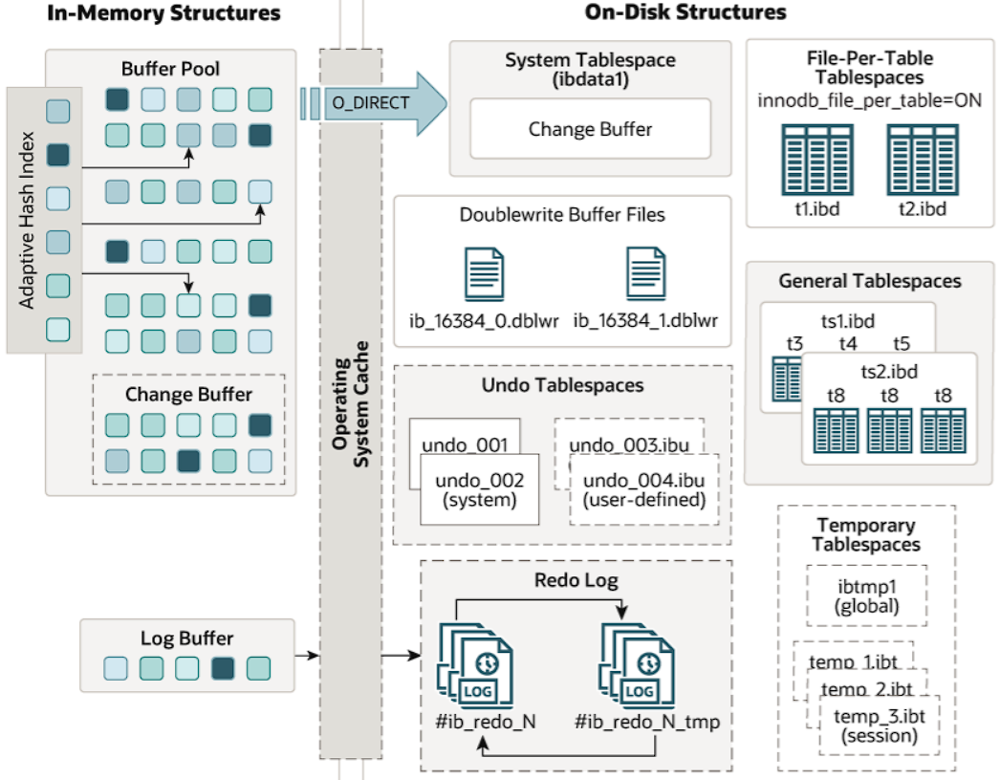

# 

从MySQL 5.5版本开始默认使用InnoDB作为引擎，它擅长处理事务，具有自动崩溃恢复的特性

# 存储结构

如下图：由内存模块和磁盘模块构成

- 左边表示内存模块
- 右边表示磁盘模块




## Buffer pool

缓冲池，简称BP。BP以Page页为单位，默认大小16K，BP的底层采用链表数据结构管理Page；在InnoDB访问表记录和索引时会在Page页中缓存，以后使用可以减少磁盘IO操作，提升效率；

图中的小方块表示的就是每一个page

Page根据状态可以分为三种类型：

- free page ： 空闲page，未被使用
- clean page：被使用page，数据没有被修改过
- dirty page：脏页，被使用page，数据被修改过，页中数据和磁盘的数据产生了不
  一致

lru list：表示正在使用的缓冲区，管理clean page和dirty page，缓冲区以midpoint为基点，前面链表称为new列表区，存放经常访问的数据，占63%；后面的链表称为old列表区，存放使用较少数据，占37%。

改性LRU：链表分为new和old两个部分，加入元素时并不是从表头插入，而是从中间midpoint位置插入，如果数据很快被访问，那么page就会向new列表头部移动，如果数据没有被访问，会逐步向old尾部移动，等待淘汰

### Buffer Pool配置参数

```shell
show variables like '%innodb_page_size%'; //查看page页大小
show variables like '%innodb_old%'; //查看lru list中old列表参数
show variables like '%innodb_buffer%'; //查看buffer pool参数
```

| **参数**                        | **默认值** | **说明**                                                     |
| :------------------------------ | :--------- | :----------------------------------------------------------- |
| `innodb_buffer_pool_size`       | 128MB      | **缓冲池总大小**。建议设为物理内存的 **50%-80%**（专用DB服务器） |
| `innodb_buffer_pool_instances`  | 8          | **缓冲池实例数**。减少锁竞争，建议：当 pool_size ≥ 8GB 时设为 4-8 |
| `innodb_buffer_pool_chunk_size` | 128MB      | **缓冲池分块大小**。动态调整 pool_size 时的最小单位（需是 1MB 的倍数） |

## Change Buffer

Change Buffer是针对操作<b id="red">二级索引（非聚簇索引）</b>和<b id="red">非唯一索引</b> 的一个优化，针对DML（增改）的一个优化

1. 如果是操作的是二级索引，对应的数据没有在Buffer Pool中，那么不会立刻写到Buffer Pool中，会写入Change Buffer中做一个缓冲；等到后面，被修改的数据被读取的时候，那么将会把Change Buffer里面的数据合并到Buffer Pool中，这样可以减少磁盘IO次数，提高性能；
2. 如果是一级索引，那么不会触发Change Buffer，直接在Buffer Pool中进行修改

ChangeBuffer占用BufferPool空间，默认占25%，最大允许占50%，可以根据读写业务量来进行调整。可以通过参数innodb_change_buffer_max_size;

## Log Buffer

LogBuffer主要是用于记录InnoDB引擎日志，在DML操作时会产生Redo和Undo日志。LogBuffer空间满了，会自动写入磁盘。可以通过将innodb_log_buffer_size参数调大，减少磁盘IO频率

innodb_flush_log_at_trx_commit参数控制日志刷新行为，默认为1

- 0 ： 每隔1秒写日志文件和刷盘操作（写日志文件LogBuffer-->OS cache，刷盘<b id="gray">OS cache</b>-->磁盘文件），最多丢失1秒数据
- 1：事务提交，立刻写日志文件（<b id="gray">OS cache</b>）和刷盘，数据不丢失，但是会频繁IO操作（默认的配置）
- 2：事务提交，立刻写日志文件，每隔1秒钟进行刷盘操作（有风险，服务器down机，OS cache 数据会丢失）


# InnoDB文件存储结构

一个ibd数据文件-->Segment（段）-->Extent（区）-->Page（页）-->Row（行）


<b id="gray">tablespace</b>

表空间，用于存储多个ibd数据文件

<b id="gray">Segment</b>

1. 段，用于管理多个Extent
2. 分为数据段，索引段，回滚段（事务处理）

<b id="gray">Extent</b>

1. 区，一个区固定包含64个连续的页，大小为1M（一个page16K）。
2. 当表空间不足，需要分配新的页资源，不会一页一页分，直接分配一个区

<b id="gray">Page</b>

1. 页，用于存储多个Row行记录，大小为16K

<b id="gray">Row</b>

1. 行，包含了记录的字段值、事务ID、（Trx id）、滚动指针（Roll pointer）、字段指针（Field pointers）等信息