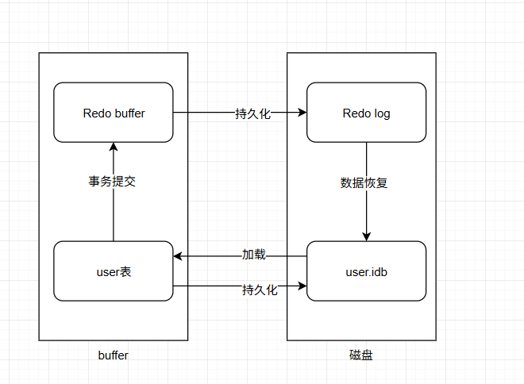

#

# 日志文件

- 错误日志

  默认开启，show variables like '%log_error%'， 可以查询错误日志的开启状态

- 二进制日志（binary log）

  记录了对MySQL数据库执行的更改操作，并且记录了语句的发生时间、执行时长；但是它不
  记录select、show等不修改数据库的SQL。主要用于数据库恢复和主从复制（就是我们常说的bin log）

  1. show variables like '%log_bin%'; //是否开启
  2. show variables like '%binlog%'; //参数查看
  3. show binary logs;//查看日志文件

- 慢查询日志（Slow query log）

  记录所有执行时间超时的查询SQL，默认是10秒。

  1. show variables like '%slow_query%'; //是否开启
  2. show variables like '%long_query_time%'; //时长

# 日志在ACID的表现

- 原子性（atomicity)： undo log实现
- 一致性（consistency)：
- 隔离性（isolation）：加锁和MVCC实现
- 持久性（durability）： redo log


# Undo log

是 Innodb 存储引擎层生成的日志，实现了事务中的**原子性**，主要**用于事务回滚和 MVCC**。

<b id="blue">Undo</b>：意为撤销或取消，以撤销操作为目的，返回指定某个状态的操作。

<b id="blue">Undo Log</b>：数据库事务开始之前，会将要修改的记录存放到 Undo 日志里，当事务回滚时或者数
据库崩溃时，可以利用 Undo 日志，撤销未提交事务对数据库产生的影响

<b id="blue">Undo Log存储</b>：undo log采用段的方式管理和记录。在innodb数据文件中包含一种rollback segment回滚段，内部包含1024个undo log segment。可以通过下面一组参数来控制Undo log存储：show variables like '%innodb_undo%';

## 作用

1. 实现事务的原子性
2. 实现多版本并发控制（MVCC）

# MVCC

多版本并发控制，保证读和写之间没有锁竞争

mvcc解决的就是读写时的*线程安全*问题，线程不用去争抢**读写锁**。


> 读已提交

读已提交/重复读，都是基于mvcc实现的

## MVCC概念

- 如下图：先插入张三数据，再修改为李四数据，再修改为王五数据，再修改为赵六数据
- 那么undo log 就会记录这几行数据，每行数据都有事务id，回滚指针（**Undo log存储我们的历史数据**）
- roll point （回滚指针）指向上个版本的undo log,undo log 里面的roll point 又指向他的前一个版本数据


## Read view

<b id="blue">Read View</b> 是在事务进行快照读操作时生成的一个读视图，用于记录和维护系统当前活跃事务的 ID

- 当我们用select读取数据时，这一时刻的数据会有很多个版本
- 我们知道在版本链中，去查询哪个版本的数据
- 他在代码中就是一个对象

<b id="blue">Read View</b>包括以下几个部分

m_ids: 表示在生成`ReadView`时当前系统中**活跃的读写事务**的`事务id`列表(事务未提交id)----这里是一个集合

min_trx_id： 表示在生成`ReadView`时**当前系统**中活跃的读写事务中最小的`事务id，也就是`m ids中的最小值

max_trx_id: 表示生成`ReadView`时系统中应该分配给下一个事务的`id`值

creator_trx_id:表示生成该`Readview`的事务的事务id

> ReadView如何判断版本链中的哪个版本可用?

*trx_id*表示当前`要读取`的那一条数据的事务id

trx_id == creator_trx_id: 可以访问这个版本（当前数据的创建者）

trx_id  < min_trx_id:  可以访问这个版本（表示trx_id这个数据已经提交）

trx_id  > max_trx_id: 不可以访问这个版本（表示trx_id数据未提交）

min_trx id <= trx_id <= max _trx_id:如果trx_id在m_ids中是不可以访问这个版本的，反之可以

- 读已提交：每一个select都会生成一个readview
- 可重复读：生成的readview是以事务为单位

> 解决可重复读的幻读问题

- 快照读的解决方式
  - 读取专门的快照 (对于RC，快照（ReadView）会在每个语句中创建。对于RR，快照是在事务启动时创建的)
  - 每个事务都只生成一个readview，外界再怎么修改数据，readview没有变化
- 间隙锁（mysql默认）
  - 锁的就是两个值之间的空隙。在一行行扫描的过程中，不仅将给行加上了行锁，还给行两边的空隙，也加上了间隙锁
  - 如A去update 某个范围数据，这个范围数据在A没提交时，B去修改这个范围数据是不能成功的

## 快照读和当前读

- 快照读：其实是基于MVCC+undo log实现的，读取的MVCC快照链路中的某个版本，很可能是历史版本，不用加锁。
- 当前读：读取的是记录的最新版本，并且返回的数据记录会加上锁，保证其他事务不能并发的修改数据记录。
  - 更新数据都是先读后写的，而这个读，只能读当前的值，称为“当前读”

### 当前读的sql


1. select ... lock in share mode

2. select ... for update

3. update table ...

4. insert into table

5. delete from table

# Redo log

- 是 Innodb 存储引擎层生成的日志，实现了事务中的**持久性**，主要**用于掉电等故障恢复**；
- 记录InnoDB存储引擎的事务日志
- <b id="blue">Redo</b>：顾名思义就是重做。以恢复操作为目的，在数据库发生意外时重现操作。
  <b id="blue">Redo Log</b>：指事务中修改的任何数据，将最新的数据备份存储的位置（Redo Log），被称为重做
  日志。
- mysql 先写日志再写磁盘（当mysql不忙的时候，将日志数据写入磁盘文件中）


## 工作原理

如图所示：

1. 当事务提交后，数据写入Redo buffer,同时，也写入缓存区准备加载磁盘
2. 当加载磁盘过程中，断电或者其他原因，可从Redo Log 恢复数据




为什么提交了idb，又提交Redo log？

1. 提交idb之前，也是有一些列缓存区的
2. redo是一个顺序提交的过程， 而idb不是，比如，我们修改user id=1  和 id=8,那么磁盘需要先寻找到 1，再寻找8再去做修改操作，而Redo 则不需要，只需要循环写入修改了 id=1和id=8
3. 所以，写入redo要快很多

## LogBuffer

LogBuffer主要是用于记录InnoDB引擎日志，在DML操作时会产生Redo和Undo日志


### Redo Log写入原理

- 以循环方式写入日志文件,不断的写与擦除,文件1写满时，切换到文件2，文件2写满时，再次切换到文件1。
- writepos当前记录的位置,循环边写边后移
- checkpoint当前要擦除的位置,循环边写边后移
- 当擦除的时候，先会操作阻塞，将日志写入磁盘表里面的结构里


### Flush log 原理(刷盘机制)

- os buffer： 内核态的内存
- innodb_flush_log_at_trx_commit：默认是1， （配置值： 0,1,2）

下图表示*innodb_flush_log_at_trx_commit*为不同的值时，刷盘策略


*日志刷盘规则*：

默认情况下事务每次提交的时候都会刷事务日志到磁盘中，这是因为变量 innodb_flush_log_at_trx_commit 的值为1。但是innodb不仅仅只会在有commit动作后才会刷日志到磁盘，这只是innodb存储引擎刷日志的规则之一。

1.发出commit动作时。已经说明过，commit发出后是否刷日志由变量 innodb_flush_log_at_trx_commit 控制。

2.每秒刷一次。这个刷日志的频率由变量 innodb_flush_log_at_timeout 值决定，默认是1秒。要注意，这个刷日志频率和commit动作无关。

3.当log buffer中已经使用的内存超过一半时。

4.当有checkpoint时，checkpoint在一定程度上代表了刷到磁盘时日志所处的LSN位置。

# Bin log(逻辑日志)

## 概念

- 二进制日志
- 在服务层实现的功能（引擎共用）
- Binlog为逻辑日志,记录的是一条语句的原始逻辑
- Binlog不限大小,追加写入,不会覆盖以前的日志

## 查看是否开启

binLog默认是关闭的，可以通过参数`log_bin`控制

```sql
### log_bin=on 标识开启了
mysql> show variables like '%log_bin%';
+---------------------------------+--------------------------------+
| Variable_name                   | Value                          |
+---------------------------------+--------------------------------+
| log_bin                         | ON                             |
| log_bin_basename                | /var/lib/mysql/mysql_bin       |
| log_bin_index                   | /var/lib/mysql/mysql_bin.index |
| log_bin_trust_function_creators | OFF                            |
| log_bin_use_v1_row_events       | OFF                            |
| sql_log_bin                     | ON                             |
+---------------------------------+--------------------------------+
```

## 配置开启

在my.conf配置

```conf
[mysqld]
server-id=123454
log_bin=mysql_bin
binlog_format=ROW
expire_logs_days=30
```

## 我们能利用binlog做什么

1. 主从数据库
2. *canal*就是利用binlog对其进行监听表数据的变动
2. 数据恢复：通过mysqlbinlog工具来恢复数据。


## 记录模式

<b id="blue">ROW</b>：日志中会记录每一行数据被修改的情况，然后在slave端对相同的数据进行修改

- 优点：能清楚记录每一个行数据的修改细节，能完全实现主从数据同步和数据的恢复。
- 缺点：批量操作，会产生大量的日志，尤其是alter table会让日志暴涨。

<b id="blue">STATMENT</b>：每一条被修改数据的SQL都会记录到master的Binlog中，slave在复制的时候SQL进程会解析成和原来master端执行过的相同的SQL再次执行。简称SQL语句复制。

- 优点：日志量小，减少磁盘IO，提升存储和恢复速度
- 缺点：在某些情况下会导致主从数据不一致，比如last_insert_id()、now()等函数。

<b id="blue">MIXED</b>：以上两种模式的混合使用，一般会使用STATEMENT模式保存binlog，对于STATEMENT模式无法复制的操作使用ROW模式保存
binlog，MySQL会根据执行的SQL语句选择写入模式。

## Redo Log和Binlog区别

1. Redo Log是属于InnoDB引擎功能，Binlog是属于MySQL Server自带功能，并且是以二进制文件记录。
2. Redo Log属于物理日志，记录该数据页更新状态内容，Binlog是逻辑日志，记录更新过程。
3. Redo Log日志是循环写，日志空间大小是固定，Binlog是追加写入，写完一个写下一个，不会覆盖使用。
4. Redo Log作为服务器异常宕机后事务数据自动恢复使用，Binlog可以作为主从复制和数据恢复使用。Binlog没有自动crash-safe能力。
