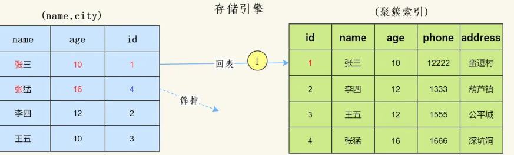

# 索引

## 分类

InnoDB

- 主键索引
  - 设定为主键后数据库会自动建立索引,innodb为聚簇索引
- 单值索引
  - 即一个素引只包含单个列,一个表可以有多个单列索引
- 唯一索引
  - 索引列的值必须唯一，但允许有空值（只能存在一个null）
- 复合索引
  - 即一个素引包含多个列
  - 常用于多个值查询

MYISAM

- 全文索引（FULL TEXT）
  - 全文索引类型为FULLTEXT，在定义索引的列上支持值的全文查找，允许在这些索引列中插入重复值和空值。全文索引可以在CHAR、VARCHAR,TEXT上创建

## 创建索引方式

- 查看一个表的索引

```mysql
show index from t_user;
```

- 建表后创建

```mysql
create index idx_st_sname on students(sname); ##创建普通索引
##或者alter方式
Alter table ... add INDEX 索引名称(字段, 字段);

create index idx_st_union on students(sname,sex); ##创建复合索引
create unique index idx_st_sid on students(sid); ##创建唯一索引
```

- 建表前创建

```mysql
create table t_user (id int primary key, name varchar(50), key(name));

create table t_user (id int primary key, name varchar(50), unique(name));
```

# 索引原理

- innodb采用的是B+树
- 如果查普通索引，先会去普通索引上查（普通索引的data存储的是主键id）, 查到主键id后，再去主键索引（聚合索引）上查询数据

### B-树

- 非叶子节点也存储数据


### B+树理解

- 是*二叉查找树的改良版本*


- 每页相当于上图的一个磁盘块
- InnoDB存储引擎中页的大小为16KB（操作系统的预读一页是4K，所以存储引擎的页大小应该是4k的整数倍），一般表的主键类型为INT（占用4个字节）或BIGINT（占用8个字节），指针类型也一般为4或8个字节，也就是说一个页（B+Tree中的一个节点）中大概存储16KB/(8B+8B)=1K个键值（因为是估值，为方便计算，这里的K取值为〖10〗^3）。也就是说一个深度为3的B+Tree索引可以维护10^3 * 10^3 * 10^3 = 10亿 条记录。

### 为什么要选择B+

- 磁盘预读：每次读取数据，磁盘都是将一块数据进行返回（也称为页），所以将数据放到节点会使得一页存储的数据减少（我们每次比对，只需要比对key）
- 如果将数据存储在非叶子节点，那么会造成树的层级增加，增加了磁盘IO

### B+与B-树的区别

- 非叶子节点只存储键值信息。
- 所有叶子节点之间都有一个链指针。
- 数据记录都存放在叶子节点中。
**适用场景：**B树适合进行随机读写操作，因为每个节点都包含了数据；而B+树适合进行范围查询和顺序访问，因为数据都存储在叶子节点上，并且叶子节点之间使用链表连接，有利于顺序遍历。

### 聚簇索引与非聚簇索引

- 聚集索引与非聚集索引的区别是：叶节点是否存放一整行记录
- InnoDB 主键使用的是聚簇索引和辅助索引，MyISAM 不管是主键索引，还是二级索引使用的都是非聚簇索引。
  下图形象说明了聚簇索引表(InnoDB)和非聚簇索引(MyISAM)的区别：


innodb中：

- InnoDB使用的是聚簇索引，将主键组织到一棵B+树中，而行数据就储存在叶子节点上，若使用"where id= 14"这样的条件查找主键，则按照B+树的检索算法即可查找到对应的叶节点，之后获得行数据。
- 若对Name列进行条件搜索，则需要两个步骤:第一步在辅助索引B+树中检索Name，到达其叶子节点获取对应的主键。第二步使用主糖在主索引B+树种再执行一次B+树检索操作，最终到达叶子节点即可获取整行数据。(重点在于通过其他键需要建立辅助索引)
- 聚簇索引默认是主键，如果表中没有定义主键，InnoDB会选择一个唯一且非空的索引代替。如果没有这样的索引，InnoDB会隐式定义一个主键(类似oracle中的Rowld)来作为聚簇索引。如果已经设置了主键为聚簇索引又希望再单独设置聚簇索引，必须先刑除主键，然后添加我们想要的聚簇索引，最后恢复设置主键即可。

MYISAM中:

- 索引和数据是分开的

## 为什么主键通常建议使用自增id

聚簇索引的据的物理存放你序与索引顺序是一致的，即:只要索引是相邻的，那么对应的擞据一定也是相邻地存放在磁盘上的。如果主键不是自增id，那么可以想象，它会干些什么，**不断地调整数据的物理地址、分页**，当然也有其他一些措施来减少这些操作，但却无法彻底避免。但，如果是自增的，那就简单了，它只需要一页一页地写，索引结构相对紧凑，磁盘碎片均效率也高。

## 聚簇索引一定会是主键？

在 InnoDB 中，聚集索引不一定是主键，但是主键一定是聚集索引：原因是如果没有定义主键，聚集索引可能是第一个不允许为 null 的唯一索引，如果也没有这样的唯一索引，InnoDB 会选择内置 6 字节长的 ROWID 作为隐含的聚集索引。

## 什么情况下无法利用索引呢?

- 在查询语句中使用LIKE关键字进行查询时，如果匹配字符串的第一个字符为"%”，索引不会被使用。如果"%"不是在第一个位围，索引就会被使用。
  - 如果使用两个%% 可以使用覆盖索引，如： select phone from user where phone like '%56456%'

> 多列索引是在表的多个字段上创建一个索引，只有查询条件中使用了这些字段中的第一个字段，索引才会被使用。
- 如 索引是：name age sex  , 查询的时候 使用了name 就可以使用索引（最左原则）
- 如： age sex 无法使用索引，  age sex name  可以使用

> > 原理

左边的key是有序的排列在树结构上的

右边的只有在a相等的情况下，b才有序的


- 查询语句只有OR关键字时，如果OR前后的两个条件的列都是索引，那么查询中将使用索引。**如果OR前后有一个条件的列不是索引，那么查询中将不使用索引**。
- 多列索引，左边使用了范围查询 如：   where  name=''  and age>10 and sex=0  (age索引在sex索引左边)
- 计算，如: +、-、*、/、!=、<>、is null、 is not null、or
- 函数，如: sum(）、 round(）等等
- 手动/自动类型转换，如: id = "1"，本来是数字，给写成字符串了

## hash索引

- mysql 的memory引擎使用hash索引
- InnoDB 引擎有一个特殊的功能叫做“自适应哈希索引。当InnoDB注意到某些索引值被使用得非常频繁时 ，它会在内存中基于 B - Tree 索引之上再创建一个哈希索引，这样就让 B-Tree 索引 也具有哈希索引的一些优点， 比如快速的哈希查找。这是一个完全自动的、内部的行为，用户无战控制或者配置，不过如果有必要，完全可以关闭该功能。

> 为什么不选择hash作为innodb索引

1. hash会有碰撞问题，比如说：很多值计算hash之后，都占用了一个index，那么会导致这个index的链表过长
2. 利用hash存储的话需要将所有的数据文件添加到内存，比较耗费内存空间
3. hash更加适合等值计算


# InnoDb和MyIsam区别

1. InnoDB支持事务，MyISAM不支持事务。这是MSQL将默认存储引擎从MylSAM变成InnoDB的重要原因之一。
2. InnoDB支持外键，而MylSAM不支持。对一个包含外键的InnoDB表转为MYISAM会失败。
3. InnoDB是聚集（聚簇)索引，plylSAM是非聚集(非聚簇）索引.
4. MylSAM支持FULLTEXT类型的全文索引,
5. lnnoDB最小的锁粒度是`行锁`，MylSAM最小的锁粒度是`表锁`。

# 锁的类型

## 表锁和行锁

mysql  如果以索引为条件进行操作的话，则是行锁

如果**索引失效**,则会由行锁上升到表锁

## 间隙锁

如果我在索引列插入： 1,3,5,6,7这些数据

然后我们查找范围： where  id>=1  and id<=7

这个时候，数据库会将 1-7的数据锁上，这时我们插入id=2的数据是插入不了的，因为已经产生了间隙锁

## for update

语句为查询结果集施加排他锁（X锁），在事务提交前阻止其他事务对这些行进行**修改或加锁**。其底层依赖InnoDB的行级锁机制，但锁的粒度会根据查询条件动态调整

当使用for update时，锁定行的方式取决于where中的字段是否具有索引，而不是唯一索引。如果where条件中的字段具有索引（无论是普通索引还是唯一索引），MySQL将锁定与查询结果集匹配的行，如果where中的字段没有索引MySQL将锁表

1. For Update只能应用于`SELECT`语句中。
2. 对于使用了For Update的`SELECT`语句，只有当事务提交或回滚时，所加的锁才会被释放。

### 典型应用场景

在高并发下单场景中，通过`SELECT ... FOR UPDATE`锁定当前库存行，确保"查询-校验-扣减"操作的原子性，避免超卖（伪代码示例）

ps:一般电商也不会使用mysql扣库存

```sql
START TRANSACTION;
SELECT stock FROM products WHERE id=1001 FOR UPDATE; -- 锁定
IF stock > 0 THEN 
   UPDATE products SET stock=stock-1 WHERE id=1001;
END IF;
COMMIT;
```

## 共享锁（读锁）

1. `FOR UPDATE` 在 REPEATABLE READ 下可以被读取（快照读），但在 READ COMMITTED 下会被阻塞。
2. `FOR SHARE` 允许其他事务读取，但不允许修改。

`FOR SHARE`（MySQL 8.0+ 推荐 `FOR SHARE`，旧版用 `LOCK IN SHARE MODE`）加的是 **共享锁（S 锁）**

- **其他事务可以读取该行**（不会被阻塞）。
- **但不能修改或删除该行**（会被阻塞）。

## 获取数据库锁的次数信息

```sql
show status like "innodb_row_locks%";
```

# 性能分析Explain

- 我们常常用到explain这个命令来查看一个这些SQL语句的执行计划

```sql
-- 实际SQL，查找用户名为Jefabc的员工
select * from emp where name = 'Jefabc';
-- 查看SQL是否使用索引，前面加上explain即可
explain select * from emp where name = 'Jefabc';
```


> 描述

id:选择标识符
select_type:表示查询的类型。
table:输出结果集的表
partitions:匹配的分区
type:表示表的连接类型
possible_keys:表示查询时，可能使用的索引
key:表示实际使用的索引
key_len:索引字段的长度
ref:列与索引的比较
rows:扫描出的行数(估算的行数)
filtered:按表条件过滤的行百分比
Extra:执行情况的描述和说明


# CHAR 和 VARCHAR 的区别

1. **存储方式：**CHAR是固定长度的字符类型，而VARCHAR是可变长度的字符类型。
2. **占用空间：**CHAR会以固定的长度存储数据，不论实际存储的字符数目，而VARCHAR则根据实际需要的空间动态分配存储。
3. **尾随空格：**CHAR在存储时会用空格填充到指定长度，并在检索时需要删除尾随空格，而VARCHAR没有这个问题。
4. **长度限制：**CHAR的长度范围为1到255个字符，而VARCHAR的长度范围也是255个字符，但可以根据需求设定更长的长度。
5. **访问效率：**由于CHAR是固定长度的，它在某些情况下可能会比VARCHAR稍微快一些。


# MySQL 8的索引跳跃扫描

假设有一个包含以下数据结构的表`employees`：

| **ID** | **Department** | **Position** |
| ------------------------------------------------------ | ------------------------------------------------------------ | ------------------------------------------------------------ |
| 1      | Sales        | Manager      |
| 2      | Sales        | Executive    |
| 3      | HR           | Manager      |
| 4      | HR           | Executive    |
| 5      | IT           | Manager      |
| 6      | IT           | Executive    |

并且在表上有一个复合索引 `(Department, Position)`。

### 查询场景

假设我们希望查找所有`Manager`职位的员工：

```sql
SELECT * FROM employees WHERE Position = 'Manager';
```

### 传统索引处理

如果正常按索引`(Department, Position)`的顺序使用，理想情况下需要首先给出`Department`条件，以充分利用索引优势，但本查询并没有提供对`Department`的条件。

### 跳跃扫描的优化实现（概念性）

通过类似Skip Scan的逻辑，MySQL优化器可能会：

1. **分区扫描**：
   - 将索引按`Department`的唯一值进行分割。每个分区相当于不同的部门，比如`Sales`、`HR`、`IT`。
2. **应用条件**：
   - 对每个`Department`分区中的`Position`行进行扫描，即跳跃扫描中仅搜索`Position = 'Manager'`的员工。
3. **跳过无关分区**：
   - 由于`Position = 'Manager'`限定，我们只在每个`Department`的分区中寻找匹配的`Position`，而不是对整个表进行扫描。

跳跃扫描并不是真正的“跳过了”第一个字段，而是优化器为你重构了SQL，比如上述这条SQL则会重构成如下情况

```sql
SELECT * FROM employees WHERE Department='Sales' and Position = 'Manager';
SELECT * FROM employees WHERE Department='HR' and Position = 'Manager';
SELECT * FROM employees WHERE Department='IT' and Position = 'Manager';
```

但是跳跃扫描机制也有很多限制，比如多表联查时无法触发、SQL条件中有分组操作也无法触发、SQL中用了DISTINCT去重也无法触发

# MRR(Multi-Range Read)机制

MRR 通过把「随机磁盘读」，转化为「顺序磁盘读」，从而提高了索引查询的性能。

开启了 MRR，重新执行 sql 语句，发现 Extra 里多了一个「Using MRR」

**对于 Myisam，在去磁盘获取完整数据之前，会先按照 rowid 排好序，再去顺序的读取磁盘。**

**对于 Innodb，则会按照聚簇索引键值排好序，再顺序的读取聚簇索引。**

顺序读带来了几个好处：
1、磁盘和磁头不再需要来回做机械运动；

2、可以充分利用磁盘预读


如果没有开启MRR，查询模式：


开启MRR模式：


# 索引下推

索引下推(Index Condition Pushdown，简称ICP)，是MySQL5.6版本的新特性，它能减少回表查询次数，提高查询效率。

比如，我们有Sql

```sql
SELECT * from user where  name like '陈%' and age=10
```

> 没有索引下推：

会忽略age这个字段，直接通过name进行查询，然后拿着取到的id值一次次的回表查询


> 有索引下推：

InnoDB并没有忽略age这个字段，而是在索引内部就判断了age是否等于20，对于不等于20的记录直接跳过，因此在(name,age)这棵索引树中只匹配到了一个记录，此时拿着这个id去主键索引树中回表查询全部数据，这个过程只需要回表一次。

