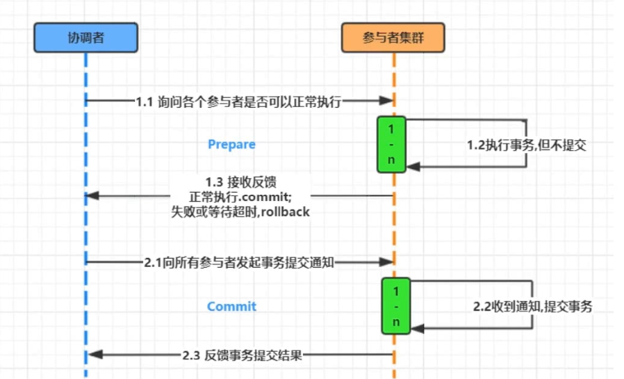
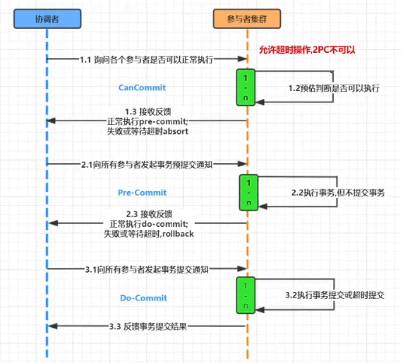
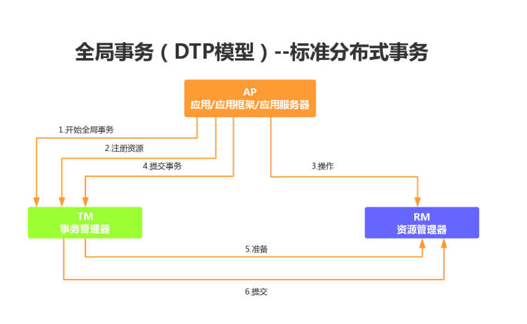

# 分布式事务

# 理论

## CAP（强一致性）

在分布式系统领域有个著名的CAP定理

1. C-数据一致性；
2. A-服务可用性；
   1. 系统中非故障节点收到的每个请求都必须有响应.在可用系统中，如果我们的客户端向服务器发送请求，并且服务器未崩溃，则服务器必须最终响应客户端，不允许服务器忽略客户的请求
3. P-服务对网络分区故障的容错性
   1. 单台服务器，或多台服务器出问题（主要是网络问题）后，正常服务的服务器依然能正常提供服务
      1. 也就是说，如果服务器网络出现问题，允许服务器之间 数据的不同步
   2. 这三个特性在任何分布式系统中不能同时满足，最多同时满足两个

*CAP理论也就是说在分布式存储系统中，最多只能实现以上两点。而由于当前网络延迟故障会导致丢包等问题，所以我们分区容错性是必须实现的。也就是NoSqL数据库P肯定要有，我们只能在一致性和可用性中进行选择，没有Nosql数据库能同时保证三点。（==>AP 或者 CP）*

>  `CP(consistency + partition tolerance):`

关注一致性和分区容忍性。它关注的是系统里大多数人的一致性协议。这样的系统只需要保证大多数结点数据一致，而少数的结点会在没有同步到最新版本的数据时变成不可用的状态。这样能够提供一部分的可用性。

## BASE（最终一致性）

BASE 是指基本可用（Basically Available）、软状态（ Soft State）、最终一致性（ Eventual
Consistency）。它的核心思想是即使无法做到强一致性（CAP 就是强一致性），但应用可以采用
适合的方式达到最终一致性。

- BA指的是基本业务可用性，支持分区失败；
- S表示柔性状态，也就是允许短时间内不同步；
- E表示最终一致性，数据最终是一致的，但是实时是不一致的

# 两阶段提交协议（2PC）

两阶段提交协议，简称2PC(2 Prepare Commit)，属于强一致性

1. 准备阶段：协调者询问是否可以执行
2. 提交阶段：协调者发起提交事务通知

2PC 方案实现起来简单，实际项目中使用比较少，主要因为以下问题

1. 性能问题：所有参与者在事务提交阶段处于同步阻塞状态，占用系统资源，容易导致性能瓶颈。
2. 可靠性问题：如果协调者存在单点故障问题，如果协调者出现故障，参与者将一直处于锁定状态。
3. 数据一致性问题：在阶段 2 中，如果发生局部网络问题，一部分事务参与者收到了提交消息，另一部分事务参与者没收到提交消息，那么就导致了节点之间数据的不一致。

# 3PC模式
*三阶段提交升级点：*

3PC 三阶段提交，是两阶段提交的改进版本，与两阶段提交不同的是，引入超时机制。同时在协调者和参与者中都引入超时机制。三阶段提交将两阶段的准备阶段拆分为 2 个阶段，插入了一个preCommit 阶段，解决了原先在两阶段提交中，参与者在准备之后，由于协调者或参与者发生崩溃或错误，而导致参与者无法知晓处于长时间等待的问题。如果在指定的时间内协调者没有收到参与者的消息则默认失败。

1. 阶段1：canCommit
   协调者向参与者发送 commit 请求，参与者如果可以提交就返回 yes 响应，否则返回 no 响应。
2. 阶段2：preCommit
   协调者根据阶段 1 canCommit 参与者的反应情况执行预提交事务或中断事务操作。参与者均反馈 yes：协调者向所有参与者发出 preCommit 请求，参与者收到preCommit 请求后，执行事务操作，但不提交；将 undo 和 redo 信息记入事务日志
   中；各参与者向协调者反馈 ack 响应或 no 响应，并等待最终指令。任何一个参与者反馈 no或等待超时：协调者向所有参与者发出 abort 请求，无论收到协调者发出的 abort 请求，或者在等待协调者请求过程中出现超时，参与者均会中断事务。
3. 阶段3：do Commit
   该阶段进行真正的事务提交，根据阶段 2 preCommit反馈的结果完成事务提交或中断操作。

# XA（强一致性）

XA是由X/Open组织提出的分布式事务的规范（比如：JDBC，就是一套规范），是基于两阶段提交协议。 XA规范主要定义了全局事务管理器（TM）和局部资源管理器（RM）之间的接口。目前主流的关系型数据库产品都是实现了XA接口

如下：RM其实可以看出我们平时操作的资源（如多个数据库 ）

# TCC模式（最终一致性）

TCC 是服务化的两阶段编程模型，其 Try、Confirm、Cancel 3 个方法均由业务编码实现

1. Try 操作作为一阶段，负责资源的检查和预留；
2. Confirm 操作作为二阶段提交操作，执行真正的业务；
3. Cancel 是预留资源的取消；
