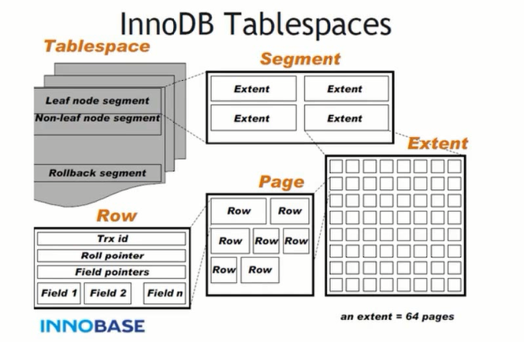

# mysql模块

# 查询缓存

这是MySQL的一个可优化查询的地方，如果开启了查询缓存且在
查询缓存过程中查询到完全相同的SQL语句，则将查询结果直接返回给客户端；（8.0已弃用）

> 即使开启查询缓存，以下SQL也不能缓存

1. 查询语句使用SQL_NO_CACHE
2. 查询的结果大于query_cache_limit设置
3. 查询中有一些不确定的参数，比如now()

# InnoDB文件存储结构

一个ibd数据文件-->Segment（段）-->Extent（区）-->Page（页）-->Row（行）

*tablespace*:表空间，用于存储多个ibd数据文件

*Segment*:段，用于管理多个Extent

*Extent*:区，一个区固定包含64个连续的页，大小为1M。当表空间不足，需要分配新的页资源，不会一页一页分，直接分配一个区

*Page*:页，用于存储多个Row行记录，大小为16K

*Row*：行，包含了记录的字段值，事务ID（Trx id）、滚动指针（Roll pointer）、字段指针（Field pointers）等信息