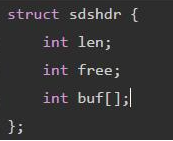
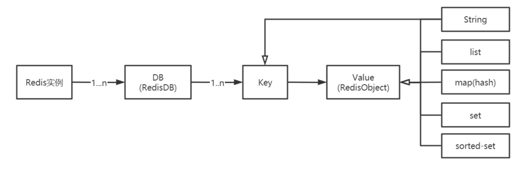
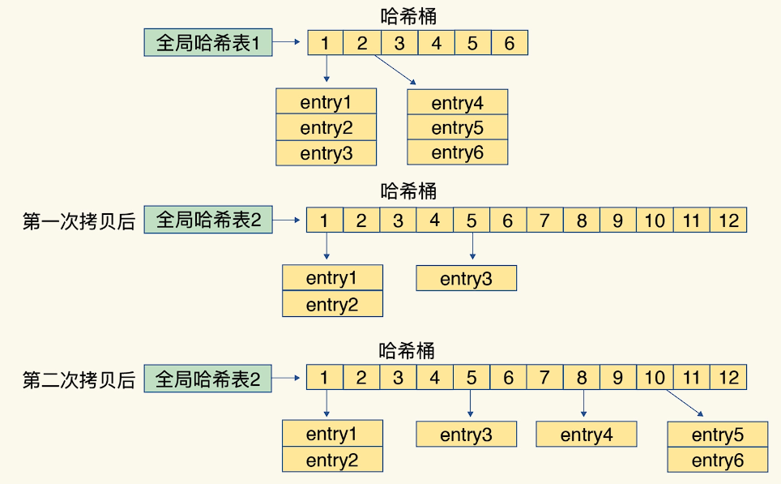
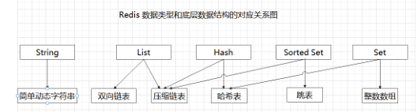
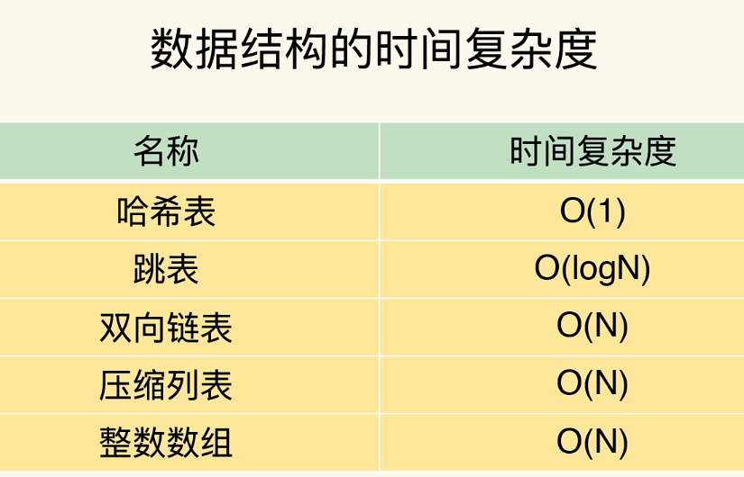
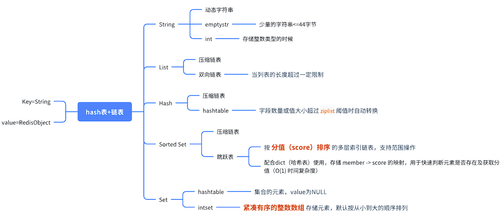

# 命令操作

# 字符串操作

## Set

*设置值*

```shell
127.0.0.1:6379> set name laoxiao
OK
```

*设置过期时间,查看过期时间*

```shell
127.0.0.1:6379> EXPIRE name 10
(integer) 1
127.0.0.1:6379> ttl name
(integer) 2
```

*设置过期的key*

1. 在SET命令中，有很多选项可用来修改命令的行为。 以下是SET命令可用选项的基本语法。

- EX seconds − 设置指定的到期时间(以秒为单位)。
- PX milliseconds - 设置指定的到期时间(以毫秒为单位)。
- NX - 仅在键不存在时设置键。
- XX - 只有在键已存在时才设置。

```shell
redis 127.0.0.1:6379> SET KEY VALUE [EX seconds] [PX milliseconds] [NX|XX]
```

*判断key是否存在*

```shell
127.0.0.1:6379> EXISTS name
(integer) 0
```

*移除key*

```shell
127.0.0.1:6379> MOVE name 1
(integer) 1
```

*value的自增,自减*

```shell
127.0.0.1:6379> INCR count
(integer) 1
127.0.0.1:6379> DECR count
(integer) 0
```

*替换value的内容*

```shell
127.0.0.1:6379> SETRANGE name 2 zy
(integer) 7
127.0.0.1:6379> get name
"lazyiao"
```

## mset

*表示一次可以设置多个键值对*

msetnx 是原子性的，如果一个没有设置成功，则其他键值对都设置不成功

```shell
redis 127.0.0.1:6379> MSET key1 value1 key2 value2 .. keyN valueN
```

## 替换
将下班为2开始的字符替换成zy

```shell
127.0.0.1:6379> SETRANGE name 2 zy
(integer) 7
127.0.0.1:6379> get name
"lazyiao"
```

## Redis的CAS

*getset*

- 如果存在值则进行替换

```shell
127.0.0.1:6379> GETSET key value
```

## 字符串类型的扩容

Redis的字符串是一个由字节组成的序列，跟java里面的ArrayList有点类似，采用预分配冗余空间的方式来减少内存的频繁分配，内部为当前字符串实际分配的空间capacity一般要高于实际字符串长度len。当字符串长度小于1M时，扩容都是加倍现有的空间，**如果超过1M**，扩容时一次只会多扩1M的空间。需要注意的是字符串最大长度为512M。

## 底层实现结构

Redis 中没有直接使用 C 语言的字符串，而是构建了一套自己的抽象类型，名为简单动态字符串，简称 *SDS*



*len*: 记录 buf 数组中已经使用字节的数量，也就是 SDS 类型所保存的字符串的长度。
*free*: 记录了 buf 数组中未使用的字节数量
*buf*: 是存储字节的数组

体现了用**空间换时间**的算法思想。牺牲了一些空间，来换取更快的查询效率。比如说结构体中 len 的值 5 表示这个 SDS 保存了一个五个字节长的字符串，O (1) 的时间复杂度就可以查询出结果

# List

## 基本操作

1. list命令都是L或者R开头的
2. 元素时字符串类型，列表头部和尾部增删快、元素可以重复，最多存2^32-1个元素
3. push操作,往key里面设置值，放入列表的头部

```shell
127.0.0.1:6379> LPUSH list one
(integer) 1
127.0.0.1:6379> LPUSH list 2
(integer) 2
127.0.0.1:6379> lpush list 3
(integer) 3
```

## 获取值

```shell
127.0.0.1:6379> LRANGE list 0 1
1) "3"
2) "2"
```

## 将值push到列表尾部

```shell
127.0.0.1:6379> RPush list rpu
(integer) 4
127.0.0.1:6379> LRANGE list 0 -1
1) "3"
2) "2"
3) "one"
4) "rpu"
```

## 从左边弹出值

```shell
127.0.0.1:6379> LPOP list
"3"
## 查看当前list
127.0.0.1:6379> LRANGE list 0 -1
1) "2"
2) "one"
3) "rpu"
```

## 移除

*移除指定值*

- count > 0 : 从表头开始向表尾搜索，移除与 VALUE 相等的元素，数量为 COUNT 。
- count < 0 : 从表尾开始向表头搜索，移除与 VALUE 相等的元素，数量为 COUNT 的绝对值。
- count = 0 : 移除表中所有与 VALUE 相等的值。

```shell
127.0.0.1:6379> LREM key count element
```

*移除一个值*

- 移除1个指定的值
- 可以用来如:取消某个人的关注

```shell
127.0.0.1:6379> LREM list 1 one
(integer) 1
```

## 截断

1. 设置 0 1 2 3四个元素

2. 截取index =1  2的元素(`只取下表为1，2的值`)

3. 可以看到四个元素只剩下1 2了

```shell
127.0.0.1:6379> LTRIM mylist 1 2
OK
127.0.0.1:6379> LRANGE mylist 0 -1
1) "2"
2) "1"
```

## 弹入弹出

从右边弹出一个元素，从左边push到一个新的元素中

```shell
127.0.0.1:6379> RPOPLPUSH mylist mylist2
"1"
```

## 性能瓶颈

- 如果 `List` 数据量超过 **10K**，考虑优化查询方式或改用其他数据结构。
- 如果 `List` 数据量超过 **1M**，强烈建议改用 **Redis Stream** 或 **Sorted Set**。
- 如果需要频繁访问中间元素，考虑改用 **Hash** 或 **Sorted Set**。

# SET集合

## 基本操作

无序的、去重的、元素是字符串类型

```shell
# 添加一个或者多个成员
SADD key member1 [member2]
# 返回集合中的所有成员
smembers key
# 判断 member 元素是否是集合 key 的成员
## key中存在member返回1
sismember key member
# 返回集合中一个或多个随机数
srandmember key [count]
# 获取集合的成员数
scard key
# 移除并返回集合中的一个随机元素

```

*获取集合个数*

```shell
127.0.0.1:6379> SCARD myset
(integer) 4
```

*移除指定元素*

```shell
127.0.0.1:6379> SREM myset 3
(integer) 1
```

## 多个集合操作

*将一个集合中的指定元素移动到另一个集合*

```shell
127.0.0.1:6379> SMOVE myset myset2 2
(integer) 1
```

*求差集*

```shell
127.0.0.1:6379> SDIFF myset myset2
1) "1"
2) "1,"
```

*求交集(用户之间的共同关注)*

- A用户的关注放一个集合，粉丝放一个集合
- A用户和B用户的关注求交集就是共同关注

```shell
127.0.0.1:6379> sadd myset laoxiao
(integer) 1
127.0.0.1:6379> sadd myset2 laoxiao
(integer) 1
127.0.0.1:6379> SINTER myset myset2
1) "laoxiao"
```

*求并集*

```shell
127.0.0.1:6379> SUNION myset myset2
1) "1"
2) "laoxiao"
3) "2,"
4) "1,"
```

# HASH(哈希)

## 基本操作

- 由field和关联的value组成的map键值对
- field和value是字符串类型
- 一个hash中最多包含2^32-1个键值对

```shell
set key field value
```

*存入/获取*

```shell
127.0.0.1:6379> hset myhash name laoxiao
(integer) 1
127.0.0.1:6379> hget myhash name
"laoxiao"
```

*获取所有的键或者值* 

```shell
127.0.0.1:6379> HKEYS myhash
1) "name"
127.0.0.1:6379> HVALS myhash
1) "laoxiao"
```

## 不适用hash的情况

1. 使用二进制位操作命令
2. 使用过期键功能

# 有序集合

## 基本操作

*添加语法*

数据按照score进行排序

```shell
127.0.0.1:6379> ZADD key [NX|XX] [GT|LT] [CH] [INCR] score member [score member ...]
```

*返回指定下标区间*

```shell
127.0.0.1:6379> ZRANGE key min max [BYSCORE|BYLEX] [REV] [LIMIT offset count] [WITHSCORES]
## 查询下标的元素
127.0.0.1:6379> zrange myz 1 2
1) "lisi"
2) "wangwu"
```

*获取分数2-3*

```shell
127.0.0.1:6379> ZRANGEBYSCORE myz 2 3
1) "lisi"
2) "wangwu"
```

*从负无穷到正无穷查询（升序查找）*

```shell
127.0.0.1:6379> ZRANGEBYSCORE myz -inf +inf
1) "laoxiao"
2) "lisi"
3) "wangwu"
```

*降序查询*

```shell
127.0.0.1:6379> ZREVRANGEBYSCORE key max min [WITHSCORES] [LIMIT offset count]
```

*给member增加increment*

```shell
ZINCRBY key increment member
```

## 对比list

- **Sorted Set 在频繁修改数据时仍然比 List 更高效**，尤其是在需要排序、范围查询或随机访问时。
- **Sorted Set 的性能瓶颈主要出现在超高频率写入或超大范围查询时**，此时可以考虑分片或外部数据库。

# 经纬度

> `3.2版本推出`
>
> *可以计算地理位置的距离*

1. longitude 经度
2. latitude 纬度

```shell
GEOADD key [NX|XX] [CH] longitude latitude member [longitude latitude member
## 插入地理位置
## 两级无法添加
127.0.0.1:6379> GEOADD china:city 112.98626 28.25591 changsha
(integer) 1
127.0.0.1:6379> GEOADD china:city 113.64317 28.16378 liuyang
(integer) 1
```

*获取经纬度*

```shell
127.0.0.1:6379> GEOPOS china:city changsha
1) 1) "112.98626035451889038"
   2) "28.25590931465907119"
```

*获取城市距离*

```shell
127.0.0.1:6379> GEODIST china:city changsha liuyang
"65197.3795"

##计算的距离单位（km）
127.0.0.1:6379> GEOdist china:city changsha liuyang km
"65.1974"
```

*删除地理位置*

```shell
127.0.0.1:6379> ZREM china:city liuyang
```

# 发布订阅

*发布*：

`channel`：管道名称

`message`：消息

```shell
127.0.0.1:6379> PUBLISH channel message
```

*订阅*：

```shell
127.0.0.1:6379> SUBSCRIBE laoxiao 
Reading messages... (press Ctrl-C to quit)
1) "subscribe"
2) "laoxiao"
```

# 数据结构的底层

## 全局结构

1.  Redis的全局哈希表是由多个哈希表构成的，每个哈希表称为一个数据库（DB）。数据库的数量可以通过配置进行设置，默认是16个。每个数据库都是一个独立的哈希表，负责存储键值对。
2. **渐进式rehash：** 当数据库的键值对数量较多时，为了保持查询性能，Redis会在不中断服务的情况下，逐步将旧的数据库哈希表中的数据迁移到新的数据库哈希表中，这个过程叫做渐进式rehash。这样，Redis能够平滑地将数据从旧的哈希表迁移到新的哈希表，避免大规模的数据迁移对性能造成影响。

### RedisObject

**Redis 最外层的两种基础数据结构**

| **Key**   | **String**      | 所有键必须是字符串类型（二进制安全，最大 512MB）。           |
| --------- | --------------- | ------------------------------------------------------------ |
| **Value** | **RedisObject** | 值的底层统一用 `RedisObject` 结构封装，内部再指向具体的数据类型实例 |

```c++
typedef struct redisObject {
    unsigned type:4;      // 数据类型（String/List/Hash/Set/ZSet等）
    unsigned encoding:4;  // 底层编码（如 int/embstr/ziplist/hashtable/skiplist 等）
    void *ptr;            // 指向实际数据的指针
    // ...（其他字段如 LRU 时间、引用计数等）
} robj;
```



## 哈希冲突

1. Redis 解决哈希冲突的方式，就是链式哈希。链式哈希也很容易理解，就是指同一个哈希桶中的多个元素用一个链表来保存，它们之间依次用指针连接
2. 如果哈希表里写入的数据越来越多，哈希冲突可能也会越来越多，这就会导致某些哈希冲突链过长，进而导致这个链上的元素查找耗时长，效率降低
3. 所以，Redis 会对哈希表做 rehash 操作。rehash 也就是增加现有的哈希桶数量，让逐渐增多的 entry 元素能在更多的桶之间分散保存，减少单个桶中的元素数量，从而减少单个桶中的冲突。

## rehash

rehash是一个渐进式的过程，它不会一次性地将所有键值对重新分配到新的哈希表中，而是分多次进行，每次处理一小部分键值对。这种渐进式的rehash过程可以保证在rehash期间，Redis仍然可以正常处理读取和写入操作，不会阻塞客户端请求

**具体的rehash过程**如下：

1. Redis会创建一个新的空哈希表，大小是当前哈希表的两倍（或更小，如果是缩小操作）。
2. Redis会将当前哈希表的rehashidx属性设置为0，表示rehash的起始位置。
3. 在每次执行读取或写入操作时，Redis会同时对当前哈希表和新哈希表进行操作。
4. 对于读取操作，Redis首先在当前哈希表中查找键值对，如果找不到，则继续在新哈希表中查找。
5. 对于写入操作，Redis会将新的键值对添加到新哈希表中，同时保留当前哈希表中的键值对。
6. 在每次执行完一定数量的操作后，Redis会逐步将当前哈希表中的键值对迁移到新哈希表中，直到迁移完成。
7. 最后，Redis会将新哈希表设置为当前哈希表，并释放旧的哈希表的内存空间。



## 各个数据结构底层






## String

底层实现并非简单的字符数组，而是根据存储内容的特性（如长度、类型）采用了 **三种编码方式** 来优化性能和内存使用

### 动态字符串

存储普通字符串且长度 > 44 字节

```c
struct sdshdr {
    int len;      // 已用长度
    int free;     // 剩余空间
    char buf[];   // 柔性数组，存储实际数据
};
```

### EMBSTR（嵌入式字符串）

- **适用场景**：字符串长度 ≤ 44 字节。
- EMBSTR (Embedded String) 是 Redis 专门为短字符串设计的一种高效存储编码方式，它将 Redis 对象元数据(robj)和字符串数据(SDS)存储在**单个连续内存块**中

### INT（整数编码）

**适用场景**：字符串表示的是 **64 位有符号整数**（如 `SET key 123`）

### SDS使用场景

存储字符串和整型数据、存储key、AOF缓冲区和用户输入缓冲


## List

Redis在选择使用压缩列表还是双向链表作为列表的底层实现时，会根据以下两个因素进行判断：

- 列表的长度：当列表的长度超过一定限制（默认为512个元素）时，Redis会将压缩列表转换为双向链表，以便更好地处理大型列表。
- 列表元素的大小：当列表中的元素大小超过一定限制（默认为64字节）时，Redis会将压缩列表转换为双向链表，以便更好地处理大型元素。

## Hash

### **`ziplist`（压缩列表）**

- **适用场景**：字段数量较少（默认 ≤ `hash-max-ziplist-entries` 512）且字段值较小（默认 ≤ `hash-max-ziplist-value` 64 字节）。

### **`hashtable`（哈希表）**

- **适用场景**：字段数量或值大小超过 `ziplist` 阈值时自动转换。
- **数据结构**：
  - 与 Redis 的全局哈希表实现相同（链式哈希表，数组 + 链表）。
  - 每个键值对存储为 `dictEntry` 结构：

## Set

Set的底层实现是**「ht和intset」**

### intset

intset也叫做整数集合，适用于当集合中的元素**全是整数**，且元素数量较少时

它使用一个 **紧凑有序的整数数组** 存储元素，默认按从小到大的顺序排列。它可以保存`int16_t`、`int32_t` 或者`int64_t` 的整数值

在整数集合新增元素的时候，若是超出了原集合的长度大小，就会对集合进行升级，具体的升级过程如下：

1. 首先扩展底层数组的大小，并且数组的类型为新元素的类型。
2. 然后将原来的数组中的元素转为新元素的类型，并放到扩展后数组对应的位置。
3. 整数集合升级后就不会再降级，编码会一直保持升级后的状态

- **优点**：
  - 内存高效（连续存储，无额外指针开销）。
  - 查询时间复杂度为 `O(log n)`（二分查找）。
- **缺点**：
  - 插入非整数元素或元素过多时会转换为 `hashtable`。

可以看到存储数字的时候，使用的是intset作为数据结构

```shell
127.0.0.1:6379> SADD myset 1 2 3
(integer) 3
127.0.0.1:6379> OBJECT ENCODING myset
"intset"

127.0.0.1:6379> SADD myset "hello"
(integer) 1
127.0.0.1:6379> OBJECT ENCODING myset
"hashtable"
```

### hashtable

- **适用场景**：
  - 集合中包含**非整数元素**（如字符串）。
  - 元素数量超过 `intset` 的配置阈值。

- **数据结构**：
  - 与 Redis 的 `Dict`（字典）相同，使用链式哈希表（数组 + 链表）。
  - **键（key）**：集合的元素（如字符串 `"apple"`）。
  - **值（value）**：固定为 `NULL`（因为集合只需判断元素是否存在）。

## sortset

### ziplist（压缩列表）

- **适用场景**：元素数量较少（默认 ≤ `zset-max-ziplist-entries` 128）且元素值较小（默认 ≤ `zset-max-ziplist-value` 64 字节）。

压缩列表是一种紧凑的数据结构，用于存储较小的列表。它将多个列表元素紧密地存储在一起，以减少内存的使用。压缩列表的结构如下

```html
<zlbytes><zltail><zllen><entry><entry>...<entry><zlend>
    
- <zlbytes>：表示压缩列表的总字节数。
- <zltail>：指向压缩列表的最后一个节点。
- <zllen>：表示压缩列表中的元素数量。
- <entry>：表示每个列表元素的存储形式，包括元素长度和元素内容。
- <zlend>：表示压缩列表的结束标志。
```

**压缩列表并不是以某种压缩算法进行压缩存储数据，而是它表示一组连续的内存空间的使用，节省空间**

在sortset中的表现：

- **数据结构**：
  - 一个双向链表结构的压缩列表，按 **分值（score）排序** 存储元素。
  - 每个元素以 `[member1, score1, member2, score2, ...]` 的形式紧凑存储，无指针开销。
- **优点**：
  - 内存占用极低（连续存储，无哈希表或跳表的结构性开销）。
- **缺点**：
  - 查询效率较低（需遍历查找，时间复杂度 `O(n)`）。
  - 插入/删除需重新分配内存，不适合频繁修改的大数据集

###  skiplist + dict（跳表 + 哈希表）

**适用场景**：元素数量或大小超过 `ziplist` 阈值时自动转换

- **`skiplist`（跳表）**：
  - 按 **分值（score）排序** 的多层索引链表，支持范围操作（如 `ZRANGE`）。
  - 平均时间复杂度：`O(log n)` 查询/插入/删除。
- **`dict`（哈希表）**：
  - 存储 `member -> score` 的映射，用于快速判断元素是否存在及获取分值（`O(1)` 时间复杂度）

**协作机制**：

- 跳表负责排序和范围操作，哈希表负责快速访问单个元素。
- 两者共享相同的 `member` 和 `score` 对象（通过指针引用，无数据冗余

## 总结


