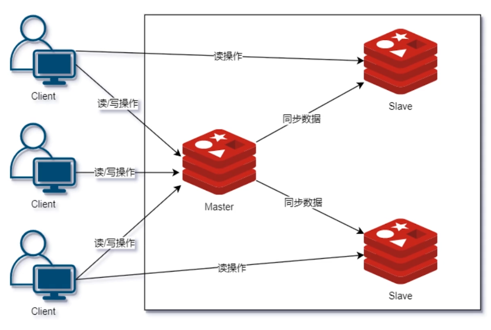
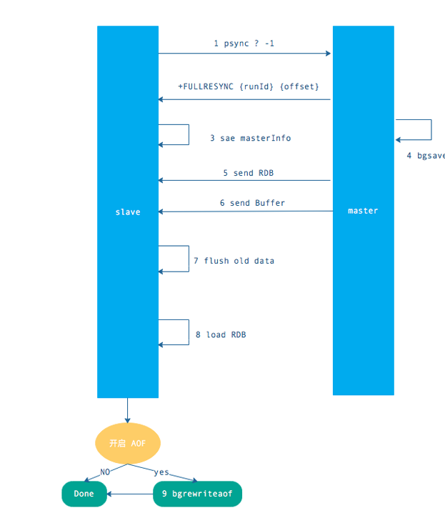
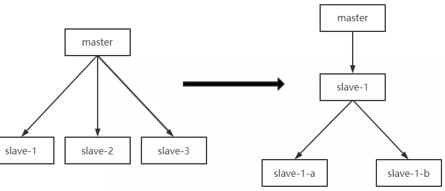

# 

1. 只一个redis服务器的数据，复制到其他redis服务器

2. 数据复制是单向的，只能 master -> slave

3. 主从复制作用

- 数据热备份，数据故障修复
- 负载均衡，主节点写，从节点进行读操作
- 高可用（防止一台服务器宕机）

# 环境搭配

## 查看当前库信息

```shell

127.0.0.1:6379> info replication

# Replication

role:master ## 主节点

connected_slaves:0 ## 从节点连接数

master_failover_state:no-failover

master_replid:413efdc5cccbb10f3430d1d012b52fed3209db1c

master_replid2:0000000000000000000000000000000000000000

master_repl_offset:0

second_repl_offset:-1

repl_backlog_active:0

repl_backlog_size:1048576

repl_backlog_first_byte_offset:0

repl_backlog_histlen:0

```
## 复制三个配置文件

```shell
[root@localhost redis-6.2.1]# cp redis.conf redis79.conf
[root@localhost redis-6.2.1]# cp redis.conf redis80.conf
[root@localhost redis-6.2.1]# cp redis.conf redis81.conf
```

## 修改每个配置文件

配置的访问密码必须一致

```conf
# 修改端口
port 6380
# 修改进程文件
pidfile /var/run/redis_6380.pid
# 日志wenj
logfile "log-80.log"
# 持久化文件
dbfilename dump80.rdb
dir ./data/
```

## 一主二从




### 通过命令配置

- 不是永久的

- 从机找主机，配置

```shell
## 在从节点配置
127.0.0.1:6380> SLAVEOF 192.168.1.131 6379
OK
### 能够看到6379（主节点）有两个从机
127.0.0.1:6379> info replication
# Replication
role:master
connected_slaves:2
slave0:ip=192.168.1.131,port=6381,state=online,offset=42,lag=0
slave1:ip=192.168.1.131,port=6380
```

### 配置文件配置

在从节点配置

```shell
### 配置主节点的ip 和端口
 replicaof <masterip> <masterport>
### 配置主机的密码
 masterauth <master-password>
```

# 特性

- 主机可以写，从机不能写只能读
- 所有主机的信息都会被从机保存

```shell
## 从机只能读
127.0.0.1:6380> set name laoxiao1
(error) READONLY You can't write against a read only replica.
```

- 第一次连接主机，slave会发生全量复制，接收master的数据库文件数据
- 后面的新增，则发生的是增量复制

# 手动的从机变主机

```shell
127.0.0.1:6379> SLAVEOF no one
```

# 主从复制过程

## 全量赋值过程

1. 第一次同步(新增从节点/第一次启动)

2. master节点收到从服务器的psync命令,会fork一个子进程在后台执行<b id="blue">bgsave</b>命令，并将新写入的数据先写入到一个缓冲区中，bgsave执行完成之后,再将生成的RDB文件发送给slave节点，然后master节点再将缓冲区的内容以redis协议格式再全部发送给slave节点，slave节点先删除旧数据,slave节点将收到后的RDB文件载入自己的内存，再加载所有收到缓冲区的内容，从而这样一次完整的数据同步



## psync 命令的使用方式

命令格式为 psync{runId}{offset}

runId：从节点所复制主节点的运行 id

offset：当前从节点已复制的数据偏移量

从节点发送 psync 命令给主节点，runId 就是目标主节点的 ID，如果没有默认为 -1，offset 是从节点保存的复制偏移量，如果是第一次复制则为 -1.

## 增量复制的过程

 在全量同步之后再次需要同步时,从服务器只要发送当前的offset位置给主服务器，

然后主服务器根据相应的位置将之后的数据(包括写在缓冲区的积压数据)发送给从服务器,再次将其保存到从节点内存即可

发送的数据是以执行命令的方式

# 过期KEY处理

Slave不会让KEY 过期，而是等待Master让 KEY 过期。当Master让 KEY 到期时，它会合成一个 DEL命令并传输到所有的Slave。

# 主从复制注意事项

### 避免全量复制

### 避免复制风暴

单主节点复制的风暴：当主节点重启后，多个从节点会同时从主节点复制数据，这样的话是会带来复制风暴，解决方式可以更换复制的架构，比如可以使用级联复制的架构

