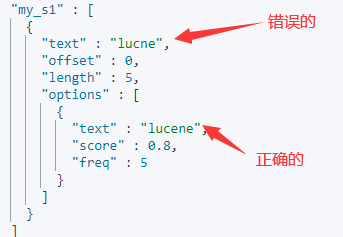
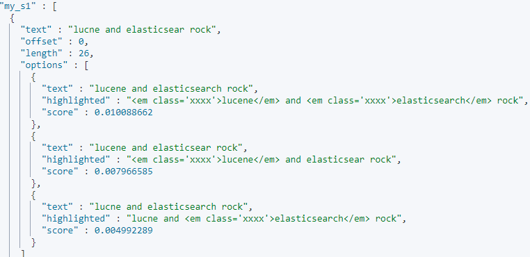
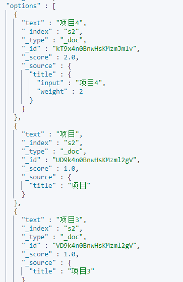

**在7.X后，官方废弃type,默认type为_doc**

故：
ES 的Type 被废弃后，库表合一，Index 既可以被认为对应 MySQL 的 Database，也可以认为对应 table。

# 简单的集群管理

- 快速检查进群的健康状态

```
GET /_cat/health?v
```

- 查看集群index

```
GET /_cat/indices?v
```

# 新增操作

```
PUT /index/type/documentid
{
	json 数据
}
```

新增一条数据
```shell
PUT /order/product/1
{
  "name":"iphone",
  "price":"3000",
  "desc": "Simple to use and cheap to use"
}
```

不指定documentid 新增(采用GUID算法生成)

```shell
POST /order/product/
{
  "name":"phone",
  "price":"2000",
  "ooprice":2000,
  "desc": "Simple to use and cheap to use"
}
```

- PUT 和POST用法

```
PUT是幂等方法，POST不是。
– PUT，DELETE操作是幂等的。所谓幂等是指不管进行多少次操作，结果都一样。比如我用PUT修改一篇文章，然后在做同样的操作，每次操作后的结果并没有不同，DELETE也是一样。
– POST操作不是幂等的，比如常见的POST重复加载问题：当我们多次发出同样的POST请求后，其结果是创建出了若干的资源。
– 还有一点需要注意的就是，创建操作可以使用POST，也可以使用PUT，区别在于POST是作用在一个集合资源之上的（/articles），而PUT操作是作用在一个具体资源之上的（/articles/123），比如说很多资源使用数据库自增主键作为标识信息，而创建的资源的标识信息到底是什么只能由服务端提供，这个时候就必须使用POST。
```

# 修改操作

- 替换的方式

这有一点不好，就是需要将所有字段都带上

```
PUT /order/product/1
{
  "name":"iphone",
  "price":"4000",
  "desc": "Simple to use and cheap to use"
}
```

返回

```json
"_index" : "order",
"_type" : "product",
"_id" : "5", //可以不手动设置，es会自动设置
```

- 修改的方式（post）

```
POST /order/product/1/_update
{
  "doc":{
    "name":"huawei iphone"
  }
}
```

# 查询

```
GET /order/product/1
```

# 删除

不是物理删除，只是标记，如果数据越来越多，则会后台自动物理删除

```shell
DELETE /order/product/1
```

- 带查询方式的删除

```json
POST /sys_org_company/_delete_by_query
{
   "query": {
        "match_all": {
        }
    }
}
```


# 结构化查询

## 基本知识

> 结构化查询（Query DSL）  

query的时候，会先比较查询条件，然后计算分值，最后返回文档结果  

查询全部，会将所有的数据查询出来

```json
GET /test_index/test_type/_search?scroll=1m
{
  "query": {
    "match_all": {}
  }
}
```

> 结构化过滤（Filter DSL）  

过滤器，对查询结果进行缓存，不会计算相关度，避免计算分值，执行速度非常快  

```json
GET /order/product/_search
{
  "query":{
    "bool": {
      "must": [
        {"match":{"name": "iphone"}}
      ],
      "filter": [
      {"range":{"price":{"gt":"3000"}}}  
      ]
    }
  }
```

## 结构化过滤（Filter DSL）  

> term 过滤  

term 主要用于精确匹配哪些值，比如数字，日期，布尔值或 not_analyzed 的字符串（未经分析的文本数据类型），相当于sql <b id="blue">age=26  </b>

```json
{ "term": { "age": 26 }}
{ "term": { "date": "2014-09-01" }}
```

### terms 过滤  

terms 允许指定多个匹配条件。如果某个字段指定了多个值，那么文档需要一起去做匹配。相当于sql： <b id="blue">age in</b> 

```json
{"terms": {"age": [26, 27, 28]}}
```

### range 过滤  

range 过滤允许我们按照指定范围查找一批数据 

GET /order/_search

```json
{
    "range": {
        "price": {
            "gte": 2000,
            "lte": 3000
            }
        }
    }
}
```

### exists 和 missing 过滤  

exists 和 missing 过滤可以用于查找文档中是否包含指定字段或没有某个字段  

```json
{
	"exists": {
    	"field": "title"
    }
}
```

### bool 过滤  

用来合并多个过滤条件查询结果的布尔逻辑：

1. must：多个查询条件的完全匹配，相当于 and。

2. must_not： 多个查询条件的相反匹配，相当于 not；

3. should：至少有一个查询条件匹配，相当于 or；

   相当于sql and 和or  

```json
{
    "bool": {
        "must": { "term": { "folder": "inbox" }},
        "must_not": { "term": { "tag": "spam" }},
        "should": [
                { "term": { "starred": true }},
                { "term": { "unread": true }}
            ]
    }
}
```

### 复杂查询

如果我们需要查询  (A|B)&C，  则如下查询

> json版本

```json
{
    "query": {
        "bool": {
            "must": [
                {
                    "bool": {
                        "should": [
                            {
                                "match": {
                                    "A": "测试"
                                }
                            },
                            {
                                "match": {
                                    "B": "测试2"
                                }
                            }
                        ]
                    }
                },
                {
                    "bool": {
                        "must": [
                            {
                                "term": {
                                    "C": "1"
                                }
                            }
                        ]
                    }
                }
            ]
        }
    }
}
```

> 代码版本

```java
BoolQueryBuilder boolQueryBuilder = QueryBuilders.boolQuery()
        .must(QueryBuilders.boolQuery()
                .should(QueryBuilders.matchQuery("A", key))
                .should(QueryBuilders.matchQuery("B", key)))
        .must(QueryBuilders.boolQuery()
                .must(QueryBuilders.termQuery("C", "1")));
```

### 分词完全匹配

如果<b id="blue">operator</b>的选项是and，则表示XXX的分词必须完全匹配，如果是or，则只需要匹配一个即可

```java
{
    "query": {
        "bool": {
            "must": [
                {
                    "match": {
                        "itemName": {
                            "query": "xxx",
                            "operator": "and"
                        }
                    }
                }
            ]
        }
    }
}
```

# 自动补全

suggest就是一种特殊类型的搜索

分为四种

1. Term suggester ：词条建议器。对给输入的文本进进行分词，为每个分词提供词项建议
2. Phrase suggester ：短语建议器，在term的基础上，会考量多个term之间的关系
3. Completion Suggester，它主要针对的应用场景就是"Auto Completion"。
   1. 完成补全单词，输出如前半部分，补全整个单词
4. Context Suggester：上下文建议器  

## Term suggester 

可以用来拼写纠错(对一个词语进行纠错)；我们在搜索引擎中搜索为华 然后显示：**我们为您显示“华为”相关的商品**。仍然搜索：“为华”


1. 建立mapping

```json
PUT s1
{
  "mappings": {
    "properties": {
        "title":{
          "type":"text",
          "analyzer":"standard"
        }
      }
  }
}
```

2. 添加词条

```json
PUT s1/_doc/1
{
  "title": "Lucene is cool"
}
```

3. 进行错误的词条搜索

```json
GET s1/_doc/_search
{
  "suggest": {
    "my_s1": {
      "text": "lucne",
      "term": {
        "field": "title"
      }
    }
  }
}
```

4. 返回正确的词条



## Phrase suggester

与Term 不同的是，Phrase是对一连串的短语进行纠错

如:在词库，我们有两个 “Lucene is cool”， “Elasticsearch builds on top of lucene”词语，

如果我们搜索:lucne的单词错误，elasticsear的单词错误

```json
GET s1/_doc/_search
{
  "suggest": {
    "my_s1": {
      "text": "lucne and elasticsear rock",
      "phrase": {
        "field": "title",
        "highlight":{
          "pre_tag":"<em class='xxxx'>",
          "post_tag":"</em>"
        }
      }
    }
  }
}
```

那么返回的是：，此时我们对options可以取评分最高的短语进行操作



## Completion Suggester

`可以用来做自动补全操作`, 如：京东的搜索，我们搜索，小米，下拉框出来小米10，小米11等下拉选项

使用此类型，首先我们要使用特殊的mapping映射, type是completion类型

```
我们前期选择 Completion Suggester 因为这个性能最好，他将数据保存在内存中的有限状态转移机中（FST）
后期如果需要优化，可以结合 Term Suggester ，Phrase Suggester， Context Suggester进行优化
```

1. 建立一个mapping，其中title使用的类型是自动补全类型

```json
PUT s2
{
  "mappings": {
    "properties": {
      "title":{
          "type":"completion",
          "analyzer":"ik_smart"
      }
    }
  }
}
```

2. 批量的添加一些数据,这些数据，就是我们后面的自动补全 的数据

```json
POST _bulk/?refresh=true
{ "index": { "_index": "s2", "_type": "_doc" }}
{ "title": "项目"}
{ "index": { "_index": "s2", "_type": "_doc" }}
{ "title": "项目进度"}
{ "index": { "_index": "s2", "_type": "_doc" }}
{ "title": "项目管理"}
{ "index": { "_index": "s2", "_type": "_doc" }}
{ "title": "项目进度及调整 汇总.doc_文档"}
{ "index": { "_index": "s2", "_type": "_doc" }}
{ "title": "项目3"}

## 我们也可以给参数加入权重，这样查询靠前
POST s2/_doc
{
  "title":{
    "input": "项目4",
    "weight": 2
  }
}
```

3. 进行自动补全查询
   1. skip_duplicates 跳过返回的重复数据

```json 
GET s2/_doc/_search
{
  "suggest": {
    "my_s1": {
      "prefix": "项",
      "completion": {
        "field": "title",
         "skip_duplicates": true
      }
    }
  }
}
```

4. 获取的结果如图

