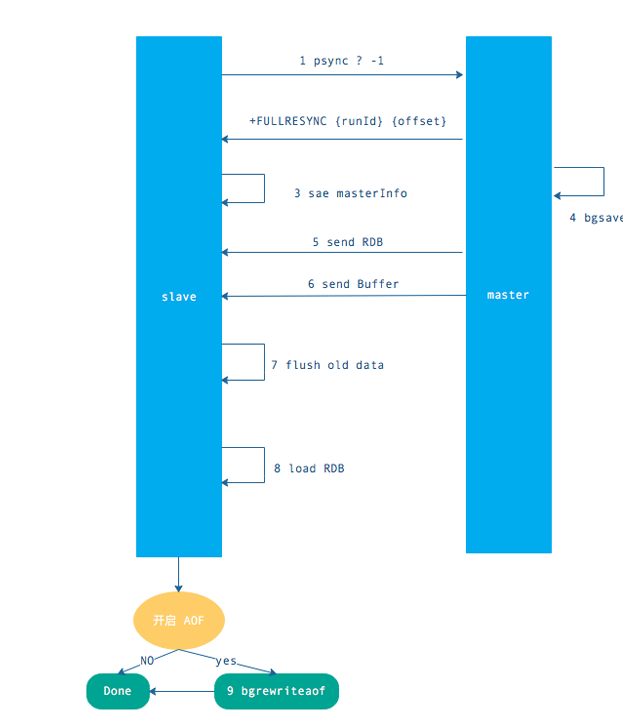
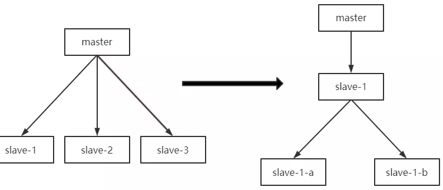

# 

1. 只一个redis服务器的数据，复制到其他redis服务器

2. 数据复制是单向的，只能 master -> slave

3. 主从复制作用

- 数据热备份，数据故障修复
- 负载均衡，主节点写，从节点进行读操作
- 高可用（防止一台服务器宕机）

# 主从复制过程

## 全量赋值过程

1. 第一次同步

2. master节点收到从服务器的psync命令,会fork一个子进程在后台执行bgsave命令，并将新写入的数据先写入到一个缓冲区中，bgsave执行完成之后,再将生成的RDB文件发送给slave节点，然后master节点再将缓冲区的内容以redis协议格式再全部发送给slave节点，slave节点先删除旧数据,slave节点将收到后的RDB文件载入自己的内存，再加载所有收到缓冲区的内容，从而这样一次完整的数据同步

## psync 命令的使用方式

命令格式为 psync{runId}{offset}

runId：从节点所复制主节点的运行 id

offset：当前从节点已复制的数据偏移量

从节点发送 psync 命令给主节点，runId 就是目标主节点的 ID，如果没有默认为 -1，offset 是从节点保存的复制偏移量，如果是第一次复制则为 -1.

## 增量复制的过程

 在全量同步之后再次需要同步时,从服务器只要发送当前的offset位置给主服务器，然后主服务器根据相应的位置将之后的数据(包括写在缓冲区的积压数据)发送给从服务器,再次将其保存到从节点内存即可

## 主从复制注意事项

### 避免全量复制

### 避免复制风暴

单主节点复制的风暴：当主节点重启后，多个从节点会同时从主节点复制数据，这样的话是会带来复制风暴，解决方式可以更换复制的架构，比如可以使用级联复制的架构

