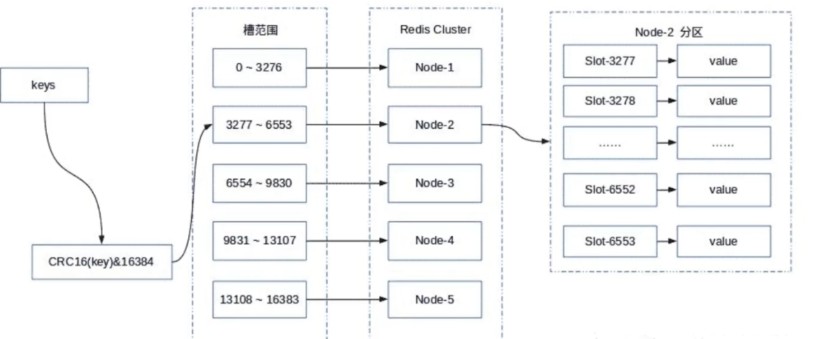

# 

Redis的哨兵模式基本已经可以实现高可用，读写分离 ，但是在这种模式下每台redis服务器都存储相同的数据，很浪费内存，因为一个master节点并不能放海量数据，而且单个Redis的实例过大时，会导致rdb文件过大，当执行主从同步时时间过长，所以在redis3.0上加入了cluster模式，实现的redis的分布式存储，也就是说每台redis节点上存储不同的内容。

> Redis-Cluster采用无中心结构,它的特点如下

- 所有的redis节点彼此互联(PING-PONG机制),内部使用二进制协议优化传输速度和带宽。

- 节点的fail是通过集群中超过半数的节点检测失效时才生效。

- 客户端与redis节点直连,不需要中间代理层.客户端不需要连接集群所有节点,连接集群中任何一个可用节点即可。

并发量大了-->主从复制解决
主从稳定性-->哨兵解决
单节点存储能力/写能力-->集群cluster解决

# 数据分区

redis 采用<b id="blue">虚拟槽分区</b>， redis 确定每个节点的槽范围



`优点`:每个node均匀的分配了slot，缩小增减节点影响的范围

`缺点`: 每个节点需要存储node和slot的对应信息

# 环境搭建

redis官网建议：集群最少3主3从节点

客户端执行命令:

-a : 指定密码

```shell
redis-cli -a 654321 --cluster create 192.168.1.31:8001 192.168.1.31:8002 192.168.1.31:8003 192.168.1.31:8004 192.168.1.31:8005 192.168.1.31:8006 --cluster-replicas 1
```

# 集群的常用命令

