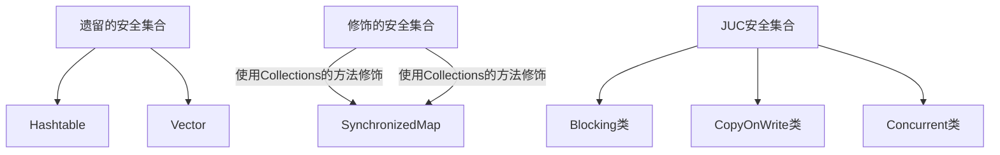

# 多线程效率问题

- 单核CPU下，多线程并不能实际的提高程序运行的效率，但是能够使不同的线程轮询使用cpu
- 多核下，可以并行的执行，可以提高效率


# 线程常见方法


# 主线程和守护线程

- 正常情况下，Java会等待所有线程结束，程序才会结束
- 特殊情况：守护线程不管有没有结束，主线程结束，都会强制结束
- 垃圾回收线程就是常见的守护线程

# 线程状态

## 从API层面

```java
public enum State {
    /**
     * 初始状态
     */
    NEW,

    /**
     * 保护运行/可运行/阻塞（操作系统的阻塞，如：io的阻塞accept）状态
     */
    RUNNABLE,

    /**
     * 阻塞状态：被锁住了
     */
    BLOCKED,

    /**
     * 阻塞：调用了wating/join
     */
    WAITING,

    /**
     * 阻塞：调用sleep
     */
    TIMED_WAITING,

    /**
     * Thread state for a terminated thread.
     * The thread has completed execution.
     */
    TERMINATED;
}
```

## 从操作系统角度

## 线程状态的转换

> NEW --> RUNNABLE  

1. NEW --> RUNNABLE  

> RUNNABLE <--> WAITING  

1. 调用 obj.wait() 方法时  
2. 调用 obj.notify() ， obj.notifyAll() ， t.interrupt()  
3. 当前线程调用 LockSupport.park() 方法会让当前线程从 RUNNABLE --> WAITING  

> RUNNABLE <--> WAITING  

1. 当前线程调用 t.join() 方法时，当前线程从 RUNNABLE --> WAITING  

> RUNNABLE <--> TIMED_WAITING  

1. 当前线程调用 Thread.sleep(long n) ，当前线程从 RUNNABLE --> TIMED_WAITING  

# 共享模型-管理


# 内存模型


# CAS


# 不可变对象

- 享元模式等不可变的类是线程安全的（单个方法是线程安全的）

- 采用final修饰
- 采用保护性拷贝

## final

- final的读，直接将final修饰的变量的值，复制一份，到调用的线程的栈中，他没有共享的操作
- 不加final，则直接getstatic，去堆内存（共享内存）获取

# 并发工具

## 自定义线程池

1. 线程池阻塞队列

- 队列的输出存储数组
- 锁
- 生产者条件变量：队列满了需要阻塞
- 消费者条件变量：队列空了需要阻塞
- 容量标记

2. 线程池主类

- 任务队列（存储待执行的线程）
- 线程集合（set集合，存储work，正在工作的线程集合）
- 线程数
- 超时时间：超过这个时间没使用这个线程就停掉这个线程

3. work类设计

- 执行线程的方法（继承Ruanable，重写run方法）
- Ruanable属性（用于通过构造参数接受线程，在run方法里直接调用）

## JDK的线程池

### ThreadPoolExecutor

- 线程池有一个整形参数
- 高三位表示线程池的状态

```java
private final AtomicInteger ctl = new AtomicInteger(ctlOf(RUNNING, 0));
```


## 线程池的工厂方法

### newFixedThreadPool  

- 核心线程数 == 最大线程数（没有救急线程被创建），因此也无需超时时间
- 阻塞队列是无界的，可以放任意数量的任务  

` 适用于任务量已知，相对耗时的任务`

```java
public static ExecutorService newFixedThreadPool(int nThreads) {
        return new ThreadPoolExecutor(nThreads, nThreads,
                                      0L, TimeUnit.MILLISECONDS,
                                      new LinkedBlockingQueue<Runnable>());
    }
```

### newCachedThreadPool  

- 核心线程数是 0， 最大线程数是 Integer.MAX_VALUE，救急线程的空闲生存时间是 60s，意味着全部都是救急线程（60s 后可以回收）  
- 队列采用了 SynchronousQueue 实现特点是，它没有容量，没有线程来取是放不进去的（一手交钱、一手交货）  

`适合任务数比较密集，但每个任务执行时间较短的情况  `

```java
public static ExecutorService newCachedThreadPool() {
    return new ThreadPoolExecutor(0, Integer.MAX_VALUE,
                                  60L, TimeUnit.SECONDS,
                                  new SynchronousQueue<Runnable>());
}
```

### newSingleThreadExecutor

`希望多个任务排队执行。线程数固定为 1，任务数多于 1 时，会放入无界队列排队。任务执行完毕，这唯一的线程也不会被释放。  `

```
public static ExecutorService newSingleThreadExecutor() {
    return new FinalizableDelegatedExecutorService
        (new ThreadPoolExecutor(1, 1,
                                0L, TimeUnit.MILLISECONDS,
                                new LinkedBlockingQueue<Runnable>()));
}
```

## 线程池提交任务

```java
// 执行任务
void execute(Runnable command);
// 提交任务 task，用返回值 Future 获得任务执行结果
<T> Future<T> submit(Callable<T> task);
// 提交 tasks 中所有任务
<T> List<Future<T>> 
    invokeAll(Collection<? extends Callable<T>> tasks)
					throws InterruptedException;
// 提交 tasks 中所有任务，带超时时间
<T> List<Future<T>> 
    invokeAll(Collection<? extends Callable<T>> tasks,
					long timeout, TimeUnit unit)
					throws InterruptedException;
// 提交 tasks 中所有任务，哪个任务先成功执行完毕，返回此任务执行结果，其它任务取消
<T> T invokeAny(Collection<? extends Callable<T>> tasks)
			throws InterruptedException, ExecutionException;

// 提交 tasks 中所有任务，哪个任务先成功执行完毕，返回此任务执行结果，其它任务取消，带超时时间
<T> T invokeAny(Collection<? extends Callable<T>> tasks,
				long timeout, TimeUnit unit)
		throws InterruptedException, ExecutionException, TimeoutException;
```


## 工作线程模式

- 让有限的工作线程（Worker Thread）来轮流异步处理无限多的任务。也可以将其归类为分工模式，它的典型实现
  就是线程池  

### 饥饿现象

- 一般只有固定大小的线程池才会有饥饿现象
- 如：A B线程都需要等待C线程执行完才能做事情，此时，线程池大小2，如果A B 同时执行，那么C永远不可能执行，则A B线程一直在等待

解决方案：

- 不同类型的线程分给不同的线程池工作

## 线程池配置

### CPU密集型

通常采用cpu核数＋1能够实现最优的CPU利用率，+l是保证当线程由于页缺失故障（操作系统）或其它原因导致暂停时，额外的这个线程就能顶上去，保证CPU时钟周期不被浪费

### IO密集型

CPU不总是处于繁忙状态，例如，当你执行业务计算时，这时候会使用CPU资源，但当你执行IO操作时、远程RPC调用时，包括进行数据库操作时，这时候CPU就闲下来了，你可以利用多线程提高它的利用率。

公式：

线程数=核数*期望CPU利用率 *总时间(CPU计算时间+等待时间)/ CPU 计算时间

## 定时调度

### Timer方式

在『任务调度线程池』功能加入之前，可以使用java.util.Timer来实现定时功能，Timer的优点在于简单易用，但由于所有任务都是由同一个线程来调度，因此所有任务都是串行执行的，同一时间只能有一个任务在执行，前一个任务的延迟或异常都将会影响到之后的任务。

```java
Timer timer = new Timer();

TimerTask timerTask1 = new TimerTask() {
    @Override
    public void run() {
        log.debug("延迟执行1......");
    }
};

timer.schedule(timerTask1, 1000);
```

### 线程池方式

- 延迟执行

```java
ScheduledExecutorService pool = Executors.newScheduledThreadPool(2);
pool.schedule(() -> {
    log.debug("pool1 ....");
}, 1, TimeUnit.SECONDS);
```

- 延迟执行（线程池）

1. 时间间隔：如果时间到了，上个线程池线程没执行完，等待它执行完后立马执行

```java
ScheduledExecutorService pool = Executors.newScheduledThreadPool(2);
pool.scheduleAtFixedRate(() -> {
    log.debug("pool2 ....");
}, 1, 2, TimeUnit.SECONDS);
// 初始延迟，  时间间隔 ，  时间单位
```

2. 时间间隔：从上一个线程执行完毕后，开始算时间

```java
ScheduledExecutorService pool = Executors.newScheduledThreadPool(2);
pool.scheduleWithFixedDelay(() -> {
    log.debug("pool2 ....");
}, 1, 2, TimeUnit.SECONDS);
```

- 定时执行

```java
LocalDateTime now = LocalDateTime.now();
LocalDateTime time = now.withHour(11).withMinute(19).withSecond(0).with(DayOfWeek.WEDNESDAY);
if(now.compareTo(time) > 0) {
    //如果当前时间>需要定时的时间，则定时时间延迟一周
    time.plusWeeks(1);
}
log.debug("下次执行时间：{}", time);
long millis = Duration.between(now, time).toMillis();
//一个星期的时间间隔
long period = 1000*60*24*7;
ScheduledExecutorService pool = Executors.newScheduledThreadPool(2);
//执行定时任务，延迟到定时的时间，然后每次执行
pool.scheduleAtFixedRate(() -> {
    log.debug("执行定时任务...");
}, millis, period, TimeUnit.MILLISECONDS);
```

## Fork/Join

- Fork/Join 是 JDK 1.7 加入的新的线程池实现，它体现的是一种分治思想，适用于能够进行任务拆分的 cpu 密集型运算  

- 所谓的任务拆分，是将一个大任务拆分为算法上相同的小任务，直至不能拆分可以直接求解。跟递归相关的一些计算，如归并排序、斐波那契数列、都可以用分治思想进行求解  
- Fork/Join 默认会创建与 cpu 核心数大小相同的线程池  

```java
public static void main(String[] args) {
    ForkJoinPool pool = new ForkJoinPool(3);
    Integer i = pool.invoke(new MyTask(5));
    log.debug("计算结果：{}", i);
}

static class MyTask extends RecursiveTask<Integer> {
    int i;
    public MyTask(int i) {
        this.i = i;
    }
    @Override
    protected Integer compute() {
        log.debug("开始计算： {}", i);
        if(i==1) {
            return i;
        }
        MyTask task = new MyTask(i - 1);
        //执行任务
        ForkJoinTask<Integer> fork = task.fork();
        return i+fork.join();
    }
}
```

# JUC


#


# 集合类



- Blocking 大部分实现基于锁，并提供用来阻塞的方法  
- CopyOnWrite 之类容器修改开销相对较重  
- Concurrent 类型的容器  

1. 内部很多操作使用 cas 优化，一般可以提供较高吞吐量  
2. 弱一致性  
   1. 遍历时弱一致性，例如，当利用迭代器遍历时，如果容器发生修改，迭代器仍然可以继续进行遍
      历，这时内容是旧的  
   2. 求大小弱一致性，size 操作未必是 100% 准确  

## ConcurrentHashMap

## 重要属性

```java
// 默认为 0
// 当初始化时, 为 -1
// 当扩容时, 为 -(1 + 扩容线程数)
// 当初始化或扩容完成后，为 下一次的扩容的阈值大小
private transient volatile int sizeCtl;
// 整个 ConcurrentHashMap 就是一个 Node[]
static class Node<K,V> implements Map.Entry<K,V> {}
// hash 表
transient volatile Node<K,V>[] table;
// 扩容时的 新 hash 表
private transient volatile Node<K,V>[] nextTable;
// 扩容时如果某个 bin 迁移完毕, 用 ForwardingNode 作为旧 table bin 的头结点
static final class ForwardingNode<K,V> extends Node<K,V> {}
// 用在 compute 以及 computeIfAbsent 时, 用来占位, 计算完成后替换为普通 Node
static final class ReservationNode<K,V> extends Node<K,V> {}
// 作为 treebin 的头节点, 存储 root 和 first
static final class TreeBin<K,V> extends Node<K,V> {}
// 作为 treebin 的节点, 存储 parent, left, right
static final class TreeNode<K,V> extends Node<K,V> {}
```


### 构造方法

- 参数：初始化大小，扩容的阈值（默认3/4）， 并发度
- 可以看到实现了懒惰初始化(JDK8)，在构造方法中仅仅计算了table的大小，以后在第一次使用时才会真正创建

```java
public ConcurrentHashMap(int initialCapacity,
                         float loadFactor, int concurrencyLevel) {
    if (!(loadFactor > 0.0f) || initialCapacity < 0 || concurrencyLevel <= 0)
        throw new IllegalArgumentException();
    //如果初始化大小小于并发度，那么就将并发度赋值给初始化大小
    if (initialCapacity < concurrencyLevel)
        initialCapacity = concurrencyLevel;   
    long size = (long)(1.0 + (long)initialCapacity / loadFactor);
    //因为size计算出来可能不是2^n,此处保证他是2^n（计算hash的要求）
    //所以我们构造传入的大小不一定是真实大小（current特点）
    int cap = (size >= (long)MAXIMUM_CAPACITY) ?
        MAXIMUM_CAPACITY : tableSizeFor((int)size);
    this.sizeCtl = cap;
}
```

### get流程

- 整个get流程没有锁，因为数组被valitalex修饰，然后使用sun.misc.Unsafe#getObjectVolatile来保证数组元素的可见性

```java
public V get(Object key) {
    Node<K,V>[] tab; Node<K,V> e, p; int n, eh; K ek;
    //保证计算的hash值是一个正整数
    int h = spread(key.hashCode());
    if ((tab = table) != null && (n = tab.length) > 0 &&
        //定位到数组下标
        (e = tabAt(tab, (n - 1) & h)) != null) {
        //判断头结点是不是要查找的key
        if ((eh = e.hash) == h) {
            if ((ek = e.key) == key || (ek != null && key.equals(ek)))
                return e.val;
        }
        else if (eh < 0)
            return (p = e.find(h, key)) != null ? p.val : null;
        while ((e = e.next) != null) {
            if (e.hash == h &&
                ((ek = e.key) == key || (ek != null && key.equals(ek))))
                return e.val;
        }
    }
    return null;
}
```

### put流程

```java
final V putVal(K key, V value, boolean onlyIfAbsent) {
    //key不能有空值（与hashmap不同）
    if (key == null || value == null) throw new NullPointerException();
    int hash = spread(key.hashCode());
    int binCount = 0;
    for (Node<K,V>[] tab = table;;) {
        Node<K,V> f; int n, i, fh;
        //hash表还没有创建，初始化hash表
        if (tab == null || (n = tab.length) == 0)
            //采用cas初始化hash表
            tab = initTable();
        //创建链表头结点
        else if ((f = tabAt(tab, i = (n - 1) & hash)) == null) {
            //cas的方式创建头结点
            if (casTabAt(tab, i, null,
                         new Node<K,V>(hash, key, value, null)))
                break;                   // no lock when adding to empty bin
        }
        //锁住当前链表，去帮忙扩容
        else if ((fh = f.hash) == MOVED)
            tab = helpTransfer(tab, f);
        else {
            //发生桶下标的冲突
            V oldVal = null;
            //锁住链表头部
            synchronized (f) {
                //确保头结点没有被移动过，则进行put操作
                if (tabAt(tab, i) == f) {
                    //普通结点的hash>0，
                    if (fh >= 0) {
                        binCount = 1;
                        //遍历链表
                        for (Node<K,V> e = f;; ++binCount) {
                            K ek;
                            //寻找相同的key，如果相同则进行更新value
                            if (e.hash == hash &&
                                ((ek = e.key) == key ||
                                 (ek != null && key.equals(ek)))) {
                                oldVal = e.val;
                                if (!onlyIfAbsent)
                                    e.val = value;
                                break;
                            }
                            Node<K,V> pred = e;
                            if ((e = e.next) == null) {
                                pred.next = new Node<K,V>(hash, key,
                                                          value, null);
                                break;
                            }
                        }
                    }
                    //红黑树
                    else if (f instanceof TreeBin) {
                        Node<K,V> p;
                        binCount = 2;
                        if ((p = ((TreeBin<K,V>)f).putTreeVal(hash, key,
                                                       value)) != null) {
                            oldVal = p.val;
                            if (!onlyIfAbsent)
                                p.val = value;
                        }
                    }
                }
            }
            //bincout!=0，说明有hash冲突，则进行了链表操作
            if (binCount != 0) {
                //如果cout>=8则进行树化
                //数化前先扩容，hash表超过64,才考虑树化
                if (binCount >= TREEIFY_THRESHOLD)
                    treeifyBin(tab, i);
                if (oldVal != null)
                    return oldVal;
                break;
            }
        }
    }
    addCount(1L, binCount);
    return null;
}
```

### 初始化hash表

- 采用cas的方式进行创建表

```java
private final Node<K,V>[] initTable() {
    Node<K,V>[] tab; int sc;
    while ((tab = table) == null || tab.length == 0) {
        if ((sc = sizeCtl) < 0)
            Thread.yield();
        //SIZECTL=-1 表示正在创建当前表
        else if (U.compareAndSwapInt(this, SIZECTL, sc, -1)) {
            try {
                if ((tab = table) == null || tab.length == 0) {
                    int n = (sc > 0) ? sc : DEFAULT_CAPACITY;
                    @SuppressWarnings("unchecked")
                    Node<K,V>[] nt = (Node<K,V>[])new Node<?,?>[n];
                    table = tab = nt;
                    sc = n - (n >>> 2);
                }
            } finally {
                sizeCtl = sc;
            }
            break;
        }
    }
    return tab;
}
```

### addCount

**增加元素表的计数**

- 当hash表数量超过sizeCtl则对数组执行扩容操作； 将数组长度扩大为原来的2倍；
- 记录当前hash表的数量；

```java
//计数值，当前链表的长度
private final void addCount(long x, int check) {
    //设置多个累加单元
    CounterCell[] as; long b, s;
    //如果有累加单元，则往累加单元操作
    if ((as = counterCells) != null ||
        //如果还没有累加单元，则往基础值累加（cas操作）如果cas失败，证明有竞争，则进行累加单元操作
        !U.compareAndSwapLong(this, BASECOUNT, b = baseCount, s = b + x)) {
        CounterCell a; long v; int m;
        boolean uncontended = true;
        if (as == null || (m = as.length - 1) < 0 ||
            (a = as[ThreadLocalRandom.getProbe() & m]) == null ||
            //执行累加单元的累加操作，并判断是否成功
            !(uncontended =
              U.compareAndSwapLong(a, CELLVALUE, v = a.value, v + x))) {
            //创建累加单元cell的数组
            fullAddCount(x, uncontended);
            return;
        }
        //检测链表操作
        if (check <= 1)
            return;
        s = sumCount();
    }
    if (check >= 0) {
        Node<K,V>[] tab, nt; int n, sc;
        //判断元素的个数是否大于阈值
        while (s >= (long)(sc = sizeCtl) 
               && (tab = table) != null &&
               (n = tab.length) < MAXIMUM_CAPACITY) {
            int rs = resizeStamp(n);
            if (sc < 0) {
                if ((sc >>> RESIZE_STAMP_SHIFT) != rs || sc == rs + 1 ||
                    sc == rs + MAX_RESIZERS || (nt = nextTable) == null ||
                    transferIndex <= 0)
                    break;
                if (U.compareAndSwapInt(this, SIZECTL, sc, sc + 1))
                    transfer(tab, nt);
            }
            //需要扩容操作
            else if (U.compareAndSwapInt(this, SIZECTL, sc,
                                         (rs << RESIZE_STAMP_SHIFT) + 2))
                //扩容： 原来的hash表，新的hash表（新hash表示懒触发的）
                transfer(tab, null);
            s = sumCount();
        }
    }
}
```

### size计算

- size计算实际发生在put，remove改变集合元素的操作之中（addcount）
- 没有竞争发生，向baseCount 累加计数
- 有竞争发生，新建counterCells，向其中的一个 cell累加计数(类似longadder  )
  - counterCells初始有两个cell
  - 如果计数竞争比较激烈，会创建新的cell来累加计数

```java
public int size() {
    long n = sumCount();
    return ((n < 0L) ? 0 :
            (n > (long)Integer.MAX_VALUE) ? Integer.MAX_VALUE :
            (int)n);
}
```

```java
final long sumCount() {
    CounterCell[] as = counterCells; CounterCell a;
    long sum = baseCount;
    if (as != null) {
        //汇总所有的累加单元进行相加
        for (int i = 0; i < as.length; ++i) {
            if ((a = as[i]) != null)
                sum += a.value;
        }
    }
    return sum;
}
```

## JAVA7

它维护了一个segment 数组，每个segment对应一把锁

- 优点:如果多个线程访问不同的segment，实际是没有冲突的，这与jdk8中是类似的
- 缺点：Segments 数组默认大小为16，这个容量初始化指定后就不能改变了，并且不是懒惰初始化  

