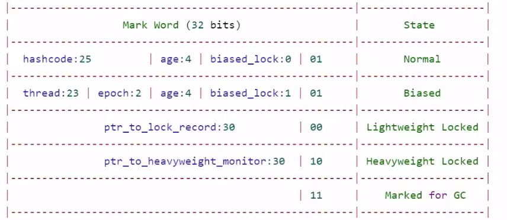
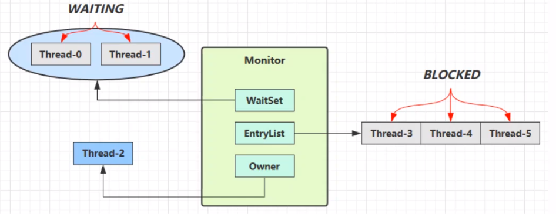
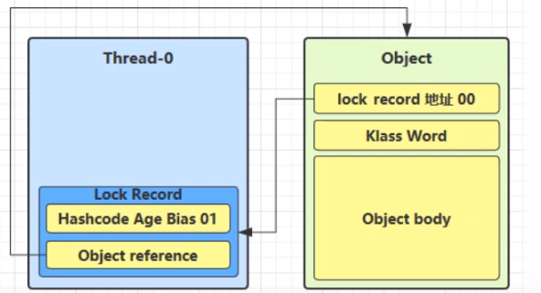
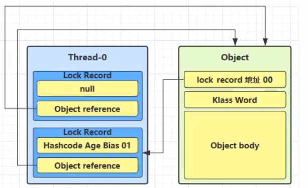
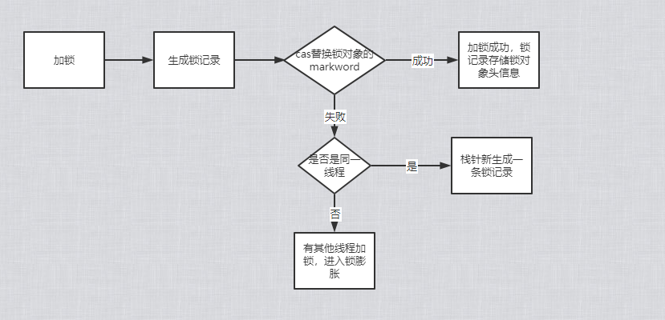
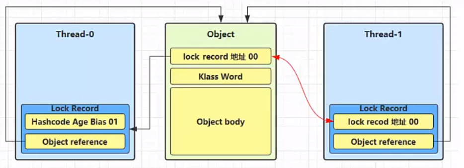
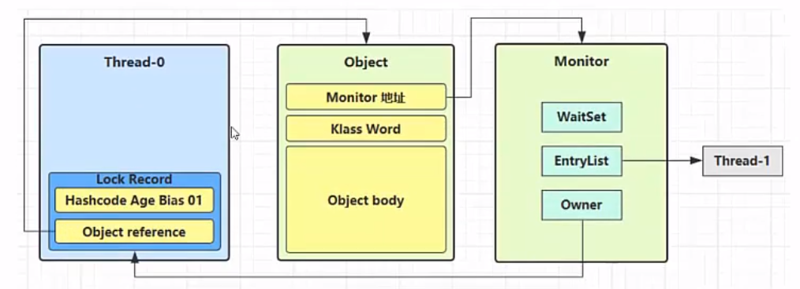

# Java对象头

一般我们new的对象，都由对象头和对象的成员属性组成

> 普通对象头结构

- 一个对象的大小
  - 此处以32位虚拟机为例-----如：一个Integer：8个字节对象头+4个字节的数据，int 只有4个字节数据

> Klass Word

存储了对象类型的指针：如：String类型， Student的类型

> Mark Word结构

- age: 垃圾回收的年龄
- biased_lock：是否是偏向锁
- 最后两位：锁状态

# Monitor对象

## 简介

- monitor是操作系统提供的对象
- 每个Java对象都可以关联一个Monitor对象，如果使用synchronized给对象上锁〈重量级)之后，该对象头的Mark Word 中就被设置指向**Monitor对象的指针**

## 结构

- monitor里面的owner属性指向抢到锁的线程
- 此时另外一个线程来抢这个锁，则monitor的的EntryList指向抢锁的线程
- 当线程执行完，将EntryList中的线程全部唤醒，继续抢锁
- waitSet:存放wait状态的线程集合

# 轻量级锁

## 使用场景

- 如果一个对象虽然有多线程访问，但多线程访问的时间是错开的（也就是没有竞争)，那么可以使用轻量级锁来优化。
- 即，线程A加锁解锁 完了以后， 线程B再加锁解锁
- 轻量级锁是没有阻塞的概念的

## 轻量级锁加锁过程

1. 当执行到加锁模块时，栈帧中生成一个锁记录的结构，内部存储锁定的对象和Mark Word

2. 让锁记录中Object reference指向锁对象，并尝试用cas替换Object的Mark Word，将Mark Word 的值存入锁记录
3. 如果cas替换成功，对象头中存储了锁记录地址和状态00，表示由该线程给对象加锁(此时，obj的分带年龄，锁标识等都存储到锁记录中，将来解锁可以恢复过去)

4. 如果CAS失败，则有一下两种情况
   1. 如果是其它线程已经持有了该Object的轻量级锁，这时表明有竞争，进入锁膨胀过程
   2. 如果是自己执行了synchronized锁重入，那么再添加一条Lock Record作为重入的计数

5. 当退出synchronized代码块（解锁时）锁记录的值不为null（为null表示为锁重入），这时使用cas将 Mark Word的值恢复给对象头
   1. 成功，解锁成功
   2. 失败，说明轻量级锁进行了锁膨胀或已经升级为重量级锁，进入重量级锁解锁流程

> 简单的流程图

# 锁膨胀

如果在尝试加轻量级锁的过程中，CAS操作无法成功，这时一种情况就是有其它线程为此对象加上了轻量级锁(有竞争)，这时需要进行锁膨胀，将轻量级锁变为重量级锁。

1. 当Thread1 去申请轻量锁的时候，发现obj锁状态是00（轻量级）

2. 此时进入锁膨胀流程
   1. Object对象申请monitor锁，让Object指向monitor重量级锁地址，owner指向已经申请好锁的Thread0,Entrylist阻塞队列存储一个Thread1
   2. monitor地址状态变为10（重量级锁）

3. Thread0解锁的时候，发现锁膨胀，则它进入重量级锁解锁流程
   1. Owner设置为空
   2. 唤醒EntryList的线程

# 自旋优化

重量级锁竞争的时候，还可以使用自旋来进行优化，如果当前线程自旋成功(即这时候持锁线程已经退出了同步块，释放了锁)，这时当前线程就可以避免阻塞。