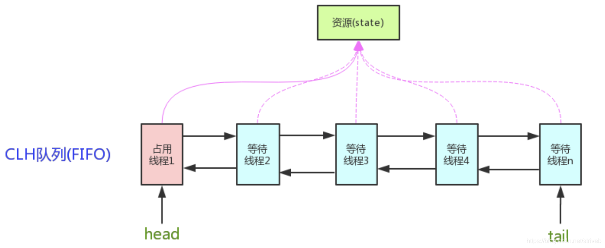
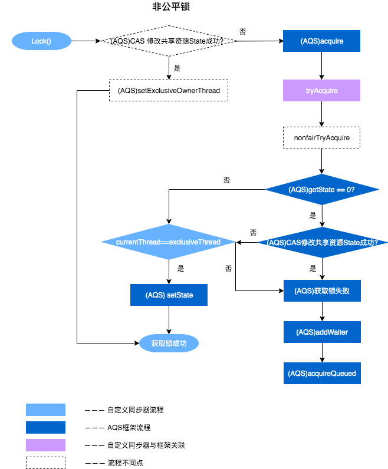
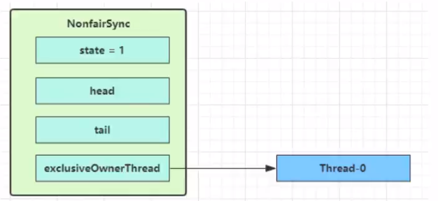
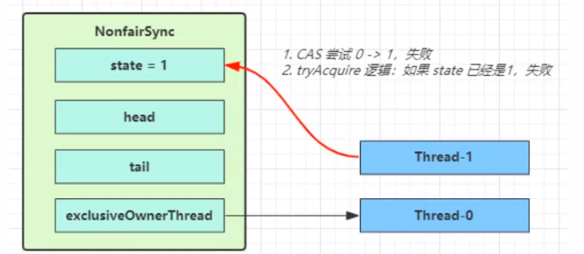
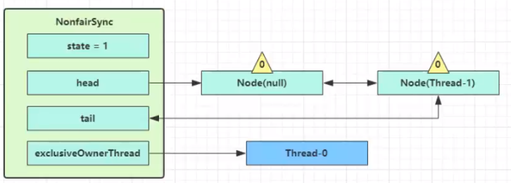
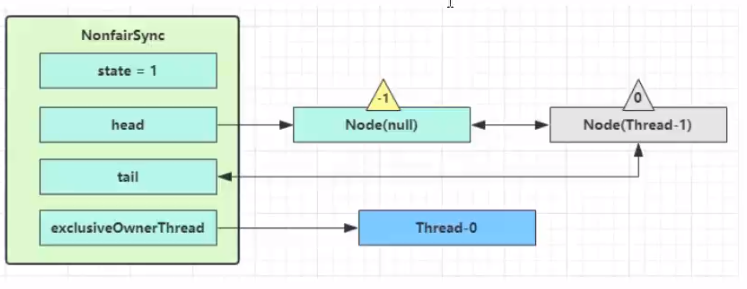
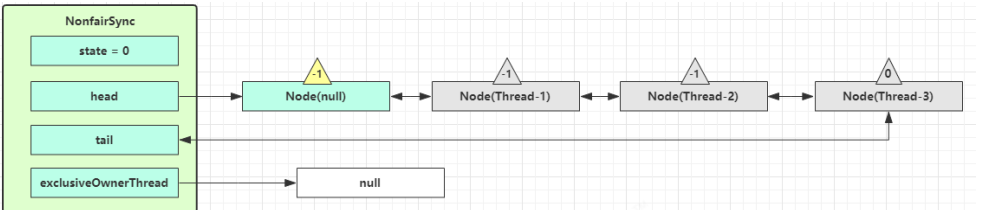
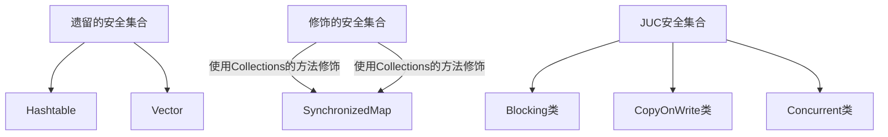

# 
# AQS

全称是AbstractQueuedSynchronizer，是阻塞式锁(如synchronized 就是阻塞的锁，cas不是)和相关的同步器工具的框架

特点：

1. **用state属性来表示资源的状态**（分独占模式（只有一个线程可以占用）和共享模式)，子类需要定义如何维护这个状态，控制如何获取锁和释放锁
2. 提供了基于FIFO（先进先出）的等待队列，类似于Monitor的EntryList
3. 条件变量来实现等待、唤醒机制，支持多个条件变量，类似于Monitor的WaitSet



AQS定义两种资源共享方式：Exclusive（独占，只有一个线程能执行，如ReentrantLock）和Share（共享，多个线程可同时执行，如Semaphore/CountDownLatch）

```
isHeldExclusively()：该线程是否正在独占资源。只有用到condition才需要去实现它。
tryAcquire(int)：独占方式。尝试获取资源，成功则返回true，失败则返回false。
tryRelease(int)：独占方式。尝试释放资源，成功则返回true，失败则返回false。
tryAcquireShared(int)：共享方式。尝试获取资源。负数表示失败；0表示成功，但没有剩余可用资源；正数表示成功，且有剩余资源。
tryReleaseShared(int)：共享方式。尝试释放资源，如果释放后允许唤醒后续等待结点返回true，否则返回false。

```


## 加锁基本原理

重写AbstractQueuedSynchronizer.tryAcquire,来对AbstractQueuedSynchronizer.state状态进行修改

调用AbstractQueuedSynchronizer.tryAcquire判断能不能修改成功，用来判断是否加锁成功

```java
// 如果获取锁失败
if (!tryAcquire(arg)) {
// 入队, 可以选择阻塞当前线程 park unpark
}
```

- 释放锁的姿势

```java
// 如果释放锁成功
if (tryRelease(arg)) {
// 让阻塞线程恢复运行
}
```

## AQS基本实现

getState()、setState()和 compareAndSetState()，均是原子操作,用来对state字段进行操作

### 基本流程



### 代码片段

这段代码，在compareAndSetState失败后，没有做wait处理，如果想看wait处理可以参考ReentrantLock

```java
public static void main(String[] args) {
    MyLock lock = new MyLock();
    new Thread(() -> {
        lock.lock();
        log.debug("线程执行中....");
        sleep(2000);
        lock.unlock();
    }).start();
    new Thread(() -> {
        lock.lock();
        log.debug("线程执行中....");
        lock.unlock();
        log.debug("解锁成功");
    }).start();
}

static class MyLock implements Lock {
    //自定义同步器
    class MySync extends AbstractQueuedSynchronizer {
        @Override
        protected boolean tryAcquire(int arg) {
            //尝试加锁，
            if(compareAndSetState(0, arg)) {
                //设置锁拥有的线程为当前线程
                setExclusiveOwnerThread(Thread.currentThread());
                return true;
            }
            return false;
        }

        @Override
        protected boolean tryRelease(int arg) {
            //尝试解锁
            setExclusiveOwnerThread(null);
            //此处不需要cas是因为只有一个线程会释放锁
            setState(0);
            return true;
        }

        @Override
        protected boolean isHeldExclusively() {
            //是否持有独占锁
            return getState()==1;
        }

        public Condition newCondition() {
            return new ConditionObject();
        }
    }

    MySync mySync = new MySync();
    @Override
    public void lock() {
        //尝试，不成功，进入等待队列
        mySync.acquire(1);
    }

    @Override
    public void lockInterruptibly() throws InterruptedException {
        //尝试一次，不成功返回，不进入队列
        mySync.acquireInterruptibly(1);
    }

    @Override
    public boolean tryLock() {
        //尝试一次，不成功返回，不进入队列
        return mySync.tryAcquire(1);
    }

    @Override
    public boolean tryLock(long time, TimeUnit unit) throws InterruptedException {
        //尝试，不成功，进入等待队列，有时限
        return mySync.tryAcquireNanos(1, unit.toNanos(time));
    }

    @Override
    public void unlock() {
        mySync.release(1);
    }

    @Override
    public Condition newCondition() {
        return mySync.newCondition();
    }
}
```

# ReentrantLock

## 特点

1. 可中断（如A线程持有锁，B线程可以中断他）

trylock也可以被打断，被打断抛出异常

```java
//尝试去获取锁，当有竞争时，进入阻塞队列
//当其他线程调用打断时，抛出异常
lock.lockInterruptibly();
```


2. 设置超时时间

超时未获取到锁则返回false

```java
lock.tryLock(1, TimeUnit.SECONDS)
```

3. 可以设置为公平锁（可以防止线程饥饿问题） 
4. 支持多个条件变量 
5. 可重入   

```java
public static void method1() {
    lock.lock();
    try {
        method2();
    } finally {
        lock.unlock();
    }
}
public static void method2() {
    lock.lock();
    try {

    } finally {
        lock.unlock();
    }
}
```

## 公平锁

- 按照获取尝试获取锁的顺序给予资源
- 通过构造方法创建公平锁

```java
ReentrantLock lock = new ReentrantLock(true);
```

- 公平锁会降低并发度

## 条件变量

- 类似synchronized的wait
- 使用方式：

1. 必须在lock中使用
2. 创建某个条件（将来调用await方法的线程都会进入这个条件中阻塞）
3. 调用await方法，进入阻塞
4. 另外一个线程调用signal唤醒，线程去竞争锁

```java
//一把锁可以创建多个条件
Condition condition1 = lock.newCondition();
Condition condition2 = lock.newCondition();

condition1.await();
//唤醒某一个锁
condition1.signal();
```


# ReentrantLock原理

## 非公平锁原理

- 构造器中，默认实现的sync是一个非公平的锁，他们都继承自AQS

```java
public ReentrantLock() {
    sync = new NonfairSync();
}
```

### 加锁过程

1. 没有锁竞争的时候



```java
final void lock() {
    if (compareAndSetState(0, 1))
        //将状态改为1，线程设置当前线程
        setExclusiveOwnerThread(Thread.currentThread());
    else
        acquire(1);
}
```
2. 出现第一个锁竞争的时候   

```java
public final void acquire(int arg) {
    if (!tryAcquire(arg) &&
        acquireQueued(addWaiter(Node.EXCLUSIVE), arg))
        selfInterrupt();
}
```
1. CAS 尝试将 state 由 0 改为 1，结果失败  
2. 进入 tryAcquire 逻辑，这时 state 已经是1，结果仍然失败  
 
3. 接下来进入 addWaiter 逻辑，构造 Node 队列  
4. 第一个 Node 称为 Dummy（哑元）或哨兵，用来占位，并不关联线程     
5. 0表示正常状态，-1表示有责任唤醒下一个线程    

6. 进入 parkAndCheckInterrupt， Thread-1 park（灰色表示park当前线程）  


### 释放锁原理

```java
public final boolean release(int arg) {
    if (tryRelease(arg)) {
        Node h = head;
        if (h != null && h.waitStatus != 0)
            unparkSuccessor(h);
        return true;
    }
    return false;
}
```
Thread-0 释放锁，进入 tryRelease 流程，如果成功  
1. 设置 exclusiveOwnerThread 为 null ,state =0 
2. 当前队列不为 null，并且 head 的 waitStatus = -1，进入unparkSuccessor 流程,找到队列中离 head 最近的一个 Node（没取消的），unpark 恢复其运行，本例中即为 Thread-1  

3. 此时如果有另外一个线程来竞争，则会体现非公平锁的特征(thread1和thread4同时竞争)


## 重入锁原理

### 加锁原理
当发现锁重入时，state+1
```java
final boolean nonfairTryAcquire(int acquires) {
    final Thread current = Thread.currentThread();
    int c = getState();
    if (c == 0) {
        if (compareAndSetState(0, acquires)) {
            setExclusiveOwnerThread(current);
            return true;
        }
    }
    //如果已经获得了锁, 线程还是当前线程, 表示发生了锁重入
    else if (current == getExclusiveOwnerThread()) {
        // state++
        int nextc = c + acquires;
        if (nextc < 0) 
            throw new Error("Maximum lock count exceeded");
        setState(nextc);
        return true;
    }
    return false;
}
```

### 解锁流程

```java
protected final boolean tryRelease(int releases) {
    int c = getState() - releases;
    if (Thread.currentThread() != getExclusiveOwnerThread())
        throw new IllegalMonitorStateException();
    boolean free = false;
    // 支持锁重入, 只有 state 减为 0, 才释放成功
    if (c == 0) {
        free = true;
        setExclusiveOwnerThread(null);
    }
    setState(c);
    return free;
}
```

## 条件变量实现原理 
### await原理
由图可以看到 ConditionObject 结构也是个双向链表
1. 开始 Thread-0 持有锁，Thread-0 调用 await，进入 ConditionObject 的 addConditionWaiter 流程；创建新的 Node 状态为-2（Node.CONDITION），关联 Thread-0，加入等待队列尾部  
2. park 阻塞 Thread-0 ，  阻塞队列Thread-1，竞争到锁    

### signal原理 
假设 Thread-1 要来唤醒 Thread-0  

1. 进入 ConditionObject 的 doSignal 流程，取得等待队列中第一个 Node，即 Thread-0 所在 Node  
2. 将该 Node 加入 AQS 队列尾部，将 Thread-0 的 waitStatus 改为 0，Thread-3 的waitStatus 改为 -1  （表示它有责任唤醒THread-0） 


# 读写锁

1. ReentrantReadWriteLock  
2. 让读-读并发，其他的互斥  
3. **需要注意的是，readlock里面，在unlock之间，不能嵌套WriteLock**
## 使用示例
```java
static class Container {
    ReentrantReadWriteLock rw =  new ReentrantReadWriteLock();
    ReentrantReadWriteLock.ReadLock r = rw.readLock();
    ReentrantReadWriteLock.WriteLock w = rw.writeLock();
    public void read() {
        r.lock();
        try {
            log.debug("开始读.....");
            sleep(1000);
        } finally {
            r.unlock();
        }
    }
    public void writer() {
        w.lock();
        try {
            log.debug("开始写.....");
            sleep(1000);
        } finally {
            w.unlock();
        }
    }
}
```

## 注意事项

- 读锁不支持条件变量  
- 重入时升级不支持：即持有读锁的情况下去获取写锁，会导致获取写锁永久等待 
- 重入时降级支持：即持有写锁的情况下去获取读锁  

## 应用

- 读写锁可以应用在缓存中
- 如：查询的时候只需要加读锁，当进行缓存更新时，添加写锁

## 原理

- 成功上锁，流程与 ReentrantLock 加锁相比没有特殊之处，不同是写锁状态占了 state 的低 16 位，而读锁使用的是 state 的高 16 位  

# StampedLock
1. 该类自 JDK 8 加入，是为了进一步优化读性能，它的特点是在使用读锁、写锁时都必须配合【搓】使用  
2. 读的时候先验证下戳，如果戳没有改动，则证明，没有其他锁产生，此时不需要再进行加锁 

- StampedLock 不支持条件变量  
- StampedLock 不支持可重入 

```java
public static class Container {
    StampedLock lock = new StampedLock();
    public String read() {
        //进行乐观读，获取戳
        long stamp = lock.tryOptimisticRead();
        //模拟做了很多不可描述的事情
        //此时可能发生其他锁产生
        sleep(1000);
        //验戳
        if(lock.validate(stamp)) {
            log.debug("==> 中间没有发生其他锁");
            return "直接读出来的";
        }
        //验证失败，此时锁升级成读锁
        try {
            log.debug("==> 开始锁升级");
            stamp = lock.readLock();
            sleep(1000);
            log.debug("==> 读锁后产生的数据");
            return "==> 读锁后产生的数据";
        } finally {
            lock.unlock(stamp);
        }
    }
    public void writer() {
        long stamp = lock.writeLock();
        try {
            sleep(2000);
            log.debug("==> 开始写事件");
        } finally {
            lock.unlock(stamp);
        }
    }
}
```
# Semaphore 
信号量，用来限制能同时访问共享资源的线程上限（同一个时刻，范围这个资源的限制）

- 只能限制线程数，不能限制资源数
- 如果线程数和资源数对应（如连接池），可以采用

```java
//当线程满了三个之后，线程阻塞
Semaphore semaphore = new Semaphore(3);
for(int i=0; i < 30; i++) {
    new Thread(() -> {
        try {
            semaphore.acquire();
        } catch (InterruptedException e) {
            e.printStackTrace();
        }
        try {
            log.debug("==> 开始执行");
            sleep(1000);
        } finally {
            semaphore.release();
        }
    }).start();
}
```

## 原理

- permits(线程的限制数量)赋值给state
- 当state<0时，其他线程阻塞
- 如：thread3 thread4竞争失败，进入AQS队列park阻塞


# Countdownlatch

用来进行线程同步协作，等待所有线程完成倒计时  
其中构造参数用来初始化等待计数值，await() 用来等待计数归零，countDown() 用来让计数减一  

## API
```java
CountDownLatch(int count) //实例化一个倒计数器，count指定计数个数
countDown() // 计数减一
await() //等待，当计数减到0时，所有线程并行执行
```

## 示例

```java
CountDownLatch countDownLatch = new CountDownLatch(3);
for (int i=1; i<=3; i++) {
    int iTmp = i;
    new Thread(() -> {
        sleep(iTmp*1000);
        countDownLatch.countDown();
        log.debug("==> 一个线程执行");
    }).start();
}
try {
    log.debug("==> waiting");
    countDownLatch.await();
    log.debug("==> 等待结束");
} catch (InterruptedException e) {
    e.printStackTrace();
}
```

## 使用场景

- 如：游戏组队，需要所有的队员都加载完毕才能进入游戏

# CyclicBarrier

- 让一组线程到达一个屏障点进入阻塞线程，阻塞线程执行完再唤醒业务线程
- 它是可以重用的

```java
Runnable runnable = new Runnable() {
    public void run() {
        System.out.println("召唤神龙");
    }
};
//当达到7时，进入阻塞线程
final  CyclicBarrier cyclicBarrier = new CyclicBarrier(7, runnable);
for(int i=1; i<=7; i++){
    final int tmp = i;
    new Thread(new Runnable() {
        public void run() {
            System.out.println("第"+tmp);
            try{
                //使cyclicBarrier+1
                cyclicBarrier.await();
            }catch(Exception e){
            }
        }
    }).start();
}
```


# 集合类



- Blocking 大部分实现基于锁，并提供用来阻塞的方法  
- CopyOnWrite 之类容器修改开销相对较重  
- Concurrent 类型的容器  

1. 内部很多操作使用 cas 优化，一般可以提供较高吞吐量  
2. 弱一致性  
   1. 遍历时弱一致性，例如，当利用迭代器遍历时，如果容器发生修改，迭代器仍然可以继续进行遍
      历，这时内容是旧的  
   2. 求大小弱一致性，size 操作未必是 100% 准确  

## ConcurrentHashMap

## 重要属性

```java
// 默认为 0
// 当初始化时, 为 -1
// 当扩容时, 为 -(1 + 扩容线程数)
// 当初始化或扩容完成后，为 下一次的扩容的阈值大小
private transient volatile int sizeCtl;
// 整个 ConcurrentHashMap 就是一个 Node[]
static class Node<K,V> implements Map.Entry<K,V> {}
// hash 表
transient volatile Node<K,V>[] table;
// 扩容时的 新 hash 表
private transient volatile Node<K,V>[] nextTable;
// 扩容时如果某个 bin 迁移完毕, 用 ForwardingNode 作为旧 table bin 的头结点
static final class ForwardingNode<K,V> extends Node<K,V> {}
// 用在 compute 以及 computeIfAbsent 时, 用来占位, 计算完成后替换为普通 Node
static final class ReservationNode<K,V> extends Node<K,V> {}
// 作为 treebin 的头节点, 存储 root 和 first
static final class TreeBin<K,V> extends Node<K,V> {}
// 作为 treebin 的节点, 存储 parent, left, right
static final class TreeNode<K,V> extends Node<K,V> {}
```


### 构造方法

- 参数：初始化大小，扩容的阈值（默认3/4）， 并发度
- 可以看到实现了懒惰初始化(JDK8)，在构造方法中仅仅计算了table的大小，以后在第一次使用时才会真正创建

```java
public ConcurrentHashMap(int initialCapacity,
                         float loadFactor, int concurrencyLevel) {
    if (!(loadFactor > 0.0f) || initialCapacity < 0 || concurrencyLevel <= 0)
        throw new IllegalArgumentException();
    //如果初始化大小小于并发度，那么就将并发度赋值给初始化大小
    if (initialCapacity < concurrencyLevel)
        initialCapacity = concurrencyLevel;   
    long size = (long)(1.0 + (long)initialCapacity / loadFactor);
    //因为size计算出来可能不是2^n,此处保证他是2^n（计算hash的要求）
    //所以我们构造传入的大小不一定是真实大小（current特点）
    int cap = (size >= (long)MAXIMUM_CAPACITY) ?
        MAXIMUM_CAPACITY : tableSizeFor((int)size);
    this.sizeCtl = cap;
}
```

### get流程

- 整个get流程没有锁，因为数组被valitalex修饰，然后使用sun.misc.Unsafe#getObjectVolatile来保证数组元素的可见性

```java
public V get(Object key) {
    Node<K,V>[] tab; Node<K,V> e, p; int n, eh; K ek;
    //保证计算的hash值是一个正整数
    int h = spread(key.hashCode());
    if ((tab = table) != null && (n = tab.length) > 0 &&
        //定位到数组下标
        (e = tabAt(tab, (n - 1) & h)) != null) {
        //判断头结点是不是要查找的key
        if ((eh = e.hash) == h) {
            if ((ek = e.key) == key || (ek != null && key.equals(ek)))
                return e.val;
        }
        else if (eh < 0)
            return (p = e.find(h, key)) != null ? p.val : null;
        while ((e = e.next) != null) {
            if (e.hash == h &&
                ((ek = e.key) == key || (ek != null && key.equals(ek))))
                return e.val;
        }
    }
    return null;
}
```

### put流程

```java
final V putVal(K key, V value, boolean onlyIfAbsent) {
    //key不能有空值（与hashmap不同）
    if (key == null || value == null) throw new NullPointerException();
    int hash = spread(key.hashCode());
    int binCount = 0;
    for (Node<K,V>[] tab = table;;) {
        Node<K,V> f; int n, i, fh;
        //hash表还没有创建，初始化hash表
        if (tab == null || (n = tab.length) == 0)
            //采用cas初始化hash表
            tab = initTable();
        //创建链表头结点
        else if ((f = tabAt(tab, i = (n - 1) & hash)) == null) {
            //cas的方式创建头结点
            if (casTabAt(tab, i, null,
                         new Node<K,V>(hash, key, value, null)))
                break;                   // no lock when adding to empty bin
        }
        //锁住当前链表，去帮忙扩容
        else if ((fh = f.hash) == MOVED)
            tab = helpTransfer(tab, f);
        else {
            //发生桶下标的冲突
            V oldVal = null;
            //锁住链表头部
            synchronized (f) {
                //确保头结点没有被移动过，则进行put操作
                if (tabAt(tab, i) == f) {
                    //普通结点的hash>0，
                    if (fh >= 0) {
                        binCount = 1;
                        //遍历链表
                        for (Node<K,V> e = f;; ++binCount) {
                            K ek;
                            //寻找相同的key，如果相同则进行更新value
                            if (e.hash == hash &&
                                ((ek = e.key) == key ||
                                 (ek != null && key.equals(ek)))) {
                                oldVal = e.val;
                                if (!onlyIfAbsent)
                                    e.val = value;
                                break;
                            }
                            Node<K,V> pred = e;
                            if ((e = e.next) == null) {
                                pred.next = new Node<K,V>(hash, key,
                                                          value, null);
                                break;
                            }
                        }
                    }
                    //红黑树
                    else if (f instanceof TreeBin) {
                        Node<K,V> p;
                        binCount = 2;
                        if ((p = ((TreeBin<K,V>)f).putTreeVal(hash, key,
                                                       value)) != null) {
                            oldVal = p.val;
                            if (!onlyIfAbsent)
                                p.val = value;
                        }
                    }
                }
            }
            //bincout!=0，说明有hash冲突，则进行了链表操作
            if (binCount != 0) {
                //如果cout>=8则进行树化
                //数化前先扩容，hash表超过64,才考虑树化
                if (binCount >= TREEIFY_THRESHOLD)
                    treeifyBin(tab, i);
                if (oldVal != null)
                    return oldVal;
                break;
            }
        }
    }
    addCount(1L, binCount);
    return null;
}
```

### 初始化hash表

- 采用cas的方式进行创建表

```java
private final Node<K,V>[] initTable() {
    Node<K,V>[] tab; int sc;
    while ((tab = table) == null || tab.length == 0) {
        if ((sc = sizeCtl) < 0)
            Thread.yield();
        //SIZECTL=-1 表示正在创建当前表
        else if (U.compareAndSwapInt(this, SIZECTL, sc, -1)) {
            try {
                if ((tab = table) == null || tab.length == 0) {
                    int n = (sc > 0) ? sc : DEFAULT_CAPACITY;
                    @SuppressWarnings("unchecked")
                    Node<K,V>[] nt = (Node<K,V>[])new Node<?,?>[n];
                    table = tab = nt;
                    sc = n - (n >>> 2);
                }
            } finally {
                sizeCtl = sc;
            }
            break;
        }
    }
    return tab;
}
```

### addCount

**增加元素表的计数**

- 当hash表数量超过sizeCtl则对数组执行扩容操作； 将数组长度扩大为原来的2倍；
- 记录当前hash表的数量；

```java
//计数值，当前链表的长度
private final void addCount(long x, int check) {
    //设置多个累加单元
    CounterCell[] as; long b, s;
    //如果有累加单元，则往累加单元操作
    if ((as = counterCells) != null ||
        //如果还没有累加单元，则往基础值累加（cas操作）如果cas失败，证明有竞争，则进行累加单元操作
        !U.compareAndSwapLong(this, BASECOUNT, b = baseCount, s = b + x)) {
        CounterCell a; long v; int m;
        boolean uncontended = true;
        if (as == null || (m = as.length - 1) < 0 ||
            (a = as[ThreadLocalRandom.getProbe() & m]) == null ||
            //执行累加单元的累加操作，并判断是否成功
            !(uncontended =
              U.compareAndSwapLong(a, CELLVALUE, v = a.value, v + x))) {
            //创建累加单元cell的数组
            fullAddCount(x, uncontended);
            return;
        }
        //检测链表操作
        if (check <= 1)
            return;
        s = sumCount();
    }
    if (check >= 0) {
        Node<K,V>[] tab, nt; int n, sc;
        //判断元素的个数是否大于阈值
        while (s >= (long)(sc = sizeCtl) 
               && (tab = table) != null &&
               (n = tab.length) < MAXIMUM_CAPACITY) {
            int rs = resizeStamp(n);
            if (sc < 0) {
                if ((sc >>> RESIZE_STAMP_SHIFT) != rs || sc == rs + 1 ||
                    sc == rs + MAX_RESIZERS || (nt = nextTable) == null ||
                    transferIndex <= 0)
                    break;
                if (U.compareAndSwapInt(this, SIZECTL, sc, sc + 1))
                    transfer(tab, nt);
            }
            //需要扩容操作
            else if (U.compareAndSwapInt(this, SIZECTL, sc,
                                         (rs << RESIZE_STAMP_SHIFT) + 2))
                //扩容： 原来的hash表，新的hash表（新hash表示懒触发的）
                transfer(tab, null);
            s = sumCount();
        }
    }
}
```

### size计算

- size计算实际发生在put，remove改变集合元素的操作之中（addcount）
- 没有竞争发生，向baseCount 累加计数
- 有竞争发生，新建counterCells，向其中的一个 cell累加计数(类似longadder  )
  - counterCells初始有两个cell
  - 如果计数竞争比较激烈，会创建新的cell来累加计数

```java
public int size() {
    long n = sumCount();
    return ((n < 0L) ? 0 :
            (n > (long)Integer.MAX_VALUE) ? Integer.MAX_VALUE :
            (int)n);
}
```

```java
final long sumCount() {
    CounterCell[] as = counterCells; CounterCell a;
    long sum = baseCount;
    if (as != null) {
        //汇总所有的累加单元进行相加
        for (int i = 0; i < as.length; ++i) {
            if ((a = as[i]) != null)
                sum += a.value;
        }
    }
    return sum;
}
```

## JAVA7

它维护了一个segment 数组，每个segment对应一把锁

- 优点:如果多个线程访问不同的segment，实际是没有冲突的，这与jdk8中是类似的
- 缺点：Segments 数组默认大小为16，这个容量初始化指定后就不能改变了，并且不是懒惰初始化  

