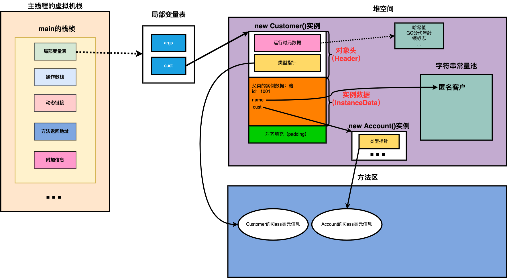

# 对象实例化

## 对象创建方式

- new 
  - 变形1：xxx的静态方法
  - 变性2：xxxbuilder/xxxfactory
- Class的newInstance()(反射的方式，只能调用空参的构造器，权限必须是public)
- Constructor的newInstance()
  - 可以调用空参和带参的构造器
  - 权限没有要求

```java
//调用有参的构造方法生成类实例
Constructor<InternalClass> constructor
        = InternalClass.class.getDeclaredConstructor(new Class[] {Integer.class});
InternalClass instance = constructor.newInstance(new Integer[] {1});
log.debug("instance {}", instance);
```

- 使用clone()
  - 当前类需要实现Cloneable的接口
- 使用反序列化
  - 从文件中/网络中获取对象的二进制流

## 创建对象步骤

1. 判断对应的类是否加载、链接、初始化
    - new指令，首先检查这个指令的参数能不能在Metasoace常量池定位到符号引用，检测到了证明这个类被加载了， 就直接使用
    - 没有，在双亲委派模式下加载类
2. 为对象分配内存
    - 规整内存------指针碰撞
    - 不规整内存--------虚拟机维护列表，记录哪些可用，哪些不可用
3. 处理并发安全问题
    - 采用CAS
    - 每个线程分配一个TLAB
4. 初始化分配到空间(属性的默认初始化，零值初始化)
5. 设置对象头
    - 记录当前所属的类
    - 记录hash值
6. 执行init方法进行初始化(类构造器<init>)


# 对象内存布局


## 对象头

1. 运行时元数据
    - hash值（hashcode）
    - GC分代年龄
    - 锁状态标志
2. 类型指针
    - 指向类元数据instanceKlass，确定该对象的类型
3. 如果创建的是数组，还需要记录数组的长度

## 实例数据
instance data

*说明*

- 他是对象的真正存储有效信息

*规则*

- 相同宽度的字段总是被分配在一起
- 父类定义的变量会出现在子类之前

## 对齐填充

- 不是必须，就起到占位符作用


## 简单的示例

```java
public class CustomerTest {
    public static void main(String[] args) {
        Customer cust = new Customer();
    }
}
```

- 局部变量表存了一个cust的变量
- cust指向堆空间

