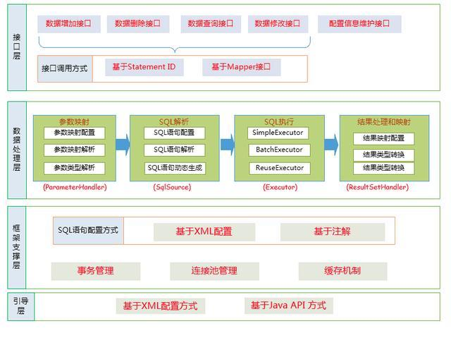
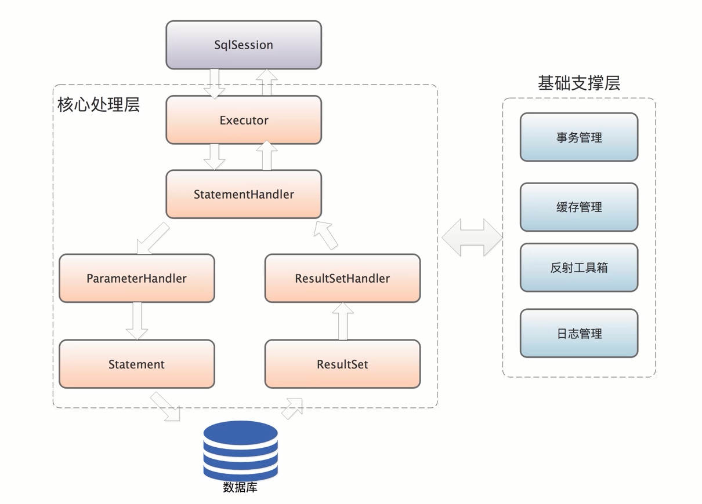
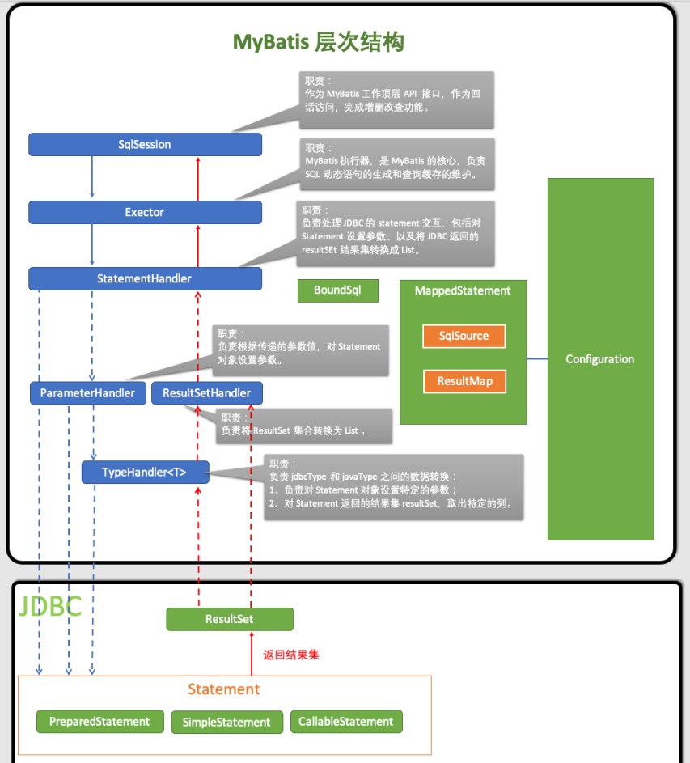

# 架构图

# 总体架构




# 执行顺序



# 层次结构



1. *SqlSession*：作为MyBatis工作的主要顶层API，表示和数据库交互的会话，完成必要数据库增删改查功能
2. *Executor*：MyBatis执行器，是MyBatis 调度的核心，负责SQL语句的生成和查询缓存的维护
3. *StatementHandler*：封装了JDBC Statement操作，负责对JDBC statement 的操作，如设置参数、将Statement结果集转换成List集合
4. *ParameterHandler*：负责对用户传递的参数转换成JDBC Statement 所需要的参数
5. *ResultSetHandler*：负责将JDBC返回的ResultSet结果集对象转换成List类型的集合
6. *TypeHandler*： 
7. *MappedStatement*：MappedStatement维护了一条<select|update|delete|insert>节点的封装
8. *SqlSource*：负责根据用户传递的parameterObject，动态地生成SQL语句，将信息封装到BoundSql对象中，并返回
9. *BoundSql*：表示动态生成的SQL语句以及相应的参数信息
10. *Configuration*：MyBatis所有的配置信息都维持在Configuration对象之中

# 相关反射类

## Reflector

```java
 // 对应的Class 类型 
  private final Class<?> type;
  // 可读属性的名称集合 可读属性就是存在 getter方法的属性，初始值为null
  private final String[] readablePropertyNames;
  // 可写属性的名称集合 可写属性就是存在 setter方法的属性，初始值为null
  private final String[] writablePropertyNames;
  // 记录了属性相应的setter方法，key是属性名称，value是Invoker方法
  // 他是对setter方法对应Method对象的封装
  private final Map<String, Invoker> setMethods = new HashMap<>();
  // 属性相应的getter方法
  private final Map<String, Invoker> getMethods = new HashMap<>();
  // 记录了相应setter方法的参数类型，key是属性名称 value是setter方法的参数类型
  private final Map<String, Class<?>> setTypes = new HashMap<>();
  // 和上面的对应
  private final Map<String, Class<?>> getTypes = new HashMap<>();
  // 记录了默认的构造方法
  private Constructor<?> defaultConstructor;
  // 记录了所有属性名称的集合
  private Map<String, String> caseInsensitivePropertyMap = new HashMap<>();
```

## ReflectorFactory

```java
public interface ReflectorFactory {
  // 检测该ReflectorFactory是否缓存了Reflector对象
  boolean isClassCacheEnabled();
  // 设置是否缓存Reflector对象
  void setClassCacheEnabled(boolean classCacheEnabled);
  // 创建指定了Class的Reflector对象
  Reflector findForClass(Class<?> type);
}
```

## 调用示例

```java
ReflectorFactory factory = new DefaultReflectorFactory();
Reflector reflector = factory.findForClass(Student.class);
System.out.println("可读属性:"+Arrays.toString(reflector.getGetablePropertyNames()));
System.out.println("可写属性:"+Arrays.toString(reflector.getSetablePropertyNames()));
System.out.println("是否具有默认的构造器:" + reflector.hasDefaultConstructor());
System.out.println("Reflector对应的Class:" + reflector.getType());
```