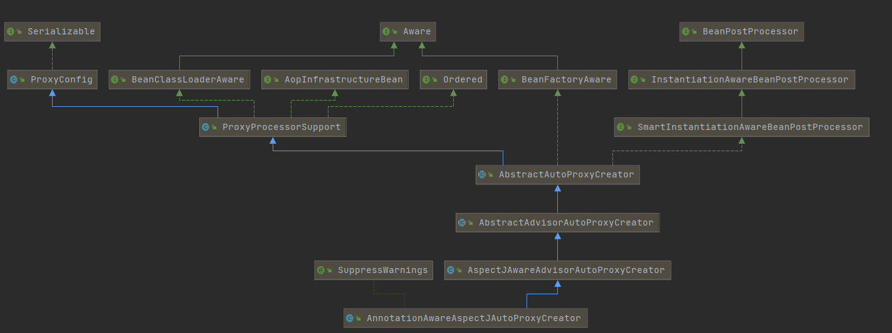

#

>  EnableAspectJAutoProxy

1. Spring的Aop起源于@EnableAspectJAutoProxy注解

```java
@Import(AspectJAutoProxyRegistrar.class)
public @interface EnableAspectJAutoProxy
```

2. 这个注解是一个Spring的Enable编程，利用ImportBeanDefinitionRegistrar进行注册
   1. 它在这个方法里注册了AnnotationAwareAspectJAutoProxyCreator（自动代理注册器）这个bean

>AnnotationAwareAspectJAutoProxyCreator



1. 我们发现这个类实现了BeanPostProcessor后置处理器和 Aware模型
   1. 凡是Aware的都会有一个setBeanFactory方法
   2. BeanPostProcessor在refresh方法注册阶段进行创建
2. 在后置通知方法AbstractAutoProxyCreator#postProcessAfterInitialization中
   1. 通过AbstractAutoProxyCreator#wrapIfNecessary代理对象的创建
   2. 注意：**Spring 默认是jdk代理的，如果是直接使用类而不是接口，则是cglib**
   3. 当强制使用cglib时：需要配置`spring.aop.proxy-target-class=true`或`@EnableAspectJAutoProxy(proxyTargetClass = true`)

> 执行阶段

 JdkDynamicAopProxy/CglibAopProxy将每一个通知方法又被包装为方法拦截器，形成一条责任链调用

