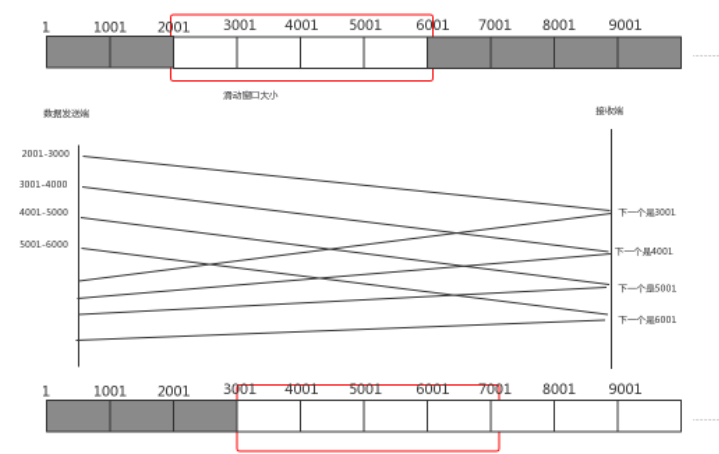
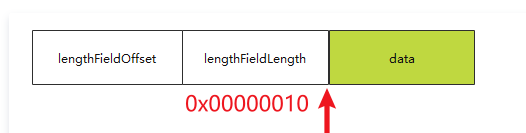

# Netty高级解决方案

# 黏包半包

**只要我们使用**<b id="blue">TCP-IP</b>**协议，都会产生这个现象**

> 黏包现象
>
> `有10个10k数据，我希望是10k发一次，但是服务器一次性把这10个10k一次发过去了`

> 半包现象
>
> `有10K一个完整的数据，我希望一次发送过去，但是服务器将10K分为两次发送过去`

## TCP滑动窗口

1. TCP以一个段(segment)为单位，每发送一个段就需要进行一次确认应答(ack)处理，但如果这么做，缺点是包的往返时间越长性能就越差
2. 为了解决此问题，引入了窗口概念，窗口大小即决定了无需等待应答而可以继续发送的数据最大值

> 图解

1. 窗口大小为4格，当从2001开始发送消息，一直到6001都不需要无需ACK应答
2. 等到7001时，则不能再发送，因为受到了滑动窗口的大小限制
3. 当接收到2001的应答后，窗口右移，此时7001可以发送
4. 窗口越大，则网络的吞吐率就越高



> 窗口造成半包现象

如果一段数据，发送的时候，正好只能发送一部分就达到了窗口的大小，那么这个时候就会造成半包的现象

> 窗口造成黏包现象

如果多段数据都在窗口内，则可能造成黏包现象（窗口缓存了多段报文）

## Nagle算法

`会造成黏包现象`

> 发送数据不会来一条发一条，而是缓存到一定大小，发送

## 总结

> 黏包

1. 应用层:接收方 ByteBuf 设置太大(Netty默认1024)
2. 滑动窗口:假设发送方256 bytes 表示一个完整报文，但由于接收方处理不及时且窗口大小足够大，这256 bytes字节就会缓冲在接收方的滑动窗口中，当滑动窗口中缓冲了多个报文就会粘包
3. Nagle算法:会造成粘包

> 半包

1. 应用层:接收方ByteBuf 小于实际发送数据量
2. 滑动窗口:假设接收方的窗口只剩了128 bytes，发送方的报文大小是256 bytes，这时放不下了，只能先发送前128 bytes，等待ack后才能发送剩余部分，这就造成了半包
3. MSS限制:当发送的数据超过MSS限制后，会将数据切分发送，就会造成半包

## 解决方案（解码器）

> 短连接
>
> **可以解决粘包问题，不能解决拆包问题**

在发送完数据之后，就断开连接

> 定长的消息解码器

1. 客户端和服务器端约定一个长度N，如果消息不满N，则用特殊字符填充
2. 约定的长度一定要是所有字符串中最长的那个

3. netty中的解码器：io.netty.handler.codec.FixedLengthFrameDecoder

> 分割符解码器 

1. netty中的解码器（使用换行符作为分隔符）：io.netty.handler.codec.LineBasedFrameDecoder
2. netty中的解码器（自定义分隔符）：io.netty.handler.codec.DelimiterBasedFrameDecoder

> 基于字段长度（LTC）
>
> `分为两个部分：内容长度+实际内容`

1. io.netty.handler.codec.LengthFieldBasedFrameDecoder
2. 字段解析
   1.  lengthFieldOffset：长度字段偏移量
   2.  lengthFieldLength：长度字段的长度
   3.  lengthAdjustment：以长度字段为基准，再过*lengthAdjustment*字节是内容
   4.  initialBytesToStrip：从头剥离几个字节，剩下的字节作为解析字节



lengthAdjustment：

1. 如果报文 length = 10，content真正的长度为10，后续报文 = content = 10，那 lengthAdjustment = 0，报文长度无修修正
2. 如果报文 length = 15，content真正的长度为10（说明length代表整个报文的长度，也就是 length + header+ content ），后续报文 = content = 10，后续报文和length（15）不等，所以报文长度需要修正，lengthAdjustment = -5

# 简单的Http服务


```java
public static void main(String[] args) {
    new ServerBootstrap()
            .group(new NioEventLoopGroup())
            .channel(NioServerSocketChannel.class)
            .childHandler(new ChannelInitializer<NioSocketChannel>() {
                @Override
                protected void initChannel(NioSocketChannel ch) throws Exception {
                    ch.pipeline().addLast(new LoggingHandler());
                    ch.pipeline().addLast(new HttpServerCodec());
                    ch.pipeline().addLast(new ChannelInboundHandlerAdapter() {
                        @Override
                        public void channelRead(ChannelHandlerContext ctx, Object msg) throws Exception {
                            //会收到两个
                            //请求行：class io.netty.handler.codec.http.DefaultHttpRequest
                            //请求体：class io.netty.handler.codec.http.LastHttpContent$1
                            log.debug("收到客户端请求：{}", msg.getClass());
                            if(msg instanceof DefaultHttpRequest) {
                                DefaultHttpRequest request = (DefaultHttpRequest) msg;
                                log.debug(request.uri());
                                DefaultFullHttpResponse response
                                        = new DefaultFullHttpResponse(request.protocolVersion(), HttpResponseStatus.OK);
                                response.content().writeBytes("<h1>hello</h1>".getBytes(StandardCharsets.UTF_8));
                                ctx.writeAndFlush(response);
                            }
                        }
                    });
                }
            }).bind(80);
}
```

# 自定义协议

## 要素

1. 魔数，用来在第一时间判定是否是无效数据包（如：jvm字节码以cafebaby开头）
2. 版本号，可以支持协议的升级
3. 序列化算法，消息正文到底采用哪种序列化反序列化方式，可以由此扩展，例如：json、protobuf、hessian、jdk
4. 指令类型，是登录、注册、单聊、群聊... 跟业务相关
5. 请求序号，为了双工通信，提供异步能力（如：发送123，消息不一定以123这个顺序来发）
6. 正文长度
6. 消息正文


# 标识线程安全的Handler

*@Sharable*: 这个注解标识，当前handler是线程安全的（<b id="blue">LoggingHandler</b>），可以共享使用，如果不标识这个注解，表示当前handler不是线程安全的

- 如果我们为了防止子类注释*@Sharable*,可以参考`io.netty.channel.ChannelHandlerAdapter#ensureNotSharable`的写法

# 连接假死

> 出现原因

1. 网络设备出现故障，例如网卡，机房等，底层的TCP 连接已经断开了，但应用程序没有感知到，仍然占用着资源。
2. 公网网络不稳定，出现丢包。如果连续出现丢包，这时现象就是客户端数据发不出去，服务端也—直收不到数据，就这么—直耗着
3. 应用程序线程阻塞，无法进行数据读写

> 产生问题

1. 假死的连接占用的资源不能自动释放
2. 向假死的连接发送数据，得到的反馈是发送超时

## IdleStateHandler

使用这个handler可以在没有读写事件后，编写一些操作

*IdleStateHandler*：

-  readerIdleTimeSeconds：表示多少秒没有读就会触发IdleState.READER_IDLE事件
-  writerIdleTimeSeconds： 表示多少秒没有写就会触发事件（**不关注就写0**）
-  allIdleTimeSeconds： 表示多少秒没有读或者写就会触发事件

```java
ch.pipeline().addLast(new IdleStateHandler(5, 0, 0 ));
ch.pipeline().addLast(new ChannelDuplexHandler() {
    @Override
    public void userEventTriggered(ChannelHandlerContext ctx, Object evt) throws Exception {
        if(evt instanceof IdleStateEvent) {
            IdleStateEvent event = (IdleStateEvent) evt;
            if(event.state() == IdleState.READER_IDLE) {
                log.debug("已经5s没有读数据了");
            }
        }
    }
});
```

*ChannelDuplexHandler*：入站和出站都会经过

*userEventTriggered*：特殊事件经过方法

## 心跳数据包

服务器端检测到客户端没有发送数据，可能不是客户端网络断了，而是客户端没有用户操作，那么此时服务器端断开客户端的网络是不合适的

所以此时，*客户端*可以定期的向*服务器*端发送心跳数据

客户端写的心跳包时间一般是客户端读的时间一半，如：此时是3s

> 客户端添加代码

```java
ch.pipeline().addLast(new IdleStateHandler(0, 3, 0 ));
ch.pipeline().addLast(new ChannelDuplexHandler() {
    @Override
    public void userEventTriggered(ChannelHandlerContext ctx, Object evt) throws Exception {
        if(evt instanceof IdleStateEvent) {
            IdleStateEvent event = (IdleStateEvent) evt;
            if(event.state() == IdleState.WRITER_IDLE) {
                log.debug("已经3s没有写数据了");
            }
        }
    }
});
```


