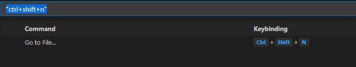
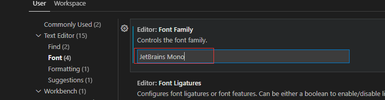
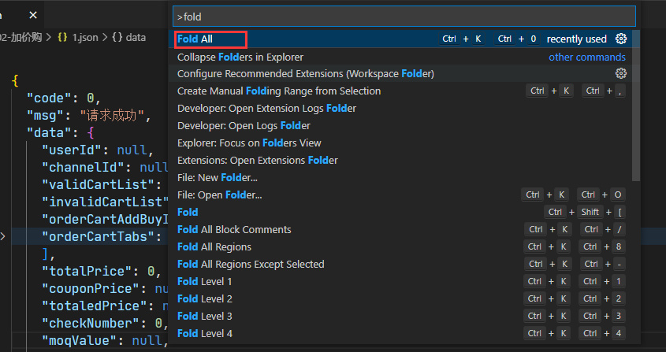

#

# 修改快捷方式

打开默认键盘快捷方式设置：
File -> Preferences -> Keyboard Shortcuts

# 几个常见的快捷键修改

## 格式化

## 搜索文件

## 方法提示

## 触发提示

# 字体调整

File -> Preferences -> setting

# 插件

## GIT

### Git Graph

显示git分支相关信息

## Git History

显示历史

# 折叠代码块

右键进入命令行

搜索fold

# json处理

> json 树结构处理

安装完后，点击右上角

