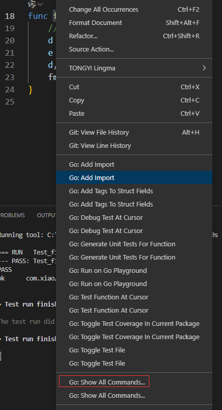

#

# Go 在VSCode里面的一些调用

# 插件的安装

前置条件：必须要配置GoPath, 这些插件，会安装在go的bin目录下

在此之前请先设置`GOPROXY`（因为go依赖需要翻墙），打开终端执行以下命令（修改代理）：

```bash
go env -w GOPROXY=https://goproxy.cn,direct
```

或者环境变量配置


1. 安装go的插件 

2. Windows平台按下`Ctrl+Shift+P`，Mac平台按`Command+Shift+P`，这个时候VS Code界面会弹出一个输入框，我们在这个输入框中输入`>go:install`，
   下面会自动搜索相关命令，我们选择`Go:Install/Update Tools`这个命令，按下图选中并会回车执行该命令（或者使用鼠标点击该命令）


# 生成Go的调试方法

1. 写一个方法，点击右键，找到show all comments



2. 找到这个，点击生成


3. 在Todo的地方补充单元测试


4. 如果在测试用例中，想打印log，则可以在设置里加-v


