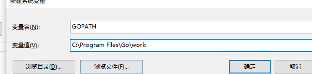
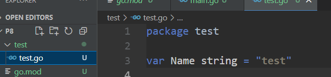
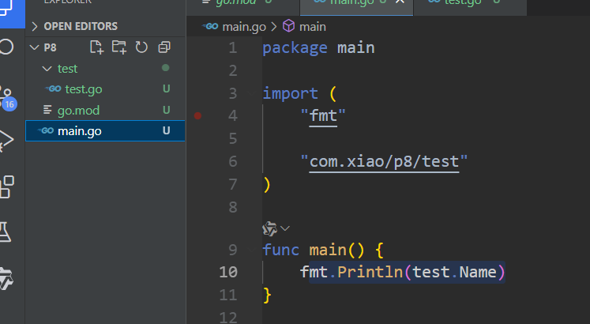

# 基础

## 标准文档

https://studygolang.com/pkgdoc

## 安装

> 下载地址

Go官网下载地址：https://golang.org/dl/

Go官方镜像站（推荐）：https://golang.google.cn/dl/

## 环境变量

1. 配置GOROOT,用于全局执行go相关的命令

GOROOT的变量值即为GO的安装目录


path配置


2. 配置GOPATH、

GOPATH的变量值即为存储Go语言工作的目录

新建几个目录：

bin: 存放编译的二进制文件

pkg：存放编译后的库文件

src：存放源码文件



3. 打开命令行工具，输入命令go env,看环境配置的相关信息

## hello word

1. 编写代码

```go
package main

import "fmt"

func main() {
	fmt.Printf("hello word")
}

```

2. 编译和运行

- 在当前项目路径下编译

```shell
PS D:\git\gitee\go\src\gofirst\hello> go build .\HelloWord.go
PS D:\git\gitee\go\src\gofirst\hello> .\HelloWord.exe
hello word
```

- 在其他路径编译

gopath 的src下路径编译

```shell
go build github.com/helloword/helloword.go
```

## 基本结构介绍

> package main

编译为一个可执行文件

并且必须要有个main函数

```go
func main() {
}
```

> import "fmt"

导入包

## 变量声明

`go语言的变量必须先声明再使用`，当一个变量被声明后，系统会自动赋予他零值

```tex
int为0，float为0.0, bool 为false , string为空字符串，指针为nil
```

> 格式

var 变量名  变量类型

### 批量声明

var (

变量名1  变量类型

变量名2  变量类型

变量名3  变量类型

)

`变量声明必须要使用`

### 类型推导

通常我们会将变量不声明类型，因为能够跟进赋值类型推导变量类型

*不建议使用这种不带类型的定义方式，我们最好是标明类型*

```go
var s1 = "老肖";
fmt.Println(s1);
```

### 短变量声明

`只能在函数中使用`

```go
s2 := "laoxiao"
fmt.Println(s2)
```

<b id="gray">重复定义</b>

一般情况下是不允许重复定义的，但是有一种特例，比如，一个方法，返回一个值和一个err，那么这个err是可以重复定义的

```go
c1, err = f1()
c2, err = f2()
```


### 匿名变量

有的时候，方法返回两个值，但是我们只需要其中一个，而go变量赋值又必须使用，所以我们可以采用 _  来接收变量值，

匿名变量不占用命名空间，不占用内存

```go
func main() {
	x, _ := func1()
	fmt.Println("x=", x)
}

func func1() (int, string) {
	return 1, "haha"
}
```

## 类型别名/定义

### 别名

如果使用 alias_int作为变量定义，则这个变量的类型为int

```go
type  alias_int = int
```

### 定义

如果使用 new_int 作为变量定义，则这个变量的类型为new_int

```go
type new_int int
```

## 基础数据类型

### 整型

包括有符号整型： int int32 int64

无符号： uint uint32

因为<b id="gray">int/uint</b>在不同机器大小可能变化，一般不建议使用

### 浮点型

诵堂应该优先使用float64类型，因为float32类型的累计计算误差很容易扩散，并且float32能精确表示的正整数并不是很大。

比如：

```go
var f float32 = 1 << 24
//true
fmt.Println(f == f+1)
```

### 字符类型

一种是uint8类型，或者叫 byte型，代表了ASCll码的一个字符。

另一种是rune类型，代表一个UTF-8字符，当需要处理中文、日文或者其他复合字符时，则需要用到rune类型。rune类型等价于int32类型。

1. byte

定义一个字符的常用方式：

```go
// var b byte = 'A'
var b byte = 65
fmt.Printf("%c", b)
```

2. rune

Go语言同样支持 Unicode (UTF-8)，用rune来表示，在内存中使用int来表示

在书写Unicode 字符时，需要在16进制数之前加上前缀\u或者\U。如果需要使用到4字节则使用\u前缀，如果需要使用到8个字节，则使用\U前缀。

### 字符串

#### 字符串反引号的定义

```go
var s string = `aaaa\nbbbb`
fmt.Printf("%s", s)
```

#### 字符串常用操作

| 方法                                | 描述           |
| ----------------------------------- | -------------- |
| len(str)                            | 求长度         |
| +或fmt.Sprintf                      | 拼接字符串     |
| strings.Split                       | 分割           |
| strings.contains                    | 判断是否包含   |
| strings.HasPrefix,strings.HasSuffix | 前缀/后缀判断  |
| strings.Index(),strings.LastIndex() | 子串出现的位置 |
| strings.Join(a[]string, sep string) | join操作       |

#### 字符编码处理

Go语言中为了处理非AsCII码类型的字符定义了新的rune类型

- 英文字符使用ASCII码老进行处理

#### 修改字符串

要修改字符串，需要先将其转换成`[]rune`或`[]byte`，完成后再转换为`string`。无论哪种转换，都会重新分配内存，并复制字节数组。

- rune本质是一个int32类型
  - ASCII码和Unicode 占用的自己不同

```go
func changeString() {
	s1 := "big"
	// 强制类型转换
	byteS1 := []byte(s1)
	byteS1[0] = 'p'
	fmt.Println(string(byteS1))

	s2 := "白萝卜"
	runeS2 := []rune(s2)
    //需要用字符来进行赋值
	runeS2[0] = '红'
	fmt.Println(string(runeS2))
}
```

#### 字符串长度获取

```go
//ASCII 码获取长度方式
var s string = "aaaa"
fmt.Println(len(s))
// unicode编码 获取长度方式
var u string = "你好"
fmt.Println(utf8.RuneCountInString(u))
```

#### 字符串拼接

因为编译器会在行尾自动补全分号，所以拼接字符串用的加号“+"必须放在第一行末尾。

```go
var s string = "你好" +
"世界"
fmt.Printf("%s", s)
```

上面的拼接性能不好，可以这样写

```go
var s1 string = "你好"
var s2 string = "世界"
var s bytes.Buffer
s.WriteString(s1)
s.WriteString(s2)
fmt.Printf("%s", s.String())
```

#### 字符串的格式化

```go
// 输出：s=你好
var s string = "你好"
var sf string = fmt.Sprintf("s=%s", s)
fmt.Println(sf)
```

#### 字符串查找

```go
var s string = "你好,今天说hello"
//返回，的index
var i int = strings.Index(s, ",")
// 获取,号之后的字符
var s1 string = fmt.Sprintln(s[i+1:])
fmt.Println(s1)
```

### 类型转换

类型B的值=类型B(类型A 的值)valueOfTypeB = type B(value0fTypeA)

比如：将浮点类型转为int类型

```go
i := 5.0
k := int(i)
fmt.Println(k)
```

## 常量

### 单个声明

```go
const t1 = 3.14
```

### 批量声明

- 每一个都赋值

```go
const (
   OK  = 200
   NOT = 404
)
```

- 如果下面的不辅助，默认跟随上面的

```go
const (
   n1 = 2
   n2
   n3
)
```

### iota 常量生成器

1. 当const 出现iota时，它赋值为0
2. const每`新增一行`+1

```go
	//输出 0 1 2
	const (
		a1 = iota
		a2
		a3
	)
	fmt.Println(a1, a2, a3)
```


```go
const (
	a1 = iota //0
	a2        //1
	a3 = iota //2
)
```


## 条件判断

> if语句

```go
if 表达式1 {
    分支1
} else if 表达式2 {
    分支2
} else{
    分支3
}
```

- if条件判断还有一种特殊的写法，可以在 if 表达式之前添加一个执行语句，再根据变量值进行判断
- 变量的作用域只在条件判断语句里面

```go
func ifDemo2() {
	if score := 65; score >= 90 {
		fmt.Println("A")
	} else if score > 75 {
		fmt.Println("B")
	} else {
		fmt.Println("C")
	}
}
```

> for循环

- 基本格式

```go
for 初始语句;条件表达式;结束语句{
    循环体语句
}
```

- 死循环

``` go
for {
    循环体语句
}
```

- 使用`for range`遍历数组、切片、字符串、map 及通道（channel）。 通过`for range`遍历的返回值有以下规律：
  1. 数组、切片、字符串返回索引和值。
  2. map返回键和值。
  3. 通道（channel）只返回通道内的值

```go
name := "my name is 老肖"
for index, value := range name {
   fmt.Printf("%d %c \n", index, value)
}
```


# 指针

- p1存的内容是a1的内存地址
- v1存的内容是p1记录的内存地址的值

```go
	a1 := 10
	//获取a1的地址
	p1 := &a1
	fmt.Println(p1)
	//获取内存地址对应的值
	v1 := *p1
	fmt.Println(v1)
```

## 获取地址

```go
//获取a1的地址
p1 := &a1
```

## 打印输出

```go
//输出s, i 的地址
var s string = "你好"
var i int = 1
fmt.Printf("%p, %p", &s, &i)
```

## 获取地址指向的值

```go
//获取内存地址对应的值
v1 := *p1
fmt.Println(v1)
```

## 指针传值

指针传值修改指针指向内容会修改外部的（参考c）

```go
func modify2(x *int) {
	*x = 100
}
```

## new和make

> new

new是一个内置的函数，它的函数签名如下

```go
func new(Type) *Type
```

- Type表示类型，new函数只接受一个参数，这个参数是一个类型
- *Type表示类型指针，`new函数返回一个指向该类型内存地址的指针`。

```go
p2 := new(int)
*p2 = 100
//去除p2指向的内存的值
fmt.Println(*p2)
```

> make

make也是用于内存分配的，区别于new，它只用于slice、map以及chan的内存创建

## 举例-获取命令行参数

```go
var mode = flag.String("mode", "fast", "fast or slow")
flag.Parse()
fmt.Println(*mode)
```

通过flag包，获取命令参数

比如：

```shell
PS F:\git\gitee\learn-go\p3> go run .\main.go --mode=slow
slow
```


# 数组

## 定义

- 存放元素的容器
- 必须制定存放的元素类型和长度
- 如下，一旦定义完，那么就在内存区域开辟了2的空间

```go
var a1 [2]bool
fmt.Printf("%T ", a1)
```

## 初始化

- 如果没有初始化，默认元素都是0值
  - 如bool：false
  - 整形：0
  - 字符串：“”

```
a1 = [2]bool{true, true}

a2 := [2]int{1, 2}
//跟进数组的长度自动推送长度
a2 := [...]int{1, 2}
//根据索引进行初始化，标识第0初始化=1， 第4初始化=2
a3 := [...]int{0: 1, 4: 2}
```

## 遍历

```go
var s [3]int
for index, value := range s {
    fmt.Println(index, value)
}
```

## 多维数组

定义一个多维数组

```go
var s [4][3]int
for i := 0; i < 4; i++ {
    for j := 0; j < 3; j++ {
        s[i][j] = i + j
    }
}
```

给多维数组初始化

给s[2], s[3]初始化数据

```go
//输出
000
000
120
123
var s [4][3]int = [4][3]int{2: {1, 2}, 3: {1, 2, 3}}
for i := 0; i < 4; i++ {
    for j := 0; j < 3; j++ {
        fmt.Print(s[i][j])
    }
    fmt.Print("\n")
}
```

## 数组之间的赋值

s1=s2, 相当于s1 再开辟一条空间，然后将s2的值赋值，所以，s2再改变不会影响到s1

```go
//输出
[3 4]
[5 4]
var s1 [2]int = [2]int{1, 2}
var s2 [2]int = [2]int{3, 4}
s1 = s2
s2[0] = 5
fmt.Println(s1)
fmt.Println(s2)
```

 

# 切片

## 创建

### 切片定义

- 数组是有局限性的，如：数组定义以后，长度就固定了

  - 如：定义一个函数，接收参数是固定长度的数组，此时，这个函数将不再能接收其他长度的数组 

- 切片是一个引用类型，它的内部结构包含`地址`、`长度`和`容量`。切片一般用于快速地操作一块数据集合,没有固定长度
- 切片和数组密不可分，如果将数组理解为一栋办公楼，那么切片就是把不同的连续楼层出租给使用者，出租的过程需要选择开始楼层和结束楼层，这个过程就会生成切片

### 通过数组得到切片

- 获取方式为 left <=index<right（左闭右开） 

```
a4 := [...]int{1, 2, 3, 4, 5, 6, 7}
s1 := a4[1:3]
//2,3
fmt.Println("s1: ", s1)
```

- 特殊方式

```go
a[2:]  // 等同于 a[2:len(a)]
a[:3]  // 等同于 a[0:3]
a[:]   // 等同于 a[0:len(a)]
```

### 切片声明

```go
var name []T
```


### make 创建切片

- 创建一个长度为5，容量为10的int数组类型的切片， 10为初始化分配的空间，后面如果超过则需要扩容

```
a1 := make([]int, 5, 10)

fmt.Printf("a1=%d  cap=%d \n", len(a1), cap(a1))
```

## 添加数据

通过<b id="gray">append</b>方式，向切片添加数据

```go
//输出 [a b]   
var s []string
s = append(s, "a")
s = append(s, "b")
fmt.Println(s)
```

## 长度和容量

我们可以通过使用内置的`len()`函数求长度，使用内置的`cap()`函数求切片的容量、

<b id="gray">长度</b>:此时切片的数据长度

<b id="gray">容量</b>：此时切片的底层的数组长度

```go
// cap表示容量
// 输出： [2] 1 3
func tSlice() {
    //s := make([]int, 10)
    s := [4]int{1, 2, 3}
    sl := s[1:2] //将低index [1,2)(左闭右开)赋值给slice sl
    fmt.Println(sl, len(sl), cap(sl))
}
```

> 注意事项

1. 切片不能直接比较

2. 切片的本质就是对底层数组的封装，它包含了三个信息：底层数组的指针、切片的长度（len）和切片的容量（cap）

## 扩容

通过<b id="blue">append</b>方法进行追加，如果容量足够，直接添加，如果容量不够，则进行扩容

- 将6追加到a1切片中
- 如果超过则对切片进行扩容

```go
//输出
//[1 2 3 4 5 6]
//10
a1 := []int{1, 2, 3, 4, 5}
a1 = append(a1, 6)
```

## 复制

可以通过 <b id="blue">copy</b>来复制，这里注意，dest是新开辟一个空间，进行复制数据， destSlice := srcSlice这种操作，是引用赋值

- 复制一个新的数据到新的容器中

```go
copy(destSlice, srcSlice []T)
```

例如，将s1 ,copy到s2

```go
//输出：[1 2]
var s1 = []int{1, 2, 3}
var s2 = []int{4, 5}
copy(s2, s1)
fmt.Println(s2)
```


# Map

## 定义

### make方式

- map是一种无序的基于`key-value`的数据结构，Go语言中的map是引用类型，必须初始化才能使用。
- 不要new map,否则会得到一个空引用的指针

```go
//定义一个map类型，他的key是string类型，值是int类型
var m1 map[string]int
m1 = make(map[string]int, 10)
```

### 初始化方式

类似json的方式初始化

```go
var m map[string]int = map[string]int{"a": 1, "b": 2}
for k, v := range m {
    fmt.Println(k, v)
}
```

## 赋值

```go

//给map类型赋值
m1["age"] = 20
//如果没有这个key则返回一个bool给ok这个字段
value, ok := m1["name"]
if !ok {
   fmt.Println("没有这个name键")
} else {
   fmt.Println(value)
}
```

## 遍历

```go
//map遍历
for k, v := range m1 {
   fmt.Println(k, v)
}
```

## 删除

```go
//map 删除
delete(m1, "age")
```

## 一个key对应多个值的处理方式

使用切片的方式

m := make(map[string] []int)

## 清空map

go并没有为map定义清空的方法，想要清空他，可以采用make一个空的map 重新赋值，让垃圾回收清空他

```go
var m map[string]int = map[string]int{"a": 1, "b": 2}
m = make(map[string]int)

for k, v := range m {
    fmt.Println(k, v)
}
```

# new 和 Make

make 关键字的主要作用是创建slice、map和Channel等内置的数据结构，而new 的主要作用是为类型申请一片内存空间，并返回指向这片内存的指针。

1. new分配返回的是指针，即类型*Type。make返回引用，即 Type;


# 条件等语句


## break

break语句可以结束for、switch和select的代码块，另外 break语句还可以在语句后面添加标签，表示退出某个标签对应的代码块，标签要求必须定义在对应的for 、 switeh和select的代码块上。

```go
	var s [4][3]int = [4][3]int{2: {1, 2}, 3: {1, 2, 3}}
OuterLoop:
	for i := 0; i < 4; i++ {
		for j := 0; j < 3; j++ {
			fmt.Print(s[i][j])
			if j == 1 {
				break OuterLoop
			}
		}
		fmt.Print("\n")
	}
```

## continue

continue 也可以跟标签，表示跳出当前循环再执行下continue标签下的循环


# 函数

## 基本使用

- 声明返回变量，则在函数内部可以直接使用

```go
//函数
func main() {
   ret := sum(10, 20)
   fmt.Println(ret)
}

/**
求和计算
*/
func sum(x int, y int) (ret int) {
	ret = x + y
	return
}
```

- 另一种定义方式

```go
func sum1(x int, y int) int {
   return x + y
}
```

- 参数简写，如果连续两个参数类型一致时，可以将前面的类型进行简写

```go
//参数类型的简写
func f2(x, y int) int {
   return x + y
}
```

- 可变长度参数
- 可变长度的参数必须是函数的最后

```go
//可变长度参数
func f3(x string, y ...int) {

}
```


> 执行时机


```go
//输出5
func f1() int {
   x := 5
   defer func() {
      x++
   }()
   //x赋值5，返回值也赋值5
   //执行defer
   //返回赋值的5
   return x
}

//输出6
func f2() (x int) {
   defer func() {
      x++
   }()
   //此时返回的就是x
   return 5
}

func f3() (y int) {
   x := 5
   defer func() {
      x++
   }()
   return x
}
func f4() (x int) {
   defer func(x int) {
      x++
   }(x)
   return 5
}
```

## 参数

1. 值传递
2. 引用传递

```go
//main方法中
var a, b int = 1, 2
abAddr(&a, &b)
fmt.Println(a, b)

func abAddr(a, b *int) {
	*a = 10
}

```


## 函数作为参数

函数在go里面是一等公民，可以作为参数传递

```go
//输出 func() 
//func() int 


func main() {
	a1 := f1
	fmt.Printf("%T \n", a1)
	a2 := f2
	fmt.Printf("%T \n", a2)
}

func f1() {
   fmt.Println("函数中输出...")
}

func f2() int {
   return 10
}
```

> 如果我们需要将函数作为参数，可以这么写

- 注意x需要加()才能够被执行，表示不需要传入参数

```
func f3(x func() int) {
   a := x()
   fmt.Println(a)
}
```

> 一般我们可以将函数定义成类型进行值传递

1. 定义一个函数类型，传入一个string参数，这样在formart中，我们想要传递一个参数的函数就不用写成func formart(f func(v string) , v string) string

```go
func formartStr(v string) string {
	return fmt.Sprintf("v=%s", v)
}

type formartStrC func(v string) string

func formart(f formartStrC, v string) {
	fmt.Println(f(v))
}
```

2. 在mian方法中调用formart

```go
formart(formartStr, "hello")
```

> 函数也可以被当成返回值

## 匿名函数

- 在函数内部，没办法定义一个有名字的函数，此时，可以定义一个变量接收匿名函数
  - 将f1定义成函数，作为值传递

```go
func main() {
	f1 := func(x int, y int) int {
		return x + y
	}
	fmt.Println(f1(100, 200))
}
```

- 如果函数只调用一次，可以这样写
  - 表示定义了一个函数并且执行他（传递10）

```go
func(x int) {
   fmt.Println("x=", x)
}(10)
```

- 匿名函数也可以当成函数的返回值


> 适配器模式

```go
func main() {
	tmp := fTemp(f2, 10)
	tmp()
}
func f2(x int) {
   fmt.Println("this is f2")
}

//如果f2现定义，后面我们需要对f2进行调整，但是不改变f2的方法，此时我们可以这样操作
//有点类似java的适配器模式
func fTemp(tmpFunc func(int), x int) func() {
   tmp := func() {
      tmpFunc(x)
   }
   return tmp
}
```

## 返回值

### 多返回值

```go
//多个返回值
func f1(x int, y int) (int, string) {
   return x, ""
}
```

### 隐试返回

支持返回值命名，默认值为类型零值,命名返回参数可看做与形参类似的局部变量，由return隐式返回

```go

//在返回值定义变量，隐试的返回
func resFunc() (m map[string]int, s string) {
	m = make(map[string]int)
	m["a"] = 1
	m["b"] = 2
	s = "hello"
	return
}

```


## 闭包

闭包相当于，定义了一个常量，供下面的作用域内的函数进行操作

比如：

定义一个函数，函数内定义一个变量hp, 在返回的匿名函数中，持有了这个变量的引用

```go
func playerHpDiff() func() int {
	hp := 100
	return func() int {
		hp--
		return hp
	}
}
```

调用这个匿名函数一次，hp-1

```go
//输出： 99 98
player := playerHpDiff()
//调用一次玩家血量减少
fmt.Println(player())
fmt.Println(player())
```

## 延迟调用

`defer`语句会将其后面跟随的语句进行延迟处理。

1. 在`defer`归属的函数即将返回时，将延迟处理的语句按`defer`定义的逆序进行执行
2. 先defer的后处理

即：先进后出（类似栈）

```go
//输出：5421
defer fmt.Println(1)
defer fmt.Println(2)
defer fmt.Println(4)
fmt.Println(5)
```

- 使用匿名函数，避免defer还没有调用就将参数传入
  - 如果我们直接<b id="gray">defer  log.Printf("时间差：%v", time.Since(start))</b>, 则打印的时间差就不是3S，因为还没调用前，这个时间就已经传入了

```go
start := time.Now()
log.Printf("开始%v", start)
defer func() {
    log.Printf("时间差：%v", time.Since(start))
}()
time.Sleep(3 * time.Second)
```


## 内置函数

|    内置函数    |                             介绍                             |
| :------------: | :----------------------------------------------------------: |
|     close      |                     主要用来关闭channel                      |
|      len       |      用来求长度，比如string、array、slice、map、channel      |
|      new       | 用来分配内存，主要用来分配值类型，比如int、struct。返回的是指针 |
|      make      |   用来分配内存，主要用来分配引用类型，比如chan、map、slice   |
|     append     |                 用来追加元素到数组、slice中                  |
| panic和recover |                        用来做错误处理                        |

# 异常处理

## panic 方式

golang的错误处理流程:当一个函数在执行过程中出现了异常或遇到 panic()，正常语句就会立即终止，然后执行defer语句，再报告异常信息，最后退出 goroutine。如果在defer 中使用了recover()函数,则会捕获错误信息，使该错误信息终止报告。

1. 发生panic错误
2. 执行panic之前的defer
3. 通过recover终止错误，执行defer之后的代码

```go
defer func() {
    // 通过recover捕获异常
    if err := recover(); err != nil {
        fmt.Println(err.(string))
    }
}()
panic("panic err")
```

> 延迟调用中引发的错误，可被后续延迟调用捕获，但仅最后一个错误可被捕获
>
> 如下：只会输出：defer panic

```go
defer func() {
    fmt.Println(recover())
}()

defer func() {
    panic("defer panic")
}()
panic("panic err")
```

> 如果需要执行后面的代码，又需要保护某部分代码，则可将代码块封装成匿名函数执行
>
> 类似java
>
> try {
>
> ​	保护的代码块
>
> ​	throw ...
>
> }

```go
var i int = 10
func() {
    defer func() {
        fmt.Println(recover())
    }()
    panic("defer panic")
}()
fmt.Printf("i=%d", i)
```

## 自定义异常方式

1. 定义一个异常
2. 如果y==0,返回异常

```go
var errorZero = errors.New("zero")
func div(x, y int) (int, error) {
	if y == 0 {
		return 0, errorZero
	}
	return x / y, nil
}
```

3. 调用的时候，如果有err,则抛出panic,通过recover进行捕获

```go
defer func() {
    fmt.Println(recover())
}()
v, err := div(1, 0)
if err != nil {
    panic(err)
}
fmt.Println(v)
```

## 封装成trycatch模式

1. 封装方法

```go
func try(fun func(), hundler func(error)) {
	defer func() {
		if err := recover(); err != nil {
			hundler(err.(error))
		}
	}()
	fun()
}
```

2. 调用方式

```go
try(func() {
    panic("panic err")
}, func(err error) {
    fmt.Println(err)
})
```

## panic 和error怎么优雅使用

惯例是:导致关键流程出现不可修复性错误的使用panic，其他使用error。 

# 结构体

## 定义

使用`type`和`struct`关键字来定义结构体

```go
type 类型名 struct {
    字段名 字段类型
    字段名 字段类型
    …
}
```

结构体的定义只是一种内存布局的描述，只有当结构体实例化时，才会真正地分配内存

## 实例化

结构体本身是一种类型，可以像整型、字符串等类型一样，以var的方式声明结构体即可完成实例化。

1. var p person 的时候就已经分配内存了，里面的字段给的是默认值

```go
func main() {
   var p person
   //给结构体赋值
   p.name = "老肖"
   p.age = 18
   p.hobby = []string{"跑步", "游戏"}
   fmt.Println(p)
}

//定义一个结构体
type person struct {
   name  string
   age   int
   hobby []string
}
```

2. 实例化的第二种方式

```go
func main() {
	//var person = Person{}
	var person = Person{"James", 20}
	fmt.Println(person)
}

type Person struct {
	Name string
	Age  int
}
```

3. 定义结构体指针
   1. new(T) 返回的是指针类型
   2. person.Name能够像var类型那样操作，是因为go 经过语法糖做了简化

```go
var person *Person = new(Person)
person.Name = "James"
person.Age = 20
fmt.Println(*person)
```

4. 通过&符号，实例化

```go
var person = &Person{}
fmt.Println(person)
```

## 匿名结构体

1. 匿名结构体就是将结构体直接在某个方法里定义了实例化给某个变量

```go
var coordinates struct {
   x int
   y int
}
coordinates.x = 10
coordinates.y = 20
fmt.Println(coordinates)
```

2. 匿名结构体初始化

```go

p := &struct {
    Name string
    Age  int
}{
    Name: "James",
    Age:  20,
}
fmt.Println(*p)
```


## 结构体指针

- 结构体是值类型的
- 想要在函数中修改结构体的数据，需要传入指针


```go
fmt.Println(p)

func updatePerson(p *person) {
	//(*p).name = "小小"
	//可以用语法糖的方式进行修改
	p.name = "小小"
}
```

## 初始化方式

```go
//key value赋值
var p4 = person{
   age:  13,
   name: "小小",
}
fmt.Println(p4)

//key的顺序，必须全部赋值
var p5 = person{
   "小小",
   14,
   []string{"girl"},
}
fmt.Println(p5)
```

## 构造函数

- 当字段少，不是很重时，返回值类型

```go
//定义一个构造函数
func newPerson(name string, age int) person {
   return person{
      name: name,
      age:  age,
   }
}
```

- 当字段多，占用内存大时，使用指针类型，因为此时对内存地址进行拷贝不是很消耗资源

```go
//定义一个构造函数
func newPerson(name string, age int) *person {
   return &person{
      name: name,
      age:  age,
   }
}
```


## 匿名结构体

```go
func main() {
   var p = person{
      "老肖",
      22,
   }
   fmt.Println(p)
}

//匿名字段不显示的定义字段名
//适合字段比较少的结构体
type person struct {
   string
   int
}
```

## 嵌套结构体

- 在结构体中嵌套其他的结构体
- Go语言中的继承是通过内嵌或组合来实现的，所以可以说，在Go语言中，相比较于继承，组合更受青睐

```got
type Address struct {
   address string
}

type Person struct {
   name string
   Address
}
```

- 调用的时候，直接通过Person 能够访问到address

```go
func main() {
   var person = Person{
      name: "老肖",
      Address: Address{
         "中国",
      },
   }
   fmt.Println(person)
   	//可以直接访问结构体字段
   fmt.Println(person.address)
}
```


>模拟实现继承

- 本来dog是不能调用move方法的
- 因为其嵌套了animal，所以他拥有了animal的一切，可以调用animal的方法

```go
func main() {
   var d = dog{
      animal{
         "旺财",
      },
   }
   d.say()
   d.move()
}

type animal struct {
   name string
}

type dog struct {
   animal
}

func (a animal) move() {
   fmt.Printf("%s 在移动 \n ", a.name)
}

func (d dog) say() {
   fmt.Printf("%s 在狂叫 \n", d.name)
}
```

## json

> 序列化

1. 此时，字段之所以要定义为大写，是因为，type如果需要被其他包使用，则必须首字母大写
2. 但是此时我们发现输出的字符串为：json: {"Name":"老肖","Age":12}

```go
func main() {
   var p = person{
      Name: "老肖",
      Age:  12,
   }
   str, err := json.Marshal(p)
   if err != nil {
      fmt.Println(err)
      return
   }
   fmt.Printf("json: %s", str)
}

type person struct {
   Name string
   Age  int
}
```

3. 为了使序列化的json key为小写，我们可以这么操作

```go
type person struct {
   Name string `json:"name"`
   Age  int    `json:"age"`
}
```

> 反序列化

```go
var p2 person
var str2 = "{\"name\":\"laoxiao\",\"age\":13}"
err1 := json.Unmarshal([]byte(str2), &p2)
if err != nil {
   fmt.Println(err1)
   return
}
fmt.Println(p2)
```

# 方法

**只能给自己包定义方法**

- `方法（Method）`是一种作用于特定类型变量的函数
- 规定一个接受者person,可以由person对象调用
  - 相当于在函数的名称前面加一个接收器

```go
type Person struct {
	Name string
	Age  int
}
//(p Person)表示接收器，表示为Person结构体的方法
func (p Person) SayHello() {
	fmt.Println("Hello", p.Name)
}
```

- 调用方式

```go
person := Person{Name: "James", Age: 20}
person.SayHello()
```


## 指针接收器

- 需要修改接收者中的值
- 接收者是拷贝代价比较大的大对象
- 证一致性，如果有某个方法使用了指针接收者，那么其他的方法也应该使用指针接收者时需要使用指针接收者

```go
person.sayHello2()
func (p *person) sayHello2() {
   p.name = "小小"
}
```

## 非指针接收器

在计算机中，小对象由于值复制时的速度较快，所以适合使用非指针接收器


## 为任意类型添加方法

Go语言可以对任何类型添加方法，给一种类型添加方法就像给结构体添加方法一样，因为结构体也是一种类型。

例如：

我们每次都要判断 int==0,将其封装成方法，我们可以这样做：

1. 定义一个新类型
2. 将新类型封装成方法

```go
type newInt int

func (i newInt) isZero() bool {
	return i == 0
}
```

3. 调用方法判断非零

```go
var n newInt = 10
fmt.Println(n.isZero())
```

## 嵌套结构体访问方法

1. 定义一个Person的方法

```go
type Person struct {
	Name string
	Age  int
}

func (p *Person) SayHello() {
	fmt.Println("Hello", p.Name)
}
```

2. 定义一个User嵌套Person

```go
type User struct {
	Person
}
```

3. 使用User访问Person的方法

```go
user := User{Person{"James", 20}}
user.SayHello()
```


# 接口

## 定义接口

1. 在Go语言中接口(interface)是一种<b id="red">类型</b>，一种抽象的类型
2. 结构体必须实现接口中的所有的方法
   1. 如果方法名首字母大写，表示这个方法可以被包之外的代码调用

```go
type 接口类型名 interface {
    方法1(参数列表) 返回值列表
    方法2(参数列表) 返回值列表
}
```

## 实现接口

1. 定义一个接口, 接口里有一个方法

```go
type DataWriter interface {
	//interface {} 表示可以传入任意类型
	WriteData(data interface{}) error
}
```

2. 实现接口
   1. 定义一个接口体
   2. 结构体的方法必须**实现接口的方法**

```go
type File struct {
}

func (f *File) WriteData(data interface{}) error {
	fmt.Printf("write data to file, %s", data)
	return nil
}
```

3. 调用
   1. 当接收器是File时候，file结构体的方法与接口<b id="red">所有方法</b>一致，则我们说这个结构体实现了某个接口
   2. 所以这个变量类型可以是<b id="gray">DataWriter</b>

```go
var f DataWriter = new(File)
f.WriteData("hello")
```

Go语言的接口实现是隐式的，无须让实现接口的类型写出实现了哪些接口。这个设计被称为非侵入式设计。

## 类型与接口的关系

1. 一个类型可以实现多个接口
2. 多个类型也可以实现同一个接口

## 接口嵌套

1. animal嵌套了两个接口
2. 则实现者必须实现say方法和move方法

```go
type speaker interface {
   say()
}

type movement interface {
   move()
}

type animal interface {
   speaker
   movement
}
```

## 空接口

- 当我们不知道值是什么类型的时候，我们可以使用空接口 （类似java的Object）
- 如：map的value

```go
//定一个了一个值接收类型是空接口的map
var m = make(map[string]interface{}, 10)
m["name"] = "老肖"
m["age"] = 18
m["hobby"] = [...]string{"运动", "唱歌"}
fmt.Println(m)
```

## 类型断言

比如

1. 我们定义一个空接口 
2. 将string类型赋值给s
3. 断言这个类型是不是string类型

```go
var s interface{}
s = "hello"
v, ok := s.(string)
if ok {
    fmt.Println(v)
} else {
    fmt.Println("not ok")
}
```

> 通过Switch来判断类型

```go
var s interface{}
s = "hello"
switch v := s.(type) {
    case string:
    fmt.Printf("is string %s", v)
    case int:
    fmt.Printf("is int")
    default:
    fmt.Printf("not ok")
}
```

**关于接口需要注意的是，只有当有两个或两个以上的具体类型必须以相同的方式进行处理时才需要定义接口。不要为了接口而写接口，那样只会增加不必要的抽象，导致不必要的运行时损耗.**

# IO

## Reader

### 定义

1.  用于从数据源按顺序读取字节流。
2. 以下类型实现了 io.Reader 接口：

   - os.File：读取文件。
   - bytes.Buffer：读取内存中的字节缓冲区。
   - strings.Reader：读取字符串。
   - 网络连接（如 net.Conn）。
   - 自定义类型（只要实现 <b id="red">Read </b>方法即可）。

```go
type Reader interface {
    Read(p []byte) (n int, err error)
}
```

> 举例

1. io.EOF 是预定义的错误，表示数据已全部读取完毕。
2. 需要显式检查 err == io.EOF，以区分正常结束和其他错误。

```go
var s string = "Hello World"
reader := strings.NewReader(s)
//定义一个缓冲区
buf := make([]byte, 5)
for {
    n, err := reader.Read(buf)
    if err != nil {
        if err == io.EOF {
            fmt.Println("读取完毕")
            break
        }
        break
    }
    println(string(buf[:n]))
}
```

## Writer

### 定义

```go
type Writer interface {
    Write(p []byte) (n int, err error)
}
```

以下类型实现了 io.Writer 接口：

- os.File：写入文件。
- bytes.Buffer：写入内存中的字节缓冲区。
- strings.Builder：构建字符串（高效写入字符串）。
- 网络连接（如 net.Conn）。
- 自定义类型（只要实现 Write 方法即可）。

## 示例

```go
file, err := os.Create("test.txt")
if err != nil {
    fmt.Println(err)
}
defer file.Close()
for i := 0; i < 5; i++ {
    file.WriteString("Hello World\n")
    file.Write([]byte("Hello World byte\n"))
}

```

## bufio

bufio包实现了带缓冲区的读写，是对文件读写的封装

读取文件示例：

```go
file, _ := os.Open("test.txt")
defer file.Close()
reader := bufio.NewReader(file)
for {
    line, _, err := reader.ReadLine()
    if err != nil {
        break
    }
    fmt.Println(string(line))
}
```

当然，我们可以使用<b id="gray">ioutil</b> 的封装包

## 打开文件

1. os打开文件
2. 返回file指针和错误信息

```go
file, err := os.Open("./main.go")
if err != nil {
   fmt.Printf("打开文件错误, %s", err)
}
//记得defer中关闭文件
defer file.Close()
```

## 读取文件

1. Read方法返回的n为读取的数组大小

```go
file, err := os.Open("./main.go")
if err != nil {
   fmt.Printf("打开文件错误, %s", err)
}
defer file.Close()

for {
   //定义一个切片，用于存储读取到的文件的数据
   var tmp = make([]byte, 128)
   n, err := file.Read(tmp)
   if err != nil {
      fmt.Printf("文件读取错误, %s", err)
   }
   fmt.Println(string(tmp[:n]))
   if n < 128 {
      return
   }
}
```

## 写入文件

```go
func main() {
   //writer1()
   //writer2()
   writer3()
}

//以拼接的方式创建文件，写入内容
func writer1() {
   file, err := os.OpenFile("./1.txt", os.O_WRONLY|os.O_APPEND|os.O_CREATE, 0666)
   if err != nil {
      fmt.Printf("打开文件失败：%s", err)
   }
   defer file.Close()
   file.Write([]byte("老小老小"))
}

//以清空的方式写入内容
func writer2() {
   file, err := os.OpenFile("./1.txt", os.O_WRONLY|os.O_TRUNC|os.O_CREATE, 0666)
   if err != nil {
      fmt.Printf("打开文件失败：%s", err)
   }
   defer file.Close()
   file.Write([]byte("老小老小"))
}

//已缓存的方式写入内容
func writer3() {
   file, err := os.OpenFile("./1.txt", os.O_WRONLY|os.O_TRUNC|os.O_CREATE, 0666)
   if err != nil {
      fmt.Printf("打开文件失败：%s", err)
   }
   defer file.Close()
   writer := bufio.NewWriter(file)
   for i := 0; i < 10; i++ {
      writer.WriteString("老小老小\n")
   }
   //将内存中的数据刷如磁盘中
   writer.Flush()
}
```


# 包

## 定义

1. 每个 Go 文件必须属于一个包（首行声明 package 包名）。
2. 一般包的名称就是其源文件所在目录的名称，虽然Go语言没有强制要求包名必须和其所在的目录名同名，<b id="blue">但还是建议包名和所在目录同名</b>，这样结构更清晰。
3. 一个文件夹下的所有源码文件只能属于同一个包，同样属于同一个包的源码文件不能放在多个文件夹下。
4. 可执行程序的入口包必须为 <b id="gray">package main</b>，且包含 <b id="gray">func main()</b>。

## 包导入方式

1. 常规导入

```go
import "fmt"

//调用
fmt.Println()
```

2. 别名导入

```go
import f "fmt"
//调用时候，直接通过别名进行打印输出
f.Println()
```

3. 省略号导入

```go
import . "fmt"

//调用的时候，可以直接调用
Println()
```

4. 匿名导入
   1. 我们不需要调用包里面的代码，只需要包里面的自启动代码，如果：<b id="gray">init方法</b>

```go
import _ "database/sql"
```

## 自定义包

1. 在test目录下建立包



2. 引用
   1. 需要注意的事，包路径是从<b id="gray">gopath</b>开始的




1. 在calculate文件夹下建立一个包，注意，此时包名和文件夹名不一致

```go
package ca

func Add(a int, b int) int {
	return a + b
}
```

2. 在main中引入包
   1. improt 导入的包默认是 GOPATH/src下的目录
   2. 当外部包需要调用函数时，函数需要`大写`，才能够对外部可见
   3. 如果文件夹名与引入的包不一致，则需要取别名，如：ca，如果一致，则默认文件夹就是别名

# Go Mod

Go Module 是 Go 1.11 引入的官方依赖管理机制，用于解决以下问题：

代码依赖的版本控制。
可重复构建（Reproducible Builds）。
脱离 GOPATH 限制，支持任意目录存放代码。


> 使用go module之前需要设置环境变量

1. GO111MODULE=on
2. GOPROXY=https://goproxy.io,direct

## 管理依赖

使用<b id="gray">go get</b>命令下载指定版本的依赖包:

```shell
# 升级到最新版本
go get github.com/foo/bar@latest

# 升级到指定版本
go get github.com/foo/bar@v1.5.0

# 升级所有依赖
go get -u ./...
```

## 项目中使用

1. 在GOPATH目录下新建一个目录，并使用go mod init初始化生成 go.mod 文件。
   1. 一旦go.mod 文件创建，则他的内容就会被go 的工具链掌握

2. 平常使用，我们先go get某个包

```shell
go get github.com/labstack/echo
```

我们会发现<b id="gray">go.mod</b>文件里面多了一些依赖

3. 如果我们再代码里已经写了某个依赖，我们可以
   1. 执行go mod tidy 运行代码会发现go mod 会自动查找依赖自动下载

```shell
go mod tidy
```

4. 如果我们想升级某个包

```shell
go get -u github.com/labstack/echo
```

