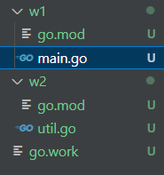

# 

# 并发编程

Go语言的并发通过`goroutine`实现。`goroutine`类似于线程，属于用户态的线程，我们可以根据需要创建成千上万个`goroutine`并发工作。`goroutine`是由Go语言的运行时（runtime）调度完成，而线程是由操作系统调度完成。

Go语言还提供`channel`在多个`goroutine`间进行通信。`goroutine`和`channel`是 Go 语言秉承的 CSP（Communicating Sequential Process）并发模式的重要实现基础。

## goroutine

## 开启goroutine

加入go 关键字，开启一个单独的groutine去执行hello函数

```go
func main() {
	go hello()
	fmt.Println("main")
}

func hello() {
	fmt.Println("Hello, world!")
}
```

## runtime包

### Gosched

重新分配任务

```go
go hello()
runtime.Gosched()
fmt.Println("main")
```


### Goexit

终止当前 Goroutine（不会影响其他协程）。

```go
go func() {
    defer fmt.Println("exit")
    runtime.Goexit()  // 协程在此终止
}()
```

# Channel 

1. 用于在 goroutine 之间安全传递数据，避免共享内存的竞态问题
2. 遵循先进先出（FIFO）原则，保证数据收发顺序

## 创建与使用

> 创建语法

```go
// 无缓冲通道（同步）
ch1 := make(chan int) 

// 有缓冲通道（异步，容量为 10）
ch2 := make(chan string, 10) 
```

> 使用语法

发送	ch <- value	将数据发送到通道，缓冲区满时阻塞
接收	value := <-ch	从通道接收数据，缓冲区空时阻塞

## 无缓冲通道

1. 如果我们只定义一个无缓冲通道，并且通道只有发送，没有接收，则会报错
2. 通道发送后会阻塞，等另一端接收数据后才会放行

```go
var ch = make(chan int)
go func(ch chan int) {
    i := <-ch
    fmt.Println(i)
}(ch)
ch <- 1
fmt.Println("main")
```

## 关闭

关闭通道（仅发送方可调用），关闭后接收操作返回零值和 false

可以通过内置的close()函数关闭channel (如果你的管道不往里存值或者取值的时候一定记得关闭管道)

## 优雅的从通道获取值

1. 定义两个管道，ch1 设置10个值， ch2从ch1取值，直到ch1关闭， main从ch2取值，直到关闭
2. 第一种方式，我们通过ok的返回值，判断管道是否关闭，这种不优雅
3. 第二种方式，通过for range 的方式，这种可以优雅的获取值

```go
ch1 := make(chan int, 10)
ch2 := make(chan int, 10)
go func(ch1 chan int) {
    for i := 0; i < 10; i++ {
        ch1 <- i
    }
    close(ch1)
}(ch1)
go func(ch1 chan int, ch2 chan int) {
    for {
        // 第一种方式
        if i, ok := <-ch1; ok {
            ch2 <- i
        } else {
            break
        }
    }
    close(ch2)
}(ch1, ch2)
//第二种方式
for i := range ch2 {
    fmt.Println(i)
}
```

## 单向通道

有的时候我们会将通道作为参数在多个任务函数间传递，很多时候我们在不同的任务函数中使用通道都会对其进行限制，比如限制通道在函数中<b id="red">只能发送或只能接收</b>。

<b id="gray">chan<- int</b>：表示只能流入数据

<b id="gray"><-chan int</b>：表示只能流出数据

```go
//ch1 只能流入数据
func f1(ch1 chan<- int) {
	for i := 0; i < 10; i++ {
		ch1 <- i
	}
	close(ch1)
}

//ch1 只能流出数据，ch2只能流入数据
func f2(ch1 <-chan int, ch2 chan<- int) {
	for {
		i, ok := <-ch1
		if !ok {
			break
		}
		ch2 <- i + i
	}
	close(ch2)
}
```

# Select

select的使用类似于switch语句，它有一系列case分支和一个默认的分支。每个case会对应一个通道的通信「(接收或发送）过程。select会一直等待，直到某个case的通信操作完成时，就会执行case分支对应的语句。

```go
select {
case data := <-ch1: 
  // 监听 ch1 的接收,执行这个case语句  
case ch2 <- 42:     
    // 监听 ch2 的发送，发送成功，执行这个case
}
```

## 阻塞式

1. 往ch1,ch2写入数据

```go
func test1(ch chan int) {
	time.Sleep(5 * time.Second)
	ch <- 5
}

func test2(ch chan int) {
	time.Sleep(2 * time.Second)
	ch <- 2
}

```


1. 使用select 选择读取到的数据
   1. 数据2，因为 ch2只延迟了2秒，先能取出数据

```go
ch1 := make(chan int)
ch2 := make(chan int)
go test1(ch1)
go test2(ch2)

select {
    case i := <-ch1:
    fmt.Println(i)
    case i := <-ch2:
    fmt.Println(i)
}
```

## 非阻塞式

如果加入<b id="gray">defualt</b>,则不会阻塞线程,此时如果ch1,chi2 获取不到数据，则执行default

```go
select {
    case i := <-ch1:
    fmt.Println(i)
    case i := <-ch2:
    fmt.Println(i)
    default:
    fmt.Println("default")
}
```

## 判断通道是否已满

```go
func writer(ch chan int) {
	for {
		select {
		case ch <- 1:
			fmt.Println("write")
		default:
			fmt.Println("通道已满")
		}
	}
}
```

# 并发安全

## 等待执行完成

1. 定一个x,用来数据的操作，等两个协成操作完打印x
   1. <b id="gray">WaitGroup</b>类似java里面的<b id="gray">CountDownLatch</b>

```go
var x int
var wg sync.WaitGroup

func add() {
	for i := 0; i < 10000; i++ {
		x++
	}
	wg.Done()
}
```

2. 调用打印输出，可以看出结果不一定10000,因为有并发问题

```go
wg.Add(2)
go add()
go add()
wg.Wait()
fmt.Println(x)
```

## 互斥锁

<b id="gray">sync.Mutex</b>：互斥锁

```go
var x int
var wg sync.WaitGroup
var lock sync.Mutex

func add() {
	for i := 0; i < 10000; i++ {
		lock.Lock()
		x++
		lock.Unlock()
	}
	wg.Done()
}
```

## 读写锁

读读不互斥，其他互斥

1. <b id="gray">rwLock.Lock()</b>为写锁
2. <b id="gray">rwLock.RLock()</b>为读锁

```go
var x int
var wg sync.WaitGroup
var rwLock sync.RWMutex

func add() {
	for i := 0; i < 10000; i++ {
		rwLock.Lock()
		x++
		rwLock.Unlock()
	}
	wg.Done()
}

func read() {
	rwLock.RLock()
	fmt.Println(x)
	rwLock.RUnlock()
}
```

## 原子操作


```go
func atomicAdd() {
	for i := 0; i < 10000; i++ {
		atomic.AddInt64(&x, 1)
	}
	wg.Done()
}
```

# 连接mysql

## 初始化

1. 导入驱动

```shell
go get -u github.com/go-sql-driver/mysql
```

2. 初始化连接

```go

var DB *sql.DB

func init() {
	db, err := sql.Open("mysql", "root:123456@tcp(192.168.8.116:3306)/my_test")
	if err != nil {
		panic(err)
	}
	//最大空闲连接数，默认不配置，是2个最大空闲连接
	db.SetMaxIdleConns(5)
	//最大连接数，默认不配置，是不限制最大连接数
	db.SetMaxOpenConns(100)
	// 连接最大存活时间
	db.SetConnMaxLifetime(time.Minute * 3)
	//空闲连接最大存活时间
	db.SetConnMaxIdleTime(time.Minute * 1)
	err = db.Ping()
	if err != nil {
		log.Println("数据库连接失败")
		db.Close()
		panic(err)
	}
	DB = db
}
```

## 保存

```go
func save() {
	r, err := DB.Exec("insert into t_user(name,age) values(?,?)", "张三", 19)
	if err != nil {
		log.Println("插入数据失败")
		return
	}
	id, _ := r.LastInsertId()
	fmt.Printf("插入成功, %d", id)
}
```

## 查询

```go

type User struct {
	name string `db:"name"`
	age  int    `db:"age"`
}

func query(id int) (*User, error) {
	r, err := DB.Query("select name,age from t_user where id=?", id)
	if err != nil {
		log.Println("查询数据失败")
		return nil, err
	}
	user := new(User)
	for r.Next() {
		_ = r.Scan(&user.name, &user.age)
	}
	return user, nil
}
```


# workspace

能够将多个模块类似maven一样，关联起来

如：

myworkspace下有多个目录



1. 使用work命令

```shell
 go work init ./w1 ./w2
```

2. 直接在w1的工程里面使用w2的代码方法

```go
import util "com.xiao/w2"

func main() {
	println("Hello, World!")
	util.W2()
}

```

# fmt标准库

## 可以指定输出方式

1. os.Stdout：控制台输出

```go
fmt.Fprint(os.Stdout, "Hello World")
```

2. 向文件中写入指定格式字符串
   1. os.O_WRONLY|os.O_CREATE|os.O_APPEND:文件可写，可创建，可追加

```go
f, err := os.OpenFile("log.txt", os.O_WRONLY|os.O_CREATE|os.O_APPEND, 0644)
if err != nil {
    t.Fatal(err)
}
defer f.Close()
fmt.Fprintf(f, "文件写入 %s", "来自文件的些人")
```

3. http模式，向浏览器输出
   1. 定义一个http服务
   2. 由于<b id="gray">http.ResponseWriter</b>是 

```go
func main() {
	http.ListenAndServe(":8080", &MyHandler{})
}

type MyHandler struct {
}

func (h *MyHandler) ServeHTTP(w http.ResponseWriter, r *http.Request) {
	fmt.Fprintf(w, "向浏览器输出 %s", "hello")
}
```

## 生成错误

能够格式化的生成error错误

```go
err := fmt.Errorf("错误信息: %s", "错误")
panic(err)
```

## 输入

1. 从控制台输入，赋值给字段

```go
var s struct {
    name string
}
fmt.Scan(&s.name)
fmt.Println(s.name)
```

2. 通过<b id="blue">fmt.FScan</b>可以从任意IO中输入数据赋值给字符串

# os 标准库

## Create

<b id="gray">Create</b> 创建一个文件，如果文件已存在，覆盖创建

```go
f, _ := os.Create("test.txt")
defer f.Close()
```

## 获取当前工作目录

```go
wd, _ := os.Getwd()
fmt.Printf("wd: %v\n", wd)
```

## 获取本机的temp目录

```go
s := os.TempDir()
fmt.Printf("temp: %v\n", s)
```

## 读取一个文件


```go
f, _ := os.OpenFile("test.txt", os.O_RDONLY, 0666)
defer f.Close()
buf := make([]byte, 4)
var body []byte
for {
    n, err := f.Read(buf)
    if err != nil {
        break
    }
    fmt.Printf("read: %v\n", string(buf[:n]))
    body = append(body, buf[:n]...)
}
fmt.Printf("body: %v\n", string(body))
```

## 从文件某个位置开始读

1. 定义4个字节长度切片
2. 从第4位开始读，因为长度是4，所以只读4个字节长度

```go
f, _ := os.OpenFile("test.txt", os.O_RDONLY, 0666)
defer f.Close()
buf := make([]byte, 4)
n, _ := f.ReadAt(buf, 4)
fmt.Printf("read: %v\n", string(buf[:n]))
```

## 获取执行程序的参数

```go
v := os.Args

fmt.Println(v)
```

运行程序输出：

```shell
$ go run main.go aaa bnbb
[C:\Users\25181\AppData\Local\Temp\go-build17077144\b001\exe\main.exe aaa bnbb]

```


# time标准库

## 字符串转时间

1. go时间格式化，必须以go的诞生时间为准
2. 如果想转 yyyy/MM格式，则可以2006/01

```go
time, _ := time.Parse("2006-01-02 15:04:05", "2025-01-01 00:00:00")
fmt.Printf("time %v ", time)
```

3. **go转时间，默认不是北京时间，所以一定要把时区加上**

```go
lc, _ := time.LoadLocation("Asia/Shanghai")
time, _ := time.ParseInLocation("2006-01-02 15:04:05", "2025-01-01 00:00:00", lc)
fmt.Printf("time %v ", time)
```


## 时间格式化

将当前时间转为字符串

```go
time := time.Now()
fmt.Printf("time %v ", time.Format("2006-01-02 15:04:05"))
```

## 时间加减

```go
//定义5分钟间隔
ti := 5 * time.Minute
now := time.Now()
fmt.Printf("time %v \n", now)
fmt.Printf("time %v \n", now.Add(-ti))
fmt.Printf("时间间隔 %v \n", now.Sub(now.Add(ti)))
```

## 时间比较

1. 使用<b id="gray">equal</b>比较会比较时区，如果使用<b id="gray">=</b>则只会比较时间格式

```go
n1 := time.Now()
n2 := time.Now()
fmt.Println(n1.Equal(n2))
```

2. 时间之前之后比较

```go
fmt.Println(n1.After(n2))
fmt.Println(n1.Before(n2))
```

# Log 标准库

Log标准库比较简单，如果项目升级至 Go 1.21+，建议使用<b id="gray">slog</b>包

## 输出格式

设置输出格式为：日期，时间， 文件短路径

```go
log.Println("第一条log")
log.SetFlags(log.Ldate | log.Ltime | log.Lshortfile)
log.Println("第二条log")
```

输出：

 ```tex
2025/03/13 19:54:52 第一条log
2025/03/13 19:54:52 main.go:8: 第二条log
 ```

## 设置前缀

```go
log.SetPrefix("[logtest]")
log.Println("第一条log")
log.SetFlags(log.Ldate | log.Ltime | log.Lshortfile)
log.Println("第二条log")
```

输出：

```tex
[logtest]2025/03/13 19:57:48 第一条log
[logtest]2025/03/13 19:57:48 main.go:9: 第二条log
```

# Error标准库

## 使用普通异常

如果字符串为空，返回错误

```go
func checkStr(v string) error {
	if v == "" {
		err := errors.New("empty string")
		return err
	} else {
		return nil
	}
}
```

```go
func main() {
	v := "hello"
	err := checkStr(v)
	if err != nil {
		fmt.Println(err)
	} else {
		fmt.Println("success")
	}
}
```

## 自定义异常

1. 定义一个结构体，实现<b id="gray">error</b>接口(回顾之前：(e MyError) Error() string 接收器实现表示实现了该接口)

```go
type MyError struct {
	msg  string
	code int
}

func (e MyError) Error() string {
	return fmt.Sprintf("code: %d, msg: %s", e.code, e.msg)
}

func (e MyError) fail() MyError {
	e.code = 400
	e.msg = "fail"
	return e
}

```

2. 在异常返回MyError

```go
func checkStr(v string) error {
	if v == "" {
		err := &MyError{}
		return err.fail()
	} else {
		return nil
	}
}
```

# bytes标准库

## 常用方法

比较与判断：Compare（比较顺序）、Contains（包含性检查）；
搜索与替换：Index（查找子串位置）、Replace（替换指定内容）；
大小写转换：ToUpper（转大写）、ToLower（转小写）；
清理与修剪：TrimSpace（去空格）、TrimPrefix（去前缀）。

```go
b1 := []byte("Hello world")
b2 := []byte("hello world")
fmt.Println(bytes.Compare(b1, b2))
fmt.Println(bytes.Equal(b1, b2))
```

## 分割

```go
b3 := bytes.Split(b1, []byte(" "))
for _, v := range b3 {
    fmt.Println(string(v))
}
```

## 连接

```go
b1 := []byte("Hello world")
b2 := []byte("hello world")
bs := [][]byte{b1, b2}
fmt.Println(string(bytes.Join(bs, []byte(","))))
```

## 字符串替换

-1 表示替换全部

```go
b1 := []byte("Hello world")
old := []byte("o")
new := []byte("O")
fmt.Printf("%v", string(bytes.Replace(b1, old, new, -1)))

```

## buffer缓冲区

### 读取

输出：lo world

每read一次，则buf中减少3个字符

```go
buf := bytes.NewBufferString("hello world")
b := make([]byte, 3)
buf.Read(b)
fmt.Println(buf.String())
```

### 写入

输出：hello worldabc

往末尾写入字符串

```go
buf := bytes.NewBufferString("hello world")
buf.Write([]byte("abc"))
fmt.Println(buf.String())
```

### 特点

1. 可读写，适用于频繁的数据拼接、修改或临时存储。
2. 使用 bytes.Buffer 处理高频写入或拼接

## Reader

1. 使用 bufio.Reader 处理大文件或网络流（如 HTTP 请求体解析）
2. 仅支持读取操作，不可修改数据 

> 每次读取三个字节

```go
br := bytes.NewReader([]byte("hello world"))
b := make([]byte, 3)
for {
    n, err := br.Read(b)
    if err != nil {
        break
    }
    fmt.Println(string(b[:n]))

}
```

## Pipe

是一种单向的、先进先出（FIFO）的通信机制，用于进程间或父子进程间的数据传输。

### 示例

1. 定义一个协程将字符串写入管道中
2. 从管道中读取数据到控制台

```go
r, w := io.Pipe()

go func() {
    fmt.Fprintf(w, "hello world")
    w.Close()
}()

if _, err := io.Copy(os.Stdout, r); err != nil {
    fmt.Println(err)
}
```

# bufio标准库

## 原理

读和写都先在缓冲区中，最后再读写文件，来降低访问本地磁盘的次数，从而提高效率


## Reader

reader := bufio.NewReader(io.Reader)      // 默认缓冲区大小 4096 字节
reader := bufio.NewReaderSize(io.Reader, size)  // 自定义缓冲区大小

## Writer

writer := bufio.NewWriter(io.Writer)       // 默认缓冲区大小 4096 字节
writer := bufio.NewWriterSize(io.Writer, size)  // 自定义缓冲区大小

# Json标准库

##  流式处理

json.NewEncoder(w io.Writer) *Encoder：将对象直接写入 io.Writer。
json.NewDecoder(r io.Reader) *Decoder：从 io.Reader 读取并解析 JSON。

1. 从文件中读取数据
2. 定义一个匿名结构体，接收json

```go
body, err := os.OpenFile("test.json", os.O_RDWR, 0666)
if err != nil {
    panic(err)
}
defer body.Close()

var obj struct {
    Name string `json:"name"`
    Age  int    `json:"age"`
}
json.NewDecoder(body).Decode(&obj)
fmt.Println(obj)
```

3. 或者我们不知道json的结构，那么我们可以使用map[string]interface{}来接收

```go
//
var obj2 map[string]interface{}
d2 := json.NewDecoder(body)
e2 := d2.Decode(&obj2)
if e2 != nil {
    panic(e2)
}
fmt.Printf("%v", obj2)
```

# 排序

## 定义

1. 首先需要实现接口, 
   1. less 方法，如果 i < j =true ,则调用swap 方法，一般就是升序

```go
type Interface interface {
    Len() int            // 切片长度
    Less(i, j int) bool  // 比较元素 i 和 j 的顺序
    Swap(i, j int)       // 交换元素 i 和 j
}
```

## 举例

1. 实现接口
2. 将实现了接口的类型传入sort函数

```go
type Nints []uint

func (n Nints) Len() int {
	return len(n)
}

func (n Nints) Less(i, j int) bool {
	return n[i] < n[j]
}

func (n Nints) Swap(i, j int) {
	n[i], n[j] = n[j], n[i]
}

func main() {
	n := Nints{5, 1, 2, 3, 4}
	sort.Sort(&n)
	fmt.Println(n)
}
```

# flag标准库

定义命令行参数：支持 int、string、bool 等基本类型。
自动生成帮助信息：通过 -h 或 --help 显示用法说明。
解析命令行输入：将命令行参数绑定到变量。

例如：

1. 编写如下代码
   1. 调用 flag.Parse()：必须在使用参数前调用

```go
name := flag.String("name", "laoxiao", "姓名")
age := flag.Int("age", 18, "年龄")
flag.Parse()
fmt.Println(*name, *age)
```

2. 执行命令 go build
3. 运行编译好的包,如果传入参数，则使用传参，否则使用默认值

```shell
$ ./flagtest.exe -name lx
lx 18
```

4. 可以使用-h查看自动生成的文档

```go
$ ./flagtest.exe -h
Usage of F:\git\gitee\learn-go\p13\flagtest\flagtest.exe:
  -age int
        年龄 (default 18)
  -name string
        姓名 (default "laoxiao")
```

# context标准库

## 上下文传递

将lx 作为key,传入到函数中

```go
f := func(ctx context.Context, k string) {
    if v := ctx.Value(k); v != nil {
        fmt.Println(v)
    } else {
        fmt.Println("not found")
    }
}
ctx := context.WithValue(context.Background(), "lx", 18)
f(ctx, "lx")
f(ctx, "lx1")
```

## 级联取消

一般用于多协程协同工作

如下：

```go
func worker(ctx context.Context, name string) {
	for {
		select {
		case <-ctx.Done():
			fmt.Printf("%s 已退出\n", name)
			return
		default:
			fmt.Printf("%s 工作中...\n", name)
			time.Sleep(500 * time.Millisecond)
		}
	}
}
```

两个协程一直工作，直到调用cancel，则调用case里的退出

```go
ctx, cancel := context.WithCancel(context.Background())
go worker(ctx, "A")
go worker(ctx, "B")

time.Sleep(2 * time.Second)
cancel() // 同时终止所有 worker
time.Sleep(2 * time.Second)
```

