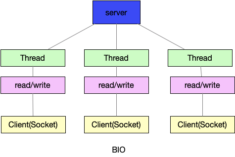
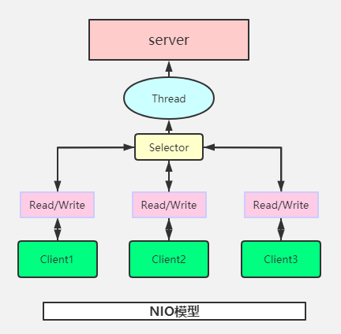
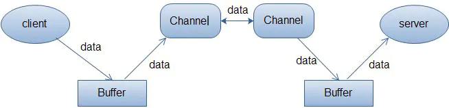

# netty介绍

netty是一个基于异步的，基于事件的网络应用框架

- 基于一个事件，这个事件可能是连接，或者断开


# IO模型

## BIO

- 阻塞型io
- 一个线程对应一个连接,并发量上来了，线程开销就大了



代码解析

```java
@Slf4j
public class TestBio {

    public void createCocket() throws Exception {
        //创建一个线程池，维护连接进来的通讯
        ExecutorService executorService = Executors.newCachedThreadPool();
        //建立一个socket
        ServerSocket serverSocket = new ServerSocket(8000);
        log.debug("服务器启动");
        while (true) {
            Socket accept = serverSocket.accept();
            //来一个连接启动一个线程
            log.debug("建立一个连接");
            executorService.execute(()->{
                handler(accept);
            });
        }
    }

    /**
     * 与客户端通信handler
     * @param socket
     */
    public void handler(Socket socket)  {
        try {
            log.debug("开始接受信息");
            InputStream inputStream = socket.getInputStream();
            while (true) {
                byte[] bytes = new byte[1024];
                int read = inputStream.read(bytes);
                if(read!=-1){
                    log.debug("收到信息：{}", new String(bytes, "UTF-8"));
                } else {
                    break;
                }
            }
        } catch (IOException e) {
            e.printStackTrace();
        } finally {
            try {
                socket.close();
            } catch (IOException e) {
                e.printStackTrace();
            }
        }
    }

    public static void main(String[] args) throws Exception {
        new TestBio().createCocket();
    }
}
```

telnet 127.0.0.1 8000

```shell
Escape 字符为 'CTRL+]'


Microsoft Telnet> send 好的
发送字符串 好的
Microsoft Telnet> send 111
发送字符串 111
Microsoft Telnet>
```


## NIO

- 同步非阻塞

- server端启动一个线程，线程维护一个selector
- selector一直轮询，查询通道有没有连接事件
- 也可以有多个线程维护selector
- 适合连接数多且连接比较短，如聊天服务器，弹幕系统，



### 介绍

- NIO有三个核心部分channel(通道)， buffer(缓冲区), selector(选择器)
- 每一个channel对应一个buffer，channel可以通过buffer进行读写，程序只与buffer进行交互



### Buffer

以intbuffer为例

```java
@Slf4j
public class TestBuffer {
    public static void main(String[] args) {
        //创建一个buffer，可以存放5个int
        IntBuffer intBuffer = IntBuffer.allocate(5);
        //将i设置进入buffer，将buffer塞满
        for(int i=0; i<intBuffer.capacity(); i++){
            intBuffer.put(i);
        }
        //转化读操作
        intBuffer.flip();
        while (intBuffer.hasRemaining()) {
            log.info("取出数据：{}", intBuffer.get());
        }

    }
}
```

### NIO和BIO比较

- NIO 以块的方式处理数据，BIO以流的方式处理

## AIO

- 异步非阻塞

