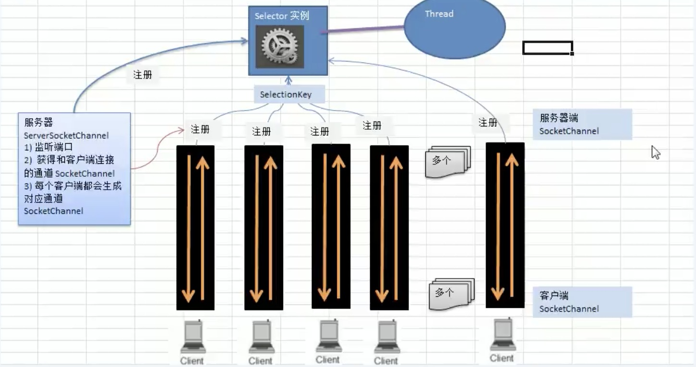

# netty介绍

netty是一个基于异步的，基于事件的网络应用框架

- 基于一个事件，这个事件可能是连接，或者断开


# IO模型

## BIO

- 阻塞型io
- 一个线程对应一个连接,并发量上来了，线程开销就大了


代码解析

```java
@Slf4j
public class TestBio {

    public void createCocket() throws Exception {
        //创建一个线程池，维护连接进来的通讯
        ExecutorService executorService = Executors.newCachedThreadPool();
        //建立一个socket
        ServerSocket serverSocket = new ServerSocket(8000);
        log.debug("服务器启动");
        while (true) {
            Socket accept = serverSocket.accept();
            //来一个连接启动一个线程
            log.debug("建立一个连接");
            executorService.execute(()->{
                handler(accept);
            });
        }
    }

    /**
     * 与客户端通信handler
     * @param socket
     */
    public void handler(Socket socket)  {
        try {
            log.debug("开始接受信息");
            InputStream inputStream = socket.getInputStream();
            while (true) {
                byte[] bytes = new byte[1024];
                int read = inputStream.read(bytes);
                if(read!=-1){
                    log.debug("收到信息：{}", new String(bytes, "UTF-8"));
                } else {
                    break;
                }
            }
        } catch (IOException e) {
            e.printStackTrace();
        } finally {
            try {
                socket.close();
            } catch (IOException e) {
                e.printStackTrace();
            }
        }
    }

    public static void main(String[] args) throws Exception {
        new TestBio().createCocket();
    }
}
```

telnet 127.0.0.1 8000

```shell
Escape 字符为 'CTRL+]'


Microsoft Telnet> send 好的
发送字符串 好的
Microsoft Telnet> send 111
发送字符串 111
Microsoft Telnet>
```


## NIO

- 同步非阻塞

- server端启动一个线程，线程维护一个selector
- selector一直轮询，查询通道有没有连接事件
- 也可以有多个线程维护selector
- 适合连接数多且连接比较短，如聊天服务器，弹幕系统，


### 介绍

- NIO有三个核心部分channel(通道)， buffer(缓冲区), selector(选择器)
- 每一个channel对应一个buffer，channel可以通过buffer进行读写，程序只与buffer进行交互


### Buffer

以intbuffer为例

```java
@Slf4j
public class TestBuffer {
    public static void main(String[] args) {
        //创建一个buffer，可以存放5个int
        IntBuffer intBuffer = IntBuffer.allocate(5);
        //将i设置进入buffer，将buffer塞满
        for(int i=0; i<intBuffer.capacity(); i++){
            intBuffer.put(i);
        }
        //转化读操作
        intBuffer.flip();
        //判读是否还有数据
        while (intBuffer.hasRemaining()) {
            log.info("取出数据：{}", intBuffer.get());
        }

    }
}
```

buffer几个参数

```java
//标记
private int mark = -1;
//当前下标
private int position = 0;
//操作过程中，下标不能超过limit
//作用：读数据不能超过这个数，flip时，会将position赋值给limit
private int limit;
//容量
private int capacity;
```

### Channel

- 可以同时读写
- 可以一步读写数据


- FileChannel  用来对本地文件进行IO操作

举例：使用通道的方式，将目标文件写入文件夹中

### buffer和channel进行文件copy

```java
public static void main(String[] args) throws Exception {
    FileInputStream input = new FileInputStream("E:\\1.avi");
    FileChannel channelSource = input.getChannel();
    FileOutputStream outputStream = new FileOutputStream("d:\\1.mp4");
    FileChannel channelTarget = outputStream.getChannel();
    ByteBuffer byteBuffer = ByteBuffer.allocate(5);
    while (true) {
        byteBuffer.clear();
        int read = channelSource.read(byteBuffer);
        if(read == -1){
            //读取完成
            break;
        }
        byteBuffer.flip();
        channelTarget.write(byteBuffer);
    }
    input.close();
    outputStream.close();
}
```

### MappedByteBuffer

能够直接在内存中进行修改，操作系统不需要再拷贝一次

### Buffer 分散聚合

- scattering : 将数据写入buffer时，采用buffer数组依次写入
  - channel.read(buffers[])
- gathering： 从buffer读数据，采用buffer数组，依次读
  - channel.write(buffers[])

### Selector

- 一般称 为选择器 ，当然你也可以翻译为 多路复用器 。它是Java NIO核心组件中的一个，用于检查一个或多个NIO Channel（通道）的状态是否处于可读、可写。如此可以实现单线程管理多个channels,也就是可以管理多个网络链接
- 当有事件发生时，返回select Key 数组，通过selectKey可以获取对应channel

对应方法

```java
int select()：阻塞到至少有一个通道在你注册的事件上就绪了。
int select(long timeout)：和select()一样，但最长阻塞时间为timeout毫秒。
int selectNow()：非阻塞，只要有通道就绪就立刻返回、。
```

```java
//获取有事件发生的key
Set selectedKeys = selector.selectedKeys();
//获取所有注册的key
Set<SelectionKey> keys = selector.keys();

```

### Selector Key

```java
//有新的网络连接
SelectionKey.OP_ACCEPT
//连接已建立
SelectionKey.OP_CONNECT
//读操作
SelectionKey.OP_READ
//写操作
SelectionKey.OP_WRITE
```


### NIO网络编程原理

- 客户端连接，通过serversocketChannel 得到 socketChannel

- socketChannel注册到selector上



- NIO server


### NIO网络代码
ServerSocketChannel：负责监听客户端连接
SocketChannel：负责读写操作

```java
public static void main(String[] args) throws IOException {
    ServerSocketChannel socketChannel = ServerSocketChannel.open();
    Selector selector = Selector.open();
    //绑定一个服务器监听端口
    socketChannel.socket().bind(new InetSocketAddress(7070));
    //设置为非阻塞
    socketChannel.configureBlocking(false);
    //将连接事件注册到selector中
    socketChannel.register(selector, SelectionKey.OP_ACCEPT);
    //循环获取连接事件
    while (true) {
        //1s没有获取到事件就重新获取
        if(selector.select(1000) == 0) {
            System.out.println("没有人连接....");
            continue;
        }
        //获取发生的事件集合
        Iterator<SelectionKey> keys = selector.selectedKeys().iterator();
        while (keys.hasNext()) {
            SelectionKey key = keys.next();
            //如果是连接事件，注册读事件,并关联一个buffer
            if(key.isAcceptable()){
                //有新的客户端连接，注册一个生成一个socket，注册一个读事件
                SocketChannel socketChannelRead = socketChannel.accept();
                socketChannelRead.configureBlocking(false);
                socketChannelRead.register(selector, SelectionKey.OP_READ, ByteBuffer.allocate(1024));
            }
            if(key.isReadable()) {
                SocketChannel channel = (SocketChannel) key.channel();
                ByteBuffer buffer = (ByteBuffer) key.attachment();
                channel.read(buffer);
                System.out.println("客户端传来： "+ new String(buffer.array()));
            }
            keys.remove();
        }
    }
}
```

```java
public static void main(String[] args) throws Exception {
    //打开选择器
    Selector selector = Selector.open();
    //打开套字接通道
    SocketChannel channel = SocketChannel.open();

    //设置非阻塞
    channel.configureBlocking(false);
    ;
    //注册通道，设置为链接就绪
    channel.register(selector, SelectionKey.OP_CONNECT);
    //绑定IP，端口
    if(!channel.connect(new InetSocketAddress("127.0.0.1", 7070))){
        while (!channel.finishConnect()) {
            System.out.println("客户端还未连接，不会阻塞，可以做其他事");
        }
    }
    ByteBuffer byteBuffer = ByteBuffer.wrap("hello, 老肖".getBytes());
    channel.write(byteBuffer);
    System.out.println("写入完毕");
}
```


### NIO和BIO比较

- NIO 以块的方式处理数据，BIO以流的方式处理

## AIO

- 异步非阻塞

# NIO与零拷贝

## 传统IO

传统IO进行了四次拷贝三次切换

- 拷贝过程

1. 从硬盘 经过 DMA 拷贝（**直接内存拷贝**） 到 kernel buffer （内核buferr）
2. 从kernel buffer 经过**cpu 拷贝**到 user buffer ,比如拷贝到应用程序(这个时候我们可以对流进行修改)
3. 从user buffer 拷贝到 socket buffer 
4. 从socket buffer 拷贝到 protocol engine 协议栈

- 状态切换

- 用户态---》 内核状 （或者叫着 用户上下文----》 内核上下文）

- 内核状---》 用户状

- 用户状---》 内核状


## sendFile优化

零拷贝指没有cpu拷贝,NIO中使用transferTo操作


1. DMA拷贝，将数据从硬盘拷贝到kernel buffer 
2. DMA拷贝，将数据从kernel buffer拷贝到protocol engine
3. cpu copy 其实拷贝的是一些基本的信息（数据量少）

# Netty设计

## 线程模型

- 传统阻塞IO模型
  - 当并发数越大，服务器端线程越多


- Reactor模式

Reactor模式是处理并发I/O常见的一种模式，用于同步I/O，其中心思想是将所有要处理的I/O事件注册到一个中心I/O多路复用器上，同时主线程阻塞在多路复用器上，一旦有I/O事件到来或是准备就绪，多路复用器将返回并将相应`I/O`事件分发到对应的处理器中

- 单reactor单线程


- 单reactor多线程
  - reactor监控客户端请求
  - 发生连接，穿件一个handler
  - 如果不是连接，则reactor分发连接对应的handler
  - handler只负责响应，不做业务处理
  - worker线程池分配独立线程池完成真正的业务,并将结果返回handler


- 主从reactor多线程
  - 可以让reactor在多线程中运行
  - **main负责连接，sub负责其他**
  - Reactor 主线程 MainReactor 对象通过 Select 监控建立连接事件，收到事件后通过 Acceptor 接收，处理建立连接事件。
  - Acceptor 处理建立连接事件后，MainReactor 将连接分配 Reactor 子线程给 SubReactor 进行处理。
  - SubReactor 将连接加入连接队列进行监听，并创建一个 Handler 用于处理各种连接事件。
  - 当有新的事件发生时，SubReactor 会调用连接对应的 Handler 进行响应。
  - 一个mian可以管理多个sub


## Netty模型

### 简单版

- BossGroup 线程维护Selector, 只关注Accecpt。

- 当接收到Accept事件，获取到对应的SocketChannel, 封装成 NIOScoketChannel并注册到Worker 线程(事件循环), 并进行维护。

- 当Worker线程监听到selector 中通道发生自己感兴趣的事件后，就进行处理(就由handler)， 注意handler 已经加入到通道。


### 详细版

- 两组group，这两个group都属于NIOEventLoopGroup
  - boss  负责客户端连接
  - worker  负责网络读写 
- NIOEventLoop表示不断循环的执行处理任务的 线程
- NIOEventLoopGroup可以有多个NIOEventLoop（多个线程）
- 处理业务时，会使用pipeline


## TCP代码

- 服务器端

```java
public static void main(String[] args) throws InterruptedException {
    //管理连接
    EventLoopGroup bossGroup = new NioEventLoopGroup();
    EventLoopGroup workGroup = new NioEventLoopGroup();

    //服务器启动对象
    ServerBootstrap bootstrap = new ServerBootstrap();
    //设置两个线程组
    bootstrap.group(bossGroup, workGroup)
            //选择通道类型
            .channel(NioServerSocketChannel.class)
            //设置线程队列得到的连接数
            .option(ChannelOption.SO_BACKLOG, 128)
            //保持活动连接状态
            .childOption(ChannelOption.SO_KEEPALIVE, true)
            //设置一个处理事情的工作handler
            .childHandler(new ChannelInitializer<SocketChannel>() {
                @Override
                protected void initChannel(SocketChannel socketChannel) throws Exception {
                    socketChannel.pipeline().addLast(new NettyServerHandler());
                }
            });
    //绑定一个端口并且同步
    ChannelFuture sync = bootstrap.bind(6666).sync();
    //对关闭通道进行监听
    sync.channel().closeFuture().sync();
}
```

- 服务器端业务处理

```java
public class NettyServerHandler extends ChannelInboundHandlerAdapter {


    /**
     * 从客户端读取数据
     * @param ctx 上下文，含pipeline，channel, 客户端送的数据
     * @param msg
     * @throws Exception
     */
    @Override
    public void channelRead(ChannelHandlerContext ctx, Object msg) throws Exception {
        System.out.println("客户端地址："+ctx.channel().remoteAddress());
        //msg是一个buf类型
        ByteBuf buf = (ByteBuf) msg;
        System.out.println("客户端发送的消息："+ buf.toString(CharsetUtil.UTF_8));
    }

    /**
     * 读取数据完毕，往客户端发送数据
     * @param ctx
     * @throws Exception
     */
    @Override
    public void channelReadComplete(ChannelHandlerContext ctx) throws Exception {
        //write+flush方法
        //写入缓存，并冲刷
        ctx.writeAndFlush(Unpooled.copiedBuffer("hello : "+ ctx.channel().remoteAddress(), CharsetUtil.UTF_8));
    }
}
```

- 客户端

```java
public static void main(String[] args) throws InterruptedException {
    EventLoopGroup loopGroup = new NioEventLoopGroup();
    try {

        Bootstrap bootstrap = new Bootstrap();
        bootstrap.group(loopGroup)
                .channel(NioSocketChannel.class)
                .handler(new ChannelInitializer<SocketChannel>() {
                    @Override
                    protected void initChannel(SocketChannel socketChannel) throws Exception {
                        socketChannel.pipeline().addLast(new NettyClientHandler());
                    }
                });
        ChannelFuture future = bootstrap.connect("127.0.0.1", 6666).sync();
        future.channel().closeFuture().sync();
    } finally {
        loopGroup.shutdownGracefully();
    }
}
```

- 客户端业务处理

```java
public class NettyClientHandler extends ChannelInboundHandlerAdapter {
    @Override
    public void channelActive(ChannelHandlerContext ctx) throws Exception {
        System.out.println("启动客户端，发送消息....");
        ctx.writeAndFlush(Unpooled.copiedBuffer("hello serve:", CharsetUtil.UTF_8));
    }

    @Override
    public void channelRead(ChannelHandlerContext ctx, Object msg) throws Exception {

        ByteBuf buf = (ByteBuf) msg;
        System.out.println("服务端发送： "+ ctx.channel().remoteAddress() + " : " + buf.toString(CharsetUtil.UTF_8));
    }
}
```

## 源码分析

### NioEventLoopGroup的工作线程

- NioEventLoopGroup默认的线程数是：cpu核心数*2，new NioEventLoopGroup构造方法默认使用了NettyRuntime.availableProcessors() * 2

  如果构造参数有值，则使用构造参数的线程数

- LoppGroup使用EventExecutor来管理线程

- group包含多个NioEventLoop

  - NioEventLoop包含一个selector，一个taskqueue
  - 一个selector可以注册多个NioChannel
  - 每个NioChannel只会绑定他对应的selector上（N:1）

  

### Handler上下文分析

- pipeline本质是一个双向链表（包含head和tail）

## 异步执行

服务器端中，如果handler中的执行业务时间很久，就会与客户端阻塞

- 解决方案1：使用eventloop中的taskqueue执行

```java
@Override
public void channelRead(ChannelHandlerContext ctx, Object msg) throws Exception {
    ctx.channel().eventLoop().execute(() -> {
        try {
            Thread.sleep(10*1000);
            ctx.writeAndFlush(Unpooled.copiedBuffer("hello1 : "+ ctx.channel().remoteAddress(), CharsetUtil.UTF_8));
        } catch (InterruptedException e) {
            e.printStackTrace();
        }
    });
}
```

## 定时执行

- 新建 runnable 用于执行调度
- 稍后执行
- 五秒之后执行

```java
ctx.channel().eventLoop().schedule(() -> {
    try {
        Thread.sleep(1*1000);
        ctx.writeAndFlush(Unpooled.copiedBuffer("hello1 time : "+ ctx.channel().remoteAddress(), CharsetUtil.UTF_8));
    } catch (InterruptedException e) {
        e.printStackTrace();
    }
}, 5, TimeUnit.SECONDS);
```

## netty异步模型

- Netty的异步模型是建立在future上的
- 例如：添加一个监听，判断是否绑定端口成功

```java
//绑定一个端口并且同步
ChannelFuture sync = bootstrap.bind(6666).sync();
sync.addListener((future) -> {
    if(future.isSuccess()) {
        System.out.println("绑定端口 6666 成功....");
    }
});
```

# http服务

```java
public static void main(String[] args) {
    EventLoopGroup bossGroup = new NioEventLoopGroup(1);
    EventLoopGroup workGroup = new NioEventLoopGroup();
    try {
        ServerBootstrap bootstrap = new ServerBootstrap();
        bootstrap.group(bossGroup, workGroup)
                .channel(NioServerSocketChannel.class)
                .childHandler(new HttpServerInitializer());
        ChannelFuture channelFuture = bootstrap.bind(new InetSocketAddress(6666)).sync();
        channelFuture.channel().closeFuture().sync();
    } catch (Exception e) {

    } finally {
        bossGroup.shutdownGracefully();
        bossGroup.shutdownGracefully();
    }
}
```

```
 * @Description 在某个Channel注册到EventLoop后，对这个Channel执行一些初始化操作
 * @createTime 2020年09月16日 09:23:00
 */
public class HttpServerInitializer extends ChannelInitializer<SocketChannel> {
    /**
     * 向管道加入处理器
     * @param socketChannel
     * @throws Exception
     */
    @Override
    protected void initChannel(SocketChannel socketChannel) throws Exception {
        ChannelPipeline pipeline = socketChannel.pipeline();
        pipeline.addLast("httpServerCodec", new HttpServerCodec());
        pipeline.addLast("httpServerHandler", new HttpServerHandler());
    }
}
```

```java
* @Description HttpObject:客户端与服务器端通讯的工具封装成：HttpObject
 * @createTime 2020年09月16日 09:38:00
 */
@Slf4j
public class HttpServerHandler extends SimpleChannelInboundHandler<HttpObject> {

    /**
     * 读取数据
     * @param ch
     * @param object
     * @throws Exception
     */
    @Override
    protected void channelRead0(ChannelHandlerContext ch, HttpObject object) throws Exception {
        if(object instanceof HttpRequest) {
            log.debug("msg: {} ", object.getClass());
            log.debug("客户端地址: {} ", ch.channel().remoteAddress());
            ByteBuf content = Unpooled.copiedBuffer("netty, 服务器", CharsetUtil.UTF_8);

            DefaultFullHttpResponse response = new DefaultFullHttpResponse(HttpVersion.HTTP_1_1, HttpResponseStatus.OK, content);
            response.headers().set(HttpHeaderNames.CONTENT_TYPE, "text/plain; charset=UTF-8");
            response.headers().set(HttpHeaderNames.CONTENT_LENGTH, content.readableBytes());
            ch.writeAndFlush(response);
        }
    }
}
```

# Netty核心组件

## 常用组件

- ServerBootstrap，Bootstrap 
  - 用于设置eventLoop
  - channel:设置服务器端通道的实现
  - optionL 给serverchannel添加配置
  - childHandler: 用于添加workergroup对应的自定义的handler
  - handler：添加bossgroup对应的handler
- Channel
  - channel类型与协议有关
- Selector
- ChannelHandler
ChannelInboundHandler:负责出站
ChannelOutboundHandler: 负责入站


- PipeLine

pipeline是一个包含头和尾的类似双向链表


# 心跳机制

IdleStateHandler是netty处理空闲状态的处理器

- readerIdleTime:多久时间没读，发送一个心跳检测包，是否连接
- writerIdleTime：多久时间没写，发送一个心跳检测包
- allIdleTime：多久时间没有读写

```java
EventLoopGroup bossGroup = new NioEventLoopGroup(1);
EventLoopGroup workGroup = new NioEventLoopGroup();
try {

    ServerBootstrap bootstrap = new ServerBootstrap();
    bootstrap.group(bossGroup, workGroup)
            .channel(NioServerSocketChannel.class)
            .handler(new LoggingHandler(LogLevel.INFO))
            .childHandler(new ChannelInitializer<SocketChannel>() {
                @Override
                protected void initChannel(SocketChannel ch) throws Exception {
                    ChannelPipeline pipeline = ch.pipeline();
                    //在pipeline中 加入解码器
                    pipeline.addLast(new IdleStateHandler(3,5,7, TimeUnit.SECONDS));
                    pipeline.addLast(new IdleStateServerHandler());
                }
            });
    log.debug("===>聊天服务器端启动");
    ChannelFuture sync = bootstrap.bind(this.port).sync();
    sync.channel().closeFuture().sync();
} finally {
    bossGroup.shutdownGracefully();
    workGroup.shutdownGracefully();
}
```

```java
public class IdleStateServerHandler extends ChannelInboundHandlerAdapter {
    /**
     *
     * @param ctx 上下文
     * @param evt 事件
     * @throws Exception
     */
    @Override
    public void userEventTriggered(ChannelHandlerContext ctx, Object evt) throws Exception {
        //如果是心跳检测机制
        if(evt instanceof IdleStateEvent ) {
            IdleStateEvent event = (IdleStateEvent) evt;
            String msg = null;
            switch (event.state()) {
                case ALL_IDLE:
                    msg = "读写空闲";
                    break;
                case READER_IDLE:
                    msg = "读空闲";
                    break;
                case WRITER_IDLE:
                    msg = "写空闲";
                    break;
            }
            log.info(msg);
        }
    }
}
```

# websorcket

- websocket数据以 帧frame传输

```java
EventLoopGroup bossGroup = new NioEventLoopGroup(1);
EventLoopGroup workGroup = new NioEventLoopGroup();
try {

    ServerBootstrap bootstrap = new ServerBootstrap();
    bootstrap.group(bossGroup, workGroup)
            .channel(NioServerSocketChannel.class)
            .handler(new LoggingHandler(LogLevel.INFO))
            .childHandler(new ChannelInitializer<SocketChannel>() {
                @Override
                protected void initChannel(SocketChannel ch) throws Exception {
                    ChannelPipeline pipeline = ch.pipeline();
                    //使用http解码和编码
                    pipeline.addLast(new HttpServerCodec());
                    //以块方式进行读写
                    pipeline.addLast(new ChunkedWriteHandler());
                    //http传输是分段的，HttpObjectAggregator多段聚合
                    //所以在http传输中，大量数据会有多个http请求
                    pipeline.addLast(new HttpObjectAggregator(8192));
                    // 浏览器访问 ws://127.0.0.1/hello
                    //WebSocketServerProtocolHandler 将http升级 为 websocket
                    pipeline.addLast(new WebSocketServerProtocolHandler("/hello"));
                    //以文本帧的方式进行处理
                    pipeline.addLast(new TextWebSocketFrameHandler());

                }
            });
    log.debug("===>服务器端启动");
    ChannelFuture sync = bootstrap.bind(this.port).sync();
    sync.channel().closeFuture().sync();
} finally {
    bossGroup.shutdownGracefully();
    workGroup.shutdownGracefully();
}
```

# 编解码

## Protobuf

- 支持跨平台夸语言的编解码

- 很时候RPC或者数据存储  

## 生成代码

- 引入pom

```xml
<dependency>
    <groupId>com.google.protobuf</groupId>
    <artifactId>protobuf-java</artifactId>
    <version>3.4.0</version>
</dependency>
```

- 下载生成客户端工具

<https://github.com/protocolbuffers/protobuf/releases>

# netty出站入站机制

- channelPipeline 提供了 channelhandler链的容器
- 写入 socket叫 出站，读socket叫入站
- netty发送或者 接受一个消息，会发生一次解码、编码
- 出站 需要 编码，  入站 需要解码


## 解码器

- ByteToMessageCodec

由于不可能知道远程节点是否会一次性发送完整的信息，所有tcp可能会出现粘包拆包问题，这个类会对入站数据进行缓冲，知道他完全被处理好


举例：

有个int类型的解码器

重写decode方法，socket发送两个int数据，入站解码开始解码，读到四个字节就将其转化为int放入list中，直到全部读完

然后丢给下一个handler执行


# TCP粘包拆包

TCP是面向连接的，面向流的，提供高可靠性服务。收发两端（客户端和服务器端）都要有一一成对的socket，因此，发送端为了将多个发给接收端的包，更有效的发给对方，使用了优化方法（Nagle算法），将多次间隔较小且数据量小的数据，合并成一个大的数据块，然后进行封包。这样做虽然提高了效率，但是接收端就难于分辨出完整的数据包了，因为面向流的通信是无消息保护边界的

## 基本介绍

- 服务端分别收到了D1和D2，没有粘包和拆包
- 服务端一次性收到了D1和D2，称为TCP粘包
- 服务端两次读取到了两个数据包，第一次读到了D1的完整部分和D2的部分数据，第二次读到了D2的剩余部分。 这称为TCP拆包
- 服务端两次读取到两个数据包，第一次是D1的部分，第二次是D1的剩余部分和D2的完整部分。


## 举例


## 解决方案

- 自定义协议+编解码器

# netty源码解析

## netty启动过程

- 先看example下的示例代码

EchoServer
EchoServerHandler
EchoClient
EchoClientHandler

### EchoServer

```java
EventLoopGroup bossGroup = new NioEventLoopGroup(1);
EventLoopGroup workerGroup = new NioEventLoopGroup();
```

bossGroup用于接收TCP请求，他会将请求交给workgroup，workgroup获取真正的连接进行通信

EventLoopGroup是一个时间循环组（线程组）， 含有多个EventLoop

MultithreadEventExecutorGroup
		 ------ MultithreadEventExecutorGroup()方法					

```
//创建时间循环组
children = new EventExecutor[nThreads];
```

引导类

```
ServerBootstrap b = new ServerBootstrap();
```

channel方法目的通过反射创建channelFactory

```
b.group(bossGroup, workerGroup)
 .channel(NioServerSocketChannel.class)
```

### EventLoopGroup


## EventLoop组件

- 一个EventLoopGroup 包含一个或者多个EventLoop；
- 一个EventLoop 在它的生命周期内只和一个Thread 绑定；
- 所有由EventLoop 处理的I/O 事件都将在它专有的Thread 上被处理；
- 一个Channel 在它的生命周期内只注册于一个EventLoop；
- 一个EventLoop 可能会被分配给一个或多个Channel。

NioEventLoopGroup对象可以理解为一个线程池，内部维护了一组线程，每个线程负责处理多个Channel上的事件，而一个Channel只对应于一个线程，这样可以回避多线程下的数据同步问题。

## unpooled 缓存操作

通过两个指针，readerIndex与writerIndex分别指向已经读到的位置和写入的位置，比JDK提供的ByteBuffer 省了flip操作
<<<<<<< HEAD

# 更换编解码

## Google 的 ProtoBuf

=======
>>>>>>> origin/master
