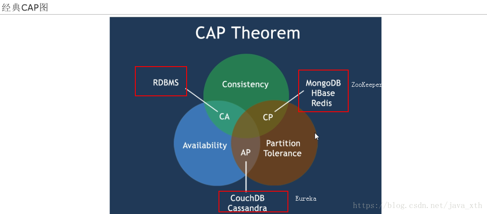

# 概念

## 什么是微服务

将单一的应用程序化成小的服务模块，每个服务模块都是独立的进程

将业务区分，分为一个个服务模块，每一个小服务可以拥有自己的数据库，它强调的时个体

## 微服务架构

个个微服务直接相互调用，形成一个架构，它强调的时整体

## dubble与cloud的区别

dubble是基于rpc远程调用，cloud时基于restful的

## 微服务的优缺点

### 优点

- 服务足够小

- 代码易于理解

- 开发效率高，一个服务只做一个事

- 有利于解耦

- 微服务能用不同语言开发 

- 微服务可以有自己的数据库，也可以由统一的数据库

### 缺点
- 增加了运维成本
- 使整体的服务变复杂

## SpringCloud是什么

SpringCloud=分布式微服务架构下的一站式解决方案，
是各个微服务架构落地技术的集合体，俗称微服务全家桶

# 建立公共模块-api

## 建立实体bean

**Lombok**

Lombok能以简单的注解形式来简化java代码，提高开发人员的开发效率。例如开发中经常需要写的javabean

引入jar包

```xml
<dependency>
    <groupId>org.projectlombok</groupId>
    <artifactId>lombok</artifactId>
</dependency>
```

```java
public class TUser {
    @Getter
    @Setter
    private String id;
    @Getter
    @Setter
    private String username;
}
```

## 搭建基础环境

这个是微服务提供者（mybatis+controller）：dept-8001

## 新建微服务消费者 

建立微服务 dept-80

配置config

```java
@Configuration
public class ConfigBean {

    @Bean
    public RestTemplate getRestTemplate(){
        //RestTemplate提供了多种便捷访问远程Http服务的方法
        return new RestTemplate();
    }
}
```

### 使用RestTemplate

RestTemplate提供了多种便捷访问远程Http服务的方法， 
是一种简单便捷的访问restful服务模板类，是Spring提供的用于访问Rest服务的客户端模板工具集

```java
@RestController
public class UserController {
    @Autowired
    private RestTemplate restTemplate;
    private final String url = "http://localhost:8001";

    @GetMapping("getUser")
    public List getUser(){
        return restTemplate.getForObject(url+"/getUser",List.class);
    }
}
```

# Eureka服务注册与发现

Spring Cloud 封装了 Netflix 公司开发的 Eureka 模块来实现服务注册和发现(请对比Zookeeper)。

Eureka 采用了 C-S 的设计架构。Eureka Server 作为服务注册功能的服务器，它是服务注册中心。

而系统中的其他微服务，使用 Eureka 的客户端连接到 Eureka Server并维持心跳连接。这样系统的维护人员就可以通过 Eureka Server 来监控系统中各个微服务是否正常运行。SpringCloud 的一些其他模块（比如Zuul）就可以通过 Eureka Server 来发现系统中的其他微服务，并执行相关的逻辑。


Eureka包含两个组件：Eureka Server和Eureka Client
Eureka Server提供服务注册服务
各个节点启动后，会在EurekaServer中进行注册，这样EurekaServer中的服务注册表中将会存储所有可用服务节点的信息，服务节点的信息可以在界面中直观的看到


EurekaClient是一个Java客户端，用于简化Eureka Server的交互，客户端同时也具备一个内置的、使用轮询(round-robin)负载算法的负载均衡器。在应用启动后，将会向Eureka Server发送心跳(默认周期为30秒)。如果Eureka Server在多个心跳周期内没有接收到某个节点的心跳，EurekaServer将会从服务注册表中把这个服务节点移除（默认90秒）

## 三大角色

Eureka Server 提供服务注册和发现

Service Provider服务提供方将自身服务注册到Eureka，从而使服务消费方能够找到

Service Consumer服务消费方从Eureka获取注册服务列表，从而能够消费服务

**EurekaClient:通过注册中心进行访问没如果server多个心跳周期没有收到某个节点，则server会将其从服务注册表移除（默认90秒）**

## 建立eureka服务

新建cloud-eureka-7001服务

引入jar包

```xml
<dependencies>
    <!--eureka-server服务端 -->
    <dependency>
        <groupId>org.springframework.cloud</groupId>
        <artifactId>spring-cloud-starter-eureka-server</artifactId>
    </dependency>
</dependencies>
```

配置文件

```yml
server:
  port: 7001

eureka:
  instance:
    hostname: localhost #eureka服务端的实例名称，后续defaultZone通过这个来关联eureka
  client:
    #false表示不向注册中心注册自己。
    register-with-eureka: false
    #false表示自己端就是注册中心，
    #我的职责就是维护服务实例，并不需要去检索服务
    fetch-registry: false
    service-url:
      #设置与Eureka Server交互的地址查询服务和注册服务都需要依赖这个地址。
      defaultZone: http://${eureka.instance.hostname}:${server.port}/eureka/
```

使用EurekaServer开启server

```java
@SpringBootApplication
// EurekaServer服务器端启动类,接受其它微服务注册进来
@EnableEurekaServer
public class Application7001 {
    public static void main(String[] args) {
        SpringApplication.run(Application7001.class,args);
    }
}
```

访问<http://localhost:7001/>

## 微服务注册

微服务注册进eureka服务中心

### 基本信息注册

将cloud-provider-dept-8001注册服务中心

添加依赖

```xml
<!-- 将微服务provider注册进eureka -->
<dependency>
    <groupId>org.springframework.cloud</groupId>
    <artifactId>spring-cloud-starter-eureka</artifactId>
</dependency>
<dependency>
    <groupId>org.springframework.cloud</groupId>
    <artifactId>spring-cloud-starter-config</artifactId>
</dependency>
```

添加配置信息 

```yml
eureka:
  client: #客户端注册进eureka服务列表内
    service-url:
      defaultZone: http://localhost:7001/eureka
```

在启动类添加注解

```java
@SpringBootApplication
@MapperScan("com.xiao.mapper")
//本服务启动后会自动注册进eureka服务中
@EnableEurekaClient
public class Application {
```

测试：

先启动eureka 再启动 被注册的服务

访问：<http://localhost:7001/> 能看到注册信息

| Application | AMIs        | Availability Zones | Status                                                       |
| :---------- | :---------- | :----------------- | :----------------------------------------------------------- |
| **UNKNOWN** | **n/a** (1) | (1)                | **UP** (1) - [192.168.1.101:8001](http://192.168.1.101:8001/info) |

## 添加服务别名（status）

**添加application名称与status别名**

引入包

```xml
<dependency>
    <groupId>org.springframework.boot</groupId>
    <artifactId>spring-boot-starter-actuator</artifactId>
</dependency>
```

配置文件添加

```yml
spring:
  application:
    name: provider-dept #添加Application名称，可以用与feign和rebbion访问
eureka:
  client: #客户端注册进eureka服务列表内
    service-url:
      defaultZone: http://localhost:7001/eureka
  instance:
    instance-id: provider-dept-8001 #每个微服务提供者这个instance-id都必须不同（Status）
    #访问路径可以显示IP地址
    prefer-ip-address: true
```

结果：

| Application       | AMIs        | Availability Zones | Status                                                       |
| :---------------- | :---------- | :----------------- | :----------------------------------------------------------- |
| **PROVIDER-DEPT** | **n/a** (1) | (1)                | **UP** (1) - [provider-dept-8001](http://192.168.1.101:8001/info) |

## 添加springboot info信息

父工程添加

```xml
<build>
    <finalName>cloudparent</finalName>
    <resources>
        <resource>
            <directory>src/main/resources</directory>
            <filtering>true</filtering>
        </resource>
    </resources>
    <plugins>
        <plugin>
            <groupId>org.apache.maven.plugins</groupId>
            <artifactId>maven-resources-plugin</artifactId>
            <configuration>
                <delimiters>
                    <delimit>$</delimit>
                </delimiters>
            </configuration>
        </plugin>
    </plugins>
</build>
```

子工程配置，$开始和$结束，在src/main/resources下，就能取到maven配置文件的信息

```yml
info:
  app.name: xiao-microservicecloud
  company.name: www.xiao.com
  build.artifactId: $project.artifactId$
  build.version: $project.version$
```

## eureka自我保护

某时刻某一个微服务不可用了，eureka不会立刻清理，一定时间内（默认90秒）依旧会对该微服务的信息进行保存，这是CAP里面的AP思想

## eureka 的集群

修改host文件映射

127.0.0.1	eureka7001.com
127.0.0.1   eureka7002.com
127.0.0.1   eureka7003.com

新建两个eureka项目

修改yml配置

```yaml
eureka:
  instance:
    #hostname: localhost #eureka服务端的实例名称
     hostname: eureka7001.com #eureka服务端的实例名称
  client:
    #false表示不向注册中心注册自己。
    register-with-eureka: false
    #false表示自己端就是注册中心，
    #我的职责就是维护服务实例，并不需要去检索服务
    fetch-registry: false
    service-url:
      #设置与Eureka Server交互的地址查询服务和注册服务都需要依赖这个地址。
      #defaultZone: http://${eureka.instance.hostname}:${server.port}/eureka/
      defaultZone: http://eureka7002.com:7002/eureka/,http://eureka7003.com:7003/eureka/
```

修改注册的服务配置

```yaml
eureka:
  client: #客户端注册进eureka服务列表内
    service-url:
      #defaultZone: http://localhost:7001/eureka
      defaultZone: http://eureka7001.com:7001/eureka/,http://eureka7002.com:7002/eureka/,http://eureka7003.com:7003/eureka/
```

访问：<http://eureka7001.com:7001/>能看到集群信息

## euraka 与zookeeper的区别

 在分布式系统领域有个著名的CAP定理（

C-数据一致性；

A-服务可用性；

P-服务对网络分区故障的容错性(单台服务器，或多台服务器出问题（主要是网络问题）后，正常服务的服务器依然能正常提供服务)，这三个特性在任何分布式系统中不能同时满足，最多同时满足两个）



**CAP理论也就是说在分布式存储系统中，最多只能实现以上两点。而由于当前网络延迟故障会导致丢包等问题，所以我们分区容错性是必须实现的。也就是NoSqL数据库P肯定要有，我们只能在一致性和可用性中进行选择，没有Nosql数据库能同时保证三点。（==>AP 或者 CP）**


RDBMS==>（MySql,Oracle,SqlServer等关系型数据库）遵循的原则是：ACID原则（A：原子性。C：一致性。I：独立性。D：持久性。）。

NoSql==>    （redis,Mogodb等非关系型数据库）遵循的原则是：CAP原则（C：强一致性。A:可用性。P：分区容错性）。

一般来说 p 是必须满足的，然后我们只能在c和a之间做选择

如在大型网站中，选择的时AP原则，因为服务不能挂，挂了就是很严重的灾难性事故


zookeeper保证的是cp：在向注册中心注册时，zookeeper可以允许几分钟的注册事件，但不能接收服务down掉不可用

，当master接口与其他节点失去联系时，其余节点重新选择leader，但如果选择leader时间太长，选举期间，整个zk集群是不可用的，这时就会导致注册服务瘫痪。

euraka保证的是ap：eureka各个节点平等，只要有一台在，就能保证注册服务，只不过查到的信息可能不是最新的，此外，它还有一种自我保护机制：在15分钟内，85%节点没有正常心跳，则eureka认为客户端与注册中心网络出现故障，则出现以下几点现象

1 不会从注册表移除没有心跳的过期服务

2 任然接受新的注册与查询，但不同步其他节点

3 网络稳定，再同步到其他节点

# Ribbon负载均衡

pring Cloud Ribbon是基于Netflix Ribbon实现的一套**客户端**的**负载均衡**的工具。

负载均衡分为两种：

集中式：

​	即在服务的消费方和提供方之间使用独立的LB设施(可以是硬件，如F5, 也可以是软件，如nginx), 由该设施负责	把访问请求通过某种策略转发至服务的提供方；

进程内LB：

​	将LB逻辑集成到消费方，消费方从服务注册中心获知有哪些地址可用，然后自己再从这些地址中选择出一个合	适的服务器。

​	Ribbon就属于进程内LB，它只是一个类库，集成于消费方进程，消费方通过它来获取到服务提供方的地址。


Ribbon在工作时分成两步
第一步先选择 EurekaServer ,它优先选择在同一个区域内负载较少的server.
第二步再根据用户指定的策略，在从server取到的服务注册列表中选择一个地址。
其中Ribbon提供了多种策略：比如轮询、随机和根据响应时间加权。


## ribbon的基本实现

首先，它集成的是客户端的

在80端口上进行集成

导入jar包

**H.SR1版本之后，只需要引入类似spring-cloud-starter-zookeeper-discovery的jar包**

```xml
<!-- Ribbon相关 -->
<dependency>
    <groupId>org.springframework.cloud</groupId>
    <artifactId>spring-cloud-starter-eureka</artifactId>
</dependency>
<dependency>
    <groupId>org.springframework.cloud</groupId>
    <artifactId>spring-cloud-starter-ribbon</artifactId>
</dependency>
<dependency>
    <groupId>org.springframework.cloud</groupId>
    <artifactId>spring-cloud-starter-config</artifactId>
</dependency>
```

配置文件

```yaml
eureka:
  client: #客户端注册进eureka服务列表内
    # 因为时客户端，所以不需要向注册中心注册
    register-with-eureka: false
    service-url:
      #defaultZone: http://localhost:7001/eureka
      defaultZone: http://eureka7001.com:7001/eureka/,http://eureka7002.com:7002/eureka/,http://eureka7003.com:7003/eureka/
```

config配置更改

```java
@Bean
@LoadBalanced
public RestTemplate getRestTemplate(){
    //RestTemplate提供了多种便捷访问远程Http服务的方法
    return new RestTemplate();
}
```

control更改，这时，直接使用服务端**spring.application.name= provider-dept8001**来访问

```java
// private final String url = "http://localhost:8001";
 private final String url = "http://provider-dept8001";


 @GetMapping("getUser")
 public List getUser(){
     return restTemplate.getForObject(url+"/getUser",List.class);
 }
```

## ribbon的负载均衡

复制一个与dept-8001相同的项目，该端口为8002，并且配置文件instance-id需要更改，其他不更改，运行80端口地址，发现会轮询的访问这两个dept服务，如果有一个服务挂了，也会去访问，ribbon通过spring.application.name来访问服务端，如果application系统，就会通过负载均衡的方式来访问

```yaml
eureka:
  instance:
    instance-id: provider-dept-8002
```

## ribbon的内置负载均衡

他们都是IRule接口的实现类

| 策略名                    | 策略描述                                                     | 实现说明                                                     |
| ------------------------- | ------------------------------------------------------------ | ------------------------------------------------------------ |
| BestAvailableRule         | 选择一个最小的并发请求的server                               | 逐个考察Server，如果Server被tripped了，则忽略，在选择其中ActiveRequestsCount最小的server |
| AvailabilityFilteringRule | 过滤掉那些因为一直连接失败的被标记为circuit tripped的后端server，并过滤掉那些高并发的的后端server（active connections 超过配置的阈值） | 使用一个AvailabilityPredicate来包含过滤server的逻辑，其实就就是检查status里记录的各个server的运行状态 |
| WeightedResponseTimeRule  | 根据相应时间分配一个weight，相应时间越长，weight越小，被选中的可能性越低。 | 一个后台线程定期的从status里面读取评价响应时间，为每个server计算一个weight。Weight的计算也比较简单responsetime 减去每个server自己平均的responsetime是server的权重。当刚开始运行，没有形成statas时，使用roubine策略选择server。 |
| RetryRule                 | 对选定的负载均衡策略机上重试机制。                           | 在一个配置时间段内当选择server不成功，则一直尝试使用subRule的方式选择一个可用的server |
| RoundRobinRule            | roundRobin方式轮询选择server                                 | 轮询index，选择index对应位置的server                         |
| RandomRule                | 随机选择一个server                                           | 在index上随机，选择index对应位置的server                     |
| ZoneAvoidanceRule         | 复合判断server所在区域的性能和server的可用性选择server       | 使用ZoneAvoidancePredicate和AvailabilityPredicate来判断是否选择某个server，前一个判断判定一个zone的运行性能是否可用，剔除不可用的zone（的所有server），AvailabilityPredicate用于过滤掉连接数过多的Server。 |

默认是RoundRobinRule（轮询选择），若想使用其他，为RestTemplate赋予负载均衡功能

```java
@Configuration
public class ConfigBean {
    @Bean
    @LoadBalanced
    public RestTemplate getRestTemplate(){
        //RestTemplate提供了多种便捷访问远程Http服务的方法
        return new RestTemplate();
    }
}
```

## 自定义负载均衡

**自定义的配置类不能放在@ComponentScan所扫描的当前包下**

```java
@Configuration
public class MySelfRule {
    @Bean
    public IRule myRule(){
        //定义随机算法
        return  new RandomRule();
    }
}
```

```java
@RibbonClient(name = "cloud-zookeeper-comsumer", configuration = MySelfRule.class)
public class PaymentMain80 {
    public static void main(String[] args) {
        SpringApplication.run(PaymentMain80.class, args);
    }
}
```

## 轮询算法原理

rest接口第N次请求数%服务器总集群数量=实际调用服务器下标

每次服务重启后rest从1开始计算

源码：

```java
public class RoundRobinRule extends AbstractLoadBalancerRule {
    //选择服务器
    public Server choose(ILoadBalancer lb, Object key) {
```


# Feign负载均衡

Feign是Netflix开发的声明式、模板化的HTTP客户端， Feign可以帮助我们更快捷、优雅地调用HTTP API。

在Spring Cloud中，使用Feign非常简单——创建一个接口，并在接口上添加一些注解，代码就完成了


## 简单部署

建立一个apimaven包，专门用于写feign的接口

pom文件

```xml
<dependency>
    <groupId>org.springframework.cloud</groupId>
    <artifactId>spring-cloud-starter-feign</artifactId>
</dependency>
```

建立一个接口，之后，comsumer端就可以通过这个接口访问打provide端了

```java
@FeignClient(value = "PROVIDER-DEPT") //指定provide的注册服务
public interface DeptClientService {
    //方法名和value得与服务端提供的相同
    @RequestMapping(value="getUser", method = RequestMethod.GET)
    public TUser getUser();
}
```

新建一个80端口的comsumer端

pom的配置

```xml
<dependencies>
    <dependency>
        <groupId>org.springframework.cloud</groupId>
        <artifactId>spring-cloud-starter-feign</artifactId>
    </dependency>
</dependencies>
```

配置文件和以前的comsumer一样

建立control类

```java
@RestController
public class UserController {
    @Autowired //只需要引用feign的接口了
    private DeptClientService deptClientService;
    
    @GetMapping("getUser")
    public TUser getUser(){
        return deptClientService.getUser();
    }
}
```

启动类需要@EnableFeignClients来开启feign

```java
@SpringBootApplication
@EnableFeignClients
@EnableEurekaClient
public class DepFeignApplication80 {
    public static void main(String[] args) {
        SpringApplication.run(DepFeignApplication80.class, args);
    }
}
```

# Hystrix断路器

- 服务降级：服务器忙，请稍后再试，不让客户端等待，立刻返回一个友好提示
  - 触发条件：程序运行异常，超时
- 服务熔断：服务器达到最大访问，出发服务降级方法，是应对雪崩效用的一种微服务链路保护机制，当某个微服务不健康了，**不再调用该微服务，等待微服务正常，恢复调用**

## 问题（服务雪崩）

在分布式系统中，可能会有数十个微服务依赖，如：a->b->c ,这个时候，c出现了问题，那么，c微服务所积累的压力越来越大，这个时候导致整个系统发生更多的级联故障，进而引起系统崩溃，所谓的“雪崩效应”.

这些都表示需要对故障和延迟进行隔离和管理，以便单个依赖关系的失败，不能取消整个应用程序或系统。

## Hystrix作用

### 通配服务降级

服务降级：（反正这个降级我找了许多资料，没搞懂，应该是服务端接收的压力达到设定的值，就不进入这个服务计算，进入预定的方法， 或者，这个服务挂了，我们取一个将就的结果，先凑合着用）

代码实现

在之前的feign的api中修改

增加一个回调函数的类，这个类注入容器中，重写consumer调用的接口（想想dubbo的本地存根）

```java
@Component
public class ClientFallbackService implements FallbackFactory<DeptClientService> {
    @Override
    public DeptClientService create(Throwable throwable) {
        return new DeptClientService() {
            @Override
            public TUser getUser() {
                TUser tUser = new TUser();
                tUser.setUsername("给你个假数据缓缓");
                return tUser;
            }
        };
    }
}
```

在接口中增加注解

```java
@FeignClient(value = "PROVIDER-DEPT", fallbackFactory = ClientFallbackService.class)
public interface DeptClientService {
    @RequestMapping(value="getUser", method = RequestMethod.GET)
    public TUser getUser();
}
```

需要将comsumer端把feign的hystrix的服务降级打开

```yaml
feign:
  hystrix:
    enabled: true
```

关闭了服务器端的服务器，模拟网络断了

访问<http://127.0.0.1/getUser>返回

```json
{"id":null,"username":"给你个假数据缓缓","datesource":null}
```

- 新版写法


### 局部服务降级

一般服务降级fallback是在客户端调用的，这些方法既可以在consumer端也可以在provide端

pom新增

```xml
<!--  hystrix -->
<dependency>
    <groupId>org.springframework.cloud</groupId>
    <artifactId>spring-cloud-starter-hystrix</artifactId>
</dependency>
```

```xml
<!--  HSR1版本 -->
<dependency>
    <groupId>org.springframework.cloud</groupId>
    <artifactId>spring-cloud-starter-netflix-hystrix</artifactId>
</dependency>
```


```java
@SpringBootApplication
@MapperScan("com.xiao.mapper")
//本服务启动后会自动注册进eureka服务中
@EnableEurekaClient
@EnableCircuitBreaker//开启熔断机制
public class Application8003 {
    public static void main(String[] args) {
        SpringApplication.run(Application8003.class, args);
    }
}
```

```java
@RestController
public class UserController {

    @Autowired
    private UserService userService;
    @GetMapping("getUser")
    //毁掉的方法
    @HystrixCommand(fallbackMethod = "getUserCallable",
            //调用超过1000ms，则进入回调方法，缺省貌似5000ms
            commandProperties = {
                    @HystrixProperty(name = "execution.isolation.thread.timeoutInMilliseconds", value = "1000")})
    public TUser getUser() throws Exception{
        Thread.sleep(2000);//模拟超时
        return userService.findUser();
    }

    public TUser getUserCallable(){
        TUser tUser = new TUser();
        tUser.setId("1");
        //取用户出现问题或者超时，
        // 从缓存取出可能错误的以前的数据，将就下
        tUser.setDatesource("我来自缓存");
        return tUser;
    }
}
```

### 全局服务降级

此处在80客户端

```java
@RestController
//标注全局的降级方法
@DefaultProperties(defaultFallback="fallbackMethod")
public class FeignController {
    @GetMapping(value = "/consumer/timeOut/{id}")
    @HystrixCommand(commandProperties = {
        @HystrixProperty(name="execution.isolation.thread.timeoutInMilliseconds", value = "1000")
    })
    public String timeOut(@PathVariable("id") Long id) throws Exception{
        return feignService.timeOut(id);
    }
	//当前类访问
    public String fallbackMethod() throws Exception{
        return "全局服务降级方法";
    }
```

### 服务熔断

为了防止雪崩，hystrix提供了基于断路器的服务熔断机制

当请求发生错误的比例超过一定比例时histrix将打开断路器进入closed状态，这个状态下我们所有针对该服务的请求（以依赖隔离的线程池为隔断单位，同一线程池中的所有hiystrix command都会被熔断）都会默认使用降级策略进行处理。结果一段时间（通常称为睡眠窗口）后，断路器将被置为半打开(half open)状态，这个状态下将对一定数量的请求进行正常处理，同时统计请求成功的数量。这个数量如果能达到指定的比例断路器将自动关闭重新进入打开open状态。这就是hystrix基于断路器的熔断器机制

**保证服务方进程不被长时间占用**


代码实现

从8002的providemaven项目复制一个项目8003

pom新增

```xml
<!--  hystrix -->
<dependency>
    <groupId>org.springframework.cloud</groupId>
    <artifactId>spring-cloud-starter-hystrix</artifactId>
</dependency>
```
```xml
<!--  HSR1版本 -->
<dependency>
    <groupId>org.springframework.cloud</groupId>
    <artifactId>spring-cloud-starter-netflix-hystrix</artifactId>
</dependency>
```


```java
@SpringBootApplication
@MapperScan("com.xiao.mapper")
//本服务启动后会自动注册进eureka服务中
@EnableEurekaClient
@EnableCircuitBreaker//开启熔断机制
public class Application8003 {
    public static void main(String[] args) {
        SpringApplication.run(Application8003.class, args);
    }
}
```

```java
/**
     * 在10秒窗口期中10次请求有6次是请求失败的,断路器将起作用(断路器起作用后，就算是正确的也会调用fallback方法，隔一会后才会正常调用)
     顺序：服务降级-》服务熔断-》服务恢复
     * @param id
     * @return
     */
@HystrixCommand(
    fallbackMethod = "paymentCircuitBreaker_fallback", commandProperties = {
        @HystrixProperty(name = "circuitBreaker.enabled", value = "true"),// 是否开启断路器
        @HystrixProperty(name = "circuitBreaker.requestVolumeThreshold", value = "10"),// 请求次数
        @HystrixProperty(name = "circuitBreaker.sleepWindowInMilliseconds", value = "10000"),// 时间窗口期/时间范文
        @HystrixProperty(name = "circuitBreaker.errorThresholdPercentage", value = "60")// 失败率达到多少后跳闸
    }
)
public String paymentCircuitBreaker(@PathVariable("id") Integer id) {
    if (id < 0) {
        throw new RuntimeException("*****id不能是负数");
    }
    String serialNumber = IdUtil.simpleUUID();
    return Thread.currentThread().getName() + "\t" + "调用成功,流水号:" + serialNumber;
}

public String paymentCircuitBreaker_fallback(@PathVariable("id") Integer id) {
    return "id 不能负数,请稍后重试,o(╥﹏╥)o id:" + id;
}
```

## 服务限流

秒杀等高并发操作，严禁一窝蜂拥挤，排队调用方法

## 服务监控hystrixDashboard

能够监控访问的次数与服务是否健康


# zuul路由网关

所有的请求经过网关，就行路由转发功能

1、起到保护微服务名称的作用

2、Zuul和Eureka进行整合，将Zuul自身注册为Eureka服务治理下的应用，同时从Eureka中获得其他微服务的消息，也即以后的访问微服务都是通过Zuul跳转后获得。 


